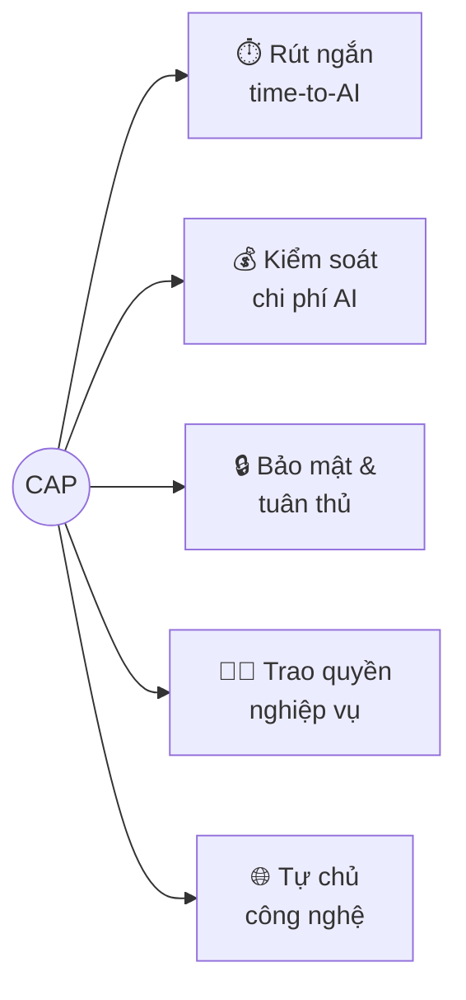
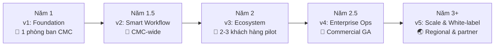

# Tầm nhìn & Mục tiêu

🟡 Draft — v0.2

> Trang này dành cho **lãnh đạo, quản lý sản phẩm và quản lý dự án** muốn hiểu CAP đang đi đâu, vì sao, và đo bằng gì. Chi tiết kỹ thuật và lộ trình tính năng có ở [Section 3 — Architecture](/03-architecture/01-services) và [Section 7 — Roadmap](/07-roadmap/01-mvp).

---

## 1. Tầm nhìn (Vision)

> **CAP là nền tảng AI thống nhất của CMC — và từ nền tảng đó, là lựa chọn ưu tiên của các doanh nghiệp Việt Nam khi đưa AI vào vận hành ở quy mô tổ chức.**

Trong vòng 3 năm, mỗi nhân sự CMC khi cần một trợ lý AI cho công việc đều mở CAP. Mỗi khách hàng doanh nghiệp Việt khi đánh giá nền tảng AI cho tổ chức mình đều có CAP trong danh sách rút gọn.

---

## 2. Sứ mệnh (Mission)

> **Trao cho người làm nghiệp vụ khả năng tự thiết kế và vận hành trợ lý AI dựa trên tri thức của chính tổ chức mình — với sự kiểm soát toàn diện về dữ liệu, chi phí và tuân thủ.**

Cốt lõi sứ mệnh là **3 chữ "tự"**:

- **Tự xây** — không phải chờ đội IT/dev
- **Tự kiểm soát** — không phải đánh đổi bảo mật để có AI
- **Tự chủ** — không phải khoá chặt vào một nhà cung cấp duy nhất

---

## 3. Bối cảnh & cơ hội

### 3.1 Vì sao là bây giờ

| Động lực | Diễn giải |
| --- | --- |
| **AI doanh nghiệp đã qua giai đoạn thử nghiệm** | Năm 2024-2025, LLM đã đủ ổn định để đưa vào quy trình thực tế. Doanh nghiệp không còn hỏi "có nên dùng AI không" mà hỏi "dùng thế nào cho an toàn và đo được" |
| **Mỗi phòng ban đang tự xoay sở** | Phòng A dùng ChatGPT cá nhân, phòng B mua Dify Cloud, phòng C thuê dev tự build → kiến thức và chi phí phân mảnh, không tái sử dụng được |
| **Yêu cầu pháp lý & chủ quyền dữ liệu** | Nghị định 13, các yêu cầu localize dữ liệu, kiểm toán nội bộ → dữ liệu nhạy cảm không thể gửi tuỳ tiện ra cloud nước ngoài. Doanh nghiệp lớn cần phương án **on-prem hoặc dedicated cloud trong nước** |
| **Khoảng trống của thị trường Việt Nam** | Chưa có một nền tảng AI nội địa nào cùng lúc đáp ứng: multi-tenant, RBAC chi tiết, hỗ trợ tri thức tiếng Việt, dịch vụ và tài liệu tiếng Việt, có thể on-prem |

### 3.2 4 nỗi đau khách hàng đang gặp

| Nỗi đau | Mô tả từ góc nhìn lãnh đạo |
| --- | --- |
| **Phân mảnh công cụ** | Tổ chức trả tiền cho 5-7 dịch vụ AI khác nhau, mỗi nơi giữ một mẩu dữ liệu, không ai có bức tranh tổng |
| **Khó kiểm soát rủi ro** | Không biết ai đang đưa dữ liệu nội bộ nào ra ngoài; chi phí AI tăng vọt không lường trước; sự cố xảy ra không truy được nguồn |
| **Phụ thuộc đội kỹ thuật** | Mọi thay đổi nhỏ về kịch bản đều phải nhờ developer → triển khai chậm, đội IT quá tải, business không chủ động được |
| **Khó mở rộng** | Pilot thành công ở 1 phòng ban không nhân rộng được cho 10 phòng ban hay 5 công ty con vì công cụ không có khái niệm đa tenant/workspace |

📎 So sánh chi tiết các nền tảng tham chiếu (Dify, Flowise, RAGFlow, Airflow) ở [Section 8 — References](/08-references/01-dify).

---

## 4. Giá trị cốt lõi cho khách hàng

CAP cam kết tạo ra **5 nhóm giá trị đo lường được** cho tổ chức triển khai:

| # | Giá trị | Ý nghĩa với tổ chức | Cách CAP hiện thực hoá |
| --- | --- | --- | --- |
| 1 | **Rút ngắn time-to-AI** | Một ý tưởng AI từ "phòng ban đề xuất" đến "có sản phẩm dùng được" rút từ vài tháng xuống vài tuần | Giao diện kéo-thả, template sẵn có, không cần lập trình |
| 2 | **Kiểm soát chi phí AI** | Lãnh đạo nhìn được chi phí AI theo từng phòng ban / dự án / agent, đặt được hạn mức, không bị "AI bill shock" | Cost tracking per tenant/workspace/agent, quota, dashboard chi phí |
| 3 | **Bảo mật & tuân thủ** | Dữ liệu nhạy cảm được cách ly đúng giữa các đơn vị; mọi truy cập đều có audit log đầy đủ phục vụ kiểm tra | Multi-tenant isolation, RBAC chi tiết, audit log, option on-prem |
| 4 | **Trao quyền nghiệp vụ** | BA, PM, chuyên viên tự thiết kế kịch bản AI cho phòng mình; đội IT chuyển từ "người xây" sang "người vận hành nền tảng" | Builder no-code, knowledge base nội bộ, role tuỳ biến |
| 5 | **Tự chủ công nghệ** | Không bị khoá vào 1 nhà cung cấp LLM/cloud; có thể đổi provider, đổi hạ tầng, đổi mô hình mà không phải xây lại | Provider-agnostic (OpenAI, Anthropic, Bedrock, vLLM nội bộ), open architecture |

---

## 5. Nguyên tắc sản phẩm

5 nguyên tắc đóng vai trò "la bàn" cho mọi quyết định sản phẩm — khi có lựa chọn khó, ưu tiên nguyên tắc trước, tiện lợi sau.

| # | Nguyên tắc | Hệ quả khi áp dụng |
| --- | --- | --- |
| 1 | **Multi-tenant first** | Mọi tính năng thiết kế cho đa tenant ngay từ ngày đầu, không "thêm tenant sau". Không có code path chỉ chạy cho 1 tenant |
| 2 | **No-code first** | Nếu một việc cần viết code mới làm được, đó là **gap cần lấp**, không phải feature "advanced". Code chỉ là escape hatch cho 5% trường hợp ngoại lệ |
| 3 | **Tri thức nội bộ ưu tiên** | Agent ưu tiên trả lời dựa trên tài liệu của tổ chức trên kiến thức chung của LLM. Mọi câu trả lời quan trọng đều có **dẫn nguồn** |
| 4 | **Quan sát được mặc định** | Mọi action (chat, workflow run, tool call, LLM call) đều có trace; mọi đồng chi phí đều đếm được. Không có "hộp đen" trong CAP |
| 5 | **An toàn theo mặc định** | Quyền mặc định là **deny**; mở rộng quyền là hành động có chủ ý và có audit. Tool không có quyền access DB; dữ liệu mỗi tenant cách ly cứng |

---

## 6. Mục tiêu chiến lược theo giai đoạn

Chiến lược triển khai theo nguyên tắc **Internal-first → External** — CMC vừa là **khách hàng đầu tiên**, vừa là **phòng thí nghiệm sản phẩm**. Mỗi pha mở rộng năng lực **đối tượng phục vụ** trước khi mở rộng **năng lực kỹ thuật**.

| Giai đoạn | Đối tượng phục vụ | Mục tiêu chiến lược (outcome, không phải feature) |
| --- | --- | --- |
| **Năm 1 — Internal pilot** (v1) | 1 phòng ban CMC | Chứng minh CAP thay được giải pháp hiện tại; rút ra 3 bài học sản phẩm lớn từ vận hành thực tế |
| **Năm 1.5 — CMC-wide** (v2) | Toàn bộ CMC, nhiều phòng ban | Trở thành nền tảng AI mặc định nội bộ CMC; thay thế ≥ 70% các công cụ AI rời rạc đang dùng |
| **Năm 2 — Early external** (v3) | 2-3 khách hàng pilot ngoài CMC | Validate product-market fit ngoài CMC; có ít nhất 1 use case "đắt giá" được chứng minh ROI rõ ràng |
| **Năm 2.5 — Commercial GA** (v4) | Khách hàng enterprise Việt Nam | Vận hành sản phẩm thương mại đầy đủ: SLA, hỗ trợ tiếng Việt, hợp đồng enterprise |
| **Năm 3+ — Regional & partner** (v5) | Doanh nghiệp khu vực, đối tác OEM | Mở rộng đa khu vực; white-label cho đối tác phân phối |

📎 Phạm vi tính năng chi tiết từng phiên bản: [Section 7 — Roadmap](/07-roadmap/01-mvp).

### 6.1 Cam kết của giai đoạn Internal-first

Trong **Năm 1 - Năm 1.5**, ưu tiên cao nhất là phục vụ tốt nội bộ CMC, kể cả khi điều đó **làm chậm các tính năng dành cho thị trường ngoài**. Lý do:

- Sản phẩm trưởng thành nhanh nhất khi có **người dùng thật, vấn đề thật, ngay bên cạnh**
- Mỗi quyết định kiến trúc đều được "thử lửa" bởi nhu cầu thực tế của một doanh nghiệp lớn
- Khi mở ra ngoài, CAP đã được vận hành ở quy mô tổ chức lớn — đó là **bằng chứng tốt nhất** cho khách hàng tiềm năng

---

## 7. Đo lường thành công

### 7.1 KPI theo cấp độ

CAP đo thành công ở **3 cấp độ**, tương ứng 3 câu hỏi:

| Cấp độ | Câu hỏi | KPI chính |
| --- | --- | --- |
| **Adoption** | Có người dùng không? | Số tenant active, số workspace active, MAU builder, số end-user chat / tháng |
| **Productivity** | Có tạo ra giá trị không? | Số workflow đã publish, số agent đang phục vụ thật, **thời gian từ ý tưởng → production** (target: ≤ 1 tuần cho use case đơn giản) |
| **Outcome** | Có mang lại kết quả nghiệp vụ không? | % câu hỏi end-user được giải đáp tự động (không escalate), NPS từ builder & end-user, chi phí AI per workspace so với baseline trước CAP |

### 7.2 Mục tiêu định lượng (tentative — sẽ chốt cùng lãnh đạo)

| Giai đoạn | Tenant active | Workspace active | Agent publish | Workflow run / tháng |
| --- | --- | --- | --- | --- |
| Cuối Năm 1 (v1) | 1 (CMC) | 1-2 | 3-5 | 1,000+ |
| Cuối Năm 1.5 (v2) | 1 (CMC) | 10+ | 30+ | 50,000+ |
| Cuối Năm 2 (v3) | 3-5 | 50+ | 100+ | 500,000+ |
| Cuối Năm 2.5 (v4) | 10-20 | 200+ | 500+ | Tự cấp phát |

> 📊 Các số mục tiêu trong bảng trên là **giả thiết ban đầu** cần được rà soát và điều chỉnh cùng lãnh đạo sản phẩm trước khi chốt OKR chính thức.

### 7.3 Tín hiệu cảnh báo (anti-goals)

Có những con số "đẹp" nhưng nếu xuất hiện thì là tín hiệu sai hướng:

- ❌ MAU cao nhưng **time-to-AI vẫn dài** → CAP đang là tool xem, không phải tool xây
- ❌ Nhiều workflow nhưng **ít workflow chạy lặp lại** → người ta dùng để thử, không dùng để làm
- ❌ Chi phí AI giảm nhưng **chất lượng câu trả lời giảm** → tối ưu sai chỗ
- ❌ Mở rộng ra ngoài CMC quá nhanh khi **nội bộ CMC chưa hài lòng** → vi phạm nguyên tắc Internal-first

---

## 8. Cấu trúc tài liệu liên quan

Vision này là điểm xuất phát. Để hiểu sâu hơn:

| Bạn quan tâm | Đọc tiếp |
| --- | --- |
| Mô hình nghiệp vụ chi tiết | [Section 2 — Domain](/02-domain/01-tenant-workspace) |
| Kiến trúc kỹ thuật | [Section 3 — Architecture](/03-architecture/01-services) |
| Đặc tả API | [Section 4 — API](/04-api/01-conventions) |
| Lộ trình tính năng theo phiên bản | [Section 7 — Roadmap](/07-roadmap/01-mvp) |
| So sánh với nền tảng tham chiếu | [Section 8 — References](/08-references/01-dify) |

---

> **Cập nhật vision** — Vision này được rà soát **6 tháng/lần** cùng lãnh đạo sản phẩm. Mọi thay đổi lớn về định vị, đối tượng phục vụ, hay nguyên tắc sản phẩm đều phải sửa ở trang này trước khi lan toả vào docs khác.
