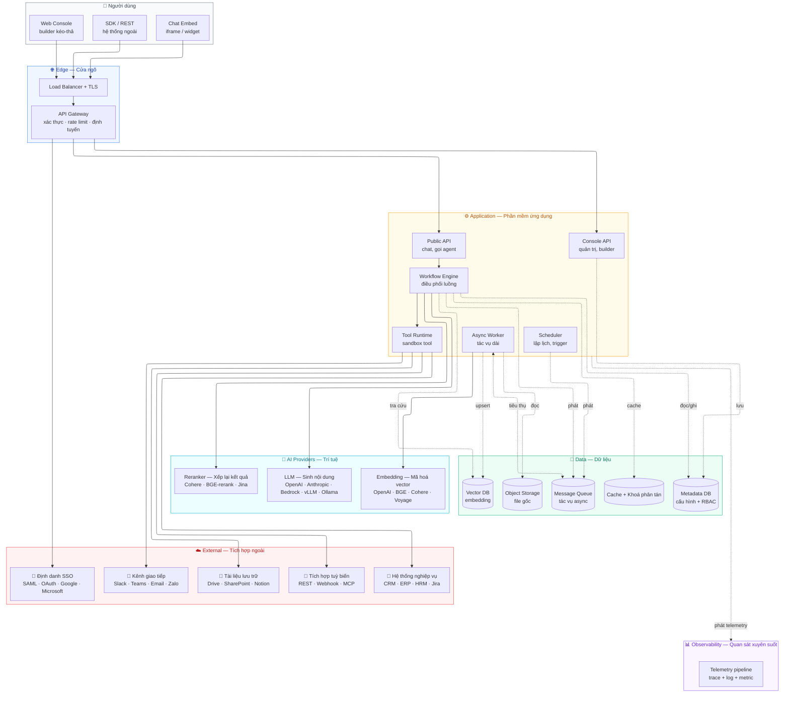
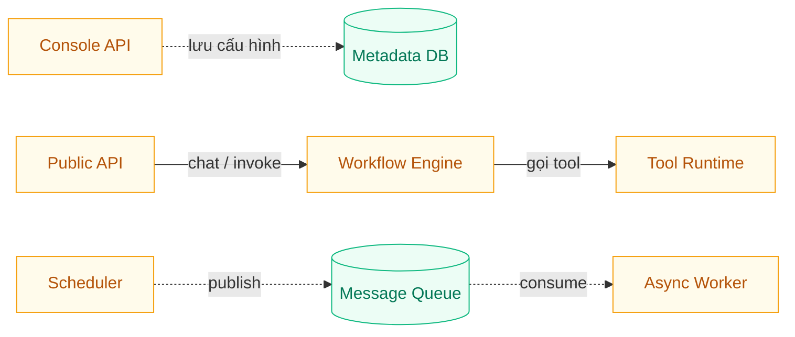
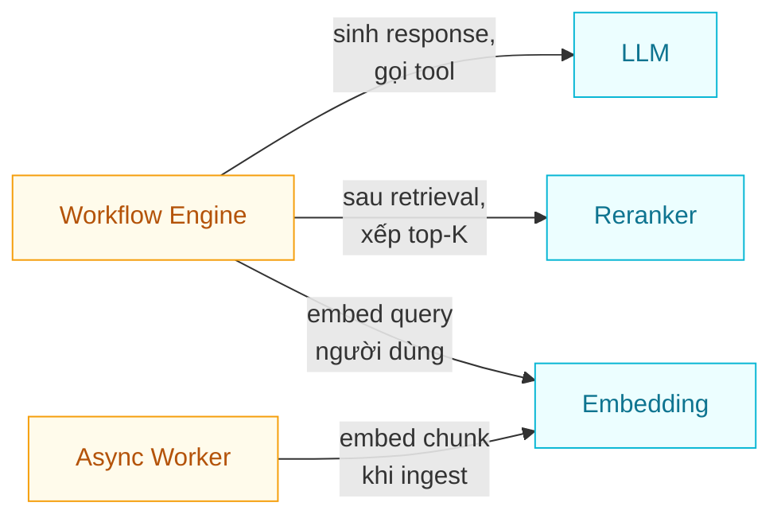
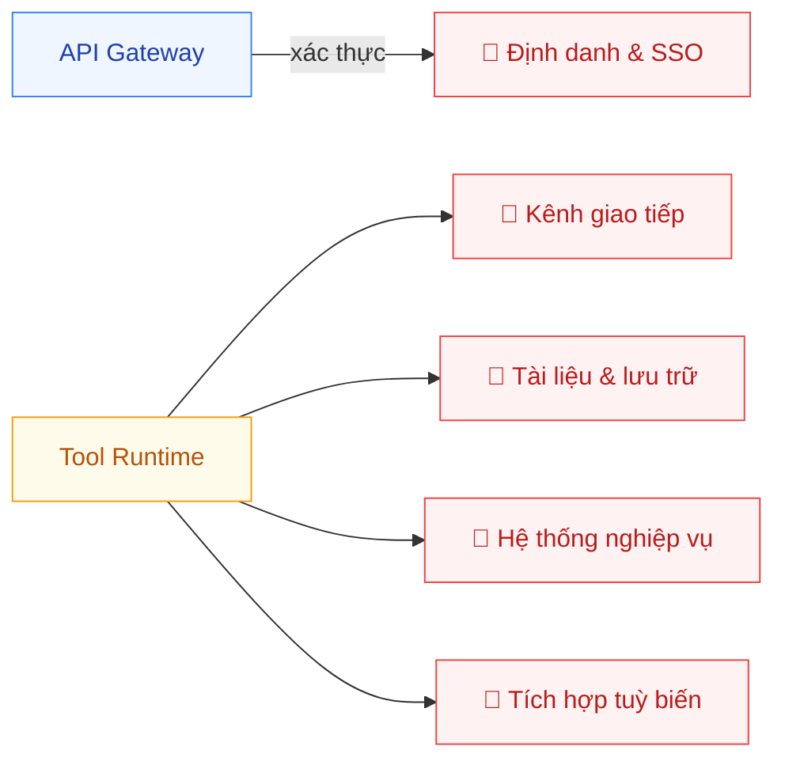
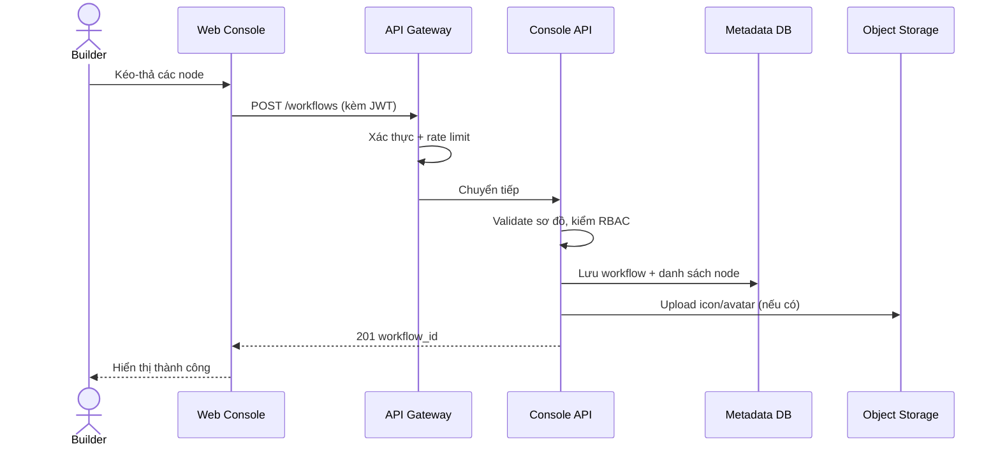
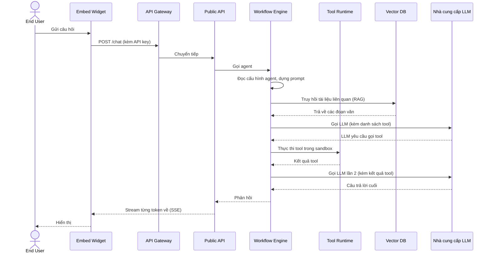
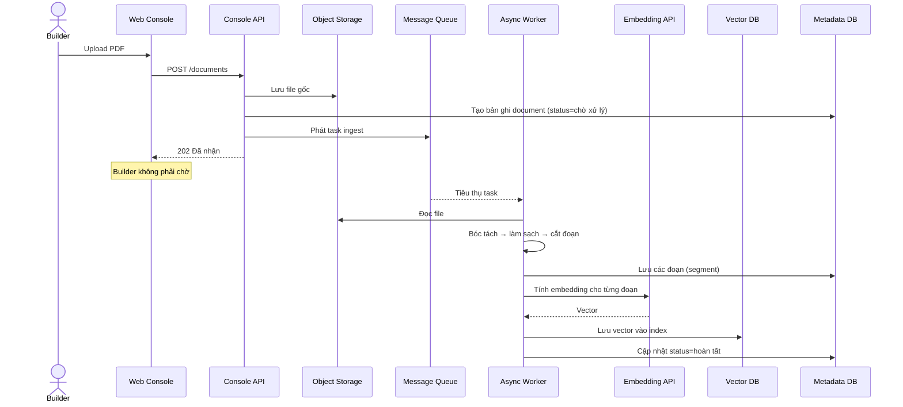

# Kiến trúc tổng quan

🟡 Draft — v0.2

> Trang này trả lời **3 câu hỏi**:
>
> 1. CAP gồm những mảnh ghép nào?
> 2. Thông tin chạy qua hệ thống như thế nào?
> 3. Đâu là các lựa chọn kiến trúc quan trọng và vì sao?
>
> Chi tiết kỹ thuật (tech stack, scaling, schema, isolation pattern) ở [Section 3 — Architecture](/03-architecture/01-services).

---

## 1. CAP gồm những mảnh ghép nào?

Hệ thống được tổ chức thành **6 lớp chức năng**, mỗi lớp có một trách nhiệm rõ ràng. Cách chia này không phụ thuộc công nghệ cụ thể — nó nói **vai trò trong hệ thống**, không phải sản phẩm cài đặt.

### 1.1 Vai trò 6 lớp

| Lớp | Trách nhiệm chính | Vì sao tách riêng |
| --- | --- | --- |
| **Edge — Cửa ngõ** | Tiếp nhận mọi traffic, kiểm token, chống lạm dụng (rate limit, DDoS), định tuyến đến đúng service | Là điểm vào duy nhất → dễ áp dụng chính sách bảo mật tập trung; không lưu dữ liệu nên nhân bản tự do |
| **Application — Phần mềm ứng dụng** | Nơi sản phẩm "sống": quản trị, builder, chat, điều phối workflow, thực thi tool | Tách thành nhiều service nhỏ để mở rộng độc lập theo loại tải (xem 1.2) |
| **AI Providers — Trí tuệ** | Mô hình ngôn ngữ (LLM), mã hoá vector (embedding), xếp lại kết quả (rerank) | Tách riêng khỏi External vì là **lõi nghiệp vụ AI** — chiếm phần lớn chi phí, được Engine/Worker gọi xuyên suốt mọi luồng (xem 1.3) |
| **Data — Dữ liệu** | Lưu trữ mọi loại dữ liệu: cấu hình, embedding, cache, file gốc, hàng đợi tác vụ | Mỗi loại dữ liệu có đặc thù riêng (truy vấn quan hệ vs ANN vs blob…) → tách store đúng loại, dễ scale |
| **External — Tích hợp ngoài** | Hệ thống của khách hàng và bên thứ 3 mà CAP cần kết nối: chat, lưu trữ, ERP/CRM, MCP, SSO | Tách riêng để áp policy outbound, đổi tích hợp dễ, không nhầm với AI lõi (xem 1.4) |
| **Observability — Quan sát** | Thu thập trace, log, metric từ mọi service; phục vụ debug, audit, đo chi phí | Là yêu cầu **bắt buộc** cho enterprise (xem nguyên tắc "Quan sát được mặc định" trong [Vision](/01-overview/01-vision)) |

### 1.2 Trong lớp Application có gì?

Đây là lớp đa dạng nhất — chia thành **6 service** dựa trên **risk profile** và **scaling profile** khác nhau. Quan hệ gọi giữa các service:

> 🔑 Hai nhóm rõ rệt: **sync** (`Public → Engine → Tool` cho mỗi lượt chat) và **async** (`Scheduler → MQ → Worker` cho tác vụ nền). Console hoạt động độc lập, chủ yếu là CRUD vào Metadata DB.

| Service | Phục vụ ai | Vì sao tách riêng |
| --- | --- | --- |
| **Console API** | Builder qua Web Console | Low traffic, high privilege (quản trị) — cần audit chặt, không nhất thiết scale lớn |
| **Public API** | End-user và hệ thống ngoài | High traffic, low privilege — cần scale theo lượt chat, tách để bảo vệ Console khỏi spike |
| **Workflow Engine** | Mọi luồng có nhiều bước | Logic nóng nhất — cần tối ưu latency, có state riêng cho mỗi run |
| **Async Worker** | Tác vụ dài (ingest tài liệu, batch) | Không chặn người dùng — chạy nền, scale theo backlog |
| **Scheduler** | Lập lịch định kỳ, trigger sự kiện | Stateful (giữ cron state) — chỉ 1 instance active, có HA |
| **Tool Runtime** | Sandbox chạy công cụ của bên thứ 3 | Cách ly bảo mật — tool không được truy cập DB trực tiếp |

> **Lưu ý cho MVP**: 6 service trên là **logical separation**. Trên hạ tầng thực tế, MVP có thể gộp một số service lại để giảm độ phức tạp vận hành. Chi tiết phasing ở [Section 3 — Services](/03-architecture/01-services).

### 1.3 Trong lớp AI Providers có gì?

Đây là **lõi nghiệp vụ AI** — tách ra khỏi External vì chiếm phần lớn chi phí vận hành và được gọi xuyên suốt mọi luồng. Mỗi workspace tự cấu hình provider và model muốn dùng.

> 🔑 Embedding được **2 nơi gọi** (Engine cho query người dùng, Worker cho chunk lúc ingest) — đó là lý do nó luôn được cache theo hash text, tránh re-embed cùng nội dung.

| Loại | Mục đích | Ai trong CAP gọi | Ví dụ |
| --- | --- | --- | --- |
| **LLM — Sinh nội dung** | Tạo câu trả lời, gọi tool, phân tích văn bản | Workflow Engine (mỗi lượt chat hoặc node LLM trong workflow) | OpenAI · Anthropic · Bedrock · Google Vertex · vLLM · Ollama |
| **Embedding — Mã hoá vector** | Biến văn bản thành vector để retrieval | Async Worker (lúc ingest tài liệu) · Engine (lúc nhận query người dùng) | OpenAI · BGE · Cohere · Voyage |
| **Reranker — Xếp lại kết quả** | Sắp xếp lại top-K từ vector search để tăng độ chính xác | Workflow Engine (sau retrieval, trước khi đưa vào prompt) | Cohere · BGE-rerank · Jina |

> **Nguyên tắc đổi provider**: lớp gọi AI được trừu tượng hoá — đổi provider không phải xây lại agent (xem [Vision § 3.4](/01-overview/01-vision)). Credential mỗi tenant riêng, mã hoá tại nơi lưu trữ.

### 1.4 Trong lớp External có gì?

External là **các hệ thống của khách hàng và bên thứ 3** — CAP gọi ra để lấy/ghi dữ liệu nghiệp vụ hoặc đẩy thông báo. Mỗi nhóm có service trong CAP đứng ra gọi và áp policy riêng:

> 🔑 **2 đường gọi External khác nhau**: SSO/Identity gọi từ **API Gateway** (lúc xác thực, chưa vào hệ thống); 4 nhóm còn lại gọi qua **Tool Runtime** (sandbox cách ly, không cho tool truy cập DB).

| Nhóm | Mục đích | Ai trong CAP gọi | Ví dụ |
| --- | --- | --- | --- |
| 💬 **Kênh giao tiếp** | Tiếp nhận tin nhắn từ user hoặc gửi notification đi | Tool Runtime (qua tool tương ứng) | Slack, MS Teams, Email, Zalo, Telegram, Webchat |
| 📄 **Tài liệu & lưu trữ** | Nguồn tri thức cho RAG; ghi kết quả ra cloud | Tool Runtime (gọi tool); Worker (đồng bộ định kỳ) | Google Drive, SharePoint, Notion, OneDrive, Confluence |
| 🏢 **Hệ thống nghiệp vụ** | Tra cứu / ghi dữ liệu nghiệp vụ của tổ chức | Tool Runtime | CRM, ERP, HRM, ITSM, Jira, Salesforce, HubSpot |
| 🔌 **Tích hợp tuỳ biến** | Mở rộng không giới hạn theo API của khách hàng | Tool Runtime; Public API (webhook inbound) | REST/GraphQL, Webhook in/out, MCP servers |
| 🔐 **Định danh & SSO** | Đăng nhập một lần, đồng bộ user từ identity provider | API Gateway (lúc xác thực) | SAML, OAuth, Google, Microsoft, Azure AD |

> **Nguyên tắc gọi ngoài**: mọi credential gọi External đều được **mã hoá tại nơi lưu trữ**, mỗi tenant có credential riêng, log gọi External không lưu nội dung secret. Chi tiết ở [Section 3 — Tool Runtime](/03-architecture/04-tool-runtime).

---

## 2. Thông tin chạy qua hệ thống như thế nào?

Toàn bộ CAP tóm gọn trong **3 luồng dữ liệu**. Hiểu 3 luồng này là hiểu cách CAP vận hành.

### 2.1 Luồng "Xây dựng" — builder định nghĩa agent / workflow

Khi một builder kéo-thả workflow trong Web Console và lưu lại, điều gì xảy ra?

**Đặc điểm**: luồng nhẹ — không chạm Engine, Worker, Queue. Builder cảm nhận **gần như tức thì**.

### 2.2 Luồng "Vận hành" — end-user chat với agent

Đây là luồng nóng nhất, được tối ưu để giảm độ trễ.

**Đặc điểm chính**:

- **Cache mạnh** ở mỗi bước có thể cache (system prompt, embedding của câu hỏi quen thuộc) → giảm chi phí + giảm độ trễ
- **Stream** từng token thay vì chờ trả lời đầy đủ → trải nghiệm "đang gõ"
- **Có thể nhiều vòng tool call** trước khi LLM ra câu trả lời cuối

### 2.3 Luồng "Nạp tri thức" — upload tài liệu → sẵn sàng tra cứu

Khi builder upload PDF/DOCX vào Knowledge Base, hệ thống không xử lý đồng bộ (sẽ rất chậm), mà chuyển sang nền:

**Đặc điểm chính**:

- **Bất đồng bộ hoàn toàn** — builder upload xong là quay về làm việc khác; có thể polling trạng thái hoặc nhận webhook khi xong
- **Có thể mất vài phút** với tài liệu lớn — đó là lý do tách Worker ra khỏi đường nóng
- **Mỗi bước đều có thể retry** mà không ảnh hưởng các tài liệu khác

---

## 3. Đâu là các lựa chọn kiến trúc quan trọng?

Phần này không liệt kê tech stack. Phần này nói **những đánh đổi đã chấp nhận** ở cấp nghiệp vụ, và lý do.

### 3.1 Tách cứng dữ liệu giữa các tenant

| Quyết định | Đảm bảo điều gì | Đánh đổi |
| --- | --- | --- |
| Mọi bảng dữ liệu, mọi vector collection, mọi bucket lưu trữ đều có khóa định danh tenant. Truy vấn không có khoá tenant **bị chặn ở tầng repository**, không phụ thuộc lập trình viên nhớ filter | Không có cách nào một workspace của khách A nhìn được dữ liệu của khách B, kể cả khi có bug | Khi muốn share resource giữa các workspace (vd KB dùng chung), cần thiết kế cơ chế share rõ ràng — không thể "vô tình" share |

→ Chi tiết kỹ thuật ở [Section 3 — Multi-tenant Isolation](/03-architecture/06-multi-tenant).

### 3.2 Cách ly công cụ khỏi nhân hệ thống (sandbox)

| Quyết định | Đảm bảo điều gì | Đánh đổi |
| --- | --- | --- |
| Mọi tool (built-in, custom REST, MCP, workflow-as-tool) chạy trong Tool Runtime tách rời, **không có quyền truy cập DB của CAP**. Có giới hạn thời gian, tài nguyên, network | Một tool lỗi hoặc độc không thể "đào" vào dữ liệu hệ thống. Có thể chấp nhận tool do người dùng tự cung cấp | Thêm độ phức tạp triển khai; tool muốn dùng dữ liệu CAP phải gọi qua API có xác thực |

→ Chi tiết ở [Section 3 — Tool Runtime](/03-architecture/04-tool-runtime).

### 3.3 Mọi hành động đều có dấu vết

| Quyết định | Đảm bảo điều gì | Đánh đổi |
| --- | --- | --- |
| Mọi service đều phát trace, log, metric theo chuẩn OpenTelemetry. Mỗi LLM call, mỗi tool call đều ghi: ai gọi, gọi gì, hết bao nhiêu token, hết bao nhiêu tiền | Khi có sự cố — debug được. Khi cần audit — có log đầy đủ. Khi tính chi phí — chia được theo tenant/workspace/agent | Chi phí lưu trữ telemetry không nhỏ; cần chiến lược retention rõ ràng |

→ Chi tiết ở [Section 3 — Observability](/03-architecture/08-observability).

### 3.4 Không khoá vào một nhà cung cấp LLM

| Quyết định | Đảm bảo điều gì | Đánh đổi |
| --- | --- | --- |
| Lớp gọi LLM được trừu tượng hoá. CAP hỗ trợ OpenAI-compatible API, Anthropic, Bedrock, và mô hình local. Mỗi workspace tự chọn provider | Khách hàng đổi provider mà **không phải xây lại agent**. Có thể chạy hỗn hợp: agent nhạy cảm dùng LLM nội bộ, agent thường dùng cloud | Không tận dụng được các tính năng đặc thù của 1 provider (vd tool calling format riêng) — phải đồng nhất theo mẫu số chung |

### 3.5 Bắt đầu đơn giản, có lối thoát để mở rộng

| Quyết định | Đảm bảo điều gì | Đánh đổi |
| --- | --- | --- |
| MVP triển khai một số service gộp lại (monolith), một số chỗ làm phiên bản đơn giản (workflow engine in-process, cache + queue dùng Redis). Mọi chỗ "đơn giản" đều có **interface trừu tượng** để swap sang phiên bản production-grade (Temporal, NATS, Qdrant) khi cần | MVP nhẹ, vận hành đơn giản, đội kỹ thuật nhỏ vẫn làm được. Khi quy mô tăng — đổi từng mảnh, không phải viết lại | Cần kỷ luật thiết kế ngay từ đầu để mỗi mảnh có thể swap; lúc swap có chi phí migration |

→ Chi tiết phasing ở [Section 3 — Services](/03-architecture/01-services).

---

## 4. Cách ly đa tenant (tóm tắt)

Mỗi lớp data có cơ chế cách ly riêng, đảm bảo "không cách nào lẫn lộn dữ liệu":

| Lớp data | Cơ chế cách ly |
| --- | --- |
| Metadata DB | Mọi bảng có cột `tenant_id` + `workspace_id`, query luôn filter ở tầng repository |
| Vector DB | Tách collection theo `(tenant_id, workspace_id)` hoặc metadata filter cứng |
| Object Storage | Prefix theo `tenant_id/workspace_id/...` — quyền IAM áp theo prefix |
| Cache / Queue | Key/subject prefix theo tenant — vừa cách ly vừa giúp throttle theo tenant |
| Compute | MVP dùng chung node; gói enterprise có thể dedicated node |

→ Trade-off chi tiết (row-level vs schema-per-tenant vs DB-per-tenant) ở [Section 3 — Multi-tenant](/03-architecture/06-multi-tenant).

---

## 5. Cấu trúc tài liệu liên quan

| Bạn muốn hiểu | Đọc tiếp |
| --- | --- |
| Khái niệm nghiệp vụ (Tenant, Workspace, Agent, Tool, Knowledge…) | [Section 2 — Domain](/02-domain/01-tenant-workspace) |
| Thiết kế chi tiết từng service, từng store, isolation, observability | [Section 3 — Architecture](/03-architecture/01-services) |
| Đặc tả API (Console + Public) | [Section 4 — API](/04-api/01-conventions) |
| Giao diện builder, workflow editor | [Section 5 — Frontend](/05-frontend/01-app-shell) |
| Triển khai dev, staging, production | [Section 6 — Deployment](/06-deployment/01-dev-env) |
| Lộ trình tính năng theo phiên bản | [Section 7 — Roadmap](/07-roadmap/01-mvp) |

---

> **Phạm vi của trang này**: tổng quan để **mọi đối tượng đọc đều nắm được hình hài hệ thống**. Mọi quyết định tech stack cụ thể (FastAPI hay NestJS, NATS hay RabbitMQ, pgvector hay Qdrant…) đều ở [Section 3 — Architecture](/03-architecture/01-services). Khi nội dung kỹ thuật phình lên ở Section 3, **trang này không cần dài hơn**.
