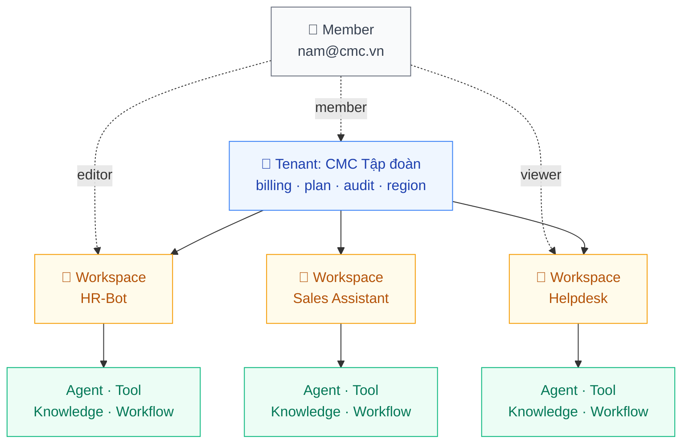
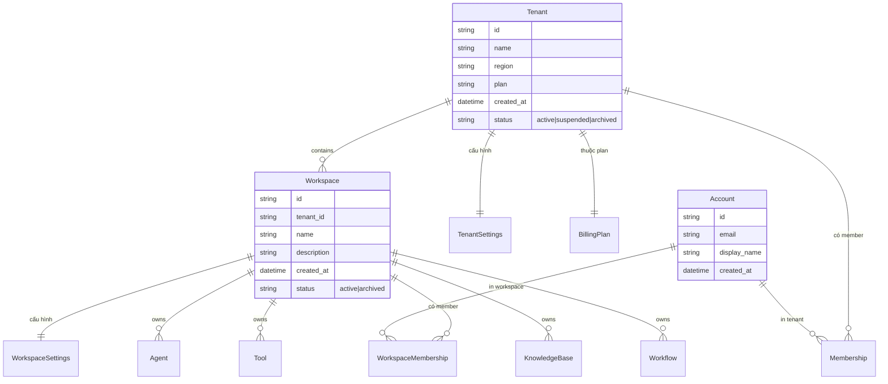
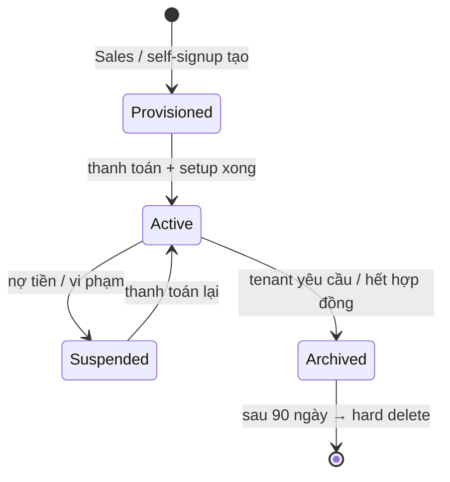
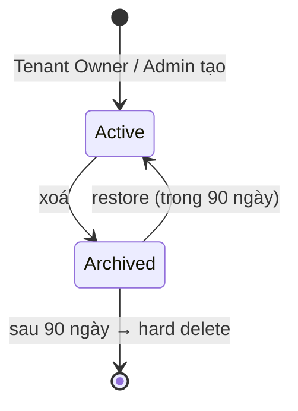

# Tenant & Workspace

🟡 Draft — v0.1

## Tenant & Workspace là gì

CAP tổ chức mọi thứ theo **2 cấp**: **Tenant** chứa nhiều **Workspace**. Mọi tài nguyên — agent, tool, knowledge base, workflow, member — đều sống trong một workspace, dưới một tenant nhất định. Hai cấp này quyết định **ai ký hợp đồng**, **ai trả tiền**, **dữ liệu cách ly đến đâu**, và **một nhân viên có thể đi qua những phòng nào**.

**Phép hình dung**:

- **Tenant** ≈ "**công ty**" trong hệ thống — pháp nhân, đơn vị ký hợp đồng, đơn vị xuất hoá đơn, đơn vị bị audit. Dữ liệu của 2 tenant **không bao giờ** nhìn thấy nhau.
- **Workspace** ≈ "**phòng ban / dự án / sản phẩm**" trong công ty đó — đơn vị làm việc thực tế. Một người có thể vào nhiều workspace trong cùng tenant, với vai trò khác nhau ở mỗi nơi.
- **Account** ≈ "**hộ chiếu**" của một người — định danh toàn cục, dùng 1 SSO login để vào mọi tenant/workspace mà người đó được mời.

**Ví dụ cụ thể**: Tập đoàn CMC (1 tenant `cmc-corp`) có 3 workspace: `hr-bot`, `helpdesk`, `sales-assistant`. Chị Nam (1 account `nam@cmc.vn`) là `workspace_editor` ở `hr-bot` và `viewer` ở `helpdesk`, không thấy `sales-assistant`. Chi phí AI của cả 3 workspace gộp về **một hoá đơn duy nhất** xuất cho Tập đoàn.

**Vì sao 2 cấp, không phải 1**: nếu chỉ có Tenant (như Dify), tổ chức lớn buộc phải hoặc tạo nhiều tenant rời rạc (không share knowledge / cost), hoặc dồn vào 1 tenant (mọi phòng ban thấy resource của nhau). 2 cấp giải đồng thời cả hai bài toán — chi tiết lập luận ở §1.

**Đọc trang này nếu bạn là**:

- **Lãnh đạo tổ chức / Giám đốc IT** — quyết định mô hình ký hợp đồng, hoá đơn, isolation, vùng dữ liệu.
- **Quản trị tenant / workspace** — cần biết quyền của mình đến đâu, ở trên còn ai.
- **BA / kiến trúc sư giải pháp** — đang map cơ cấu tổ chức khách hàng vào setup CAP.

**Trang liên quan**: [IAM & RBAC](/02-domain/02-iam-rbac) (phân quyền chi tiết) · [Multi-tenant Isolation](/03-architecture/06-multi-tenant) (cài đặt kỹ thuật).

---

## 1. Vì sao 2 cấp

CAP tách **2 cấp tổ chức** thay vì 1 — đây là quyết định cốt lõi, định hình cả isolation, billing, RBAC, sharing.

| Cấp | Định nghĩa | Đơn vị | Ví dụ |
| --- | --- | --- | --- |
| **Tenant** | Một tổ chức / khách hàng / pháp nhân riêng biệt. Là **đơn vị isolation cao nhất** | Billing, plan, audit, region | CMC Tập đoàn · FPT · MoMo |
| **Workspace** | Một không gian làm việc trong tenant. Thường = phòng ban / dự án / sản phẩm | Thành viên + tài nguyên (agent, tool, KB, workflow) | `cmc-hr-bot`, `cmc-helpdesk`, `fpt-sales-assistant` |

> 🔑 **1 member có thể thuộc nhiều workspace** trong cùng tenant, với role khác nhau ở mỗi workspace. Billing và audit gộp về Tenant; tài nguyên tách theo Workspace.

### 1.1 Vì sao cần Workspace, không chỉ Tenant

Phù hợp với [Vision § 3.4 — Tự chủ công nghệ](/01-overview/01-vision) và một trong 4 nỗi đau khách hàng:

> *"Pilot 1 phòng ban thành công, nhưng không nhân rộng được cho 10 phòng ban / 5 công ty con"*

Nếu chỉ có Tenant (như Dify), tổ chức lớn buộc phải:

- **Option 1**: Tạo nhiều Tenant rời rạc → 1 nhân viên phải có 5 account, không share knowledge / cost
- **Option 2**: Dồn vào 1 Tenant → mọi phòng ban thấy resource của nhau, không tách quyền được

CAP giải bằng cách thêm tầng **Workspace** — 1 nhân viên đăng nhập 1 lần, vào nhiều workspace; mỗi workspace có RBAC + resource độc lập; **chi phí và audit gộp về Tenant**.

### 1.2 Phân biệt với Dify

| Dify | CAP |
| --- | --- |
| Tenant = workspace (1 cấp) | Tenant chứa N Workspace (2 cấp) |
| 1 user thuộc 1 tenant | 1 user thuộc nhiều workspace trong cùng 1 tenant |
| Billing và resource gắn chặt | Billing ở Tenant; resource ở Workspace |

---

## 2. 4 nguyên tắc thiết kế

| # | Nguyên tắc | Hệ quả |
| --- | --- | --- |
| 1 | **Isolation cứng giữa Tenant** | Không có cách nào dữ liệu Tenant A leak sang Tenant B, kể cả khi RBAC có bug. Cài đặt ở tầng repository (xem [Architecture — Multi-tenant](/03-architecture/06-multi-tenant)) |
| 2 | **Workspace autonomy + Tenant oversight** | Workspace Owner toàn quyền trong workspace của mình; Tenant Owner thấy toàn cảnh (cost, audit, member) nhưng KHÔNG tự động vào được nội dung workspace |
| 3 | **Membership trong workspace inherit từ Tenant** | User được mời vào Tenant trước, sau đó được gán vào workspace cụ thể. Quyền ở Tenant tự inherit xuống workspace theo scope-cascade ([IAM §6](/02-domain/02-iam-rbac)) |
| 4 | **Soft delete + retention period** | Tenant/Workspace bị xoá KHÔNG bị purge ngay — giữ 90 ngày để recover / audit, sau đó hard delete. Đáp ứng GDPR + tránh "lỡ tay" |

---

## 3. Mô hình khái niệm

### 3.1 Khái niệm

| Khái niệm | Định nghĩa | Ví dụ |
| --- | --- | --- |
| **Tenant** | Tổ chức/pháp nhân riêng biệt — đơn vị isolation, billing, audit | `tenant_cmc_corp` |
| **Workspace** | Phòng ban / dự án / sản phẩm trong tenant | `ws_cmc_hr_bot` |
| **Account** | User toàn cục, đăng nhập 1 lần qua email/SSO. Có thể thuộc nhiều workspace trong cùng tenant | `nam@cmc.vn` |
| **Membership** | Liên kết Account ↔ Tenant — user thuộc tenant nào. Có role tenant-level | `nam@cmc.vn` là member của tenant CMC |
| **WorkspaceMembership** | Liên kết Account ↔ Workspace — user được gán vào workspace cụ thể. Có role workspace-level | `nam@cmc.vn` là `workspace_editor` ở ws HR-Bot |

> 💡 **Quan hệ với Policy (IAM)**: Membership và WorkspaceMembership là 2 dạng cụ thể của **Policy** trong IAM:
>
> - Membership = Policy ở scope `Tenant`
> - WorkspaceMembership = Policy ở scope `Workspace`
>
> Đây là **cùng một concept** với 2 tên gọi — chọn tên có ngữ cảnh nghiệp vụ ("Membership") thay vì kỹ thuật ("Policy at Tenant scope") cho phần này.

### 3.2 Vì sao Account toàn cục, không scoped

Account là **identity** (định danh), không phải authorization (quyền). Một người có 1 account duy nhất, có thể được mời vào N tenant khác nhau qua Membership.

Lợi ích:

- 1 SSO login dùng được cho mọi tenant user thuộc
- Đổi email → chỉ sửa 1 chỗ
- Lifecycle quản lý ở cấp identity provider (AD/Okta), CAP chỉ sync

---

## 4. Lifecycle

### 4.1 Tenant lifecycle

| Trạng thái | Hành vi |
| --- | --- |
| **Provisioned** | Tenant đã tạo nhưng chưa active. Có thể login để setup, chưa có quota |
| **Active** | Hoạt động bình thường, đầy đủ quota |
| **Suspended** | Đọc được nhưng không tạo/sửa được. Audit + export vẫn chạy. Email cảnh báo |
| **Archived** | Soft delete. Không login được nữa. Sau 90 ngày → hard delete (mọi resource purge) |

### 4.2 Workspace lifecycle

Workspace đơn giản hơn — không có suspended state (billing ở cấp Tenant).

### 4.3 Ai làm được gì

| Hành động | Tenant Owner | Workspace Owner | CAP Super Admin |
| --- | --- | --- | --- |
| Tạo Tenant | ❌ | ❌ | ✅ (qua sales / self-service) |
| Tạo Workspace trong Tenant | ✅ | ❌ | ✅ |
| Xoá Workspace | ✅ | ✅ (workspace của mình) | ✅ |
| Xoá Tenant | ❌ | ❌ | ✅ (chỉ sau khi tenant ack) |
| Suspend Tenant | ❌ | ❌ | ✅ |
| Transfer Workspace giữa 2 Tenant | ❌ | ❌ | ❌ (xem trade-off §9) |

---

## 5. Tenant settings & Workspace settings

### 5.1 Tenant Settings (cấp tổ chức)

| Setting | Mô tả | Ai sửa |
| --- | --- | --- |
| **Plan & Billing** | Free / Team / Business / Enterprise; payment method; invoice email | Tenant Owner |
| **Region** | Khu vực data residency (vn-north, sg, us-east) — quan trọng cho compliance | Tenant Owner (chốt khi tạo) |
| **Default LLM provider** | OpenAI / Anthropic / Bedrock / local — default cho mọi workspace mới | Tenant Admin |
| **Audit retention** | 90 / 365 / 7-năm — theo nhu cầu compliance | Tenant Owner |
| **Branding** | Logo, màu chủ đạo, custom domain (v3+) | Tenant Admin |
| **SSO config** | SAML / OAuth provider (v3) | Tenant Owner |
| **Member invite policy** | Có cho phép member mời tiếp không; domain whitelist | Tenant Admin |

### 5.2 Workspace Settings (cấp workspace)

| Setting | Mô tả | Ai sửa |
| --- | --- | --- |
| **Name & description** | Hiển thị trong UI | Workspace Owner |
| **LLM provider override** | Workspace có thể dùng provider khác Tenant default | Workspace Owner |
| **Default role for new member** | `editor` / `viewer` mặc định khi mời mới | Workspace Owner |
| **Public listing** | Cho workspace khác trong tenant thấy không (v3 marketplace) | Workspace Owner |
| **Webhook outbound** | URL nhận event từ workspace | Workspace Admin |
| **API key management** | Tạo/rotate/revoke (xem [IAM §8.2](/02-domain/02-iam-rbac)) | Workspace Owner |

---

## 6. Plan & quota model

> 📦 **Chi tiết đầy đủ ở [Billing & Subscription](/02-domain/08-billing)** — mô hình Package / Subscription / Quota allocation, package versioning, BYO LLM, billing modes (real / internal_chargeback / free).

Quota **Subscription gắn ở Tenant**, **allocation phân bổ xuống Workspace** — tenant_admin chia pool quota Tenant cho từng workspace qua UI. Lãnh đạo có dashboard consumption per workspace.

| Tier | Phù hợp | Quota tiêu biểu |
| --- | --- | --- |
| **Free** (post-MVP) | Cá nhân / dùng thử | 1 workspace, 1 agent, 5K tokens/tháng |
| **Team** | Phòng ban nhỏ | 3 workspace, 10 agent, 1M tokens/tháng, basic support |
| **Business** | Doanh nghiệp vừa | 10 workspace, 50 agent, 10M tokens/tháng, SSO |
| **Enterprise** | Tổ chức lớn | Unlimited, dedicated infra, SLA 99.9%, custom region |

> 📊 Số liệu trên là **giả định ban đầu** — sẽ chốt theo go-to-market plan ở v3.

### 6.1 Soft limit vs hard limit

- **Soft limit** (80%): vượt → cảnh báo + ghi audit, vẫn chạy
- **Hard limit** (100%): vượt → từ chối request mới (chat / workflow run). Đã queue thì cho chạy nốt

---

## 7. Sharing across Workspace

> 🔗 **Đồng bộ với [IAM §7](/02-domain/02-iam-rbac)**: phần dưới là góc nhìn từ Tenant & Workspace; logic permission ở IAM.

### 7.1 Mặc định: KHÔNG share

Theo nguyên tắc [Vision § 5 — An toàn theo mặc định](/01-overview/01-vision), tài nguyên thuộc workspace nào chỉ workspace đó nhìn thấy. Tenant Owner cũng KHÔNG tự động vào được — phải request access có audit.

### 7.2 Cơ chế share (v3+)

| Cơ chế | Phiên bản | Mô tả |
| --- | --- | --- |
| **Internal Marketplace** | v3 | Workspace publish agent/workflow lên marketplace của Tenant → workspace khác clone về (bản sao độc lập) |
| **Cross-Workspace Policy** | v3 | Workspace A cấp permission cho principal của Workspace B trên resource cụ thể của A |
| **Shared Knowledge Base** | v4 | KB có thể được mark "shared" để nhiều workspace cùng đọc — phù hợp tri thức common (chính sách công ty) |

MVP / v2 → không có share. Đảm bảo isolation cứng trước.

---

## 8. Use cases nghiệp vụ

### 🎯 Use case A — Tập đoàn 5 công ty con

> *"CMC Tập đoàn có 5 công ty con (CMC Telecom, CMC Cyber Security, CMC TS, CMC Global, CMC SI). Mỗi công ty có CIO + đội AI riêng nhưng muốn dùng chung hạ tầng AI để đỡ tốn ngân sách."*

**Setup**:

- 1 Tenant `cmc-corp` (billing tập trung tại Tập đoàn)
- 5 Workspace: `ws-telecom`, `ws-cyber`, `ws-ts`, `ws-global`, `ws-si`
- CIO mỗi công ty = `workspace_owner` workspace của mình
- Lãnh đạo Tập đoàn = `tenant_owner` (thấy cost tổng, audit toàn bộ, không tự ý vào nội dung workspace)

**Lợi ích**: chia sẻ infra → giảm ~60% chi phí, vẫn cách ly data giữa các công ty.

### 🎯 Use case B — 1 công ty 8 phòng ban

> *"Công ty 5000 nhân viên, 8 phòng ban (HR, IT, Sales, Marketing, Finance, Legal, R&D, Operations). Mỗi phòng có nhu cầu AI khác nhau."*

**Setup**:

- 1 Tenant `acme-corp`
- 8 Workspace tương ứng phòng ban
- IT Lead = `tenant_admin` (cấu hình LLM provider, SSO, audit)
- Mỗi trưởng phòng = `workspace_owner` phòng mình
- Nhân viên có thể được mời vào nhiều workspace (vd 1 nhân viên Marketing có quyền `viewer` ở workspace Sales để xem báo cáo)

### 🎯 Use case C — CAP đa khách hàng (commercial SaaS)

> *"CAP là SaaS, có 50 khách hàng enterprise. Mỗi khách hàng phải hoàn toàn cách ly khỏi nhau."*

**Setup**:

- 50 Tenant độc lập, mỗi tenant có ≥1 workspace tuỳ nhu cầu
- CAP Super Admin (của CMC) có thể tạo/suspend tenant nhưng KHÔNG có quyền vào nội dung tenant của khách (chỉ super-admin với MFA + audit kỹ mới được "impersonate" để hỗ trợ)
- Cross-tenant: HOÀN TOÀN không

---

## 9. Trade-off đã chấp nhận

| Quyết định | Lý do | Đánh đổi |
| --- | --- | --- |
| **Row-level isolation (MVP)** thay vì schema-per-tenant | Vận hành đơn giản, 1 DB, dễ migrate | Cần kỷ luật repository pattern; không phù hợp tenant > 1000 → switch sang schema-per-tenant ở v4 |
| **Workspace KHÔNG chuyển được giữa Tenant** | Tránh data leakage; nếu cần "chuyển" → xoá rồi tạo mới ở tenant đích, copy dữ liệu thủ công | Không linh hoạt khi tổ chức tái cấu trúc; chấp nhận vì rare event |
| **Soft delete 90 ngày trước hard delete** | Tránh "lỡ tay xoá" + đáp ứng audit + GDPR right to be forgotten (sau 90 ngày) | Tốn storage tạm thời; acceptable |
| **Quota theo Tenant, không Workspace** | Đơn giản billing; workspace tự cạnh tranh quota | Workspace "ồn ào" có thể ăn quota của workspace yên tĩnh → mitigation bằng alert + cost dashboard per workspace |
| **Account toàn cục** thay vì per-tenant | 1 SSO login dùng cho mọi tenant; UX tốt | Email phải unique toàn hệ thống; nhân viên rời CMC sang FPT cần quy trình transfer/clean |

---

## 10. Câu hỏi còn mở

| # | Câu hỏi | Cân nhắc | Phiên bản |
| --- | --- | --- | --- |
| Q1 | Cho phép **rename Tenant** sau khi tạo? | Đơn giản nhưng có thể gây confusion với contract, audit log. Cần ghi diff name | v2 |
| Q2 | **Workspace slug** (URL friendly) — duy nhất trong Tenant hay toàn cục? | Trong Tenant để tránh collision; URL: `cap.app/<tenant>/<workspace>` | MVP |
| Q3 | **Multi-region Tenant** — 1 tenant có workspace ở nhiều region không? | Compliance khó (GDPR data crossing), default không cho phép, enterprise plan v5 mở | v5 |
| Q4 | **Delete tenant flow** — ai có thể trigger, có cần multi-approver không, cooling-off period? | Sensitive — đề xuất 30-day cooling + tenant_owner + super_admin co-approve | v3 |
| Q5 | **Tenant migration tool** — export toàn bộ tenant ra file, import ngược? | Cho data portability / DR / vendor lock-in concerns | v4 |
| Q6 | **Workspace template** — clone workspace với cấu hình mẫu | Tiện cho rollout đa phòng ban giống nhau | v3 |
| Q7 | **Free tier có không** trong commercial launch? | Trade-off marketing vs cost — chưa quyết | TBD |

---

## Liên kết

- [IAM & RBAC](/02-domain/02-iam-rbac) — Membership = Policy ở scope tenant/workspace; cách phân quyền chi tiết
- [Architecture — Multi-tenant Isolation](/03-architecture/06-multi-tenant) — cài đặt kỹ thuật row-level
- [Vision § 3.4 — Tự chủ công nghệ](/01-overview/01-vision)
- [Vision § 5 — Nguyên tắc an toàn](/01-overview/01-vision)
- [Roadmap](/07-roadmap/01-mvp) — phiên bản nào có gì
