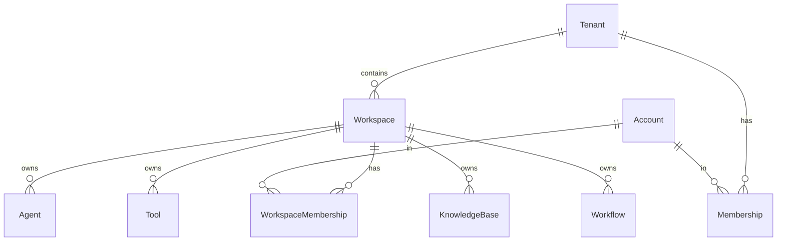

# Tenant & Workspace

🔴 Placeholder

## Mô hình 2 cấp

CAP chia tổ chức làm **2 cấp**:

| Cấp | Vai trò | Ví dụ |
| --- | --- | --- |
| **Tenant** | 1 tổ chức/khách hàng. Đơn vị billing, isolation, plan | CMC, FPT, MoMo, ... |
| **Workspace** | 1 dự án/team trong tổ chức | CMC-HR-Bot, CMC-Helpdesk, FPT-Sale |

## Khác biệt với Dify

Dify chỉ có 1 cấp = Tenant. Mọi resource (app, dataset) trực tiếp thuộc tenant. Hệ quả: tổ chức lớn phải tạo nhiều tenant rời rạc → khó share user.

CAP có 2 cấp: 1 account có thể là member của nhiều workspace trong **cùng 1 tenant**, mỗi workspace có RBAC riêng.

## Câu hỏi mở

- Có cho phép share resource giữa workspace trong cùng tenant không? (vd 1 KB dùng chung)
- Workspace có quota riêng hay dùng chung quota tenant?
- Workspace có thể chuyển sang tenant khác không?
