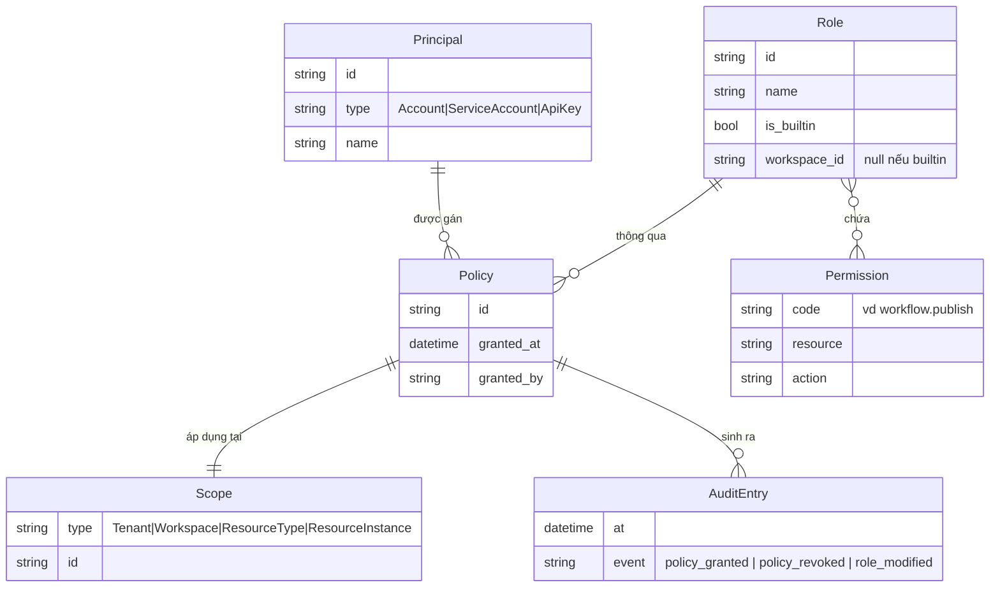
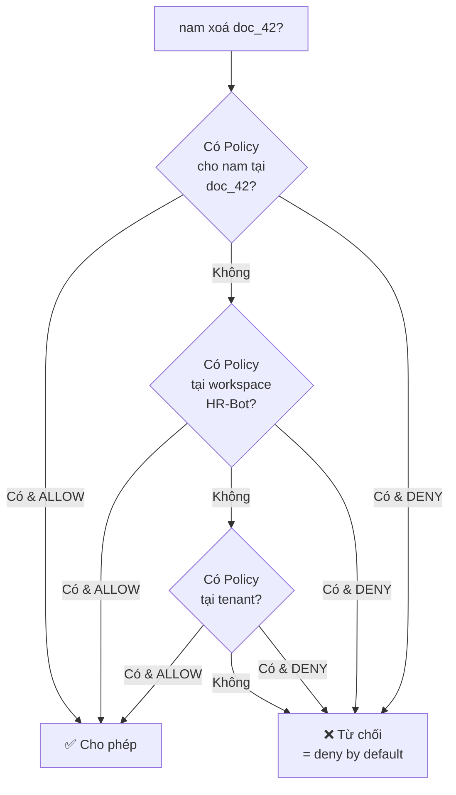
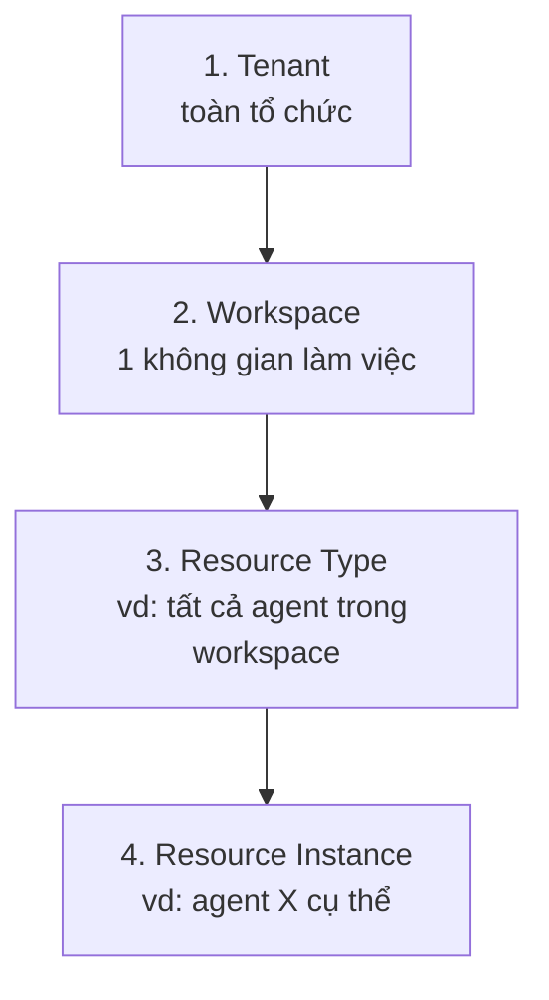
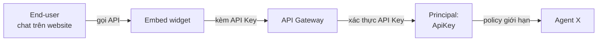
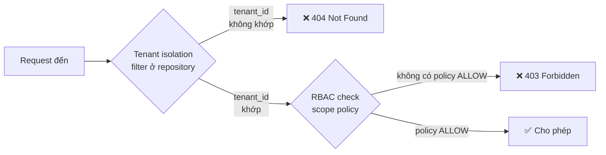

# IAM & RBAC

🟡 Draft — v0.1

> Trang này định nghĩa **mô hình quản trị truy cập** của CAP: ai làm được gì, với tài nguyên nào, trong phạm vi nào. Đối tượng đọc: Lãnh đạo tổ chức, Quản trị workspace, đội Compliance/Bảo mật, kiến trúc sư.
>
> Chi tiết kỹ thuật (JWT, token rotation, SSO flow…) ở [Section 3 — Auth Flow](/03-architecture/07-auth-flow).

---

## 1. Vì sao CAP cần RBAC chi tiết

Trong [Vision § 3.2](/01-overview/01-vision), 4 nỗi đau của khách hàng có 2 nỗi đau **trực tiếp giải bằng RBAC**:

| Nỗi đau (từ góc nhìn lãnh đạo) | RBAC cần làm gì |
| --- | --- |
| *"Không kiểm soát được ai đang đưa dữ liệu nội bộ nào ra ngoài"* | Mọi truy cập tài nguyên phải có **principal định danh** + **scope cụ thể** + **audit log** đầy đủ |
| *"Pilot 1 phòng ban không nhân rộng được cho 10 phòng ban / 5 công ty con"* | RBAC phải mở rộng theo **đa workspace trong đa tenant**, vai trò không bị fix cứng |

Đó là lý do CAP **không thể** dùng mô hình role cố định kiểu "Admin / Editor / Viewer" của các SaaS đơn lẻ. Phải có RBAC tuỳ biến ngay từ MVP.

---

## 2. 5 nguyên tắc thiết kế

5 nguyên tắc đóng vai trò "la bàn" khi có quyết định khó về phân quyền — ưu tiên nguyên tắc trước, tiện lợi sau.

| # | Nguyên tắc | Hệ quả khi áp dụng |
| --- | --- | --- |
| 1 | **Deny by default** | Khi không tìm thấy quy định rõ ràng cho phép, hệ thống **chặn**. Người dùng không có quyền là không thấy nút bấm — không "ẩn chứ vẫn gọi được" |
| 2 | **Least privilege** | Role mặc định cho thành viên mới = quyền **thấp nhất** đủ để bắt đầu. Mở rộng quyền là hành động có chủ ý, có audit |
| 3 | **Custom-first** | Vai trò tuỳ chỉnh là **chức năng cốt lõi**, không phải tính năng nâng cao. Built-in role chỉ là "gói khởi đầu" để tổ chức dùng ngay |
| 4 | **Scope inheritance with explicit override** | Quyền ở cấp tenant **tự động** có hiệu lực xuống workspace. Muốn cấm/hạn chế ở 1 workspace cụ thể → phải **ghi đè tường minh** |
| 5 | **Audit-friendly** | Mọi thay đổi về Role, Policy, Permission đều **bắt buộc** ghi audit log. Audit log **không xoá được**, chỉ archive |

---

## 3. Mô hình khái niệm



### 3.1 Giải thích các khái niệm

| Khái niệm | Định nghĩa | Ví dụ |
| --- | --- | --- |
| **Principal** | "Ai" đang thực hiện hành động. Có 3 loại | Account `nam@cmc.vn` · Service Account `crm-integration` · API Key `key_abc123` |
| **Permission** | Đơn vị quyền nguyên tử nhỏ nhất. Theo convention `<resource>.<action>` | `workflow.publish`, `knowledge.document.delete` |
| **Role** | Tập hợp Permission có tên, dễ gán hàng loạt | Role `Knowledge Editor` = `knowledge.read` + `knowledge.document.upload` + `knowledge.document.update` |
| **Scope** | Phạm vi mà Role có hiệu lực | Workspace `HR-Bot`, hoặc cụ thể hơn: Agent `agent_xyz` |
| **Policy** | Bản ghi cụ thể: *Principal X có Role Y trong Scope Z*. Là đơn vị **được audit** | `nam@cmc.vn` có role `Knowledge Editor` trong workspace `HR-Bot`, được cấp bởi `chi@cmc.vn` lúc 2026-05-14 10:30 |

### 3.2 Quyết định ALLOW/DENY

Khi `nam@cmc.vn` muốn xoá document `doc_42` thuộc workspace `HR-Bot`:



Quy tắc: **DENY thắng ALLOW** trong cùng cấp; **scope thấp ghi đè scope cao**.

**Ví dụ minh hoạ scope-low-wins**:

| Tình huống | Workspace policy | Instance policy | Kết quả |
| --- | --- | --- | --- |
| User xoá workflow bình thường trong HR-Bot | ALLOW `workflow.delete` | (không có) | ✅ Cho phép — workspace ALLOW có hiệu lực |
| User xoá `workflow_critical_audit` | ALLOW `workflow.delete` | DENY `workflow.delete` | ❌ Từ chối — instance DENY ghi đè |
| User xoá workflow trong workspace khác | (không có) | (không có) | ❌ Từ chối — deny by default |

→ Logic này cho phép **whitelist rộng + blacklist hẹp**: cấp ALLOW cho cả workspace, chỉ DENY những resource đặc biệt nhạy cảm.

---

## 4. Vai trò tự định nghĩa

Đây là điểm khác biệt cốt lõi so với các nền tảng AI khác (Dify chỉ có 5 role cố định, Flowise không có RBAC).

### 4.1 Quản trị workspace có thể làm gì

- **Tạo role mới** với tên do tổ chức đặt (vd "Trưởng phòng Marketing", "Chuyên viên Compliance")
- **Bắt đầu từ template** (clone built-in role rồi điều chỉnh) hoặc **start from scratch** (chọn từng permission)
- **Gán role** cho member trong workspace
- **Sửa/xoá role** sau này — các member đang có role đó sẽ tự động cập nhật

### 4.2 Ba tình huống thực tế

#### 🎯 Tình huống A — Phòng HR cần role "Biên tập tri thức"

> *"Chị Lan chỉ được upload tài liệu HR mới và sửa nội dung, không được xoá tài liệu cũ (vì có thể ảnh hưởng lịch sử), không được publish agent."*

Quản trị workspace HR tạo custom role `HR Knowledge Writer`:

| Permission | Mô tả |
| --- | --- |
| ✅ `knowledge.read` | Đọc kho tri thức |
| ✅ `knowledge.document.upload` | Upload tài liệu mới |
| ✅ `knowledge.document.update` | Cập nhật nội dung |
| ❌ `knowledge.document.delete` | (Không có) — không xoá được |
| ❌ `agent.publish` | (Không có) — không deploy agent được |

#### 🎯 Tình huống B — Tích hợp ERP cần service account

> *"Hệ thống ERP muốn gọi API CAP để hỏi agent kiểm tra ngân sách. Không thể dùng tài khoản cá nhân vì người đó có thể nghỉ việc."*

Tạo Service Account `erp-budget-checker`:

- Loại Principal: `ServiceAccount` (không có UI login, chỉ có API key)
- Role: custom `Budget Bot Caller` chỉ có `agent.invoke` cho 1 agent cụ thể
- Scope: ResourceInstance = `agent_budget_check_v1`
- Lifetime: API key có thể rotate, audit mọi lần gọi

#### 🎯 Tình huống C — Compliance cần role chỉ-xem-audit

> *"Chuyên viên Compliance được giao xem audit log toàn tenant nhưng không được sửa gì cả, không được vào workspace của các bộ phận khác."*

Tạo role `Compliance Auditor` cấp tenant:

| Permission | Mô tả |
| --- | --- |
| ✅ `audit.read` | Đọc audit log toàn tenant |
| ✅ `workspace.list` | Liệt kê workspace (để filter audit) |
| ❌ `workspace.read`, `agent.*`, `knowledge.*` | (Không có) — không vào được nội dung |

---

## 5. Built-in role (gói khởi đầu)

Khi tạo tenant mới, CAP cung cấp sẵn các role mặc định để **dùng ngay**. Đây là **starter pack** — quản trị có thể **đổi tên, sửa permission, hoặc xoá** sau khi tạo custom role thay thế.

> **MVP ship 5 role cốt lõi**: `tenant_owner`, `workspace_owner`, `workspace_editor`, `workspace_viewer`, `auditor`. 3 role còn lại (`tenant_admin`, `workspace_admin`, `workspace_api`) bổ sung từ v2 khi nhu cầu rõ ràng hơn — tránh "ship sớm nhưng không ai dùng".

| Role | Phạm vi | Làm được | KHÔNG được |
| --- | --- | --- | --- |
| `tenant_owner` | Tenant | Mọi thứ trong tenant, set billing, transfer ownership | (không giới hạn) |
| `tenant_admin` | Tenant | Tạo/sửa workspace, mời member toàn tenant, xem audit | Set billing, transfer ownership |
| `workspace_owner` | Workspace | Toàn quyền workspace, gán bất kỳ role nào | Sửa setting cấp tenant |
| `workspace_admin` | Workspace | Quản lý tài nguyên + member trong workspace | Xoá workspace, đổi billing |
| `workspace_editor` | Workspace | Tạo/sửa agent, tool, knowledge, workflow ở dạng draft | Publish, xoá, gán role member |
| `workspace_viewer` | Workspace | Chỉ xem cấu hình và lịch sử chạy | Mọi hành động ghi |
| `workspace_api` | Workspace | Gọi API (chat, invoke workflow) | Truy cập UI builder |
| `auditor` | Tenant hoặc Workspace | Đọc audit log + cấu hình | Mọi hành động ghi |

> 💡 **Quan trọng**: không có role nào "siêu cao hơn" được tạo bằng cách combine — muốn quyền tổng hợp, **tạo custom role mới** thay vì cộng dồn nhiều built-in role lên 1 user.

---

## 6. 4 cấp Scope

Phạm vi áp dụng của 1 Policy có 4 cấp, từ rộng đến hẹp:



| Scope | Ví dụ Policy | Khi nào dùng |
| --- | --- | --- |
| **Tenant** | "Chị Hà có role `tenant_admin` ở tenant CMC" | Lãnh đạo, IT admin toàn tổ chức |
| **Workspace** | "Anh Nam có role `workspace_editor` ở workspace HR-Bot" | Nhân sự thường xuyên — đa số policy nằm ở cấp này |
| **Resource Type** | "Đội QA có role `viewer` cho tất cả `agent` trong workspace HR-Bot" | Cấp quyền theo loại tài nguyên — vd chỉ xem agent, không xem KB |
| **Resource Instance** | "Service account `erp-bot` có role `caller` cho **agent_budget_v1** duy nhất" | Tích hợp cụ thể, cô lập rủi ro tối đa |

> **Scope inheritance** (nguyên tắc 4): policy cấp Tenant tự động hiệu lực xuống các cấp dưới, **trừ khi** có policy DENY tường minh ở cấp dưới.

---

## 7. Sharing & cross-workspace

Câu hỏi thường gặp: *"Workspace HR có agent giỏi, workspace IT muốn dùng — có chia sẻ được không?"*

### 7.1 Mặc định: KHÔNG share

Theo nguyên tắc "An toàn theo mặc định" ([Vision § 5](/01-overview/01-vision)), tài nguyên thuộc workspace nào **chỉ workspace đó nhìn thấy**. Không có magic discovery cross-workspace.

### 7.2 Có thể share qua 2 cơ chế (post-MVP)

| Cơ chế | Mô tả | Phiên bản |
| --- | --- | --- |
| **Internal Marketplace** | Workspace publish 1 agent / template lên marketplace nội bộ tenant → workspace khác **clone** về (bản sao độc lập) | v3 |
| **Explicit Cross-Workspace Policy** | Quản trị workspace A tạo policy cho phép principal của workspace B truy cập 1 resource cụ thể của A | v3 |

→ MVP/v2 không có share — đảm bảo isolation cứng trước, mở rộng sau.

---

## 8. End-user và API Key

3 loại Principal đã giới thiệu ở §3.1 — phần này đi sâu vào 2 trường hợp đặc biệt: **end-user** (người chat với agent, không có account) và **API Key** (cách hệ thống ngoài đứng tên tài nguyên).

### 8.1 End-user — không phải Principal trực tiếp

End-user (khách hàng chat với agent qua web / iframe / embed) **không có account CAP**, do đó **không phải là Principal**. Họ truy cập tài nguyên thông qua **API Key của workspace**:



**Hệ quả thực tế**:

- Permission để chat với agent gắn vào **API Key**, không vào end-user
- Audit ghi: API Key nào đã gọi agent nào — **không** ghi danh tính end-user (CAP không biết)
- Muốn track end-user → tổ chức tự gắn `end_user_id` của mình vào header request, CAP forward vào trace (không có quota / phân quyền theo end-user trong MVP)

### 8.2 API Key — vòng đời

API Key là Principal đặc biệt vì **không có người** đứng sau. Vòng đời cần kiểm soát chặt:

| Sự kiện | Ai làm | Cơ chế |
| --- | --- | --- |
| **Tạo** | Workspace Owner / Admin | Ghi audit: tạo bởi ai, scope nào, mục đích. Key chỉ hiện 1 lần — như GitHub PAT |
| **Rotate** | Workspace Owner / Admin (định kỳ hoặc khi nghi lộ) | Hỗ trợ **2 key song song trong grace period** (vd 7 ngày) để chuyển đổi không downtime |
| **Revoke** | Workspace Owner / Admin / Auditor (khẩn cấp) | Ghi audit: revoke bởi ai, vì sao. Hiệu lực tức thì |
| **Hết hạn** | Tự động — mặc định 1 năm, có thể tuỳ chỉnh | Cảnh báo 30 ngày trước khi hết hạn |
| **Phát hiện lộ** (vd commit lên GitHub) | Hệ thống tự revoke + thông báo | Bắt buộc audit + notify owner |

**Quy tắc chặt chẽ**:

- 1 API Key gắn với **1 Service Account** + **1 scope tối hẹp** (ưu tiên ResourceInstance khi có thể)
- API Key **không bao giờ log nguyên văn** — chỉ log prefix 4 ký tự đầu (`key_abcd…`) để debug
- Key được hash + store, **không recoverable** sau khi tạo

### 8.3 Service Account vs Account thường

| Tính chất | Account (người) | Service Account |
| --- | --- | --- |
| Đăng nhập UI | ✅ Email + password / SSO | ❌ |
| Gọi API | ✅ Qua JWT từ login | ✅ Qua API Key |
| MFA | ✅ Bắt buộc cho admin | ❌ (chỉ dựa vào độ khó của API Key) |
| Lifecycle | Mời / suspend / xoá khi nhân sự rời | Tạo / rotate / revoke theo tích hợp |
| Audit signature | Tên người | Tên service account + key prefix |

---

## 9. RBAC × Multi-tenant — thứ tự kiểm tra

Hai cơ chế bảo vệ chạy **tuần tự**, không cái nào thay thế cái nào — đây là chiến lược **defense in depth**:



### 9.1 Vì sao tách 2 lớp

| Lớp | Mục đích | Cài đặt ở đâu |
| --- | --- | --- |
| **Isolation** (lọc `tenant_id` / `workspace_id`) | Đảm bảo workspace A không "nhìn thấy" được resource workspace B, kể cả khi RBAC có bug | Tầng repository / data access — không phụ thuộc handler nhớ filter |
| **RBAC** (check policy) | Trong cùng tenant, ai được làm gì với resource nào | Tầng application — sau khi resource đã được load |

→ Nếu chỉ có RBAC mà không có isolation: bug RBAC có thể leak dữ liệu cross-tenant. Có cả 2 lớp: **bug ở lớp này không phá vỡ lớp kia**.

### 9.2 Status code khi từ chối

Ý nghĩa code khác nhau theo nguyên nhân từ chối — đây là chi tiết quan trọng để debug + bảo mật:

| Tình huống | Code | Vì sao |
| --- | --- | --- |
| Resource thuộc tenant khác | **404 Not Found** | Không tiết lộ resource có tồn tại — tránh leak thông tin cross-tenant |
| Resource cùng tenant nhưng không có policy ALLOW | **403 Forbidden** | Cho biết resource tồn tại nhưng không có quyền — minh bạch trong tổ chức |
| Chưa xác thực | **401 Unauthorized** | Cần đăng nhập / kèm token |

> **Lưu ý**: ngay cả `auditor` cũng phải qua isolation — không ai vượt được tenant boundary, kể cả `tenant_owner` của tenant khác. Chi tiết cài đặt ở [Section 3 — Multi-tenant Isolation](/03-architecture/06-multi-tenant).

---

## 10. Audit & compliance

Mọi thay đổi liên quan đến quản trị truy cập **bắt buộc** ghi vào audit log:

| Sự kiện | Audit | Thông tin ghi |
| --- | --- | --- |
| Member được mời vào tenant/workspace | ✅ | Ai mời, mời ai, role gì, scope nào, thời điểm |
| Role được gán/thu hồi | ✅ | Trước/sau, người thực hiện |
| Custom role được tạo/sửa/xoá | ✅ | Diff các permission |
| Permission được cấp trực tiếp (không qua role) | ✅ | Diễn giải đầy đủ |
| Đăng nhập thành công/thất bại | ✅ | IP, user agent, MFA dùng hay không |
| Sử dụng resource sensitive (xoá KB, publish agent, gọi LLM với context nhạy cảm) | ✅ | Có chính sách retention dài hơn |
| Chỉnh sửa setting bảo mật cấp tenant | ✅ | Trước/sau, lý do (nếu yêu cầu) |

→ Audit log lưu ở store riêng (xem [Observability](/03-architecture/08-observability)), **không xoá được trong app**, có thể export định kỳ ra cold storage để giảm chi phí.

---

## 11. Naming convention (tham khảo cho dev)

Permission theo định dạng `<resource>.<action>` hoặc `<resource>.<sub_resource>.<action>`.

### 11.1 Resources

| Resource | Sub-resources |
| --- | --- |
| `tenant` | `tenant.billing`, `tenant.member`, `tenant.audit`, `tenant.setting` |
| `workspace` | `workspace.member`, `workspace.role`, `workspace.setting` |
| `agent` | (không có sub) |
| `tool` | `tool.credential` |
| `knowledge` | `knowledge.document`, `knowledge.segment` |
| `workflow` | `workflow.run`, `workflow.schedule` |
| `audit` | (không có sub) |

### 11.2 Actions

Bộ action chuẩn: `list`, `read`, `create`, `update`, `delete`, `publish`, `invoke`, `grant`, `revoke`, `export`.

### 11.3 Ví dụ permission

```text
workflow.create
workflow.publish
workflow.run.read
agent.invoke
knowledge.document.upload
knowledge.document.delete
tenant.billing.read
tenant.member.invite
workspace.role.create
audit.read
audit.export
```

---

## 12. Câu hỏi còn mở

Những câu hỏi **chưa quyết** — sẽ chốt khi triển khai chi tiết:

| # | Câu hỏi | Cân nhắc |
| --- | --- | --- |
| Q1 | **ABAC** (attribute-based access control) bổ sung RBAC? | Vd: "Chỉ cho phép xem document có metadata `department == HR`" — mạnh nhưng phức tạp; v3+ |
| Q2 | **Instance-level permission UI** trong MVP hay sau? | Mô hình đã hỗ trợ ở backend từ MVP, nhưng UI gán policy theo instance có thể để v2 |
| Q3 | **Delegation/Impersonation** — admin "đăng nhập như" user khác để debug? | Tiện cho support nhưng risk lớn — cần MFA + audit kỹ; v3+ |
| Q4 | **Permission template marketplace** — share custom role giữa tổ chức? | Hay nhưng có rủi ro role không phù hợp; v4+ |
| Q5 | **Time-bound role** — gán role chỉ hiệu lực 30 ngày | Phù hợp cho contractor, audit — v3+ |
| Q6 | **Approval workflow** cho cấp quyền nhạy cảm (xoá tenant, change billing) — có cần multi-approver không? | Enterprise muốn — v4+ |
| Q7 | **SCIM** để đồng bộ user/group từ AD/Okta — MVP hay v3? | v3 đi cùng SSO/SAML |

---

## Liên kết

- [Tenant & Workspace](/02-domain/01-tenant-workspace) — mô hình 2 cấp organization
- [Vision § 5 — Nguyên tắc "An toàn theo mặc định"](/01-overview/01-vision)
- [Section 3 — Auth Flow](/03-architecture/07-auth-flow) — JWT, token, SSO chi tiết
- [Section 3 — Observability](/03-architecture/08-observability) — audit log lưu ở đâu, retention thế nào
- [Roadmap](/07-roadmap/01-mvp) — phiên bản nào có gì
