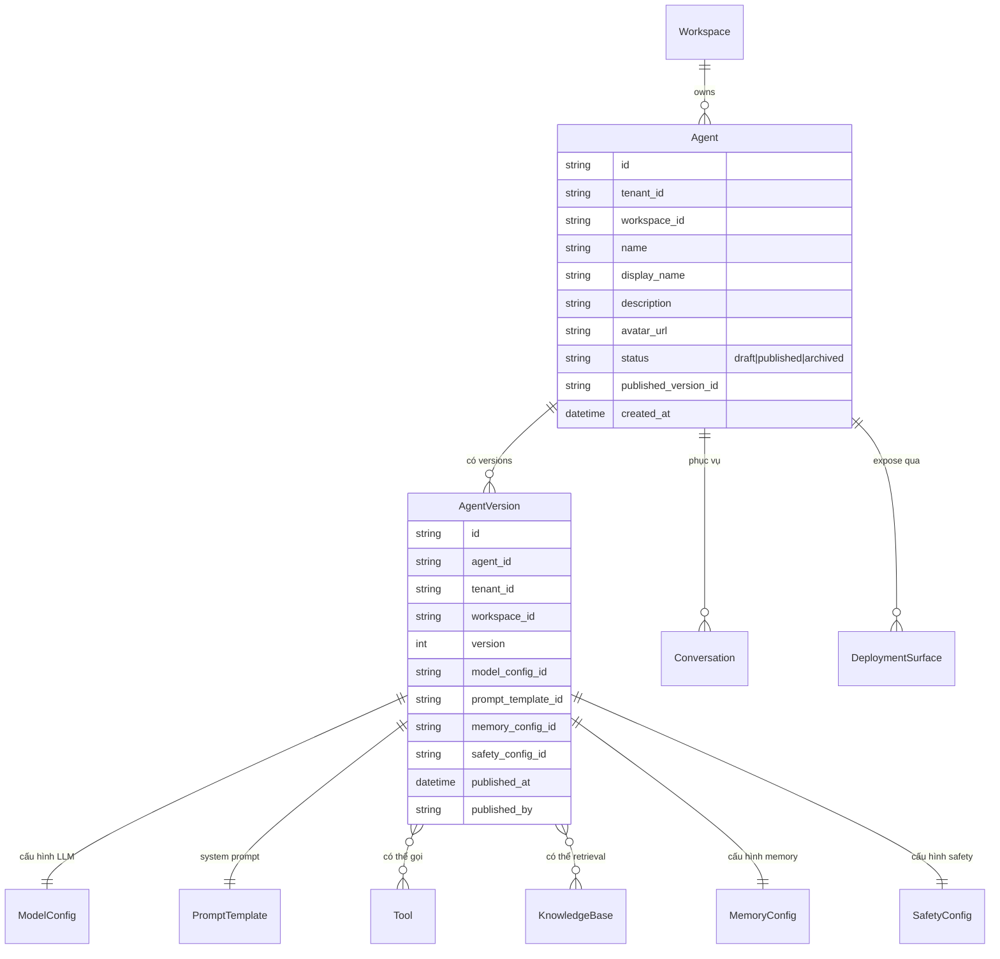
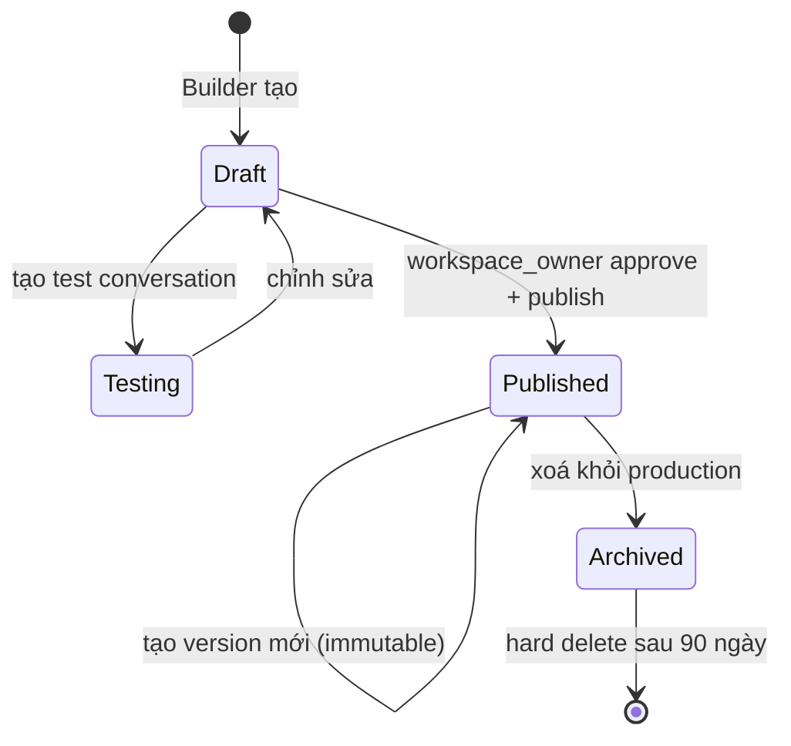

# Agent

🟡 Draft — v0.1

## Agent là gì

**Agent** là **"nhân viên ảo"** mà builder tạo ra trên CAP. Mỗi agent có **vai trò** (CSKH, tra cứu chính sách HR, tư vấn sản phẩm…), **tri thức** (gắn với Knowledge Base nội bộ), **kỹ năng** (gắn với Tool để gọi API/hệ thống) và **quy tắc ứng xử** (system prompt). End-user trò chuyện với agent qua chat; mỗi lượt, agent dùng LLM để tự quyết định: **trả lời thẳng**, **tra Knowledge Base**, **gọi Tool**, hay **chuyển cho người thật**.

**Phép hình dung**:

- Agent ≈ **một nhân viên mới** — có **mô tả công việc** (prompt), được phát **tài liệu để đọc** (KB), được phát **quyền dùng các app nội bộ** (Tool), và có **sếp giám sát chi tiêu** (safety + cost limit).
- **AgentVersion** ≈ **một bản hợp đồng đã ký** — bất biến sau khi publish. Sửa "mô tả công việc" thì cần publish lại; bản đang phục vụ khách hàng không bị thay đột ngột.
- **Memory** ≈ "trí nhớ ngắn hạn" của agent trong một phiên chat — không phải biết-tuốt vĩnh viễn.

**Ví dụ cụ thể**: agent `cmc-hr-helpdesk` —

- **Vai trò**: trả lời câu hỏi nhân viên về nghỉ phép / chấm công / phúc lợi.
- **Đọc**: KB `chinh-sach-hr-2026` (80 file PDF chính sách).
- **Kỹ năng**: Tool `submit_leave_request` (gọi API HRMS), Tool `check_remaining_days` (query HR DB).
- **Quy tắc**: trả lời ngắn gọn, kèm trích dẫn, không bao giờ tiết lộ lương người khác, vượt thẩm quyền → handoff cho HR người thật.

**Agent khác Workflow ở đâu**: Agent **suy luận theo từng lượt chat** — LLM quyết bước tiếp theo, phù hợp với hội thoại mở. Workflow **đi theo sơ đồ cố định** — mỗi bước có vai trò rõ, phù hợp với quy trình lặp đi lặp lại. Hai loại có thể **gọi lẫn nhau**: workflow chèn agent làm 1 bước; agent gọi workflow như một tool. Bảng so sánh chi tiết: §1.1.

**Đọc trang này nếu bạn là**:

- **BA / PO** — đang định nghĩa "trợ lý X" cho phòng ban, cần biết Agent gồm những phần gì để brief.
- **Builder no-code** — sắp tạo agent đầu tiên, cần hiểu các trường cấu hình + workflow publish.
- **Kiến trúc sư / Dev** — cần map khái niệm Agent vào service/data layer.

**Trang liên quan**: [Tool](/02-domain/04-tool) (kỹ năng của agent) · [Knowledge Base](/02-domain/05-knowledge) (tri thức của agent) · [Workflow](/02-domain/06-workflow) (so với agent) · [Conversation](/02-domain/07-conversation) (lượt chat với agent) · [Workflow Engine](/03-architecture/03-workflow-engine) (cách agent chạy bên trong).

---

## 1. Vì sao Agent

Agent là **đơn vị giá trị nghiệp vụ** mà builder tạo ra trên CAP — nếu ví CAP là "AWS cho AI" thì Agent là "EC2 instance", đối tượng cụ thể end-user tương tác. Đây là nơi vision của CAP được hiện thực hoá cho phòng ban / tổ chức cụ thể.

Hai cam kết cốt lõi trong [Vision](/01-overview/01-vision) được Agent trực tiếp hiện thực hoá:

- **§ 3 — Trao quyền nghiệp vụ**: BA/PM tạo Agent qua UI no-code → giải bài toán phòng ban mà không cần dev.
- **§ 5 — Tri thức nội bộ ưu tiên**: Agent gắn với Knowledge Base của tổ chức → trả lời có dẫn nguồn, không bịa.

### 1.1 Agent vs Workflow — khác nhau ở đâu

| Agent | Workflow |
| --- | --- |
| **Brain**: LLM ra quyết định mỗi bước | **Pipeline**: các bước cố định, deterministic |
| Tương tác **multi-turn** với người | Chạy **end-to-end** rồi kết thúc |
| Nhận query tự do, tự chọn tool | Input có schema, output có schema |
| Phù hợp: chatbot, trợ lý ảo, tư vấn | Phù hợp: tự động xử lý đơn, phê duyệt, ETL |

→ **Trong CAP**, Agent có thể là **một node trong Workflow** — workflow gọi agent để xử lý sub-task cần LLM reasoning. Xem [Workflow §4](/02-domain/06-workflow).

---

## 2. 5 nguyên tắc thiết kế

| # | Nguyên tắc | Hệ quả |
| --- | --- | --- |
| 1 | **Agent có identity rõ ràng** | Mỗi agent có tên, avatar, mô tả, welcome message — end-user biết đang nói chuyện với "ai" |
| 2 | **Prompt là source of truth, không phải code** | System prompt + tool selection được builder edit qua UI, không phải nhờ dev. Có versioning |
| 3 | **Mọi quyết định AI đều log được** | Mỗi lượt chat ghi: prompt nào, tool nào được gọi, LLM trả gì, hết bao nhiêu tiền |
| 4 | **Safety mặc định** | Có content filter, max iterations, max cost per conversation — không có chế độ "trust me" |
| 5 | **Provider-agnostic** | Đổi LLM provider (OpenAI ↔ Anthropic ↔ vLLM nội bộ) không phải rebuild agent — chỉ cập nhật config |

---

## 3. Mô hình khái niệm

### 3.1 Thành phần một Agent

| Thành phần | Mô tả |
| --- | --- |
| **Model config** | Provider (OpenAI/Anthropic/...), model cụ thể (gpt-4o, claude-3.5), temperature, max_tokens |
| **System prompt** | Instruction định danh agent: persona, mục tiêu, ràng buộc, ví dụ few-shot |
| **Tools** | Danh sách tool agent được gọi (xem [Tool](/02-domain/04-tool)) |
| **Knowledge** | Danh sách KB agent được retrieval (xem [Knowledge Base](/02-domain/05-knowledge)) |
| **Memory** | Cấu hình memory: số message giữ trong context, summary policy khi dài |
| **Safety** | Content filter, max iterations, max cost per conversation, refused topics |
| **Identity** | Display name, avatar, description, welcome message, suggested prompts |
| **Deployment** | Surface expose: chat URL public, embed iframe, API endpoint, Slack/Teams bot |

---

## 4. 3 loại Agent

Cùng là Agent, cùng entity, nhưng **mô hình tương tác** khác nhau dẫn đến config + cost + UX khác nhau. Builder cần biết để chọn đúng loại ngay đầu — đổi loại sau khi đã chạy production là việc đau.

| Tiêu chí | 4.1 Chatbot | 4.2 Task autonomous | 4.3 Workflow step |
| --- | --- | --- | --- |
| **Ai gọi** | End-user (qua chat UI / embed / Slack) | Trigger (user nhấn nút, schedule, webhook) | Workflow Engine — agent là 1 node |
| **Hình thái** | Multi-turn hội thoại | One-shot task, agent tự loop nội bộ | One-shot, input/output có schema cứng |
| **Memory** | ✅ Nhớ trong cùng phiên chat | ⚠️ Chỉ trong 1 task, không cross-task | ❌ Không có, mỗi lần chạy độc lập |
| **Streaming** | ✅ SSE từng token | ❌ Đợi xong cả task | ❌ Trả 1 cục output cho workflow |
| **Input** | Free-form text | Free-form text + cấu trúc | JSON schema cứng |
| **Output** | Free-form + có thể có UI element | Final answer + intermediate trace | JSON schema cứng |
| **Max iterations** | Không cố định (per turn ~3-5 tool call) | High (10-30 step) | Thấp (1-3 step) |
| **Chi phí mỗi lần** | Thấp/turn nhưng kéo dài | Cao mỗi task | Vừa — đoán được |

### 4.1 Chatbot conversational

Loại phổ biến nhất. Agent multi-turn với end-user, có memory ngữ cảnh phiên chat, stream từng token để cảm giác phản hồi nhanh.

**Khi nào chọn**: bài toán cần **đối thoại** — user hỏi → agent đáp → user hỏi tiếp dựa trên trả lời trước.

**Ví dụ cụ thể**: agent `cmc-hr-helpdesk` — nhân viên hỏi *"Tôi còn bao nhiêu ngày phép?"* → agent retrieve KB + gọi tool → trả lời + đề xuất *"Bạn có muốn xin nghỉ luôn không?"* → user *"Có, thứ 6 này"* → agent gọi tool `submit_leave_request` (nhớ context người này từ turn trước).

**Use case điển hình**: Customer support · HR helpdesk · IT helpdesk · Sales pre-consult · Tư vấn sản phẩm.

### 4.2 Task autonomous

Agent nhận **1 task duy nhất**, **tự quyết chuỗi tool cần gọi**, tự lặp tới khi xong (max N step). Không có user input giữa chừng (trừ khi gặp node `human_input`).

**Khi nào chọn**: bài toán có **đầu vào rõ + đầu ra rõ** nhưng các bước ở giữa **phụ thuộc nội dung**, không xếp trước được — cần LLM tự khám phá.

**Ví dụ cụ thể**: agent `compliance-reviewer` — nhận 1 file hợp đồng → tự quyết: (1) gọi tool `extract_clauses` → (2) so từng điều khoản với checklist quy định → (3) phát hiện điều khoản lạ → gọi `search_precedent` để tìm tiền lệ → (4) viết báo cáo + đính rủi ro. Số bước không đoán trước được, phụ thuộc hợp đồng dài/ngắn và có bao nhiêu điều khoản lạ.

**Use case điển hình**: Compliance reviewer · Lead qualifier · Tự động điều tra incident · Tự động thu thập + tóm tắt báo cáo cạnh tranh.

**Cảnh báo**: chi phí cao + khó debug nếu loop dài. **Bắt buộc** set `max_iterations` và `max_cost_per_run` để tránh runaway.

### 4.3 Workflow step

Agent là **1 node** trong workflow lớn hơn. Input/output có **JSON schema cứng**, không có memory, không stream cho user.

**Khi nào chọn**: bài toán cần LLM reasoning nhưng nằm trong quy trình lớn có nhiều bước deterministic; phần phía trước/sau là tool/code/branch, chỉ riêng bước này cần "nghĩ".

**Ví dụ cụ thể**: workflow `xu-ly-don-hang` có 5 node — (1) `tool: receive_order` → (2) **`agent: classify_intent`** (chính đây — agent xếp đơn vào loại standard/special/refund) → (3) `branch: theo loại` → (4) `tool: process` → (5) `tool: notify`. Agent node nhận `{order_text: ...}`, trả `{intent: "standard|special|refund", reason: "..."}` đúng schema để branch hoạt động.

**Use case điển hình**: Bóc tách thông tin từ hợp đồng/email · Dịch ngôn ngữ · Classify request · Sinh draft email cá nhân hoá · Phân tích sentiment.

> 💡 **Quyết định nhanh**: end-user gõ chat → 4.1. Trigger tự động + bước phụ thuộc nội dung → 4.2. Là 1 mắt xích trong quy trình lớn → 4.3.

---

## 5. Lifecycle

### 5.1 Draft

- Chỉ builder & người được chia sẻ thấy
- Test bằng "test conversation" ảo, không tính chi phí thật
- Mọi field sửa thoải mái

### 5.2 Published

- Có version cụ thể (vd `v3`). Mỗi publish tạo **immutable snapshot**
- End-user / API consumer dùng `published_version_id` này
- Sửa system prompt → tạo `v4`, không sửa `v3`
- Có thể rollback bằng cách set `published_version_id` về `v3`

### 5.3 Vì sao immutable version

- **Reproducibility**: bug ở v3 có thể reproduce sau khi đã v4
- **A/B testing**: chạy song song v3 và v4 cho 50% traffic mỗi bên
- **Audit**: end-user khiếu nại tuần trước về 1 câu trả lời → xác định version nào trả lời

---

## 6. Use cases nghiệp vụ

### 🎯 Use case A — HR Helpdesk Bot

> *"Nhân viên hỏi nhanh về quy trình nghỉ phép, chấm công, chính sách phúc lợi — không cần đợi HR trả lời thủ công."*

**Setup**:

- Loại: Chatbot conversational
- Knowledge: KB "HR Policy" (handbook, FAQ, mẫu đơn)
- Tools: `calendar.check_leave_balance`, `email.send_to_hr` (escalation)
- Memory: giữ 10 message gần nhất
- Safety: refused topics = "lương, đánh giá performance" → escalate human

### 🎯 Use case B — Sales Lead Qualifier

> *"Form submit từ website → tự động chấm điểm lead (Hot/Warm/Cold) + ghi vào CRM."*

**Setup**:

- Loại: Workflow step
- Input schema: `{name, company, message, source}`
- Tool: `crm.lookup_company`, `crm.create_lead`
- Output schema: `{score: 0-100, category, reasoning}`
- Không cần memory (single-turn)

### 🎯 Use case C — Compliance Reviewer

> *"Upload hợp đồng → agent tự đọc, đối chiếu với policy, gắn cờ điều khoản nguy hiểm, output báo cáo."*

**Setup**:

- Loại: Task autonomous
- Knowledge: KB "Legal Policy", KB "Past Cases"
- Tools: `document.parse`, `report.generate_pdf`
- Max iterations: 20 (chống loop)
- Output: structured report + xếp severity

---

## 7. Deployment surfaces

1 agent có thể expose qua nhiều "kênh":

| Surface | Mô tả | Phù hợp |
| --- | --- | --- |
| **Chat URL public** | URL `cap.app/chat/<agent_id>` dùng ngay | Demo, internal share |
| **Embed iframe** | `<iframe src="...">` nhúng website công ty | Customer-facing bot |
| **API endpoint** | `POST /api/v1/agents/<id>/invoke` | Tích hợp app khác |
| **Slack / Teams bot** | Mention `@cap-bot` trong channel | Internal team |
| **Mobile SDK** (v3) | iOS / Android SDK | Mobile app |

Mỗi surface có **API Key riêng** (theo [IAM §8.2](/02-domain/02-iam-rbac)) để revoke độc lập.

---

## 8. Cost & quan sát per agent

Mỗi agent có dashboard:

| Metric | Mô tả |
| --- | --- |
| **Conversations / ngày** | Lượt chat |
| **Tokens dùng** | Input + output, split theo model |
| **Chi phí USD** | Tổng cost LLM + tool calls |
| **Latency p50 / p95** | Độ trễ phản hồi |
| **Tool call frequency** | Tool nào được gọi nhiều |
| **Escalation rate** | % cuộc chat bị bot từ chối → người |
| **User feedback** | 👍/👎 cuối câu trả lời |

→ Tổng hợp ra **Quota per agent**: max conversations/giờ, max tokens/ngày — để chặn runaway cost.

---

## 9. Trade-off đã chấp nhận

| Quyết định | Lý do | Đánh đổi |
| --- | --- | --- |
| **Immutable version sau publish** | Reproducibility, A/B, audit | Builder phải learn flow "edit-draft-publish" thay vì "edit-save" |
| **Memory short-term only (MVP)** | Đơn giản, dễ predict cost | Long conversation phải truncate; v2 thêm summary memory |
| **Provider-agnostic giảm tính năng riêng** | Đổi provider không rebuild | Không tận dụng được Anthropic tool calling format đặc thù; phải đồng nhất theo mẫu số chung |
| **1 agent chỉ retrieve từ Knowledge của workspace** | Isolation cứng | Không share KB cross-workspace tới v4 |
| **Safety là deny-list, không ML classifier (MVP)** | Đơn giản, predictable | Bypass dễ hơn so với LLM-based filter; v2 thêm ML layer |

---

## 10. Câu hỏi còn mở

| # | Câu hỏi | Cân nhắc | Phiên bản |
| --- | --- | --- | --- |
| Q1 | **Multi-modal** — agent đầu vào ảnh / audio / video | Phụ thuộc model; v3 cho image, v4 voice | v3-v4 |
| Q2 | **Agent collaboration** — agent gọi agent khác (multi-agent) | Đã có cơ chế Agent-as-Node; cần thêm orchestrator pattern | v2 |
| Q3 | **Long-term memory** (summary + vector) | Cải thiện multi-turn nhưng phức tạp cost | v2 |
| Q4 | **A/B testing UI** | Chia traffic 50/50 giữa 2 version, compare metrics | v3 |
| Q5 | **Clone agent across workspace** (internal marketplace) | Đồng bộ với [IAM §7.2](/02-domain/02-iam-rbac) | v3 |
| Q6 | **Agent template marketplace** (public) | Share template giữa các tenant | v5 |
| Q7 | **Custom fine-tuning per agent** | Fine-tune model với dữ liệu workspace; expensive + complex | Out of MVP scope |

---

## Liên kết

- [Tool](/02-domain/04-tool) — danh sách tool agent có thể gọi
- [Knowledge Base](/02-domain/05-knowledge) — KB agent retrieval
- [Workflow](/02-domain/06-workflow) — agent là 1 loại node
- [Conversation & Run](/02-domain/07-conversation) — agent serve conversation
- [IAM §4.2 Tình huống B](/02-domain/02-iam-rbac) — Service Account gọi agent
- [Vision § 3 — Trao quyền nghiệp vụ](/01-overview/01-vision)
