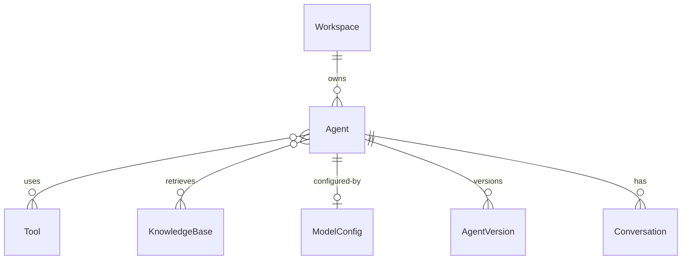

# Agent

🔴 Placeholder

## Định nghĩa

Một Agent gồm:

- **Model config**: provider, model, temperature, max_tokens
- **System prompt**: instruction
- **Tools**: danh sách tool ID được phép gọi
- **Knowledge**: danh sách KB ID được retrieval
- **Memory**: cấu hình memory (conversation history length, summary policy)
- **Trigger**: chat / API / schedule / event

Agent **là một loại Node trong Workflow** — có thể nest agent vào workflow phức tạp.

## ERD sơ bộ

## Câu hỏi mở

- Agent versioning thế nào (draft vs published)?
- Có cho clone agent across workspace không?
- Agent có thể là multi-modal (text + image + voice)?
