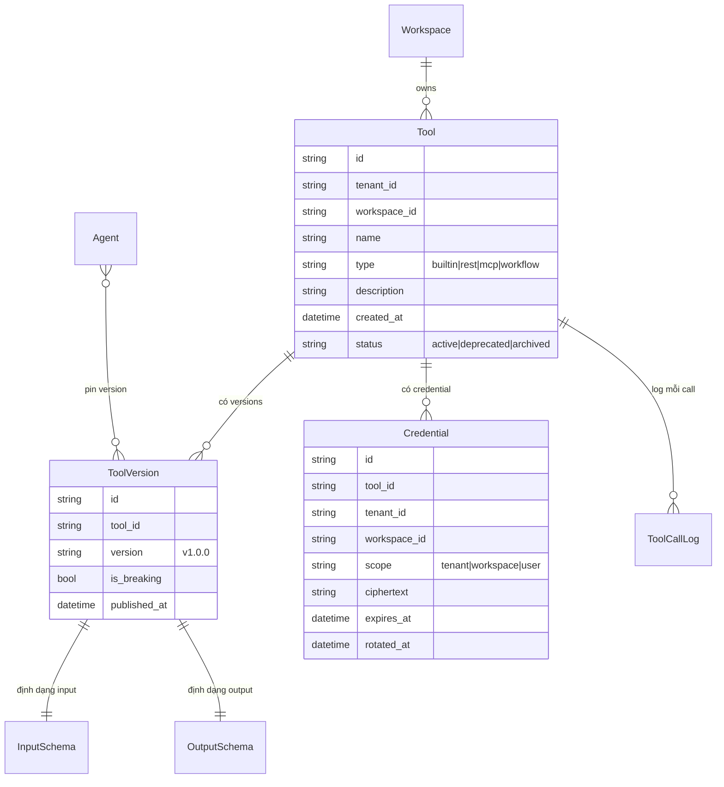
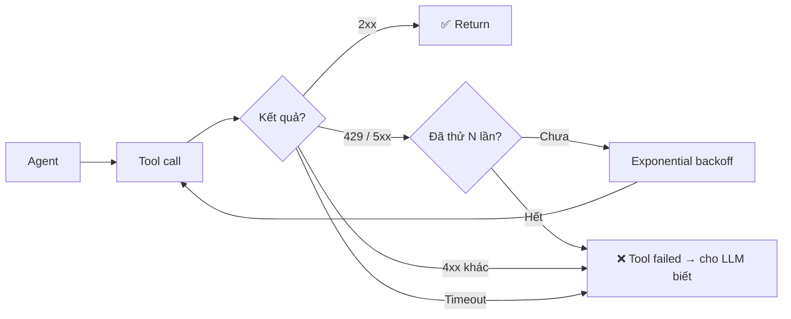

# Tool

🟡 Draft — v0.1

## Tool là gì

**Tool** là **"bàn tay"** của agent — khả năng cho phép agent **làm được việc thật**, không chỉ "nói chuyện". Tool có thể là: gọi REST API bên ngoài (CRM, ERP, HRM), gọi MCP server (Slack, Google Drive…), gửi email, query database, hoặc gọi một Workflow CAP khác như một function.

Cơ chế: agent được phát một **danh sách tool kèm schema** (mô tả + input/output). LLM tự đọc danh sách, **tự quyết** khi nào cần gọi tool nào với tham số gì → CAP nhận lời gọi → thực thi trong **sandbox cách ly** → trả kết quả về cho agent dùng tiếp.

**Phép hình dung**:

- Tool ≈ **các app trên điện thoại của agent** — mỗi app làm 1 việc cụ thể, có **giấy phép truy cập riêng** (credential), agent chỉ mở khi cần.
- **Tool Schema** ≈ **hướng dẫn sử dụng app** — LLM đọc schema để biết tham số nào bắt buộc, kết quả trả về dạng gì.
- **Tool Runtime** ≈ **chiếc điện thoại** — môi trường sandbox có giới hạn thời gian, CPU, network; tool chạy ở đây **không nhìn thấy** DB nội bộ của CAP.
- **Credential** ≈ **thẻ login** đã mã hoá; gắn theo workspace hoặc tenant; có thể rotate / revoke độc lập với tool.

**4 loại Tool**:

| Loại | Khi nào dùng | Ví dụ |
| --- | --- | --- |
| **Built-in** | Có sẵn từ CAP, không cần khai báo | `web_search`, `code_interpreter`, `image_gen` |
| **Custom REST** | Tổ chức đã có API nội bộ, muốn agent dùng | `get_customer_by_id` (từ CRM), `check_warranty` (từ ERP) |
| **MCP** | Kết nối SaaS chuẩn Model Context Protocol | Slack, GitHub, Google Drive, Notion |
| **Workflow-as-Tool** | Một workflow CAP được "đóng gói" thành tool cho agent khác gọi | `daily_report_generator`, `invoice_extractor` |

**Ví dụ cụ thể**: agent `cmc-hr-helpdesk` có 3 tool: `submit_leave_request` (Custom REST, gọi HRMS API), `slack_dm` (MCP, gửi tin trong Slack), `escalate_to_human` (Workflow-as-Tool, chuyển ticket sang đội HR). Khi nhân viên hỏi *"Em xin nghỉ thứ Sáu này"*, LLM tự gọi `submit_leave_request` với tham số `date=2026-05-22, employee_id=...`.

**Đọc trang này nếu bạn là**:

- **Builder** — đang muốn cho agent gọi hệ thống nội bộ, cần biết khai báo tool ra sao.
- **Dev tích hợp** — cần biết schema, auth, error model khi expose API nội bộ cho CAP.
- **Kiến trúc sư / Security** — cần biết tool chạy ở đâu, isolation thế nào, credential lưu ra sao.

**Trang liên quan**: [Agent](/02-domain/03-agent) (tool phục vụ ai) · [Workflow](/02-domain/06-workflow) (workflow-as-tool) · [Tool Runtime](/03-architecture/04-tool-runtime) (sandbox kỹ thuật).

---

## 1. Vì sao Tool

Tool là cách CAP giữ hai cam kết cốt lõi từ [Vision](/01-overview/01-vision) khi agent đụng tới thế giới ngoài:

- **§ 3.4 — Tự chủ công nghệ**: Tool agnostic. Đổi tool / đổi nhà cung cấp không phải rebuild agent — chỉ thay credential và schema.
- **§ 5 — An toàn theo mặc định**: Tool chạy trong **sandbox cách ly**, không truy cập DB CAP trực tiếp; mọi call đều có timeout, rate limit, audit.

Hệ quả: builder có thể **thêm/bỏ tool** trong agent qua UI mà không lo phá vỡ bảo mật ngầm; security có cơ sở để đánh giá rủi ro theo tool, không theo agent.

---

## 2. 4 nguyên tắc thiết kế

| # | Nguyên tắc | Hệ quả |
| --- | --- | --- |
| 1 | **Tool có schema rõ ràng** | Input/output JSON schema → LLM biết khi nào gọi + dev biết kiểm tra |
| 2 | **Cách ly khỏi nhân hệ thống** | Tool chạy trong Tool Runtime tách rời, có resource limit, timeout, không thấy DB CAP |
| 3 | **Credential mã hoá per-scope** | Credential gắn workspace/tenant, không lộ qua log, có rotate |
| 4 | **Versioning + lock** | Agent pin version cụ thể; tool nâng cấp không phá agent đang chạy |

---

## 3. Mô hình khái niệm

---

## 4. 4 loại Tool

| Loại | Mô tả | Implementation | Ví dụ |
| --- | --- | --- | --- |
| **Built-in** | Triển khai sẵn trong CAP, không cần config | Native code | `calculator`, `web_search`, `code_interpreter`, `datetime`, `http_request` |
| **Custom REST** | User cung cấp OpenAPI spec → CAP proxy | OpenAPI 3.0 → auto-generate tool | Internal CRM API, weather API, custom microservice |
| **MCP** | Model Context Protocol server | MCP stdio / HTTP transport | GDrive MCP, Slack MCP, GitHub MCP |
| **Workflow-as-Tool** | 1 workflow CAP được expose như tool | Internal — gọi workflow run | Reusable sub-flow: "tính ngân sách", "verify khách hàng" |

### 4.1 Built-in tool list (MVP)

| Tool | Mục đích |
| --- | --- |
| `calculator` | Tính toán số học |
| `datetime` | Lấy giờ hiện tại, parse/format date |
| `web_search` | Tìm kiếm web (qua Brave/Bing/Tavily) |
| `code_interpreter` | Chạy Python sandbox (file analysis, data viz) |
| `http_request` | GET/POST URL bất kỳ (có whitelist) |
| `knowledge_search` | Search trong KB (alternative cho retrieval node) |
| `email.send` | Gửi email qua SMTP của workspace |

Post-MVP sẽ mở rộng theo demand.

---

## 5. Credential model

Vấn đề: tool gọi API ngoài cần credential (API key, OAuth token). Lưu ở đâu?

| Scope credential | Mô tả | Phù hợp |
| --- | --- | --- |
| **Per-Tenant** | 1 credential dùng cho mọi workspace của tenant | API key dùng chung (vd Tenant-wide OpenAI key) |
| **Per-Workspace** | 1 credential riêng cho workspace | Phổ biến nhất — vd Slack workspace token |
| **Per-User OAuth** | Mỗi user OAuth cá nhân (Google, MS) | Tool action "as user" — quyền cá nhân (v3) |

**Quy tắc bảo mật**:

- Credential **mã hoá at-rest** với key per-tenant
- **Không bao giờ log** giá trị credential — chỉ log prefix 4 ký tự
- **Rotate** không downtime: hỗ trợ 2 credential song song trong grace period
- **Revoke** tức thì — agent đang gọi tool sẽ fail và retry với credential mới (nếu có)

---

## 6. Error handling & retry

Tool gọi external API thường fail. Phải predictable.

### 6.1 Default policy

| Tham số | Default | Tuỳ chỉnh |
| --- | --- | --- |
| Max retries | 3 | Per-tool config |
| Backoff | Exponential (1s → 2s → 4s) | Per-tool config |
| Timeout (1 call) | 30 giây | Per-tool config |
| Timeout (tổng cả retries) | 60 giây | Per-tool config |
| Khi fail | Trả lỗi cho LLM, LLM tự quyết retry / xin lỗi user | — |

### 6.2 Rate limit

Mỗi tool có **rate limit per-tenant** để không bị external provider block:

| Tool | Rate limit default |
| --- | --- |
| `web_search` | 10 req/giây |
| `email.send` | 100 req/giờ |
| Custom REST | Tuỳ user khai báo |

Vượt → tool call queue lại tới khi có slot, hoặc fail với 429.

---

## 7. Versioning + agent pin

Tool có thể nâng cấp (đổi schema, đổi behavior). Agent đang dùng v1 thì sao?

| Scenario | Hành vi |
| --- | --- |
| Non-breaking change (thêm field optional) | Auto-upgrade — agent dùng version mới |
| Breaking change (đổi schema, đổi response format) | Tạo version mới `v2.0.0`, agent pinned `v1.0.0` vẫn dùng v1 tới khi build update |
| Deprecation | Tool đánh dấu `deprecated`, builder được cảnh báo, sau 90 ngày → archived |

---

## 8. Use cases nghiệp vụ

### 🎯 Use case A — Slack notification tool

> *"Khi agent CRM phát hiện lead Hot, gửi notification vào channel #sales."*

- Loại: MCP (Slack MCP server)
- Credential: per-workspace (Slack bot token)
- Schema: `{channel: string, message: string, mention?: string[]}`

### 🎯 Use case B — Internal CRM lookup

> *"Agent cần tra cứu khách hàng theo SĐT trong CRM nội bộ."*

- Loại: Custom REST (đăng OpenAPI spec)
- Credential: per-tenant (API key duy nhất)
- Endpoint: `GET /customers?phone=...`

### 🎯 Use case C — Workflow-as-Tool

> *"Workflow 'verify customer' (3 bước: lookup CRM → check blacklist → score) được dùng bởi 3 agent khác nhau."*

- Loại: Workflow-as-Tool
- Expose: workflow `verify_customer_v2` thành tool
- Agent gọi như built-in tool

---

## 9. Cost tracking per tool call

Mỗi call ghi:

| Field | Mô tả |
| --- | --- |
| `tool_id` + `version` | Tool gọi |
| `duration_ms` | Thời gian |
| `external_api_cost_usd` | Nếu provider có cost (vd Tavily search) |
| `tokens_for_input/output` | Tokens LLM dùng để dispatch + parse result |
| `status` | success / error / timeout / rate_limited |

→ Dashboard: tool nào tốn nhất, agent nào gọi tool nhiều nhất, cost theo workspace.

---

## 10. Trade-off

| Quyết định | Lý do | Đánh đổi |
| --- | --- | --- |
| **Sandbox subprocess (MVP)** thay vì container | Lightweight, dễ vận hành | Isolation yếu hơn container; switch sang container ở v3 cho enterprise |
| **Schema bắt buộc** (input/output) | LLM hiểu khi nào gọi + dev validate | Khó cho legacy API không có spec — phải tự viết wrapper |
| **Credential ở scope workspace mặc định** | Đơn giản, dễ quản lý | Per-user OAuth phức tạp hơn, để post-MVP |
| **Built-in tool list nhỏ MVP** | Focus + chất lượng | User muốn nhiều hơn phải dùng Custom REST / MCP |

---

## 11. Câu hỏi còn mở

| # | Câu hỏi | Phiên bản |
| --- | --- | --- |
| Q1 | Per-user OAuth (Google personal, GitHub personal) | v3 |
| Q2 | Container sandbox cho enterprise | v3 |
| Q3 | Tool marketplace public | v5 |
| Q4 | Tool chaining tự động (LLM gợi ý chain) | v4 |
| Q5 | Tool A/B testing | v3 |
| Q6 | WASM sandbox thay subprocess | v4 |

---

## Liên kết

- [Agent](/02-domain/03-agent) — agent gọi tool
- [Workflow](/02-domain/06-workflow) — tool là 1 loại node; workflow-as-tool
- [Architecture — Tool Runtime](/03-architecture/04-tool-runtime) — sandbox cài đặt
- [IAM permission `tool.invoke`, `tool.credential.update`](/02-domain/02-iam-rbac)
