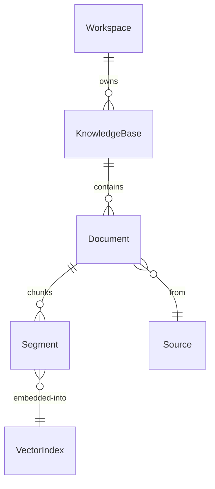

# Knowledge Base

🔴 Placeholder

## Mô hình

| Entity | Vai trò |
| --- | --- |
| KnowledgeBase | Tập document cùng config index (embedding model, chunk size) |
| Document | 1 file/URL/page nguồn |
| Segment | 1 chunk text (cùng nghĩa với "chunk") |
| VectorIndex | Collection trong Vector DB |

## 3 method retrieval

- **Semantic search** — embed query → ANN trong vector DB
- **Full-text search** — BM25 / `pg_bigm` / OpenSearch
- **Hybrid** — kết hợp + rerank

## Học từ Dify

Tham khảo chi tiết tại [research note](/08-references/01-dify) — Dify có pattern `dataset_process_rules` (snapshot rule), `embeddings` cache (dedup theo hash), `child_chunks` (parent-child mode), pipeline cho ingest custom. CAP nên kế thừa.

## Câu hỏi mở

- Có hỗ trợ multimodal (ảnh + bảng + voice) không?
- Reranking model nội bộ hay external?
- Document có versioning không?
