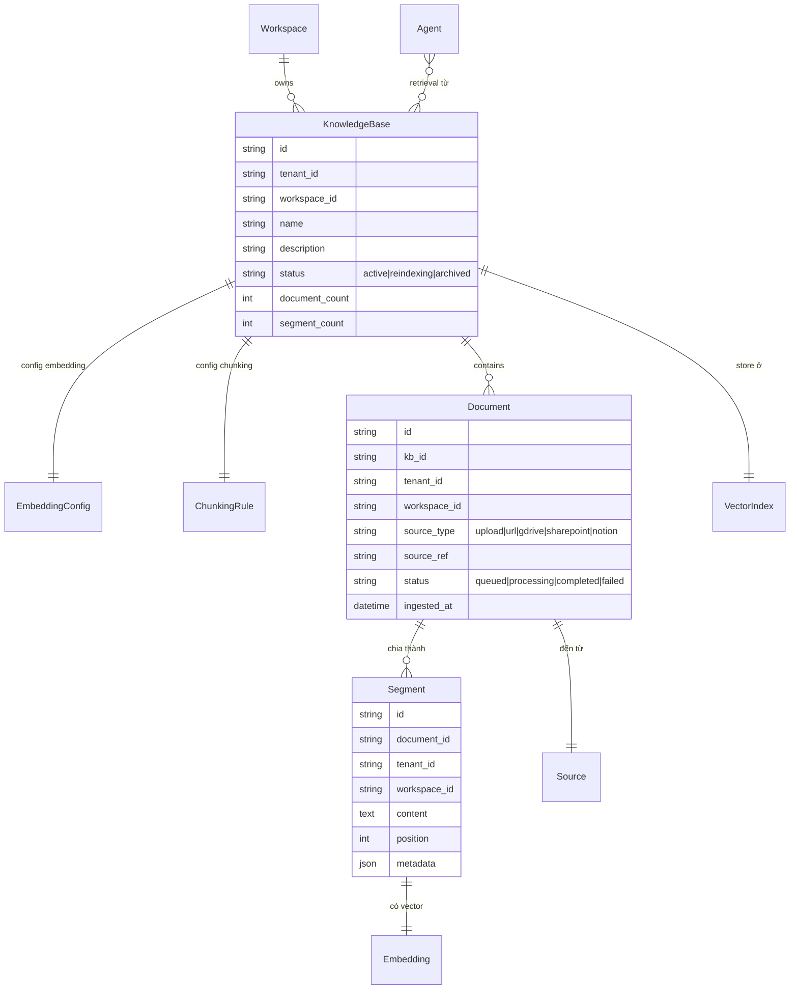

# Knowledge Base

🟡 Draft — v0.1

## Knowledge Base là gì

**Knowledge Base (KB)** là **"thư viện riêng của tổ chức"** — nơi nạp tài liệu nội bộ (chính sách HR, hợp đồng mẫu, mô tả sản phẩm, FAQ, sổ tay kỹ thuật, biên bản họp…) để agent **tham chiếu khi trả lời**. Mọi câu trả lời từ KB đều **kèm trích dẫn nguồn** (document + đoạn cụ thể) — agent **không "bịa"**, người dùng có thể click để mở tài liệu gốc và kiểm chứng.

KB hoạt động theo mô hình **RAG (Retrieval-Augmented Generation)**: tài liệu → cắt thành đoạn (segment) → biểu diễn thành vector → khi user hỏi, hệ thống tìm các đoạn **gần nghĩa nhất** với câu hỏi → đưa các đoạn đó cùng câu hỏi cho LLM tổng hợp ra câu trả lời.

**Phép hình dung**:

- KB ≈ **kho sách của công ty**; agent là **thủ thư** biết tra đúng trang cần.
- **Document** ≈ **một cuốn sách** — file PDF/DOCX/MD, URL trang web, page Confluence/Notion.
- **Segment / Chunk** ≈ **một đoạn được đánh dấu trong sách** — đơn vị tìm kiếm thực tế (vd ~300-500 từ).
- **Embedding** ≈ **toạ độ của đoạn trong "không gian ý nghĩa"** — hai đoạn cùng ý nghĩa thì gần nhau về toạ độ, dù dùng từ khác nhau.
- **Citation** ≈ **chú thích cuối câu trả lời** — "Theo trang 12, mục 3.2 của Sổ tay HR 2026…". Khách click được để mở tài liệu gốc.

**Ví dụ cụ thể**: KB `chinh-sach-hr-2026` chứa 80 file PDF chính sách (~2400 segment). Nhân viên hỏi *"Tôi có bao nhiêu ngày phép thai sản?"* →

1. Câu hỏi được embed → tra vector store
2. Hệ thống tìm 3 segment gần nghĩa nhất: 1 đoạn từ "Sổ tay HR 2026 — trang 7", 1 đoạn từ "Quy định nghỉ phép — Phụ lục 2", 1 đoạn từ "Luật Lao động trích lục"
3. Đưa 3 đoạn + câu hỏi cho LLM
4. LLM tổng hợp: *"Theo chính sách công ty, lao động nữ được nghỉ thai sản 6 tháng (Sổ tay HR 2026, tr.7). Trong trường hợp sinh đôi, mỗi con thêm 1 tháng (Phụ lục 2)…"* + link tới file gốc.

**Vì sao không để LLM tự biết**: LLM được train trên dữ liệu công khai, **không biết** chính sách nội bộ cụ thể của tổ chức bạn. Hỏi mà không có KB → LLM hoặc "không biết", hoặc tệ hơn: **bịa ra** câu trả lời nghe có vẻ đúng. KB là cơ chế ép agent **chỉ dùng tài liệu đã được kiểm duyệt** của tổ chức.

**Đọc trang này nếu bạn là**:

- **BA / content editor** — đang chuẩn bị tài liệu để nạp KB, cần biết format hỗ trợ, cách chunking, kết quả mong đợi.
- **Builder** — đang gắn KB vào agent, cần hiểu retrieval và citation ảnh hưởng câu trả lời thế nào.
- **Đội tri thức / pháp chế** — cần biết tài liệu nội bộ được lưu, truy xuất, audit ra sao.
- **Kiến trúc sư / Dev** — cần map khái niệm KB vào pipeline kỹ thuật (ingest, embedding, vector store).

**Trang liên quan**: [Agent](/02-domain/03-agent) (KB cấp cho agent) · [RAG Pipeline](/03-architecture/05-rag-pipeline) (kỹ thuật chi tiết).

---

## 1. Vì sao Knowledge Base

KB hiện thực hoá [Vision § 5 — Tri thức nội bộ ưu tiên](/01-overview/01-vision): khi câu hỏi có chạm tới tri thức tổ chức, agent **ưu tiên tài liệu của tổ chức trên kiến thức chung của LLM**. Không có KB, agent rơi vào 1 trong 2 hỏng: hoặc trả lời "không biết", hoặc tệ hơn — **bịa ra** câu nghe có vẻ đúng vì LLM được train trên dữ liệu công khai, không thấy tài liệu nội bộ.

Lợi ích kép cho tổ chức:

- **Chất lượng câu trả lời**: bám tài liệu đã được kiểm duyệt, có trích dẫn để người dùng kiểm chứng.
- **Quản trị tri thức**: tài liệu chỉ cần upload 1 lần, mọi agent dùng được — tránh phân mảnh "mỗi agent một bộ knowledge riêng".

---

## 2. 5 nguyên tắc thiết kế

| # | Nguyên tắc | Hệ quả |
| --- | --- | --- |
| 1 | **Citation mặc định** | Mọi câu trả lời từ retrieval phải kèm nguồn (document + đoạn) — không có "bịa không nguồn" |
| 2 | **Ingest reproducible** | Re-index toàn bộ KB với chunking + embedding mới phải cho kết quả đoán được |
| 3 | **Embedding cache** | Cùng text → cùng vector, dedup theo hash — tiết kiệm cost re-ingest |
| 4 | **Isolation cứng cross-tenant** | Collection vector tách per-(tenant, workspace) — không filter ở app layer |
| 5 | **Async ingest, sync retrieval** | Ingest chạy nền (có thể vài phút) — retrieval phải nhanh (\<200ms) |

---

## 3. Mô hình khái niệm



---

## 4. Document types supported

| Format | MVP | Note |
| --- | --- | --- |
| **PDF** | ✅ | Bao gồm bóc tách table với layout aware |
| **DOCX / DOC** | ✅ | |
| **TXT / MD** | ✅ | |
| **HTML** | ✅ | Strip tag, giữ heading hierarchy |
| **URL crawl** | ✅ | Crawl 1 URL hoặc whole site (rate-limited) |
| **CSV / XLSX** | ⚠️ v2 | Mỗi row 1 segment hoặc whole table |
| **Image (OCR)** | ⚠️ v2 | Tesseract / Azure OCR |
| **Audio (transcribe)** | ⚠️ v3 | Whisper |
| **Video** | ⚠️ v4 | Speech + frame analysis |

### 4.1 Ingest pipeline

```text
Upload / Sync → Extract text → Clean → Chunk → Embed → Index
                                            ↓
                                       Embedding cache check
```

Mỗi bước có thể retry độc lập. Lỗi 1 document không ảnh hưởng document khác.

---

## 5. Chunking strategy

Default: **recursive character splitter** với mặc định:

| Tham số | Default | Range |
| --- | --- | --- |
| Chunk size | 500 token | 200-2000 |
| Overlap | 50 token (10%) | 0-200 |
| Separators | `\n\n`, `\n`, dấu chấm + khoảng trắng, khoảng trắng | configurable |

**Parent-child mode** (v2): retrieve child chunk cho relevance, return parent chunk cho context — cải thiện độ chính xác.

**Semantic chunking** (v3): dùng LLM tách theo ý nghĩa thay vì size cố định.

---

## 6. Embedding & vector index

### 6.1 Choice

| Provider | Model default | Use case |
| --- | --- | --- |
| OpenAI | `text-embedding-3-small` | General, low cost |
| OpenAI | `text-embedding-3-large` | Cao chất lượng, cao cost |
| BGE | `bge-large-en-v1.5` | Self-hosted, tiếng Anh |
| Cohere | `embed-multilingual-v3` | Đa ngôn ngữ, có tiếng Việt |
| Voyage | `voyage-3` | Cao chất lượng |

**Quy tắc**: 1 KB pin 1 embedding model. Đổi → phải re-index toàn bộ KB.

### 6.2 Vector store

| Backend | MVP | Note |
| --- | --- | --- |
| pgvector | ✅ | Single Postgres — đơn giản |
| Qdrant | ✅ | Dedicated vector DB — performance cao |
| Milvus | ⚠️ v3 | Scale > 10M vectors |
| Pinecone | ⚠️ v3 | Managed cloud |

Multi-tenant isolation: **collection per (tenant_id, workspace_id, kb_id)** + metadata filter bắt buộc.

---

## 7. Retrieval methods

3 phương pháp, kết hợp được:

### 7.1 Semantic search

Embed query → ANN search trong vector index → top-K segments theo cosine similarity.

**Mạnh**: hiểu paraphrase, đồng nghĩa.

### 7.2 Full-text search

BM25 / `pg_bigm` / OpenSearch → top-K theo keyword match.

**Mạnh**: tên riêng, số liệu, từ chuyên ngành.

### 7.3 Hybrid + Rerank

Lấy top-K từ cả 2 method → rerank model (Cohere / BGE-rerank) → top-N final.

**Mạnh**: cân bằng 2 method, hiệu quả nhất cho enterprise — recommended default.

| Config | Default | Khi nào đổi |
| --- | --- | --- |
| Top-K từ vector | 20 | Tăng nếu rerank tốt |
| Top-K từ BM25 | 20 | |
| Top-N sau rerank | 5 | Vào prompt LLM |
| Similarity threshold | 0.7 | Lọc nhiễu |

---

## 8. Refresh & sync

| Cách | Mô tả | Phù hợp |
| --- | --- | --- |
| **Manual upload** | Builder upload file thủ công | Tài liệu tĩnh, ít cập nhật |
| **URL re-crawl** | Re-crawl URL theo schedule (vd hàng tuần) | Website public |
| **Source sync** | Sync từ GDrive / SharePoint / Notion (v2) | Tài liệu có nguồn cloud, cập nhật thường xuyên |
| **Webhook ingest** | External system POST tài liệu mới qua webhook | Real-time ingest |

Refresh **incremental**: chỉ re-embed segment đã đổi (theo hash), không re-process toàn bộ.

---

## 9. Access control

KB có 2 tầng kiểm soát truy cập:

### 9.1 KB-level

Mặc định — `workspace_editor` đọc cả KB; `workspace_viewer` không.

### 9.2 Document-level (v3)

Mỗi document có thể có metadata `access_groups: ["hr_team", "legal"]`. Retrieval **lọc** segment theo group của caller.

Use case: KB nội bộ chứa cả tài liệu công khai + tài liệu HR sensitive — agent của Marketing không retrieve được tài liệu HR.

---

## 10. Use cases nghiệp vụ

### 🎯 Use case A — HR Policy KB

> *"500 trang handbook + 200 FAQ + 50 quy định nội bộ."*

- 750 document → ~8000 segment
- Embedding: `text-embedding-3-small`
- Retrieval: Hybrid + rerank
- Update: hàng quý, manual upload bản mới

### 🎯 Use case B — Product Catalog KB

> *"5000 sản phẩm, mỗi sản phẩm 1 trang mô tả + spec + ảnh."*

- Source: sync từ Notion mỗi đêm
- Multi-modal v3: thêm image embedding
- Retrieval: Semantic only (do từ vựng đặc thù)

### 🎯 Use case C — Contracts archive

> *"10,000 hợp đồng cũ làm reference cho legal review."*

- Document-level access control: chỉ Legal team retrieve được
- Metadata: contract_type, signed_year, party
- Filter retrieval: chỉ retrieve hợp đồng cùng loại với câu hỏi

---

## 11. Cost & quality metrics

| Metric | Mô tả |
| --- | --- |
| **Ingest cost** | Embedding tokens dùng để ingest (1 lần / document) |
| **Retrieval cost** | Embedding query + cost rerank model (per query) |
| **Top-K relevance @ 5** | Trung bình similarity của top-5 |
| **Citation rate** | % câu trả lời agent kèm citation |
| **User feedback** | 👍/👎 trên câu trả lời từ KB |
| **Cache hit rate** | % query có cache (text query trùng) |

---

## 12. Trade-off

| Quyết định | Lý do | Đánh đổi |
| --- | --- | --- |
| **1 KB pin 1 embedding model** | Đảm bảo nhất quán cosine similarity | Đổi model = re-index toàn bộ (đắt) |
| **Async ingest** | Builder không chờ, có thể vài phút | Cần polling / webhook để biết khi xong |
| **pgvector MVP** | Đơn giản vận hành | Scale > 10M vector → cần Qdrant/Milvus |
| **Citation bắt buộc** | Chống bịa, tăng tin tưởng | Hạn chế answer creativity — agent có thể "không biết" thay vì đoán |
| **Document-level ACL ở v3** | MVP đơn giản trước | KB nhạy cảm trước v3 phải tách thành nhiều KB |

---

## 13. Câu hỏi còn mở

| # | Câu hỏi | Phiên bản |
| --- | --- | --- |
| Q1 | Multimodal (image + table extraction layout-aware) | v3 |
| Q2 | Reranker model nội bộ (BGE-rerank self-hosted) | v3 |
| Q3 | Document versioning + history | v3 |
| Q4 | Graph RAG (knowledge graph augmented) | v4 |
| Q5 | Citation explainability (giải thích vì sao đoạn này relevant) | v2 |
| Q6 | Conversational retrieval (refine query qua follow-up) | v2 |

---

## Liên kết

- [Agent](/02-domain/03-agent) — agent retrieval từ KB
- [Architecture — RAG Pipeline](/03-architecture/05-rag-pipeline) — kỹ thuật chi tiết
- [Vision § 5 — Tri thức nội bộ ưu tiên](/01-overview/01-vision)
- [Section 8 — Dify reference](/08-references/01-dify) — patterns Dify dùng
