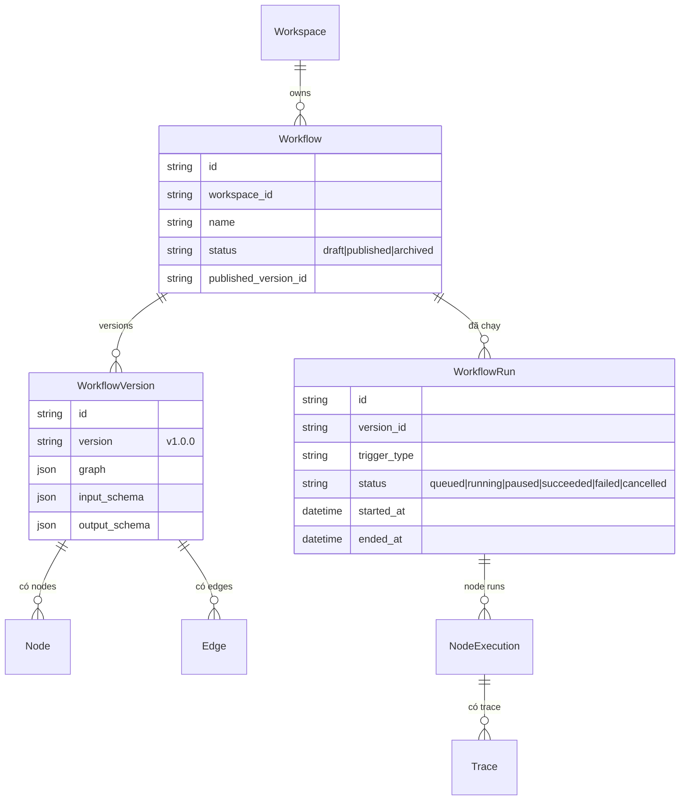
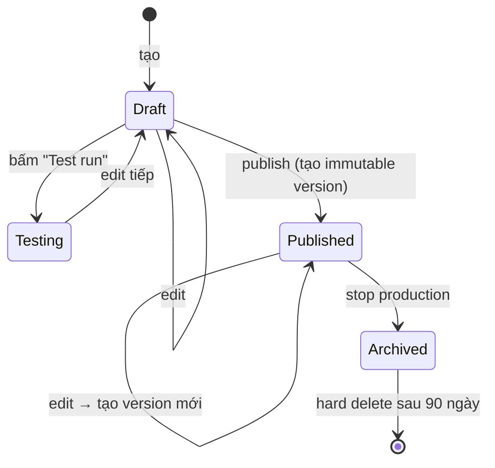
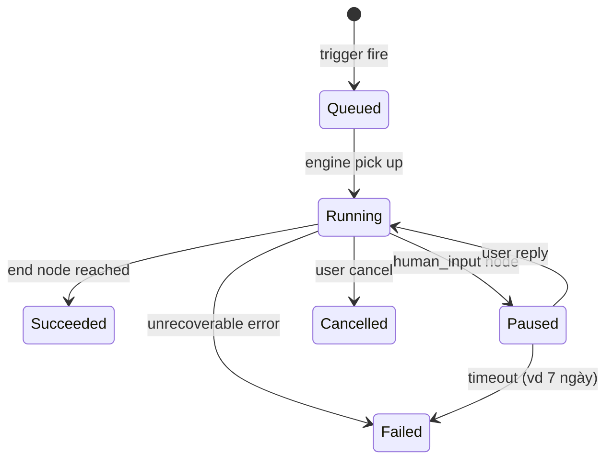

# Workflow

🟡 Draft — v0.1

> Trang này định nghĩa **Workflow** — đồ thị các node thực thi tự động hoá nghiệp vụ. Đối tượng đọc: BA, builder no-code, kiến trúc sư.
>
> Chi tiết workflow engine ở [Section 3 — Workflow Engine](/03-architecture/03-workflow-engine).

---

## 1. Vì sao Workflow

Tie-back [Vision § 3 — Trao quyền nghiệp vụ](/01-overview/01-vision): BA/PM dùng giao diện kéo-thả để tự động hoá quy trình mà không cần code. Workflow là **đơn vị tự động hoá có thể chia sẻ + version + audit**.

### 1.1 Workflow vs Agent — khi nào dùng cái nào

| Workflow | Agent |
| --- | --- |
| **Pipeline xác định** — flow giữa các bước rõ ràng | **Brain** — LLM quyết định bước tiếp theo |
| Mỗi node deterministic (trừ LLM node) | Mỗi turn có LLM reasoning |
| Input/output có schema | Free-form chat |
| Phù hợp: auto approval, ETL, batch xử lý | Phù hợp: chatbot, trợ lý tự do |
| Trigger: API, schedule, event, webhook | Trigger: chat |

**Có thể kết hợp**: workflow có thể có Agent node; agent có thể là 1 step trong workflow phức tạp.

---

## 2. 5 nguyên tắc thiết kế

| # | Nguyên tắc | Hệ quả |
| --- | --- | --- |
| 1 | **Drag-drop là source of truth** | Workflow definition không phải code; export YAML/JSON để version + share |
| 2 | **Mỗi node có input/output schema** | Type checking compile-time + runtime validate; lỗi schema không tới production |
| 3 | **Mọi run đều traceable** | Mỗi node execution có trace; debug dễ; cost đếm được |
| 4 | **Failure isolated** | Lỗi 1 node không crash toàn workflow — có retry, fallback, dead-letter |
| 5 | **Immutable version sau publish** | Run ghi rõ chạy version nào; reproduce + audit |

---

## 3. Mô hình khái niệm



---

## 4. 14 loại Node

> 📝 **Đã sửa từ "10 loại"** — bản trước đếm sai

| # | Node | Mô tả |
| --- | --- | --- |
| 1 | `start` | Entry — định nghĩa input schema |
| 2 | `end` | Exit — định nghĩa output |
| 3 | `llm` | Gọi LLM với prompt template, structured output |
| 4 | `agent` | Gọi 1 Agent đã định nghĩa (sub-graph) |
| 5 | `tool` | Gọi 1 Tool |
| 6 | `knowledge_retrieval` | Retrieval từ KB (top-K segments) |
| 7 | `branch` | If/else, switch dựa trên condition |
| 8 | `loop` | For-each, while với max iterations |
| 9 | `code` | User code (Python/JS) trong sandbox |
| 10 | `human_input` | Pause, đợi user reply qua form (Slack / email / web) |
| 11 | `sub_workflow` | Gọi workflow khác |
| 12 | `http_request` | REST call thuần (không phải tool) |
| 13 | `parameter_extractor` | LLM trích biến từ text tự do |
| 14 | `template` | Render Jinja2 template — format output |

### 4.1 Variable & I/O schema

Mỗi node có:

- **Input** từ node phía trước (theo edge) — auto-mapped hoặc explicit mapping
- **Output** đẩy về variable scope của workflow run

Variable scope: per-run (mặc định). Persistent state cross-run cần explicit `state_save` / `state_load` node (v2).

---

## 5. Trigger types

| Trigger | Khi nào fire | Phù hợp |
| --- | --- | --- |
| `manual` | User bấm "Run" trong UI | Test, debug |
| `api` | External POST `/api/v1/workflows/<id>/run` | Tích hợp hệ thống ngoài |
| `schedule` | Cron expression | ETL nightly, daily report |
| `webhook` | Inbound webhook URL | React real-time event |
| `event` | Internal event (vd `document_indexed`, `conversation_ended`) | Reactive workflow |

---

## 6. Error handling

Mỗi node có 3 cấu hình:

### 6.1 Retry

| Tham số | Default |
| --- | --- |
| Max attempts | 1 (không retry) |
| Backoff | Exponential |
| Retry on | timeout, 5xx, transient errors |

### 6.2 Fallback

Khi retry hết, có thể chỉ định:

- **Fallback node**: chuyển sang node B thay vì abort
- **Default value**: dùng giá trị mặc định, tiếp tục
- **Abort**: dừng workflow, mark `failed`

### 6.3 Dead-letter

Failed run được lưu lại để builder review, có thể manual replay.

---

## 7. Parallel execution

Workflow hỗ trợ chạy song song:

- **Fan-out**: 1 node có nhiều outgoing edge → các nhánh chạy song song
- **Fan-in (Join)**: nhiều incoming edge → đợi all hoàn thành mới tiếp
- **Race**: chỉ chờ nhánh đầu tiên xong (v2)
- **Map**: chạy 1 sub-flow cho mỗi item trong list (v2)

---

## 8. Lifecycle



Tương tự Agent: **Published version là immutable**, sửa tạo version mới.

---

## 9. Workflow Run states



| State | Hành vi |
| --- | --- |
| `queued` | Đợi worker pick up |
| `running` | Đang thực thi |
| `paused` | Đợi human_input — có timeout config |
| `succeeded` | Hoàn thành đúng end node |
| `failed` | Lỗi không recover |
| `cancelled` | User chủ động dừng |

---

## 10. Human-in-the-loop

`human_input` node pause workflow, chờ phản hồi. Render form ở đâu?

| Surface | Mô tả |
| --- | --- |
| **Web UI** | Build form qua schema → user nhận URL → fill → submit |
| **Slack** | Workflow gửi message kèm form interactive → user reply |
| **Email** | Email kèm link form → user click → fill |
| **API webhook** (v2) | External system tự cung cấp UI, POST kết quả về CAP |

Timeout: mặc định 7 ngày → fail. Có thể tuỳ chỉnh.

---

## 11. Use cases nghiệp vụ

### 🎯 Use case A — Phê duyệt yêu cầu mua sắm

```text
start (input: request) → llm (extract amount + category) → branch
                                                            ├ amount > 50M → human_input (manager approve) → end
                                                            └ amount ≤ 50M → tool (CRM auto-approve) → end
```

Trigger: API từ portal nội bộ.

### 🎯 Use case B — Daily sales report

```text
start (cron 8AM) → tool (query DB) → llm (generate summary) → tool (send email + post Slack) → end
```

Trigger: schedule.

### 🎯 Use case C — Document review

```text
start (upload) → tool (parse PDF) → agent (review compliance) → branch
                                                                ├ violations found → human_input (legal review) → end
                                                                └ ok → tool (sign + archive) → end
```

Trigger: webhook khi document upload.

---

## 12. Cost & quota per run

Mỗi run config:

| Tham số | Mặc định | Tuỳ chỉnh |
| --- | --- | --- |
| Max wall-clock | 1 giờ | Per-workflow |
| Max LLM tokens | 100K | Per-workflow |
| Max tool calls | 50 | Per-workflow |
| Max cost USD | $5 | Per-workflow |

Vượt → workflow abort với `failed` + log lý do. Chống runaway cost.

---

## 13. Trade-off

| Quyết định | Lý do | Đánh đổi |
| --- | --- | --- |
| **In-process engine (MVP)** | Đơn giản, fast iteration | Crash = lost run; switch sang Temporal v3 cho durable |
| **Sub-workflow nesting depth max 3** | Chống recursion bug | Limit độ phức tạp workflow |
| **Immutable version** | Reproducible | Builder phải learn flow edit-draft-publish |
| **State per-run mặc định** | Đơn giản, predictable | Cross-run state cần explicit save/load |
| **Variables non-typed (MVP)** | Triển khai nhanh | Lỗi schema chỉ phát hiện runtime, v2 thêm type check |

---

## 14. Câu hỏi còn mở

| # | Câu hỏi | Phiên bản |
| --- | --- | --- |
| Q1 | Loop bounded vs unbounded (max iter mặc định?) | MVP: 100, tuỳ chỉnh được |
| Q2 | Workflow marketplace nội bộ (clone giữa workspace) | v3 |
| Q3 | Visual debugger (step-by-step replay) | v2 |
| Q4 | Realtime collab edit canvas (Yjs) | v3 |
| Q5 | Workflow import/export YAML | v2 |
| Q6 | Conditional re-run (chỉ chạy lại từ node failed) | v3 |
| Q7 | Distributed execution (sub-workflow chạy ở worker khác) | v4 |

---

## Liên kết

- [Agent](/02-domain/03-agent) — agent là 1 loại node trong workflow
- [Tool](/02-domain/04-tool) — tool là 1 loại node; workflow-as-tool
- [Conversation & Run](/02-domain/07-conversation) — workflow run vs conversation
- [Architecture — Workflow Engine](/03-architecture/03-workflow-engine)
- [IAM `workflow.publish`, `workflow.run.invoke`](/02-domain/02-iam-rbac)
