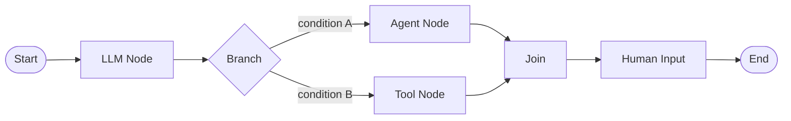

# Workflow

🔴 Placeholder

## Khái niệm

Workflow là **đồ thị có hướng** (DAG nhưng có thể có loop được kiểm soát) của các Node:

## 10 loại Node (tentative)

| Node type | Mô tả |
| --- | --- |
| `start` | Entry, định nghĩa input schema |
| `end` | Exit, định nghĩa output |
| `llm` | Gọi LLM với prompt template |
| `agent` | Gọi 1 Agent (đã định nghĩa) — agent là sub-graph |
| `tool` | Gọi 1 Tool |
| `knowledge_retrieval` | Retrieval từ KB |
| `branch` | If/else, switch |
| `loop` | For-each, while với max iterations |
| `code` | User code (Python/JS) trong sandbox |
| `human_input` | Pause, đợi user input qua form |
| `sub_workflow` | Gọi workflow khác |
| `http_request` | REST call thuần |
| `parameter_extractor` | LLM trích xuất biến từ text |
| `template` | Render Jinja2 template |

## Trigger

| Trigger | Khi nào fire |
| --- | --- |
| `chat` | User gửi message trong conversation |
| `api` | External system POST /invoke |
| `schedule` | Cron expression |
| `webhook` | Inbound webhook |
| `event` | Internal event (vd document_indexed) |

## Câu hỏi mở

- Loop bounded hay unbounded?
- Parallel execution model: theo node hay theo group?
- Workflow có versioning + rollback không?
- Workflow có thể nest workflow khác bao nhiêu level?
