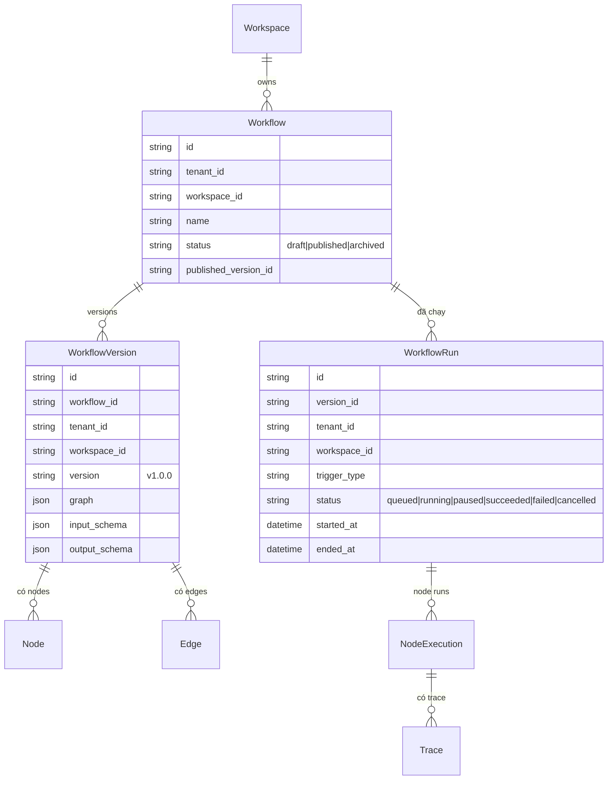
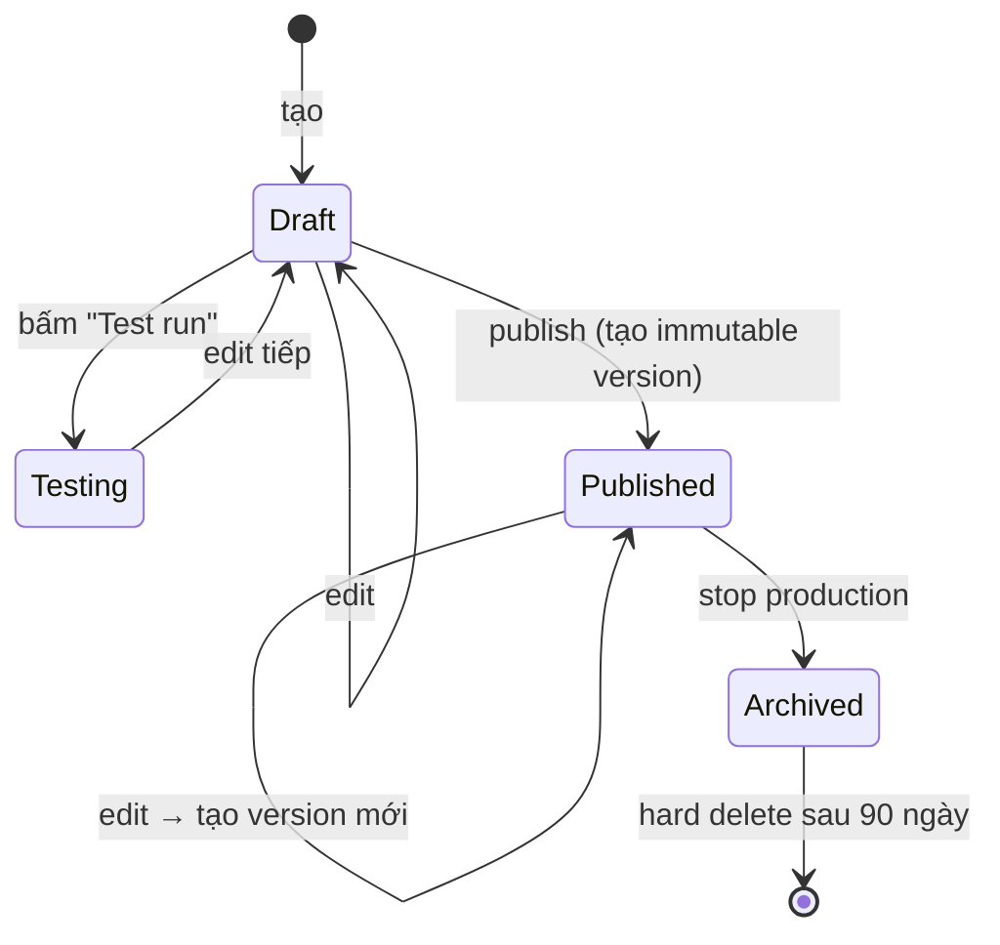
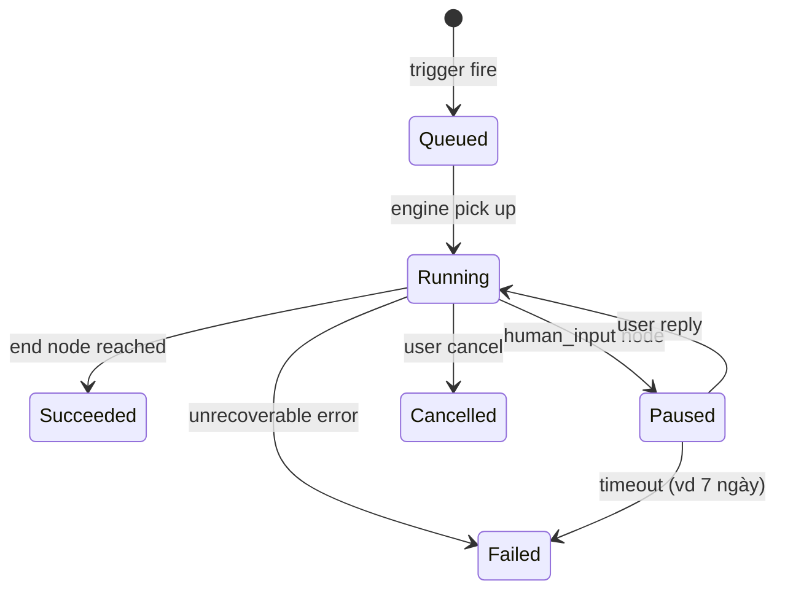

# Workflow

🟡 Draft — v0.1

## Workflow là gì

**Workflow** là **"sơ đồ quy trình tự động"** — đồ thị các bước (node) mà builder vẽ bằng **kéo-thả**, để máy chạy thay người. Input đi vào một đầu, đi qua các node — gọi LLM, gọi tool, rẽ nhánh theo điều kiện, lặp, đợi người duyệt — rồi cho output ra đầu kia.

Khác Agent (LLM tự quyết bước tiếp theo), Workflow đi theo **lộ trình xác định**: mỗi node có vai trò rõ ràng, thứ tự đoán được. Builder publish workflow thành **Workflow Version** (bất biến); mỗi lần chạy là một **Workflow Run** có trace, retry, audit đầy đủ.

**Phép hình dung**:

- Workflow ≈ **một SOP (quy trình chuẩn) của công ty được robot hoá** — có sơ đồ trên giấy ai đọc cũng hiểu, máy chạy thay người. Sửa SOP = sửa workflow.
- **Node** ≈ **một ô trong sơ đồ** — `llm` (gọi mô hình), `tool` (gọi API), `agent` (gọi agent), `branch` (rẽ nhánh điều kiện), `loop` (lặp), `human_input` (đợi người duyệt), `code` (đoạn code ngắn), `sub_workflow` (gọi workflow con), `start`/`end`…
- **Workflow Version** ≈ **bản SOP đã đóng dấu**, không sửa được; muốn sửa → tạo version mới và publish.
- **Workflow Run** ≈ **một lượt chạy cụ thể** — có ID, có timestamp, có chi phí, có log mỗi node.
- **Trigger** ≈ **kim đồng hồ / nút bấm khởi động** — workflow chạy do API gọi, đến lịch, có event/webhook, hay người dùng nhấn nút.

**Ví dụ cụ thể**: workflow `duyet-yeu-cau-mua-sam` —

```text
[start: yêu cầu mua, giá trị, người yêu cầu]
   ↓
[tool: check_budget — gọi ERP kiểm ngân sách phòng]
   ↓
[branch: theo giá trị]
   ├─ ≤ 10tr  → [human_input: quản lý trực tiếp duyệt]
   ├─ 10-100tr → [human_input: quản lý] → [human_input: giám đốc bộ phận]
   └─ > 100tr  → [human_input: quản lý] → [GĐ bộ phận] → [Ban điều hành]
   ↓
[tool: create_purchase_order — gửi nhà cung cấp]
   ↓
[tool: notify_employee — báo nhân viên]
   ↓
[end]
```

Một run cụ thể: NV gửi yêu cầu 50tr → 2 cấp duyệt → tạo PO → báo NV. Toàn bộ trace + ai duyệt + chi phí AI được ghi lại để audit.

**Workflow khác Agent ở đâu** (tóm tắt — chi tiết §1.1):

| Dùng Workflow khi | Dùng Agent khi |
| --- | --- |
| Lộ trình đoán trước được, lặp đi lặp lại | Cần "nói chuyện", ngữ cảnh mở |
| Cần audit/compliance chặt từng bước | Cần linh hoạt, LLM tự quyết |
| Trigger từ API/schedule/event | Trigger từ chat của người |

Có thể **kết hợp**: workflow có node `agent`; agent có thể gọi workflow như một tool.

**Đọc trang này nếu bạn là**:

- **BA / PM** — đang mô hình hoá quy trình nghiệp vụ để tự động hoá, cần biết các loại node + pattern điển hình.
- **Builder no-code** — sắp dựng workflow đầu tiên, cần hiểu version, trigger, run lifecycle.
- **Kiến trúc sư / Dev** — cần map khái niệm vào workflow engine + state machine.

**Trang liên quan**: [Agent](/02-domain/03-agent) (so với agent) · [Tool](/02-domain/04-tool) (node `tool`) · [Conversation & Run](/02-domain/07-conversation) (lifecycle thực thi) · [Workflow Engine](/03-architecture/03-workflow-engine) (engine kỹ thuật).

---

## 1. Vì sao Workflow

Workflow là **đơn vị tự động hoá** trong CAP có thể **chia sẻ + version + audit** — giải hai cam kết cốt lõi của [Vision](/01-overview/01-vision):

- **§ 3 — Trao quyền nghiệp vụ**: BA/PM tự dựng quy trình bằng kéo-thả, không phụ thuộc dev. Sửa quy trình = sửa workflow, không phải đẩy code production.
- **§ 4 — Quan sát + kiểm soát**: mỗi node có trace, mỗi run có cost + retry policy + audit log. Hỏng ở đâu nhìn thấy ngay, không "biến mất trong logic ẩn".

Hệ quả: cùng một quy trình nghiệp vụ (vd phê duyệt mua sắm) có thể được **viết bằng workflow một lần, tái sử dụng bởi nhiều phòng ban**, version hoá để rollback an toàn — thay vì mỗi phòng ban tự cấu hình rời rạc trong nhiều công cụ khác nhau.

### 1.1 Workflow vs Agent — khi nào dùng cái nào

| Workflow | Agent |
| --- | --- |
| **Pipeline xác định** — flow giữa các bước rõ ràng | **Brain** — LLM quyết định bước tiếp theo |
| Mỗi node deterministic (trừ LLM node) | Mỗi turn có LLM reasoning |
| Input/output có schema | Free-form chat |
| Phù hợp: auto approval, ETL, batch xử lý | Phù hợp: chatbot, trợ lý tự do |
| Trigger: API, schedule, event, webhook | Trigger: chat |

**Có thể kết hợp**: workflow có thể có Agent node; agent có thể là 1 step trong workflow phức tạp.

---

## 2. 5 nguyên tắc thiết kế

| # | Nguyên tắc | Hệ quả |
| --- | --- | --- |
| 1 | **Drag-drop là source of truth** | Workflow definition không phải code; export YAML/JSON để version + share |
| 2 | **Mỗi node có input/output schema** | Type checking compile-time + runtime validate; lỗi schema không tới production |
| 3 | **Mọi run đều traceable** | Mỗi node execution có trace; debug dễ; cost đếm được |
| 4 | **Failure isolated** | Lỗi 1 node không crash toàn workflow — có retry, fallback, dead-letter |
| 5 | **Immutable version sau publish** | Run ghi rõ chạy version nào; reproduce + audit |

---

## 3. Mô hình khái niệm



---

## 4. 14 loại Node

14 node được nhóm thành **4 họ** theo vai trò trong sơ đồ. Builder không cần nhớ hết 14 — nắm 4 họ là đủ để dựng workflow đầu tiên.

### 4.1 Họ Khung sườn (Skeleton) — 2 node

Định nghĩa "đầu" và "đuôi" của workflow. **Mọi workflow bắt buộc có đúng 1 start + 1 end**.

| Node | Vai trò | Ví dụ |
| --- | --- | --- |
| `start` | Entry point — định nghĩa **input schema** workflow nhận vào | `{order_id: string, requester: string}` |
| `end` | Exit point — định nghĩa **output schema** workflow trả về | `{status: "approved\|rejected", po_id: string?}` |

### 4.2 Họ Tư duy AI (AI Reasoning) — 4 node

Mỗi lần gọi đều tốn token, là nguồn cost chính. Dùng có chủ đích.

| Node | Vai trò | Khi nào dùng | Ví dụ |
| --- | --- | --- | --- |
| `llm` | Gọi LLM với prompt template, có thể yêu cầu **structured output** (JSON schema cứng) | Cần "thinking" một bước, không cần memory hay tool | Tóm tắt, dịch, phân loại đơn giản |
| `agent` | Gọi 1 Agent đã định nghĩa — agent này có thể có memory, tool, KB riêng | Bước cần Agent đầy đủ với tool/KB | "Phân tích hợp đồng" — agent có tool đọc PDF + KB quy định |
| `knowledge_retrieval` | Retrieval từ Knowledge Base, trả về top-K segment kèm citation | Cần "tra cứu" tài liệu trước khi sinh câu trả lời | Trước node `llm` để cung cấp context |
| `parameter_extractor` | LLM trích biến cấu trúc từ text tự do | Input là text con người viết, cần biến thành JSON | "Tôi muốn nghỉ thứ 6 này" → `{leave_date: "2026-05-22"}` |

### 4.3 Họ Điều khiển luồng (Control Flow) — 3 node

Không tốn LLM. Quyết định "đi đâu tiếp theo".

| Node | Vai trò | Ví dụ |
| --- | --- | --- |
| `branch` | If/else hoặc switch dựa trên condition trên biến | `if amount <= 10tr → A; elif <= 100tr → B; else → C` |
| `loop` | For-each (lặp qua list) hoặc while (đến khi điều kiện đúng), có **max iterations** bắt buộc | Xử lý từng file trong batch upload |
| `sub_workflow` | Gọi workflow khác như function — input/output qua schema | Tách module "kiểm tra ngân sách" để 5 workflow khác reuse |

### 4.4 Họ Tương tác Ngoài & Người (External & Human) — 5 node

Đụng ranh giới hệ thống — phía ngoài (API/code) hoặc phía người.

| Node | Vai trò | Khi nào dùng | Ví dụ |
| --- | --- | --- | --- |
| `tool` | Gọi 1 Tool đã đăng ký (REST/MCP/built-in) — có credential, retry, rate-limit chuẩn | Đa số trường hợp gọi API ngoài | `send_email`, `query_crm`, `post_to_slack` |
| `http_request` | Gọi REST trực tiếp, không qua đăng ký tool | Một lần một, không reuse | Webhook ad-hoc cho test |
| `code` | Chạy Python/JS trong sandbox | Logic biến đổi dữ liệu phức tạp khó biểu diễn bằng template | Parse XML, regex extract, gộp 3 list |
| `template` | Render Jinja2 — định dạng output bằng template | Sinh email/report theo mẫu cố định | Email `Xin chào {{name}}, đơn {{id}} đã được duyệt` |
| `human_input` | **Pause workflow**, đợi người reply qua form (Slack/email/web), rồi resume | Bất cứ đâu cần phê duyệt hoặc bổ sung thông tin từ người | Quản lý duyệt yêu cầu mua sắm |

> 💡 **`tool` vs `http_request` vs `code`**: ưu tiên `tool` (có versioning, credential, rate-limit, audit chuẩn). `http_request` cho call một lần, không tái sử dụng. `code` cho biến đổi dữ liệu — **không** nên dùng `code` để gọi API (mất audit, hạn chế sandbox).

### 4.5 Variable & I/O schema

Mỗi node có:

- **Input**: lấy từ output của node phía trước (theo edge); có thể auto-mapped theo tên biến, hoặc explicit mapping ở UI.
- **Output**: đẩy vào **variable scope** của workflow run — các node sau đọc từ đây.

**Variable scope**: per-run (mặc định) — biến mất khi run kết thúc. Lưu state cross-run cần `state_save` / `state_load` (v2).

---

## 5. Trigger types

| Trigger | Khi nào fire | Phù hợp |
| --- | --- | --- |
| `manual` | User bấm "Run" trong UI | Test, debug |
| `api` | External POST `/api/v1/workflows/<id>/run` | Tích hợp hệ thống ngoài |
| `schedule` | Cron expression | ETL nightly, daily report |
| `webhook` | Inbound webhook URL | React real-time event |
| `event` | Internal event (vd `document_indexed`, `conversation_ended`) | Reactive workflow |

---

## 6. Error handling

Mỗi node có 3 cấu hình:

### 6.1 Retry

| Tham số | Default |
| --- | --- |
| Max attempts | 1 (không retry) |
| Backoff | Exponential |
| Retry on | timeout, 5xx, transient errors |

### 6.2 Fallback

Khi retry hết, có thể chỉ định:

- **Fallback node**: chuyển sang node B thay vì abort
- **Default value**: dùng giá trị mặc định, tiếp tục
- **Abort**: dừng workflow, mark `failed`

### 6.3 Dead-letter

Failed run được lưu lại để builder review, có thể manual replay.

---

## 7. Parallel execution

Workflow hỗ trợ chạy song song:

- **Fan-out**: 1 node có nhiều outgoing edge → các nhánh chạy song song
- **Fan-in (Join)**: nhiều incoming edge → đợi all hoàn thành mới tiếp
- **Race**: chỉ chờ nhánh đầu tiên xong (v2)
- **Map**: chạy 1 sub-flow cho mỗi item trong list (v2)

---

## 8. Lifecycle



Tương tự Agent: **Published version là immutable**, sửa tạo version mới.

---

## 9. Workflow Run states



| State | Hành vi |
| --- | --- |
| `queued` | Đợi worker pick up |
| `running` | Đang thực thi |
| `paused` | Đợi human_input — có timeout config |
| `succeeded` | Hoàn thành đúng end node |
| `failed` | Lỗi không recover |
| `cancelled` | User chủ động dừng |

---

## 10. Human-in-the-loop

`human_input` node pause workflow, chờ phản hồi. Render form ở đâu?

| Surface | Mô tả |
| --- | --- |
| **Web UI** | Build form qua schema → user nhận URL → fill → submit |
| **Slack** | Workflow gửi message kèm form interactive → user reply |
| **Email** | Email kèm link form → user click → fill |
| **API webhook** (v2) | External system tự cung cấp UI, POST kết quả về CAP |

Timeout: mặc định 7 ngày → fail. Có thể tuỳ chỉnh.

---

## 11. Use cases nghiệp vụ

### 🎯 Use case A — Phê duyệt yêu cầu mua sắm

```text
start (input: request) → llm (extract amount + category) → branch
                                                            ├ amount > 50M → human_input (manager approve) → end
                                                            └ amount ≤ 50M → tool (CRM auto-approve) → end
```

Trigger: API từ portal nội bộ.

### 🎯 Use case B — Daily sales report

```text
start (cron 8AM) → tool (query DB) → llm (generate summary) → tool (send email + post Slack) → end
```

Trigger: schedule.

### 🎯 Use case C — Document review

```text
start (upload) → tool (parse PDF) → agent (review compliance) → branch
                                                                ├ violations found → human_input (legal review) → end
                                                                └ ok → tool (sign + archive) → end
```

Trigger: webhook khi document upload.

---

## 12. Cost & quota per run

Mỗi run config:

| Tham số | Mặc định | Tuỳ chỉnh |
| --- | --- | --- |
| Max wall-clock | 1 giờ | Per-workflow |
| Max LLM tokens | 100K | Per-workflow |
| Max tool calls | 50 | Per-workflow |
| Max cost USD | $5 | Per-workflow |

Vượt → workflow abort với `failed` + log lý do. Chống runaway cost.

---

## 13. Trade-off

| Quyết định | Lý do | Đánh đổi |
| --- | --- | --- |
| **In-process engine (MVP)** | Đơn giản, fast iteration | Crash = lost run; switch sang Temporal v3 cho durable |
| **Sub-workflow nesting depth max 3** | Chống recursion bug | Limit độ phức tạp workflow |
| **Immutable version** | Reproducible | Builder phải learn flow edit-draft-publish |
| **State per-run mặc định** | Đơn giản, predictable | Cross-run state cần explicit save/load |
| **Variables non-typed (MVP)** | Triển khai nhanh | Lỗi schema chỉ phát hiện runtime, v2 thêm type check |

---

## 14. Câu hỏi còn mở

| # | Câu hỏi | Phiên bản |
| --- | --- | --- |
| Q1 | Loop bounded vs unbounded (max iter mặc định?) | MVP: 100, tuỳ chỉnh được |
| Q2 | Workflow marketplace nội bộ (clone giữa workspace) | v3 |
| Q3 | Visual debugger (step-by-step replay) | v2 |
| Q4 | Realtime collab edit canvas (Yjs) | v3 |
| Q5 | Workflow import/export YAML | v2 |
| Q6 | Conditional re-run (chỉ chạy lại từ node failed) | v3 |
| Q7 | Distributed execution (sub-workflow chạy ở worker khác) | v4 |

---

## Liên kết

- [Agent](/02-domain/03-agent) — agent là 1 loại node trong workflow
- [Tool](/02-domain/04-tool) — tool là 1 loại node; workflow-as-tool
- [Conversation & Run](/02-domain/07-conversation) — workflow run vs conversation
- [Architecture — Workflow Engine](/03-architecture/03-workflow-engine)
- [IAM `workflow.publish`, `workflow.run.invoke`](/02-domain/02-iam-rbac)
