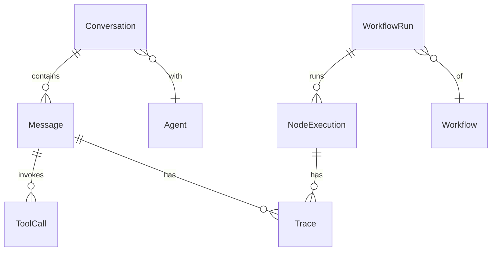

# Conversation & Run

🔴 Placeholder

## Mô hình

Có **2 loại "lần chạy"** trong CAP:

| | Conversation | Workflow Run |
| --- | --- | --- |
| Trigger | Chat (user gửi message) | API/schedule/event |
| Stateful | ✅ (có history) | ❌ (mỗi run độc lập, trừ khi save state) |
| Đơn vị | Message | Node execution |
| Thường dùng cho | Chatbot agent | Pipeline tự động |

## Câu hỏi mở

- Conversation memory: full history vs summary vs vector memory?
- Workflow run có thể "resume" được không (sau crash)?
- Đặt ngưỡng nào để tự động truncate conversation?
