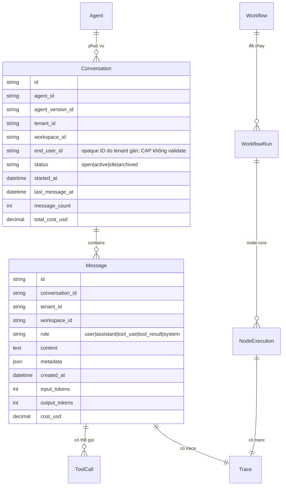
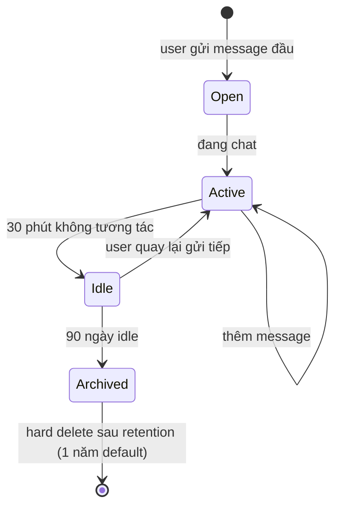

# Conversation & Run

🟡 Draft — v0.1

## Conversation & Run là gì

CAP có **2 đơn vị thực thi** ghi lại "một lần làm việc" của hệ thống — quan trọng vì đây là **đối tượng bị audit, bị tính tiền, bị debug**:

- **Conversation** — một **phiên chat** giữa end-user và Agent. Có nhiều **Message** (lượt thoại) nối tiếp, có **memory ngữ cảnh** (agent nhớ những gì đã nói), có **streaming** (chữ chảy ra dần như đang đánh máy), kéo dài cho tới khi user rời đi hoặc agent kết thúc.
- **Workflow Run** — một **lần execute** Workflow từ đầu đến cuối. Mỗi node sinh ra một **Node Execution**. Không stateful giữa các lần run (trừ khi pause/resume cho `human_input`).

Cả hai đều có **Trace** (chi tiết mỗi bước để debug + audit), đếm **Cost** (token + tool + embedding), có **Retention policy** (lưu nóng → archive → xoá theo nhu cầu compliance).

**Phép hình dung**:

- **Conversation** ≈ **một phiên tư vấn với nhân viên ảo** — nhiều câu hỏi-trả lời nối nhau, agent nhớ ngữ cảnh từ đầu phiên.
- **Workflow Run** ≈ **một lượt chạy của dây chuyền lắp ráp** — đầu vào → các trạm → đầu ra; mỗi trạm để lại log.
- **Message** ≈ **một câu** trong phiên tư vấn (user hỏi hoặc agent đáp).
- **Node Execution** ≈ **một trạm** trong lượt chạy dây chuyền (có input, output, thời gian, chi phí, status).
- **Trace** ≈ **hộp đen máy bay** — ghi lại mọi thứ để khi cần điều tra (debug khi agent trả sai, audit khi khách khiếu nại, dispute chi phí).

**Ví dụ Conversation**: khách hàng mở chat → hỏi giá sản phẩm X → agent retrieve KB → trả giá → khách hỏi tiếp "có bảo hành không" → agent dùng context cũ + retrieve lần nữa → trả lời + đính link chính sách bảo hành. Kết quả: **1 conversation** gồm 4 message, kéo dài 2 phút, tốn $0.08.

**Ví dụ Workflow Run**: hệ thống schedule chạy workflow `daily-sales-report` lúc 23:00 mỗi đêm. Một run = 12 node execution (query DB, gọi LLM tổng hợp, vẽ biểu đồ, gửi email), kéo dài 3 phút, tốn $0.42. Đêm mai chạy lại = **một run mới hoàn toàn độc lập** (không nhớ run hôm trước).

**Khi nào dùng cái nào**: end-user cần "**nói chuyện**" với hệ thống → Conversation (gắn với Agent). Cần "**chạy quy trình tự động**" không có người tương tác từng bước → Workflow Run (gắn với Workflow). Bảng so sánh chi tiết: §1.

**Đọc trang này nếu bạn là**:

- **Builder** — cần biết một lượt thực thi có gì để debug khi agent/workflow chạy sai.
- **Dev tích hợp** — cần biết schema conversation/run khi build UI riêng hoặc xuất báo cáo cho khách.
- **Đội Compliance / pháp chế** — cần biết log nào được lưu, lưu bao lâu, redact PII ra sao.
- **PM / Finance** — cần biết cost được attribute ra sao theo conversation/run để tính giá thành.

**Trang liên quan**: [Agent](/02-domain/03-agent) (chủ thể của conversation) · [Workflow](/02-domain/06-workflow) (chủ thể của run) · [Workflow Engine](/03-architecture/03-workflow-engine) (state machine kỹ thuật) · [Observability](/03-architecture/08-observability) (trace + metrics).

---

## 1. 2 concept tách biệt

| | Conversation | Workflow Run |
| --- | --- | --- |
| **Trigger** | End-user gửi message | API / schedule / event / webhook |
| **Đối tượng** | Agent | Workflow |
| **Stateful?** | ✅ Có memory (multi-turn) | ❌ Mỗi run độc lập (trừ explicit state) |
| **Đơn vị** | Message | Node execution |
| **Phù hợp** | Chatbot, trợ lý | Pipeline tự động, batch xử lý |
| **Streaming?** | ✅ SSE từng token | ❌ Đợi hoàn thành |
| **Resume?** | Auto (next message) | Chỉ khi `paused` (human_input) |

→ **Khi nào dùng cái nào**: nếu user cần "nói chuyện" → Conversation. Nếu cần "chạy quy trình" → Workflow Run.

---

## 2. 5 nguyên tắc thiết kế

| # | Nguyên tắc | Hệ quả |
| --- | --- | --- |
| 1 | **Mọi turn đều có trace** | Mỗi message / mỗi node execution có trace_id; debug + audit dễ |
| 2 | **Cost đếm chi tiết** | Token + tool + embedding cost gắn vào message/execution riêng biệt |
| 3 | **Resume-safe** | Conversation paused (do tool slow, do user offline) có thể resume; Workflow Run paused (human_input) cũng resume được |
| 4 | **Retention rõ ràng** | Conversation/Run có policy retention (hot store → cold archive → delete) theo nhu cầu compliance |
| 5 | **PII-aware** | Có cơ chế redaction trước khi log/audit cho content nhạy cảm |

---

## 3. Mô hình khái niệm



---

## 4. Message types

| Role | Mô tả | Ai sinh ra |
| --- | --- | --- |
| `user` | Tin nhắn từ end-user | End-user input |
| `assistant` | Trả lời từ LLM | Agent |
| `tool_use` | LLM yêu cầu gọi tool (với args) | LLM output |
| `tool_result` | Kết quả tool đã gọi | Tool Runtime |
| `system` | Notification hệ thống (vd "agent updated to v3") | CAP |
| `error` | Lỗi (timeout, content filter trigger) | CAP |

### 4.1 Message metadata

Mỗi message ghi:

| Field | Mô tả |
| --- | --- |
| `trace_id` | Link tới trace đầy đủ |
| `input_tokens` / `output_tokens` | Cho cost split |
| `model_used` | vd `gpt-4o-2024-08-06` |
| `latency_ms` | Tổng + sub-spans |
| `cost_usd` | LLM + tool combined |
| `citations` | Nếu agent dùng RAG → danh sách KB segment |
| `tool_calls` | Tool nào được dispatch trong turn này |

---

## 5. Streaming model

Conversation hỗ trợ **SSE streaming**:

```text
event: message_start
data: {message_id, role}

event: content_delta
data: {delta: "Xin chào "}

event: content_delta
data: {delta: "anh, "}

event: tool_use_start
data: {tool: "calculator"}

event: tool_use_end
data: {result: 42}

event: message_end
data: {total_tokens, cost_usd}
```

### 5.1 Resume after disconnect

- Conversation ghi state ngay khi từng delta đến — không mất nếu client crash
- Client reconnect → query `GET /conversations/<id>/messages?after=<message_id>` → tiếp tục từ chỗ đứt

---

## 6. Conversation lifecycle



| State | Hành vi |
| --- | --- |
| `open` | Mới tạo, chưa có turn nào |
| `active` | Có ít nhất 1 turn, đang trong session |
| `idle` | Không tương tác 30 phút |
| `archived` | Read-only, không gửi message mới được |

---

## 7. Workflow Run lifecycle

Xem chi tiết ở [Workflow §9 — Workflow Run states](/02-domain/06-workflow). Tóm tắt:

```text
queued → running → (succeeded | failed | cancelled)
              ↓
            paused (human_input) → running
```

### 7.1 Resume semantics

| Pause type | Resume bằng | Default timeout |
| --- | --- | --- |
| `human_input` | User reply qua form | 7 ngày |
| Tool waiting on external (long-running) | Tool callback / polling | Per-tool config |
| Engine crash | Worker recover từ checkpoint | N/A |

---

## 8. Memory & context window

Conversation **giữ memory** — nhưng có giới hạn context của LLM.

### 8.1 Default strategy

| Tham số | Default |
| --- | --- |
| Keep last N messages | 10 |
| Max context tokens | 16K (tuỳ model) |
| Khi vượt | Truncate từ đầu, giữ system prompt + N message cuối |

### 8.2 Summary memory (v2)

Khi truncate, dùng LLM summarize message cũ → prepend vào context.

### 8.3 Vector memory (v3)

Lưu toàn bộ message vào KB cá nhân — retrieve relevant past message thay vì truncate.

---

## 9. Cost attribution

Hệ thống tách cost chi tiết để charge / báo cáo:

| Cấp | Mô tả |
| --- | --- |
| **Per message** | `cost_usd` từng turn |
| **Per conversation** | Tổng all message |
| **Per agent** | Sum conversations của agent đó |
| **Per workspace** | Sum agent của workspace |
| **Per tenant** | Sum workspace của tenant |
| **Per model** | Split cost theo model (gpt-4o, claude-3.5…) |
| **Per tool** | Cost tool ngoài (Tavily, OCR…) |
| **Per embedding** | Embedding cost khi RAG |

→ Dashboard chargeback per phòng ban.

---

## 10. PII handling & retention

### 10.1 PII redaction

Content nhạy cảm có thể có trong message:

- Số CMND, hộ chiếu
- Số tài khoản, thẻ tín dụng
- Email, SĐT cá nhân
- Lương, đánh giá

**Default**: KHÔNG redact (audit cần raw để compliance).

**Optional** (v2): bật PII redaction layer → log/audit thấy `[REDACTED:CCCD]` thay vì số thật. Cấu hình per-workspace.

### 10.2 Retention policy

| Loại | Hot store | Cold archive | Hard delete |
| --- | --- | --- | --- |
| Conversation | 90 ngày | 1 năm | Sau 1 năm hoặc theo request |
| Workflow Run | 30 ngày | 1 năm | Sau 1 năm |
| Trace | 7 ngày | 30 ngày | Sau 30 ngày |
| Audit log | 1 năm hot | 7 năm cold | Không tự xoá — manual |

End-user có thể request xoá conversation của mình (GDPR right to be forgotten) — workspace_owner approve.

---

## 11. Use cases nghiệp vụ

### 🎯 Use case A — Customer support escalation

> *"Bot chat với khách hàng. Nếu bot không xử lý được, escalate sang nhân viên — nhân viên thấy lịch sử conversation."*

- Conversation có `assigned_to` field — bot hoặc human
- Khi bot trả lời "Tôi sẽ chuyển bạn cho nhân viên" → `assigned_to` đổi sang human
- Nhân viên load conversation → thấy đầy đủ message từ đầu

### 🎯 Use case B — Bot retraining từ feedback

> *"Sau khi conversation kết thúc, hỏi user 'Câu trả lời có hữu ích không?' → 👎 → save vào training set."*

- Conversation có metadata `feedback`: rating + comment
- Builder dashboard: filter `feedback = bad` → review → cải prompt agent

### 🎯 Use case C — Compliance audit conversation

> *"Compliance officer muốn xem mọi conversation chứa từ 'lương' trong 6 tháng qua."*

- Full-text search Message với role permission `audit.read`
- Export ra Excel/CSV — có ghi audit ai export
- Conversation đã archive vẫn search được (từ cold store)

---

## 12. Trade-off

| Quyết định | Lý do | Đánh đổi |
| --- | --- | --- |
| **Conversation lưu full message (không truncate disk)** | Audit + compliance bắt buộc | Tốn storage; mitigate bằng cold archive |
| **Cost tính per-turn (không per-token live)** | Đơn giản, predictable | Không phù hợp cho rate-card per-token pricing |
| **Retention 1 năm default** | Cân bằng compliance + cost | Có thể tuỳ chỉnh per-tenant (Pro/Enterprise) |
| **PII redaction off mặc định** | Audit cần raw | Workspace có content nhạy cảm phải tự bật |
| **No conversation forking (MVP)** | Đơn giản UX | User không "regenerate" được như ChatGPT — v2 |

---

## 13. Câu hỏi còn mở

| # | Câu hỏi | Phiên bản |
| --- | --- | --- |
| Q1 | Conversation forking (regenerate, alt branch) | v2 |
| Q2 | Long-term memory (vector / summary) | v2-v3 |
| Q3 | Conversation transfer between agent | v3 |
| Q4 | Group conversation (multi-user chat với agent) | v3 |
| Q5 | Voice conversation (STT + TTS) | v3 |
| Q6 | Real-time co-watching (admin xem live conversation đang diễn ra) | v3 |
| Q7 | Workflow Run distributed checkpoint (durable execution) | v3 |

---

## Liên kết

- [Agent](/02-domain/03-agent) — agent serve conversation
- [Workflow](/02-domain/06-workflow) — workflow run lifecycle chi tiết
- [IAM §8.1 — End-user model](/02-domain/02-iam-rbac)
- [Architecture — Observability](/03-architecture/08-observability) — trace, log, retention
