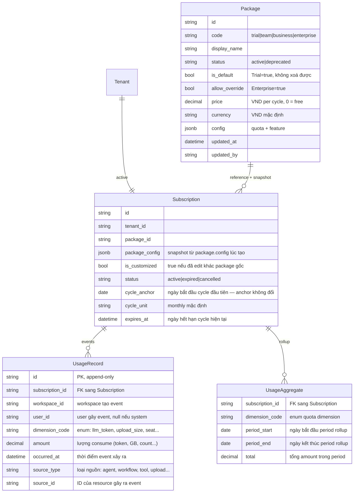
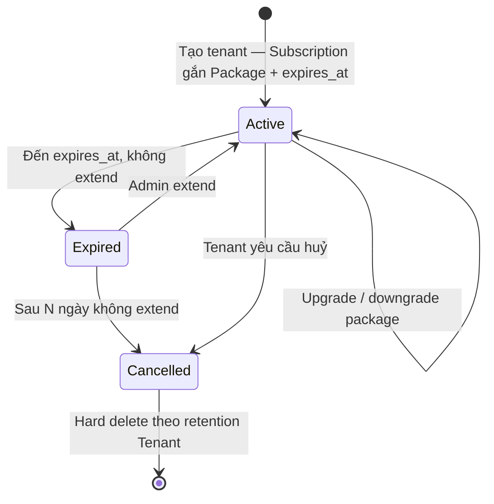

# Billing & Subscription

🟡 Draft — v0.1

> Trang này định nghĩa **mô hình tính tiền & gói dịch vụ** của CAP — cách CAP đóng gói value thành Package, gán cho Tenant qua Subscription, đo bằng Quota. Đối tượng đọc: lãnh đạo sản phẩm, kiến trúc sư, đội billing, sales, đội triển khai.
>
> Chi tiết kỹ thuật về quota enforcement, invoice generation, payment integration sẽ ở Section 3 — Architecture.

---

## Thuật ngữ chính

Bảng này giải thích các từ khoá xuất hiện trong toàn trang. Đọc qua trước khi vào nội dung phía dưới.

| Term | Ý nghĩa |
| --- | --- |
| **Package** | Template gói dịch vụ do CAP Owner định nghĩa qua UI (Trial / Team / Business / Enterprise). Chứa cấu hình **quota + feature + giá**. Khách hàng chọn 1 Package khi đăng ký tenant. |
| **Subscription** | Bản ghi gắn 1 Tenant với 1 Package — bao gồm ngày hết hạn, trạng thái, và snapshot cấu hình lúc ký. Mỗi Tenant có đúng 1 Subscription đang active tại 1 thời điểm. |
| **Tenant** | 1 tổ chức / khách hàng sử dụng CAP. Chi tiết ở [Tenant & Workspace](/02-domain/01-tenant-workspace). |
| **Quota** | Hạn mức sử dụng tài nguyên (vd 50M LLM token/tháng, 200GB storage, 20 user). Có loại reset hàng tháng, có loại tích luỹ (không reset). |
| **Feature** | Tính năng cụ thể có/không trong gói (vd SSO, SAML, Custom domain, White-label, On-prem). |
| **Snapshot config** | Bản sao cấu hình Package được lưu trong Subscription tại thời điểm ký. Sau đó độc lập — Owner sửa Package gốc không tự ảnh hưởng khách cũ. |
| **`is_customized`** | Cờ trên Subscription: `true` nếu cấu hình đã được admin sửa khác Package gốc (thường gặp ở Enterprise contract). |
| **`allow_override`** | Cờ trên Package: `true` cho phép admin chỉnh quota/feature khi tạo Subscription (mặc định chỉ Enterprise). |
| **BYO LLM** | "Bring Your Own LLM" — khách hàng tự nhập key LLM của họ (Azure OpenAI / Anthropic / vLLM nội bộ) thay vì dùng LLM CAP cung cấp. Khi BYO, token quota CAP không gate request. |
| **Managed LLM** | CAP cung cấp LLM (mặc định). Token consumption đếm vào quota của khách. |
| **Cycle** | Chu kỳ tính quota (mặc định 1 tháng — `cycle_unit = monthly`). Quota reset đầu mỗi cycle. |
| **Extend** | Hành động admin/owner bấm gia hạn Subscription — dời `expires_at` về tương lai. CAP **không tự động** gia hạn. |
| **UsageRecord** | Log sự kiện consume quota (mỗi LLM call / upload / tool call ghi 1 row), append-only. |
| **UsageAggregate** | Tổng hợp `UsageRecord` theo period (kỳ), dùng cho invoice và dashboard hiển thị nhanh. |

---

## 1. Vì sao Billing là Domain concept

Trong hầu hết SaaS, billing là module bolt-on cuối cùng. CAP làm ngược — **Billing là Domain concept core**, có mặt từ MVP. 3 lý do:

**Kiểm soát chi phí AI là lời hứa sản phẩm.** [Vision § 4](/01-overview/01-vision) giá trị #2 hứa "không bị AI bill shock, đo cost theo phòng ban, đặt quota". Mỗi LLM call / tool call / upload phải sinh `UsageRecord` ngay từ đầu — không thể bolt-on sau khi product đã chạy 6 tháng.

**Internal-first cần baseline cost thật.** Năm 1-1.5 CMC nội bộ pilot — không thu tiền thật nhưng phải đo cost ra số có nghĩa để Năm 2 thương mại định giá đúng. Skip billing ở MVP → đoán mò khi đi commercial → mất uy tín.

**Provider-agnostic ảnh hưởng pricing semantics.** [Vision § 4](/01-overview/01-vision) giá trị #5: đổi LLM provider không phải rebuild agent. Billing logic phải biết khách dùng Managed LLM (gate theo token) hay BYO LLM (không gate) — đó là domain knowledge, không phải config technical lẫn vào sau.

→ Billing nằm ở Section 02 — Domain cùng Tenant, Agent, Tool, Knowledge…, không phải Section 06 — Deployment hay infrastructure concerns.

---

## 2. Nguyên tắc thiết kế

| # | Nguyên tắc | Hệ quả |
| --- | --- | --- |
| 1 | **Package là data, không hard-code** | Owner CAP sửa pricing/quota/feature qua UI vào DB, không cần deploy. Có sẵn 4 built-in: Trial / Team / Business / Enterprise (xem §3) |
| 2 | **Subscription tự chứa snapshot config** | Mỗi Subscription có `package_config` jsonb — copy từ `package.config` lúc tạo. Sau đó độc lập: Owner sửa Package không tự ảnh hưởng khách cũ. `is_customized` flag để hỗ trợ bulk refresh non-customized |
| 3 | **Manual extend, không auto-renew** | Subscription có `expires_at`. Hết hạn → Expired (read-only). Admin/owner vào trang quản lý bấm "Extend" để kéo dài. Đơn giản, không rủi ro charge nhầm |
| 4 | **Provider-agnostic + BYO LLM** | Khách có option dùng key Azure / Anthropic / vLLM nội bộ — không bị gate bởi token quota. Pricing không khoá vào markup LLM |

---

## 3. 4 built-in package

Khi cài CAP, system seed sẵn 4 package. Owner có thể chỉnh sửa hoặc thêm package mới qua UI. **Trial có `is_default = true`** → không xoá được. **Enterprise có `allow_override = true`** → cho phép edit matrix khi tạo Subscription.

> ⚠️ Số liệu quota + giá là **giả định ban đầu**, sẽ chốt với lãnh đạo sản phẩm sau khi có data pilot.

<div className="billing-cards">

<div className="billing-card">

<div className="billing-card__title">🆓 Trial</div>
<div className="billing-card__price">Free</div>
<div className="billing-card__meta">Dùng thử 14 ngày · Gói mặc định, không xoá được</div>

<div className="billing-card__section">Quota</div>

- LLM token: **2M**/tháng
- Upload: **2GB**/tháng
- Storage: **5GB**
- Seat: **3**
- Concurrent run: **2**

<div className="billing-card__section">Feature</div>

- ✅ Multi-tenant + Workspace
- ✅ Built-in tool (limited)
- ❌ Custom REST, MCP, SSO
- Audit: 30 ngày
- Vector: pgvector
- Hỗ trợ: Community

</div>

<div className="billing-card">

<div className="billing-card__title">💼 Team</div>
<div className="billing-card__price">~5M VND / tháng</div>
<div className="billing-card__meta">1 phòng ban · ≤ 20 user · Managed hoặc BYO LLM</div>

<div className="billing-card__section">Quota</div>

- LLM token: **50M**/tháng
- Upload: **50GB**/tháng
- Storage: **200GB**
- Seat: **20**
- Concurrent run: **20**

<div className="billing-card__section">Feature</div>

- ✅ Tất cả của Trial
- ✅ Custom REST, MCP, Custom role
- ✅ SSO Google / MS OAuth
- ❌ SAML / SCIM, Custom domain
- Audit: 1 năm
- Vector: pgvector / Qdrant
- Hỗ trợ: Email · VAT invoice

</div>

<div className="billing-card">

<div className="billing-card__title">🏢 Business</div>
<div className="billing-card__price">~30M VND / tháng</div>
<div className="billing-card__meta">Multi-department · BYO khuyến nghị</div>

<div className="billing-card__section">Quota</div>

- LLM token: **500M**/tháng (managed) hoặc unlimited (BYO)
- Upload: **500GB**/tháng
- Storage: **5TB**
- Seat: **200**
- Concurrent run: **100**

<div className="billing-card__section">Feature</div>

- ✅ Tất cả của Team
- ✅ SAML / SCIM
- ✅ Custom domain
- ✅ Marketplace nội bộ
- ❌ White-label, On-prem
- Audit: 1 năm · SLA 99.5%
- Hỗ trợ: Email + chat

</div>

<div className="billing-card">

<div className="billing-card__title">🏛️ Enterprise</div>
<div className="billing-card__price">Custom (đàm phán)</div>
<div className="billing-card__meta">Multi-year contract · Cho phép admin chỉnh quota/feature khi tạo Subscription</div>

<div className="billing-card__section">Quota</div>

- Custom toàn bộ
- LLM token / Upload / Storage / Seat / Run: tuỳ đàm phán

<div className="billing-card__section">Feature</div>

- ✅ Tất cả của Business
- ✅ White-label
- ✅ On-prem deployment
- ✅ Vector mở rộng (Pinecone / Milvus)
- Audit: 7 năm · SLA 99.9%
- Hỗ trợ: Dedicated CSM

</div>

</div>

---

## 4. Mô hình khái niệm

4 entity cốt lõi:



### 4.1 Entity overview

**Package** — Template gói do Owner CAP định nghĩa qua UI

- Có **giá** và **đơn vị tiền tệ** lưu thành 2 column riêng (`price` + `currency`) — query trực tiếp được
- Có **cấu hình quota + feature** lưu trong field `config` (jsonb)
- Cờ `is_default = true` đánh dấu Trial — **không xoá được**
- Cờ `allow_override = true` (mặc định chỉ Enterprise) — cho phép admin edit cấu hình khi tạo Subscription

**Subscription** — Mỗi Tenant có 1 Subscription đang active tại 1 thời điểm

- Có **snapshot cấu hình gói** copy từ Package lúc tạo, lưu vào `package_config` (cùng shape với `package.config`)
- Sau khi tạo, snapshot độc lập với Package gốc — Owner sửa Package không tự ảnh hưởng Subscription đang chạy
- Cờ `is_customized = true` nếu cấu hình đã bị admin chỉnh khác Package gốc
- Trường `expires_at` xác định ngày hết hạn của cycle hiện tại

**UsageRecord** — Log sự kiện sử dụng, append-only

- Mỗi LLM call / upload / tool call sinh ra 1 row
- Có `workspace_id` + `user_id` để dashboard breakdown được ("workspace nào ồn ào", "user nào dùng nhiều")
- `user_id` null cho event do hệ thống tự chạy (scheduler / cron)
- `dimension_code` là enum cứng — 11 loại quota định nghĩa trong code

**UsageAggregate** — Tổng hợp `UsageRecord` theo period (kỳ)

- Khoá chính `(subscription_id, dimension_code, period_start)`
- Dùng cho invoice, dispute, dashboard hiển thị nhanh
- Generate batch hằng ngày từ UsageRecord (không tính lại từ raw events mỗi lần)

### 4.2 Subscription config — snapshot từ Package

Khi tạo Subscription, hệ thống **copy** `package.config` vào `subscription.package_config`. Sau đó 2 field độc lập — Owner sửa `package.config` không tự ảnh hưởng Subscription đang chạy.

**UX lúc tạo Subscription**: matrix quota + feature **luôn hiển thị** (lấy từ package.config làm default):

- `package.allow_override = false` (Trial / Team / Business): matrix **disabled**, admin chỉ xem, không edit. Save nguyên.
- `package.allow_override = true` (Enterprise): matrix **editable**, admin/sales chỉnh quota + tick feature trước khi save.

**`is_customized` flag**:

| Sự kiện | `is_customized` |
| --- | --- |
| Tạo Subscription, save nguyên `package.config` | `false` |
| Tạo / edit Subscription với value khác `package.config` | `true` |
| Admin bấm "Refresh from Package" → copy lại `package.config` | `false` |

**Runtime check quota**: đọc thẳng `subscription.package_config`, không cần merge logic.

### 4.3 Refresh từ Package — đồng bộ subscription chưa custom

Khi Owner sửa `package.config` của vd Team, các Subscription đang ký Team **không tự cập nhật**. Owner có 2 lựa chọn:

1. **Để nguyên** — khách cũ giữ snapshot lúc ký, predictability cao
2. **"Refresh all non-customized"** — bulk update mọi Subscription có `is_customized = false` AND `package_id = team`: copy `package.config` mới sang `subscription.package_config`. Audit ghi diff before/after

Subscription có `is_customized = true` (đã được edit custom, vd Enterprise hoặc Team đã đàm phán riêng) → **không bị động đến**, giữ nguyên config riêng.

### 4.4 Config schema — 3 loại feature entry

`package.config.feature` và `subscription.package_config.feature` cùng dùng 3 loại entry:

| Loại | Ví dụ | Format value |
| --- | --- | --- |
| **Boolean** | SSO, audit log UI, custom domain, white-label | `true` / `false` |
| **Numeric limit** | max workspace per tenant, max concurrent run | `<int>` |
| **Enum** | vector backend (`pgvector` / `qdrant` / `pinecone`), retention (`30d` / `1y` / `7y`) | `<string>` |

Feature check qua `subscription.package_config.feature[<code>]`.

---

## 5. Quota dimensions

CAP định nghĩa **11 chiều quota**, là enum cứng trong code. UX hiển thị **4 chiều chính** cho khách; 7 chiều còn lại là cap kỹ thuật.

### 5.1 Chiều chính

| Dimension | Đơn vị | Reset | Vai trò |
| --- | --- | --- | --- |
| `llm_token` | token (tách theo model) | Monthly | Quota chính khi Managed LLM |
| `upload_size` | GB | Monthly | Document nạp vào KB — gồm cost embedding + indexing |
| `total_storage` | GB | Cumulative | Tổng dung lượng KB hiện tại; vượt → block upload mới |
| `seat` | account active | Cumulative | Số builder có quyền vào workspace |

### 5.2 Chiều phụ (cap kỹ thuật + safety)

| Dimension | Đơn vị | Reset | Vai trò |
| --- | --- | --- | --- |
| `resource_agent` | int | Cumulative | Cap số agent |
| `resource_workflow` | int | Cumulative | Cap số workflow |
| `resource_knowledge` | int | Cumulative | Cap số KB |
| `resource_tool` | int | Cumulative | Cap số tool custom |
| `web_search_call` | call | Monthly | Cap built-in tool có phí ngoài (Tavily/Brave) |
| `max_concurrent_run` | int | Capacity | Số workflow run song song tối đa |
| `api_request_rate` | req/s, req/day | Rolling | Anti-abuse, return 429 khi vượt |

### 5.3 Quy tắc đặc biệt

| Tình huống | Xử lý |
| --- | --- |
| **BYO LLM** (workspace cấu hình key riêng) | `llm_token` quota **không gate** request; vẫn track để dashboard |
| **Re-embedding** (đổi embedding model / chunking) | KHÔNG tính vào `upload_size` tháng |
| **URL crawl** | Tính theo text **sau parse**, không phải HTML raw |
| **Multi-modal** (ảnh, OCR, video) | Có dimension riêng `image_processing_size`, không gộp vào `upload_size` |
| **Soft-deleted resource** (còn trong 90 ngày retention) | Không đếm vào `resource_*`; vẫn chiếm `total_storage` |

### 5.4 Built-in tool có phí

`web_search` (Tavily/Brave/Bing) có chi phí thật trên CAP (~$0.005/call). 2 mode:

| Mode | Hành vi |
| --- | --- |
| **Managed** (default) | CAP cung cấp key; user dùng → counter `web_search_call` tăng; hết quota → tool disable phần còn lại của tháng |
| **BYO** | Workspace tự nhập key của họ; không tính `web_search_call`; cost on workspace |

---

## 6. Subscription lifecycle



| State | Hành vi |
| --- | --- |
| **Active** | Hoạt động bình thường. `expires_at` còn ở tương lai |
| **Expired** | Đã qua `expires_at` mà chưa extend. Tenant **read-only**: vẫn xem được, không tạo/sửa được. Audit + export vẫn chạy |
| **Cancelled** | Đợi hard delete theo retention của Tenant ([Tenant lifecycle](/02-domain/01-tenant-workspace)) |

### 6.1 Renewal — manual extend

Hệ thống **không auto-renew**. Đơn giản, ít rủi ro charge nhầm.

| Sự kiện | Hành vi |
| --- | --- |
| Trước `expires_at` 7 ngày | Email reminder cho tenant_owner + banner trong app |
| Đến `expires_at` | Subscription chuyển `Active → Expired` |
| Admin extend | Owner CAP vào trang quản lý Subscription → bấm "Extend" → chọn cycle (default +1 tháng) → `expires_at` cộng thêm cycle. Subscription `Expired → Active` (hoặc `Active → Active` nếu extend trước hết hạn) |
| Đổi `cycle_unit` | Owner có option `monthly` (default) hoặc `yearly` khi extend |

### 6.2 Đổi package mid-cycle

| Action | Hiệu lực | Pro-rate? | Quota |
| --- | --- | --- | --- |
| **Upgrade** Team → Business | Ngay lập tức | Pro-rate phần còn lại của cycle (charge thêm) | Snapshot copy lại từ Business; quota reset; không cộng dồn quota cũ |
| **Downgrade** Business → Team | Cuối cycle hiện tại | Không refund | Snapshot copy từ Team từ cycle mới |
| **Cancel** | Cuối cycle (giữ Active đến `expires_at`) | Không refund | Sau `expires_at` → Cancelled |

### 6.3 Quota reset

| Concept | Mặc định |
| --- | --- |
| `cycle_anchor` | Ngày bắt đầu cycle **đầu tiên** — anchor không đổi suốt vòng đời Subscription. Dùng để compute cycle hiện tại |
| `expires_at` | Ngày hết hạn cycle hiện tại. Khi admin extend → cộng thêm `cycle_unit` |
| `cycle_unit` | `monthly` mặc định; có thể đổi sang `yearly` khi extend |
| Carryover unused quota | **Không** — quota chu kỳ này không dùng → mất |

**Ví dụ**: Tenant ABC ký ngày 15/3/2026, cycle monthly → `cycle_anchor = 2026-03-15`.

```text
Cycle 1: 15/3 → 14/4    (expires_at = 14/4)
Cycle 2: 15/4 → 14/5    (sau khi extend, expires_at = 14/5)
Cycle 3: 15/5 → 14/6
...
```

**Vì sao không dùng calendar (mọi tenant reset ngày 1)**:

- Tránh spike load DB khi 100K tenant cùng reset.
- Fair cho khách ký ngày cuối tháng (vd 28/3) — không phải chỉ 3 ngày "tháng đầu" rồi reset luôn.

---

## 7. Free, pilot, demo — đều là Package

Không có concept "billing mode" tách riêng. Mọi đặc tính billing đều thể hiện qua field `price` trên Package:

| Trường hợp | Cách handle |
| --- | --- |
| Khách hàng thương mại | Team / Business / Enterprise, `price > 0` |
| Trial built-in | Trial package, `price = 0`, expires 14 ngày |
| Free / pilot / demo | Package custom với `price = 0` — quota vẫn enforce |

**Lợi ích**: cả 3 trường hợp dùng cùng workflow Package + Subscription, chỉ khác giá trị `price`.

---

## 8. Pricing unit — Tenant level

- Subscription gắn ở **Tenant** — 1 tenant có 1 subscription active.
- Quota check ở **Tenant level** — mọi workspace trong tenant chia chung pool quota.
- Workspace nào tiêu nhiều → ăn vào pool chung; tenant_admin xem dashboard breakdown per workspace (qua `UsageRecord.workspace_id`).

Sub-quota cấp workspace (vd "HR workspace max 100M token") **không có ở MVP**. Khi commercial scale có tenant multi-BU thực sự cần allocation chi tiết → thêm `workspace.quota_allocation` jsonb.

---

## 9. Use cases

### 🎯 Use case A — Tổ chức mới đăng ký CAP

> *"Một tổ chức bất kỳ đăng ký dùng CAP lần đầu."*

**Yêu cầu hệ thống**:

- Khi tenant mới được tạo, hệ thống **tự động gán gói Trial** (dùng thử 14 ngày, quota nhỏ). Trial là gói mặc định, không xoá được (cờ `is_default = true`).
- **Hoặc** khách hàng chọn gói khác ngay khi tạo — ví dụ ABC đã ký Annual Team qua sales → tenant ABC khởi tạo thẳng với gói Team, bỏ qua Trial.
- Hệ thống copy cấu hình gói sang Subscription (snapshot lưu ở `package_config`), gán ngày hết hạn của cycle đầu tiên (`expires_at`).

### 🎯 Use case B — Tenant chạm quota

> *"Phòng IT đang dùng Team. Tháng này usage chạm 80% LLM token quota."*

**Yêu cầu hệ thống**:

- **Đụng 80% quota**: gửi email cảnh báo cho tenant_owner + dashboard hiển thị progress bar đỏ + gợi ý upgrade.
- **Đụng 100% quota**: chặn cứng — mọi request mới bị từ chối, UI hiển thị thông báo rõ ràng cho người dùng.
- Tenant_owner có option **upgrade ngay** → quota mới có hiệu lực tức thì, không phải đợi.
- Nếu không upgrade → đợi đầu cycle tháng sau, quota tự reset.
- Một số quota là **tích luỹ** (vd tổng dung lượng `total_storage`) — không reset đầu tháng, chỉ giảm khi user xoá tài nguyên cũ.

### 🎯 Use case C — Tenant upgrade / downgrade gói

> *"Công ty ABC dùng Team 6 tháng, mở rộng nhiều phòng ban, cần SAML cho HR + thêm dung lượng → upgrade lên Business."*

**Yêu cầu hệ thống**:

- ABC vào trang billing → bấm "Upgrade lên Business" → màn hình preview hiện **giá pro-rate** (phần chênh cho thời gian còn lại của cycle hiện tại) → bấm confirm.
- Hệ thống charge khoản pro-rate, đổi gói sang Business ngay, copy lại cấu hình Business sang Subscription (snapshot mới ở `package_config`).
- Quota Business có hiệu lực ngay; **không cộng dồn** quota Team còn dư cũ.
- Các tính năng mới (SAML, Custom domain) **mở khoá ngay**.
- **Downgrade** Business → Team: chỉ có hiệu lực **vào cuối cycle hiện tại** (tránh refund phức tạp); customer được cảnh báo trước khi xác nhận.

### 🎯 Use case D — Enterprise custom contract

> *"Công ty XYZ: cần 50TB storage (thay vì 5TB mặc định của Business), white-label, on-prem deployment, contract 3 năm với giá đặc biệt."*

**Yêu cầu hệ thống**:

- Sales đàm phán xong → CAP Owner tạo Subscription cho XYZ, chọn gói **Enterprise**.
- Gói Enterprise cho phép **chỉnh sửa cấu hình** khi tạo (cờ `allow_override = true`) → màn hình matrix quota + feature hiển thị ở chế độ **editable**: admin nhập 50TB storage, bật white-label, bật on-prem, đặt giá riêng theo contract.
- Bấm Save → hệ thống lưu cấu hình custom vào Subscription (`package_config`), đánh dấu Subscription đã chỉnh riêng (cờ `is_customized = true`).
- **Không cần tạo gói riêng cho XYZ** — Enterprise vốn là template cho phép custom hoàn toàn.
- Sau này nếu cần sửa Subscription (vd gia hạn contract đổi điều khoản) vẫn cho phép. Mọi thay đổi đều ghi audit log.

### 🎯 Use case E — Subscription hết hạn

> *"Tenant ABC đang dùng Team, hôm nay là ngày hết hạn. Hệ thống không tự động gia hạn."*

**Yêu cầu hệ thống**:

- Trước ngày hết hạn 7 ngày: gửi email nhắc nhở cho tenant_owner + banner thông báo trong app.
- Đến ngày hết hạn (`expires_at`): Subscription chuyển trạng thái **Expired** → tenant chỉ xem được nội dung cũ, không tạo/sửa tài nguyên mới.
- **Owner CAP** vào trang quản lý Subscription → bấm **"Extend"** → chọn cycle gia hạn (mặc định +1 tháng) → ngày hết hạn dời tới (`expires_at` cộng thêm cycle). Tenant active trở lại.
- Hoặc tenant_owner chủ động liên hệ admin để gia hạn.
- Sau N ngày (đề xuất 30) ở trạng thái Expired mà không gia hạn → Subscription chuyển **Cancelled** → tenant đợi hard delete theo retention.

### 🎯 Use case F — Owner cập nhật Package, refresh các Subscription chưa custom

> *"Pilot cho thấy quota Team 50M token quá ít — đa số khách kẹt cuối tháng. Owner muốn nâng lên 80M cho tất cả khách Team."*

**Yêu cầu hệ thống**:

- Owner mở UI quản lý package → sửa cấu hình Team (tăng quota 50M → 80M) → bấm Save. Template gói Team được cập nhật.
- Subscription cũ **không tự thay đổi** — vì mỗi Subscription đã copy snapshot cấu hình từ lúc khách ký, độc lập với Package.
- Owner thấy notification: *"Hiện có 12 Subscription Team chưa chỉnh sửa riêng (cờ `is_customized = false`). Bạn có muốn refresh tất cả lên cấu hình mới (80M) không?"*
- Bấm **"Refresh tất cả non-customized"** → hệ thống bulk update mọi Subscription Team chưa custom: copy cấu hình mới từ Team package sang `subscription.package_config`.
- Các Subscription đã custom riêng (vd Enterprise hoặc Team đã đàm phán riêng — `is_customized = true`) → **không bị động đến**, giữ nguyên cấu hình.
- Audit log ghi: bao nhiêu Subscription được refresh, diff before/after cho từng cái.

---

## 10. Trade-off đã chấp nhận

| Quyết định | Lý do | Đánh đổi |
| --- | --- | --- |
| Không auto-renew, admin manual extend | Đơn giản, ít rủi ro charge nhầm | Admin phải nhớ extend; nếu lỡ → tenant tạm Expired đến khi extend |
| Subscription giữ snapshot `package_config` riêng | Grandfathering tự động; Owner sửa Package không tự ảnh hưởng khách cũ | Duplicate ~5KB/sub; cần "Refresh all non-customized" UX để propagate update có chủ ý |
| Quota chia chung ở Tenant | Đơn giản, predictable | 1 workspace có thể "ăn" hết quota — mitigate bằng dashboard cảnh báo |
| Không carryover quota | Predictable cost CAP | User cảm thấy "lãng phí" — mitigate bằng usage forecast |
| `web_search` Managed default + cap | UX đơn giản | CAP gánh cost tool có phí — mitigate cap theo package |
| Token quota không enforce khi BYO LLM | Đúng tinh thần BYO | Khách BYO vẫn cần package để mở feature — mitigate bằng feature gate |
| `upload_size` đo sau parse | Phản ánh đúng cost embedding | Khó giải thích "tại sao 1GB PDF chỉ tính 200MB" |
| `allow_override` chỉ Enterprise = true | Tránh sales/admin tự sửa lung tung khi tạo Team/Business sub | Khách Team/Business muốn quota lẻ phải nâng lên Enterprise (hoặc Owner sửa thủ công sau khi tạo) |

---

## 11. Câu hỏi còn mở

| # | Câu hỏi | Cân nhắc |
| --- | --- | --- |
| Q1 | Bỏ `monthly_upload` chỉ giữ `total_storage`? | Đơn giản hơn nhưng mất visibility về spike upload |
| Q2 | `web_search` Managed-with-cap hay BYO bắt buộc? | Managed đơn giản, BYO sạch về cost CAP |
| Q3 | Multi-modal (ảnh, OCR) vào quota gì? | Dimension riêng `image_processing` hay multiplier vào `upload_size` |
| Q4 | Discount khi extend yearly vs monthly? | Industry chuẩn 15-20% cho annual; cần chốt theo cash flow |
| Q5 | End-user per-resolution billing (outcome-based) | Add-on cho Business+; cần định nghĩa "resolution" |
| Q6 | Multi-currency (VND + USD) | Schema sẵn (`price` + `currency`), UI seed VND, USD bật khi go global |
| Q7 | Public API có quota riêng so với UI? | Cùng pool đơn giản; tách giúp protect end-user widget |
| Q8 | Bao nhiêu ngày Expired trước khi auto Cancelled? | Đề xuất 30 ngày — đủ cho admin phản ứng |
| Q9 | MFA bắt buộc cho user có quyền `tenant.billing.update`? | Yes — đồng bộ với [IAM & RBAC](/02-domain/02-iam-rbac) |

---

## 12. Tích hợp với các Domain khác

| Domain | Liên hệ |
| --- | --- |
| [Tenant & Workspace](/02-domain/01-tenant-workspace) | Subscription gắn Tenant. Lifecycle Tenant Suspended/Archived link với Subscription Expired/Cancelled |
| [IAM & RBAC](/02-domain/02-iam-rbac) | Permission `tenant.billing.*` — chỉ Tenant Owner / Admin được thao tác. MFA bắt buộc cho action sensitive |
| [Agent](/02-domain/03-agent) | Mỗi conversation cost ghi `UsageRecord` với dimension `llm_token`. Agent có quota local (max conv/giờ) độc lập với quota tenant |
| [Tool](/02-domain/04-tool) | `web_search` đếm `web_search_call`. Tool custom REST của khách → không tính (out-of-CAP cost) |
| [Knowledge Base](/02-domain/05-knowledge) | Upload tăng `upload_size` + `total_storage` |
| [Workflow](/02-domain/06-workflow) | Mỗi run check `max_concurrent_run`. Run cost (token + tool) ghi `UsageRecord` |
| [Conversation & Run](/02-domain/07-conversation) | Cost attribution per message → roll-up lên Subscription. Retention conv là feature theo package |

---

## Liên kết

- [Tenant & Workspace](/02-domain/01-tenant-workspace)
- [IAM & RBAC](/02-domain/02-iam-rbac)
- [Vision § 4 — Giá trị cốt lõi "Kiểm soát chi phí AI"](/01-overview/01-vision)
- [Roadmap](/07-roadmap/01-mvp)
