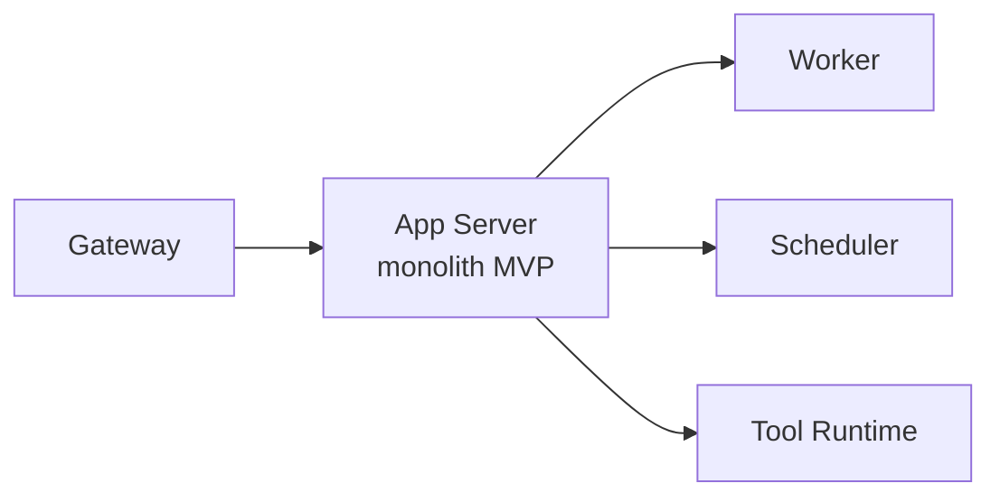

# Service boundaries

🔴 Placeholder

## Service map (MVP)

## Phasing

| Phase | Service split |
| --- | --- |
| **MVP** | 1 monolith (Console+Public+Engine) + Worker + Scheduler + Tool Runtime |
| **v1** | Tách Public API ra riêng (scale theo end-user load) |
| **v2** | Tách Engine ra (durable execution) |
| **v3** | Microservices đầy đủ |

## Quyết định cần làm

- MQ broker: Redis Streams (lite) vs NATS (HA)?
- Tool Runtime: subprocess hay container?
- HTTP framework: FastAPI / Starlette / NestJS?
