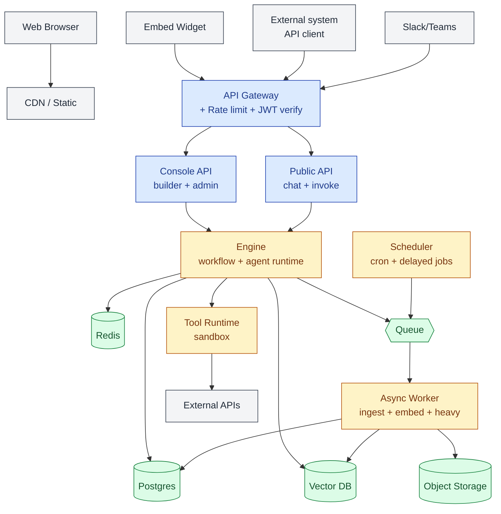
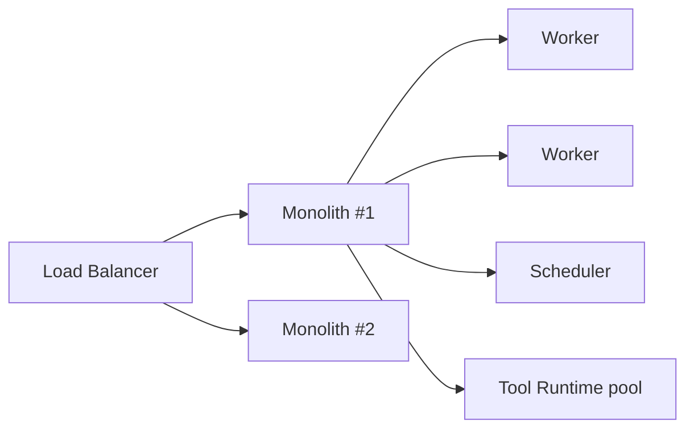
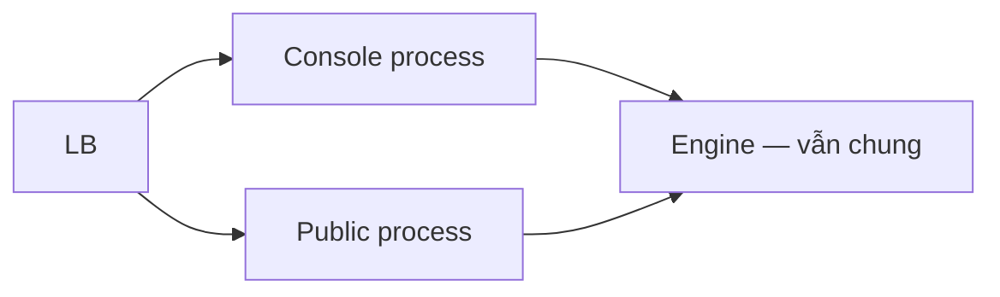

# Service boundaries

🟡 Draft — v0.1

## Trang này nói về

CAP được tổ chức thành **6 logical service** với 4 ranh giới rõ ràng theo "ai chạy gì". MVP gộp 3 service đầu thành **một monolith** để vận hành đơn giản; theo lộ trình sẽ tách dần khi nhu cầu scale + isolation lớn hơn.

**Phép hình dung**: nghĩ về CAP như một nhà hàng —

- **Console / Public API** = quầy phục vụ khách (đón request).
- **Engine** = đầu bếp ra quyết định món.
- **Worker** = phụ bếp chạy việc nặng (ingest tài liệu, embed batch).
- **Scheduler** = đồng hồ báo giờ chạy bếp định kỳ.
- **Tool Runtime** = khu vực riêng biệt để xử lý nguyên liệu nguy hiểm (sandbox).

**Đọc trang này nếu bạn là**:

- **Kiến trúc sư** — quyết định ranh giới service, deploy topology, scale strategy.
- **Dev backend** — chọn framework, viết handler, set up inter-service communication.
- **DevOps** — biết cần deploy bao nhiêu process, scaling policy, healthcheck cho cái nào.

**Trang liên quan**: [Architecture overview](/01-overview/02-architecture) (bird-eye view) · [Data stores](/03-architecture/02-data-stores) (mỗi service truy cập store nào) · [Multi-tenant Isolation](/03-architecture/06-multi-tenant) (repository pattern enforcement).

---

## 1. 6 logical service

### 1.1 Console API

| | |
| --- | --- |
| **Phục vụ ai** | Web Console (builder UI), Admin tools |
| **Đặc tính traffic** | Người dùng nội bộ; low QPS, high read; nhiều endpoint CRUD |
| **Endpoint prefix** | `/console/api/v1/*` |
| **Auth** | JWT (Access Token, 15-30 phút) + Refresh Token |
| **Phụ thuộc** | Postgres (đa số), Redis cache (light) |
| **Scaling** | Vertical đủ trong MVP; horizontal khi >100 concurrent builder |

### 1.2 Public API

| | |
| --- | --- |
| **Phục vụ ai** | End-user (qua embed/iframe), hệ thống ngoài tích hợp |
| **Đặc tính traffic** | Cao QPS (chat + invoke), SSE streaming dài, request burst |
| **Endpoint prefix** | `/api/v1/*` (chat, completions, workflow runs) |
| **Auth** | API Key hoặc JWT của workspace |
| **Phụ thuộc** | Engine (gần như mọi request), Redis (rate-limit) |
| **Scaling** | Horizontal sớm; tách process riêng ở v1 vì pattern traffic khác Console |

### 1.3 Engine

| | |
| --- | --- |
| **Trách nhiệm** | Chạy workflow + agent loop. Quản state run/conversation. Stream output. Gọi LLM, Tool, Knowledge |
| **Đặc tính** | Stateful trong phạm vi 1 run/conversation; CPU + memory cao khi có nhiều run song song |
| **Phụ thuộc** | Postgres (state), Redis (lock + cache), Vector DB (retrieval), Tool Runtime (gọi tool), Message Queue (dispatch heavy task) |
| **Scaling** | Horizontal — mỗi run có thể chạy ở bất kỳ instance nào (state persist vào Postgres giữa các node) |

### 1.4 Async Worker

| | |
| --- | --- |
| **Trách nhiệm** | Việc nặng/lâu không nên block API: ingest document (extract + chunk + embed), batch re-index, gửi webhook outbound, retry failed task |
| **Đặc tính** | Consume từ MQ, idempotent, có thể retry tùy ý |
| **Phụ thuộc** | Postgres, Vector DB, Object Storage, MQ |
| **Scaling** | Horizontal theo queue depth; mỗi worker pull job độc lập |

> 📦 Chi tiết thiết kế message contract, retry, DLQ, scheduled jobs, leader election… ở **[Task Queue & Background Jobs](/03-architecture/09-task-queue)**.

### 1.5 Scheduler

| | |
| --- | --- |
| **Trách nhiệm** | Cron-trigger workflow + jobs hệ thống (rotate log, cleanup retention, refresh KB sync) |
| **Đặc tính** | Single-leader để tránh duplicate trigger; pull lịch từ Postgres |
| **Phụ thuộc** | Postgres (lịch + leader lock), MQ (publish job) |
| **Scaling** | 1 active + N standby cho HA. Không cần scale horizontal cho khối lượng cron typical |

### 1.6 Tool Runtime

| | |
| --- | --- |
| **Trách nhiệm** | Thực thi Tool call (Built-in / Custom REST / MCP / Workflow-as-Tool) trong môi trường cách ly |
| **Đặc tính** | Stateless, ngắn (timeout default 30s), không truy cập DB CAP trực tiếp |
| **Phụ thuộc** | External APIs (qua egress proxy), Secret Manager (credential) |
| **Scaling** | Process pool MVP → container-per-call ở production. Chi tiết [Tool Runtime](/03-architecture/04-tool-runtime) |

---

## 2. 5 nguyên tắc phân chia

| # | Nguyên tắc | Hệ quả |
| --- | --- | --- |
| 1 | **Tách theo pattern traffic, không tách theo entity** | Console (low QPS, builder UI) ≠ Public (high QPS, end-user) → tách process. Nhưng Agent CRUD + Agent runtime không tách — cùng pattern |
| 2 | **Stateful logic ở Engine; stateless ở API tier** | Có thể scale Public API horizontal vô tư. Engine cần sticky cho run đang stream nhưng state vẫn flush về Postgres |
| 3 | **Heavy/long work → MQ + Worker** | API không bao giờ block trên việc >5 giây. Builder upload PDF → ngay lập tức trả `accepted`, worker xử lý nền |
| 4 | **Tool Runtime tách rời cứng** | Bug/crash trong tool không sập engine. Crash domain attack-surface khác (chạy code khách upload) — phải isolate |
| 5 | **MVP gộp được thì gộp** | Mỗi service tách thêm là +1 deploy, +1 monitor, +1 schema migration sync. Chỉ tách khi có lý do scale/security/SLA cụ thể |

---

## 3. Deployment topology

### 3.1 MVP — 4 deployable

| Deployable | Chứa | Replicas (start) | Scale theo |
| --- | --- | --- | --- |
| `app` (monolith) | Console + Public + Engine | 2 | CPU + req latency |
| `worker` | Async Worker | 2 | Queue depth |
| `scheduler` | Scheduler | 1 active + 1 standby | (không scale horizontal) |
| `tool-runtime` | Tool Runtime pool | 2 | Tool call concurrency |

→ Tổng: **4 deployable**, deploy được trên k8s cơ bản (Deployment + HPA) hoặc docker-compose cho dev.

### 3.2 v1 — Tách Public API

Khi end-user traffic > 10× builder traffic → tách Public API ra process riêng để scale + tune không ảnh hưởng Console.

### 3.3 v2 — Tách Engine + durable execution

Khi cần đảm bảo workflow run không mất do process crash (compliance enterprise) → tách Engine ra process riêng + swap in-process workflow engine sang Temporal/durable execution. Chi tiết [Workflow Engine](/03-architecture/03-workflow-engine).

### 3.4 v3 — Microservices đầy đủ

Mỗi domain (agent, workflow, knowledge, identity) tách service riêng, có team owner. Cần khi tổ chức > 30 dev và độc lập deploy là blocker.

---

## 4. Inter-service communication

| Pattern | Khi nào dùng | Implementation MVP |
| --- | --- | --- |
| **HTTP sync (request/response)** | Console → Engine; Engine → Tool Runtime | FastAPI/NestJS REST. Timeout chặt: 30s default |
| **MQ async (fire-and-forget + ack)** | Engine → Worker (ingest, embed); Scheduler → Worker (cron job) | Redis Streams (MVP) → NATS/RabbitMQ khi cần HA |
| **Event broadcast (pub/sub)** | Internal event: `document_indexed`, `conversation_ended`, `workflow_published` | Redis Pub/Sub MVP → Kafka khi cần persistence + replay |
| **Webhook outbound (CAP → external)** | Notify workspace's URL khi event xảy ra | Worker pop event → HTTP POST với HMAC sign + retry |

### 4.1 Vì sao chọn Redis Streams cho MVP

| Tiêu chí | Redis Streams | NATS | RabbitMQ | Kafka |
| --- | --- | --- | --- | --- |
| Setup MVP | ✅ Đã có Redis | Cài thêm | Cài thêm | Cài + Zookeeper/KRaft |
| Persistence | ✅ Có (memory + AOF) | Tùy mode | ✅ Mạnh | ✅ Mạnh |
| Throughput | Trung bình | Cao | Cao | Rất cao |
| Operate cost | Thấp | Trung | Trung | Cao |
| Phù hợp | < 1K msg/s | 1-100K | 1-100K | > 100K |

→ MVP < 1K msg/s, Redis Streams đủ. Khi vượt 1K/s → swap NATS (giữ API tương tự).

---

## 5. Stateless vs Stateful — checklist

Trước khi commit code cho service mới, dev phải trả lời:

| Câu hỏi | API tier (Console/Public) | Engine | Worker |
| --- | --- | --- | --- |
| State có sống qua restart process? | ❌ Không được giữ | ✅ Có (qua Postgres) | ❌ Mỗi job độc lập |
| Có thể routing request đến bất kỳ instance? | ✅ | ⚠️ Sticky trong khi stream | ✅ |
| Cache local memory được không? | ⚠️ Read-only, TTL ngắn | ⚠️ Per-run scope OK | ❌ Không |
| In-memory queue? | ❌ Phải push MQ | ⚠️ Tạm trong run, persist khi quan trọng | ❌ Đã pull từ MQ |

---

## 6. Health & lifecycle

Mỗi service expose:

| Endpoint | Mục đích | Yêu cầu |
| --- | --- | --- |
| `GET /healthz` (liveness) | Process còn sống? | Trả 200 nếu process responsive. **Không** check DB ở đây — DB down ≠ liveness fail |
| `GET /readyz` (readiness) | Sẵn sàng nhận request? | Check DB + Redis + MQ. K8s ngắt traffic khi 503 |
| `GET /metrics` | Prometheus scrape | Standard metrics + business KPI |
| `POST /shutdown` (internal) | Drain trước khi terminate | Worker: drain queue current job; API: stop accept + finish in-flight |

**Graceful shutdown SLO**: < 30s. Worker job > 30s phải checkpointable (lưu state để worker khác pick up).

---

## 7. Vì sao không microservice ngay từ đầu

Tham khảo phân tích [Dify](/08-references/01-dify) — Dify cũng dùng monolith dù scale lớn. Lý do CAP theo lựa chọn tương tự:

| Microservice quá sớm | Hệ quả |
| --- | --- |
| Tách trước khi rõ ranh giới domain | Sửa 1 feature đụng 3 service → chậm hơn monolith |
| Mỗi service 1 DB connection | Connection pool exhaustion sớm |
| Distributed transaction | Cần saga / 2PC — phức tạp hơn nhiều so với DB transaction |
| Mỗi service 1 deploy pipeline | Ops overhead lớn, lỗi deploy đa dạng |
| Tracing cross-service | Cần trace-id + correlation kỹ — không tự nhiên có như in-process |

→ MVP **gộp** + **interface rõ ràng** trong codebase (module boundary, dependency injection). Khi cần tách → tách module thành process, không phải refactor toàn bộ.

---

## 8. Tech stack đề xuất (MVP)

| Component | Tech | Vì sao |
| --- | --- | --- |
| HTTP framework | **FastAPI** (Python) | Async native, OpenAPI auto-gen, ecosystem AI dày |
| ORM | **SQLAlchemy 2.x** + Alembic | Mature, async support |
| Auth | **fastapi-jwt-auth** + tự viết policy enforcer | Standard JWT, không lock vendor |
| MQ | **Redis Streams** (MVP) → NATS (v2) | Đã có Redis sẵn |
| Worker framework | **Custom async loop** dùng Redis Streams | Đơn giản, dễ debug |
| Scheduler | **APScheduler** + Postgres backing | Cron + delayed job, có persistence |
| Tool sandbox | **Subprocess + resource.setrlimit** (MVP) | Native, dễ ops; switch container khi cần |
| Frontend | **Next.js 15 / React 18 / TS** | App Router, SSR cho SEO Console |

> Stack này chỉ là **đề xuất default**. Mỗi quyết định có thể đảo nếu team có lý do.

---

## 9. Câu hỏi còn mở

| # | Câu hỏi | Cân nhắc | Phiên bản |
| --- | --- | --- | --- |
| Q1 | MQ broker production — NATS vs RabbitMQ vs Kafka | NATS: lightweight + JetStream persistence. RabbitMQ: feature đa dạng. Kafka: replay + stream | v2 |
| Q2 | Tool Runtime sandbox: subprocess → container hay gVisor? | Container: isolation tốt, overhead ~1s startup. gVisor: gần native + isolation tốt | v2 |
| Q3 | Cần API Gateway chuyên (Kong/Traefik) hay Nginx + custom JWT là đủ? | Kong: rich plugins. Nginx: rẻ + đủ. CAP: ưu tiên Nginx + middleware ở app | v3 |
| Q4 | gRPC nội bộ thay HTTP khi tách service? | gRPC nhanh + type-safe, nhưng debug khó hơn. HTTP+OpenAPI dễ tooling | v3 |
| Q5 | Service mesh (Istio/Linkerd) cần khi nào? | Khi > 10 service và cần mTLS + observability cross-service | v4 |
| Q6 | Deploy multi-region: active-active hay active-passive? | Active-active phức tạp (data sync). Active-passive đủ cho v3-v4 | v5 |

---

## Liên kết

- [Architecture overview](/01-overview/02-architecture) — bird-eye view toàn hệ thống
- [Data stores](/03-architecture/02-data-stores) — 5 store mỗi service truy cập
- [Workflow Engine](/03-architecture/03-workflow-engine) — chi tiết Engine
- [Tool Runtime](/03-architecture/04-tool-runtime) — chi tiết sandbox
- [Multi-tenant Isolation](/03-architecture/06-multi-tenant) — repository pattern enforce ở mọi service
- [Observability](/03-architecture/08-observability) — healthcheck, metric, trace
- [Deployment](/06-deployment/01-dev-env) — cách dựng môi trường dev
