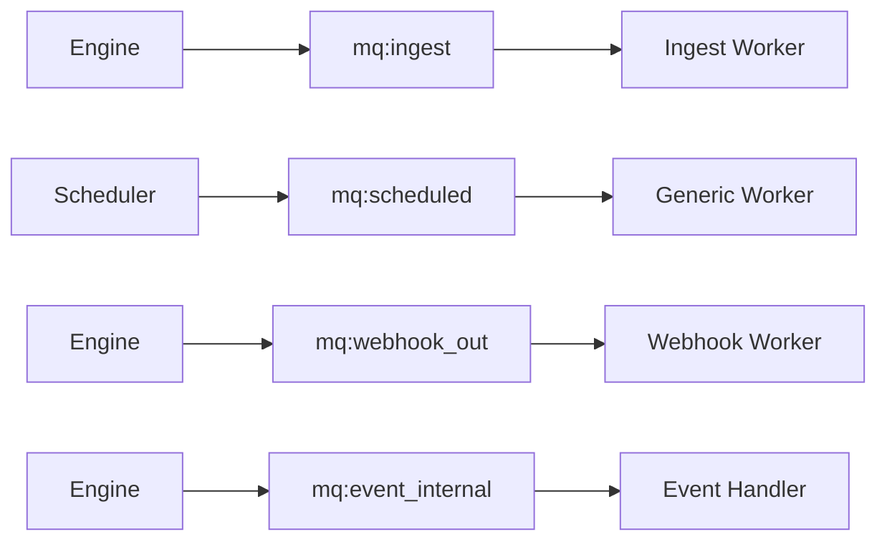

# Data stores

🟡 Draft — v0.1

## Trang này nói về

CAP dùng **5 loại data store** khác nhau, mỗi cái phục vụ **một nhu cầu khác hẳn** — không thể dồn vào một DB duy nhất mà chấp nhận đánh đổi. Trang này định nghĩa: store nào lưu gì, ai truy cập, isolation thế nào, scale ra sao, backup ra sao.

**Phép hình dung**:

| Store | Hình dung | Tương đương đời thực |
| --- | --- | --- |
| **Postgres** | "Sổ cái" — tất cả entity quan hệ, transaction ACID | Sổ kế toán chính |
| **Vector DB** | "Không gian ý nghĩa" — embedding cho retrieval | Bản đồ ý tưởng |
| **Redis** | "Trí nhớ ngắn hạn nhanh" — cache, lock, queue, blacklist | Bảng trắng |
| **Object Storage (S3/MinIO)** | "Nhà kho" — file gốc, log archive, artifact lớn | Kho tài liệu |
| **Message Queue** | "Băng chuyền" — chuyển việc giữa các service | Hệ thống dây chuyền |

**Đọc trang này nếu bạn là**:

- **Dev backend** — cần biết entity nào lưu ở đâu, query ra sao, transaction boundary ở đâu.
- **DevOps** — cần biết provision, backup, restore, scale từng store.
- **Kiến trúc sư** — đánh giá trade-off khi đổi backend (pgvector → Qdrant, Redis → NATS…).

**Trang liên quan**: [Service boundaries](/03-architecture/01-services) (service nào truy cập store nào) · [Multi-tenant Isolation](/03-architecture/06-multi-tenant) (isolation từng store) · [RAG Pipeline](/03-architecture/05-rag-pipeline) (Vector DB chi tiết).

---

## 1. 5 store một bảng

| Store | Backend MVP | Backend production | Truy cập từ | Lưu gì |
| --- | --- | --- | --- | --- |
| **Postgres** | PostgreSQL 15+ | PG 15+ với replica | Engine, Console, Public, Worker | Mọi entity quan hệ: tenant, user, agent, workflow, run, conversation, audit |
| **Vector DB** | pgvector (cùng PG) | Qdrant / Milvus | Engine (retrieval), Worker (ingest) | Embedding của KB segment, ANN search |
| **Redis** | Redis 7 standalone | Redis Cluster / Sentinel | Tất cả service | Cache, session, rate-limit, JWT blacklist, distributed lock, MQ stream |
| **Object Storage** | MinIO (dev) / S3 (prod) | S3 + versioning | Worker, Public (download), Console (upload) | File gốc (PDF, DOCX), trace dump, log archive, model artifact |
| **Message Queue** | Redis Streams | NATS JetStream | Engine (producer), Worker (consumer) | Job ingest, embed batch, webhook outbound, cron event |

---

## 2. Postgres — sổ cái

### 2.1 Schema theo 7 nhóm

Tham khảo Dify cấu trúc 7 nhóm; CAP bổ sung Workspace + RBAC riêng.

| Nhóm | Bảng tiêu biểu | Mô tả |
| --- | --- | --- |
| **Identity** | `account`, `account_password`, `oauth_link`, `mfa_factor` | User toàn cục, đăng nhập, MFA |
| **Tenant & Workspace** | `tenant`, `tenant_settings`, `billing_plan`, `workspace`, `workspace_settings`, `membership`, `workspace_membership` | Tổ chức 2 cấp + member |
| **RBAC** | `role`, `permission`, `role_permission`, `policy`, `service_account`, `api_key` | Phân quyền chi tiết |
| **Agent & Workflow** | `agent`, `agent_version`, `prompt_template`, `model_config`, `safety_config`, `workflow`, `workflow_version`, `node`, `edge` | Định nghĩa builder tạo |
| **Runtime state** | `conversation`, `message`, `tool_call`, `workflow_run`, `node_execution`, `workflow_state` | State đang chạy / đã chạy |
| **Knowledge** | `knowledge_base`, `document`, `segment`, `embedding_meta`, `ingest_job` | Metadata KB (vector lưu Vector DB) |
| **Tool & Integration** | `tool`, `tool_version`, `credential`, `webhook_subscription`, `oauth_token` | Tool, tích hợp ngoài |
| **Audit & Cost** | `audit_log`, `cost_ledger`, `quota_usage`, `event_log` | Audit không-xoá-được + cost per turn |

**Ước lượng MVP**: ~80-100 bảng. Production scale: ~150 bảng.

### 2.2 Quy ước

| Khía cạnh | Quy ước |
| --- | --- |
| **Identifier** | ULID/UUID7 — sort được theo thời gian, an toàn distributed |
| **Naming** | `snake_case` cho cột; `singular_table_name` cho bảng (vd `agent`, không `agents`) |
| **Primary key** | `id` (string ULID) |
| **Tenant scoping** | Mọi bảng business có `tenant_id` + `workspace_id` (trừ `account`, `tenant`, `audit_log`) |
| **Timestamps** | `created_at`, `updated_at` (UTC, có timezone) |
| **Soft delete** | `archived_at` (nullable) thay vì hard delete cho entity quan trọng |
| **JSON columns** | `metadata jsonb` cho extension. Truy vấn JSON cần GIN index |

### 2.3 Index strategy

| Loại index | Khi nào dùng | Ví dụ |
| --- | --- | --- |
| **B-tree** (default) | Lookup theo PK, FK, equality | `(tenant_id, workspace_id, created_at DESC)` |
| **GIN** | JSONB query, full-text search | `metadata jsonb_path_ops`, `to_tsvector(content)` |
| **HNSW / IVFFlat** (pgvector) | Vector ANN search | `embedding vector_cosine_ops` |
| **Partial** | Filter phổ biến + cardinality thấp | `WHERE archived_at IS NULL` |
| **Composite tenant-leading** | RLS-friendly + isolation | `(tenant_id, workspace_id, <entity>_status)` |

**Quy tắc vàng**: mọi query do app sinh ra phải có `tenant_id` ở `WHERE` đầu tiên — nếu không thì có chỉ số đề xuất sai hoặc bug isolation.

### 2.4 Connection pool

| Service | Pool size khuyến nghị | Vì sao |
| --- | --- | --- |
| App (Console+Public+Engine) | 10-20 per process | Mỗi request 1 connection trong scope, không leak |
| Worker | 5 per process | Long-running, ít concurrent |
| Scheduler | 2 | Đọc lịch + insert event |

PG `max_connections` default 100 → đủ cho ~5-7 app instance + 5 worker. Production cần PgBouncer transaction pooling.

### 2.5 Migration

| Tool | **Alembic** (SQLAlchemy) |
| --- | --- |
| Strategy | Forward-only; mỗi PR có migration mới, không sửa migration cũ đã merge |
| Backward compat | 2-step migration cho breaking change: (1) thêm cột mới + dual-write, (2) drop cột cũ sau khi deploy ổn |
| Zero-downtime | Tránh `ALTER TABLE ... ADD COLUMN NOT NULL DEFAULT ...` trên bảng lớn (lock). Dùng nullable + backfill + set NOT NULL |
| Lịch chạy | Migration chạy ở **init container** trước khi app start; có lock advisory để tránh chạy song song |

---

## 3. Vector DB — không gian ý nghĩa

### 3.1 pgvector (MVP)

```sql
CREATE EXTENSION vector;

CREATE TABLE segment_embedding (
  id            uuid PRIMARY KEY,
  tenant_id     text NOT NULL,
  workspace_id  text NOT NULL,
  kb_id         text NOT NULL,
  segment_id    uuid NOT NULL,
  embedding     vector(1536) NOT NULL,   -- text-embedding-3-small
  metadata      jsonb,
  created_at    timestamptz DEFAULT now()
);

CREATE INDEX idx_seg_embed_hnsw
  ON segment_embedding
  USING hnsw (embedding vector_cosine_ops)
  WITH (m = 16, ef_construction = 64);

CREATE INDEX idx_seg_embed_tenant
  ON segment_embedding (tenant_id, workspace_id, kb_id);
```

**Ưu**: cùng DB với metadata → join dễ, không quản 2 system, transaction unified.

**Nhược**: scale limit ~5-10M vector. Trên ngưỡng đó query latency tăng nhanh.

### 3.2 Qdrant (production scale)

Khi vượt 10M vector hoặc cần collection isolation cứng:

| Khía cạnh | Qdrant config |
| --- | --- |
| Collection naming | `t_<tenant_id>__w_<workspace_id>__kb_<kb_id>` — 1 collection per KB |
| Vector params | `size: 1536, distance: Cosine, on_disk: true` |
| Payload index | `tenant_id`, `workspace_id`, `kb_id`, `doc_id`, `created_at` |
| Replication | 2 replica cho HA |
| Sharding | Tự động theo Qdrant cluster |

**Migration pgvector → Qdrant**: tool internal đọc Postgres + ghi Qdrant + dual-read 1 tuần để verify → cutover.

### 3.3 Isolation rule

| Layer | Cơ chế |
| --- | --- |
| Collection level | 1 collection per `(tenant_id, workspace_id, kb_id)` — physical separation |
| Query | **Bắt buộc** filter `tenant_id` + `workspace_id` trong payload filter, ngay cả khi đã đúng collection (defense in depth) |
| Repository | Không có hàm `search(query)` không có tenant context |

Chi tiết: [Multi-tenant Isolation §3](/03-architecture/06-multi-tenant).

---

## 4. Redis — trí nhớ ngắn hạn

### 4.1 Tách 6 namespace

Để tránh "1 bug clear cả cache + queue + session":

| Namespace | Prefix | TTL | Persistence |
| --- | --- | --- | --- |
| **Cache** | `cache:` | 5 phút - 24h | RDB optional |
| **Session** | `sess:` | Theo Access Token (15-30 phút) | AOF |
| **JWT blacklist** | `bl:jwt:` | TTL = remaining JWT lifetime | AOF |
| **Rate limit** | `rl:` | 1-60s sliding window | RDB only |
| **Distributed lock** | `lock:` | 5-30s với watchdog renew | RDB only |
| **MQ Streams** | `mq:` (Stream name) | Trim by maxlen ~100K | AOF |

**Quy tắc**: namespace tách production thành **2 cluster Redis** — `cache+rl+lock` (loss tolerable) và `sess+bl+mq` (cần AOF + replica).

### 4.2 Lock pattern (Redlock simplified)

```python
async def with_lock(key: str, ttl_s: int = 10):
    token = secrets.token_urlsafe(16)
    acquired = await redis.set(f"lock:{key}", token, nx=True, ex=ttl_s)
    if not acquired:
        raise LockBusy(key)
    try:
        yield
    finally:
        # Release chỉ nếu vẫn là token của ta (tránh release nhầm)
        await redis.eval(
            "if redis.call('GET',KEYS[1])==ARGV[1] then return redis.call('DEL',KEYS[1]) end",
            1, f"lock:{key}", token,
        )
```

Dùng cho: publish workflow (tránh 2 build song song), rotate API key.

### 4.3 Cache invalidation

| Pattern | Khi nào dùng |
| --- | --- |
| **TTL-only** | Cache có thể stale ngắn (vd permission cache 30s) |
| **Write-through** | Update DB → ngay lập tức update cache (vd workspace settings) |
| **Event-based invalidate** | Publish `cache.invalidate.<entity>.<id>` qua Redis pub/sub khi entity thay đổi |

---

## 5. Object Storage — nhà kho

### 5.1 Bucket layout

| Bucket | Phục vụ | Lifecycle |
| --- | --- | --- |
| `cap-documents` | File gốc do builder upload (PDF, DOCX) | Vĩnh viễn cho đến khi document bị xoá |
| `cap-artifacts` | Output từ workflow (export, generated image) | 90 ngày → glacier |
| `cap-trace-dumps` | Trace lớn không vừa Tempo (>100KB) | 30 ngày |
| `cap-backups` | DB backup, cold archive | 7 năm (legal) |
| `cap-public` | Avatar, asset công khai có CDN | Vĩnh viễn |

### 5.2 Key naming

```text
cap-documents/
  t_<tenant_id>/
    w_<workspace_id>/
      kb_<kb_id>/
        doc_<doc_id>/
          original.<ext>
          extracted_text.txt
```

Cấu trúc thư mục **gắn tenant_id ở top** — IAM policy ở S3 level có thể giới hạn được nếu cần.

### 5.3 Upload flow

1. Console gọi `POST /uploads/presign` → backend trả pre-signed URL S3 có TTL 5 phút
2. Browser PUT trực tiếp lên S3 (không qua app)
3. S3 phát event `s3:ObjectCreated` qua SNS/Webhook → backend nhận
4. Backend kiểm size + mime + tạo `Document` record `status=uploaded`
5. Push ingest job vào MQ → Worker xử lý

**Lợi**: app không phải proxy file lớn → bandwidth & latency tốt hơn.

### 5.4 Security

- **Encryption at rest**: SSE-S3 default, SSE-KMS với key per-tenant cho Enterprise plan
- **Encryption in transit**: HTTPS bắt buộc
- **Access**: pre-signed URL có TTL ngắn; không public-read trừ bucket `cap-public`
- **Audit**: bật S3 access log + CloudTrail

---

## 6. Message Queue — băng chuyền

> 📦 Phần dưới đây là tóm tắt store-level. Chi tiết đầy đủ (message contract, retry strategy, DLQ, delayed jobs, concurrency lock, scheduler HA, outbox, observability metrics…) ở **[Task Queue & Background Jobs](/03-architecture/09-task-queue)**.

### 6.1 Topology



### 6.2 Stream conventions

| Khía cạnh | Quy ước |
| --- | --- |
| **Stream naming** | `mq:<purpose>` — vd `mq:ingest`, `mq:webhook_out` |
| **Message format** | JSON: `{event_id, tenant_id, workspace_id, payload, attempts, scheduled_for}` |
| **Consumer group** | 1 group per worker pool (`grp:ingest`) — Redis Streams native |
| **Ack** | XACK sau khi job xong; pending > 5 phút → claim by another consumer (XAUTOCLAIM) |
| **DLQ** | Sau N attempts (mặc định 5) → push sang `mq:dlq:<purpose>` để builder review |
| **Idempotency** | `event_id` được dedup ở consumer (Redis SETNX với TTL 24h) |

### 6.3 Khi nào dùng MQ

| Pattern | Có MQ | Không MQ (sync HTTP) |
| --- | --- | --- |
| Builder upload PDF → ingest | ✅ MQ (vài phút) | ❌ Block API |
| User chat → agent trả lời | ❌ Sync stream | ✅ Realtime cần |
| Schedule cron run workflow | ✅ MQ | ❌ |
| Webhook outbound | ✅ MQ + retry | ❌ Caller chờ external API |
| Workflow gọi Tool đơn lẻ | ❌ Sync | ✅ Tool < 30s |
| Workflow gọi 100 Tool batch | ✅ MQ + fan-out | ❌ |

---

## 7. Transaction boundary

| Scenario | Approach |
| --- | --- |
| 1 entity update (vd publish agent) | DB transaction đơn |
| Multi-entity cùng PG (vd create workflow + nodes + edges) | DB transaction đơn |
| PG + Vector DB (vd index segment) | **Outbox pattern**: ghi PG + bảng `outbox` trong 1 txn; worker đọc outbox → ghi Vector DB; retry idempotent |
| PG + Object Storage | Pre-create record `status=pending`, S3 upload xong → update `status=uploaded` |
| PG + MQ | Outbox: insert message vào `outbox` cùng txn, poller push lên MQ |

**Nguyên tắc**: tránh distributed transaction. Dùng outbox + eventual consistency + idempotent consumer.

---

## 8. Backup & restore

| Store | Backup | RPO | RTO |
| --- | --- | --- | --- |
| **Postgres** | WAL streaming + daily snapshot → S3 | 5 phút | 1 giờ |
| **Vector DB** | Re-embed từ PG `segment` table — KHÔNG backup riêng | N/A (rebuild) | 4-8 giờ rebuild |
| **Redis** | RDB snapshot 6h + AOF cho cluster session/MQ | 6h | 30 phút |
| **Object Storage** | S3 versioning + cross-region replication | ~realtime | 30 phút |
| **Audit log** | Immutable: ghi đồng thời PG `audit_log` + S3 archive | 5 phút | 1 giờ |

**Restore drill**: 1 lần/quý phải test full restore vào staging — không drill = không có backup.

---

## 9. Sizing — production starter

| Store | Tier | Cấu hình | Khi nào nâng |
| --- | --- | --- | --- |
| Postgres | Single primary | 4 vCPU, 16GB RAM, 500GB SSD | > 100 GB hoặc > 1K QPS → thêm read replica |
| pgvector | Cùng PG | (như trên) | > 5M vector hoặc query > 200ms → Qdrant |
| Redis | Standalone | 4GB RAM | > 50% memory → cluster 3 shard |
| Object Storage | S3 standard | ∞ | (tự scale) |
| MQ | Redis Streams trong Redis trên | 1GB stream | > 100K msg/s → NATS JetStream |

---

## 10. Câu hỏi còn mở

| # | Câu hỏi | Cân nhắc | Phiên bản |
| --- | --- | --- | --- |
| Q1 | Schema-per-tenant từ khi nào | Khi >1000 tenant; cần migration tool tự động | v4 |
| Q2 | Dùng Postgres logical replication cho read replica hay streaming? | Logical: chọn bảng; streaming: full | v2 |
| Q3 | TimescaleDB cho cost ledger? | Time-series fit tự nhiên; nhưng thêm phụ thuộc | v3 |
| Q4 | Embedding model 1024 dim vs 1536 vs 3072 — chọn gì? | Trade-off accuracy vs cost + storage | v2 |
| Q5 | Trace data > 30 ngày: drop hay archive S3? | Compliance enterprise cần > 1 năm | v3 |
| Q6 | KMS per-tenant: managed (AWS KMS) vs self-host (Vault)? | Vault kiểm soát hơn nhưng ops nặng | v3 |

---

## Liên kết

- [Service boundaries](/03-architecture/01-services) — service nào truy cập store nào
- [Multi-tenant Isolation](/03-architecture/06-multi-tenant) — isolation enforcement từng store
- [RAG Pipeline](/03-architecture/05-rag-pipeline) — chi tiết Vector DB usage
- [Workflow Engine](/03-architecture/03-workflow-engine) — outbox pattern, state persistence
- [Observability](/03-architecture/08-observability) — audit log retention, trace store
- [Deployment](/06-deployment/01-dev-env) — provision local stores
