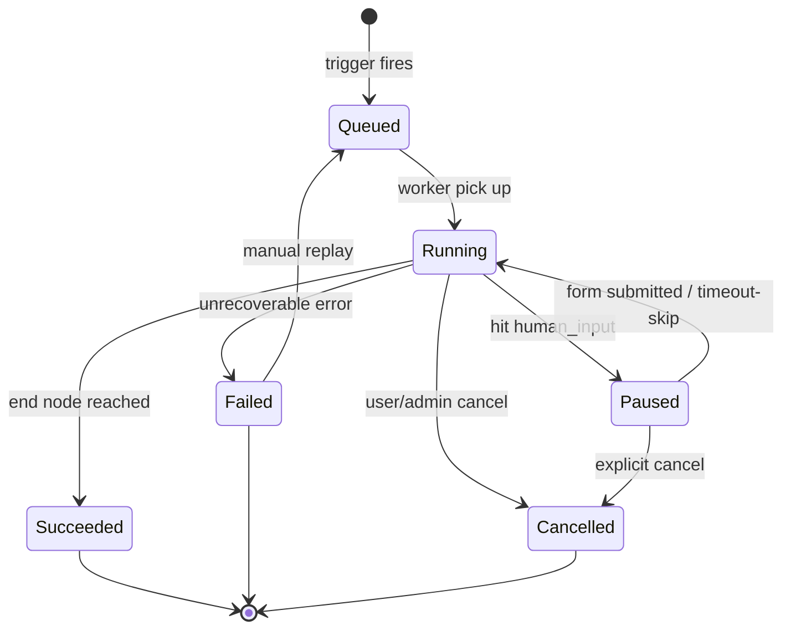
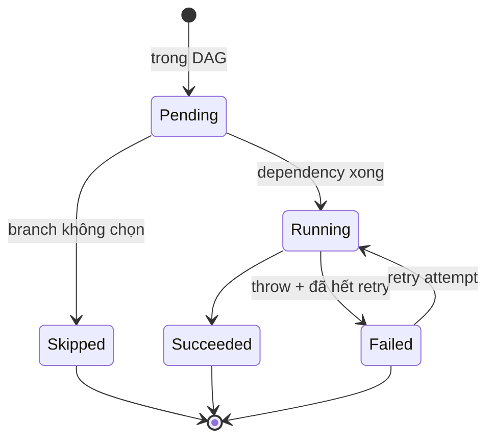
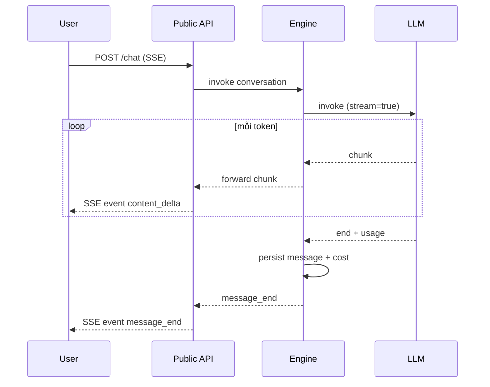

# Workflow Engine

🟡 Draft — v0.1

## Trang này nói về

**Workflow Engine** là **trái tim chạy** của CAP — chịu trách nhiệm: nhận 1 Workflow Run hoặc 1 Conversation, đi qua từng node theo định nghĩa, gọi LLM/Tool/Knowledge, quản state, retry khi hỏng, stream output, và đảm bảo mỗi bước được trace + tính cost.

Engine **chung cho cả Workflow và Agent**: agent là workflow đặc biệt 1-node-loop (LLM tự quyết bước tiếp). Tách 2 engine khác nhau = duplicate logic state + trace + cost.

**Phép hình dung**:

- Engine ≈ **máy chấp hành SOP** — đọc bản SOP (workflow definition), thực hiện từng bước, ghi nhật ký từng việc làm, biết dừng lại đợi người duyệt khi cần.
- **State machine** ≈ **bản ghi trạng thái thi đấu** — mỗi run đang ở trạng thái nào (queued/running/paused/failed), có thể tiếp tục từ đó.
- **Durable execution** (v2) ≈ **hộp đen máy bay** — engine crash giữa chừng, restart lên có thể **resume chính xác** từ node đang dở.

**Đọc trang này nếu bạn là**:

- **Dev backend** — sắp implement engine hoặc fix bug execution.
- **Kiến trúc sư** — đánh giá MVP in-process vs durable execution (Temporal).
- **Dev tích hợp** — cần hiểu semantic retry / idempotency / pause-resume để gọi API workflow đúng.

**Trang liên quan**: [Workflow](/02-domain/06-workflow) (domain — node types, lifecycle) · [Conversation & Run](/02-domain/07-conversation) (state ở góc domain) · [Service boundaries](/03-architecture/01-services) (Engine là service nào) · [Tool Runtime](/03-architecture/04-tool-runtime) (Engine gọi sang đây) · [Observability](/03-architecture/08-observability) (trace structure).

---

## 1. Yêu cầu chức năng

Engine phải làm được, đo lường được:

| Yêu cầu | Mức MVP | Mức production (v2+) |
| --- | --- | --- |
| Execute DAG node-by-node | ✅ | ✅ |
| Branch (if/else, switch) | ✅ | ✅ |
| Loop bounded (max iterations) | ✅ | ✅ |
| Parallel execution các nhánh độc lập | ⚠️ Hạn chế (2-3 nhánh) | ✅ Full (fan-out N) |
| Sub-workflow gọi nhau | ✅ | ✅ |
| Stream partial output (LLM, agent) | ✅ SSE | ✅ |
| Pause/Resume (human_input) | ✅ Per-run state Postgres | ✅ Durable checkpoint |
| Cancel run đang chạy | ✅ Soft (set flag) | ✅ Hard (kill task) |
| Retry per node (backoff, max attempts) | ✅ | ✅ |
| Timeout per node & per run | ✅ | ✅ |
| Idempotency (cùng `idempotency_key` → cùng kết quả) | ⚠️ Run-level | ✅ Node-level |
| Restart engine giữa chừng → run vẫn xong | ❌ Mất run đang chạy | ✅ Resume từ checkpoint cuối |
| Observability đầy đủ (trace, metric, log per node) | ✅ | ✅ |

---

## 2. Approach options — vì sao chọn in-process MVP

| Option | Pros | Cons | Phù hợp |
| --- | --- | --- | --- |
| **Custom in-process** (MVP của CAP) | Đơn giản, fast iteration, debug dễ, dùng Postgres làm state store | Engine crash = lost run đang chạy; scale concurrent run giới hạn theo process | < 100 concurrent run, không yêu cầu durable |
| **Temporal / Cadence** | Durable execution; replay-based recovery; production-grade | Học cost cao (lập trình theo workflow constraint); ops phức tạp; thêm cluster | Enterprise, compliance, > 1000 concurrent run |
| **Prefect 2.x** | Python-native, OSS, có UI | Heavyweight cho use case CAP; observability không khớp CAP stack | Data pipeline batch, không phải agent loop |
| **Inngest** | Cloud-native, durable, dev experience tốt | SaaS lock-in; chi phí scale | Startup nhỏ muốn không lo ops |
| **Restate** | Durable + đơn giản hơn Temporal | Mới, ecosystem chưa giàu | Tham khảo cho v3+ |

→ **MVP**: Custom in-process + persist state vào Postgres ở mỗi "checkpoint quan trọng" (xem §5). Đặt sẵn **interface `WorkflowExecutor`** để swap Temporal sau v2 mà không phải rewrite domain.

---

## 3. State machine

### 3.1 Workflow Run states



Transition rules:

| From → To | Trigger | Side-effect |
| --- | --- | --- |
| `Queued → Running` | Worker XADD claim job | Set `started_at`, trace span open |
| `Running → Paused` | Node `human_input` reached | Persist toàn bộ variable scope, gửi notification, span pending |
| `Paused → Running` | User submit form / `resume_at` timeout | Restore scope, span continue |
| `Running → Succeeded` | Hit `end` node | Set `ended_at`, total cost, close trace |
| `Running → Failed` | Node throw unrecoverable | Set `error`, dead-letter nếu cần retry workflow-level |
| `* → Cancelled` | API `POST /workflow_runs/<id>/cancel` | Set cancellation flag; running task check + abort |

### 3.2 Node Execution states

Mỗi node trong 1 run có lifecycle riêng — phụ thuộc đường đi (skip do branch, retry do fail):



---

## 4. Execution model

### 4.1 Tree-walk vs Queue-based

| Model | MVP CAP chọn | Khi nào dùng |
| --- | --- | --- |
| **Tree-walk** (recursion) | ❌ | Đơn giản nhưng không pause/resume; stack overflow với loop sâu |
| **Queue-based** (work-stealing) | ✅ | Mỗi node ready → push vào internal queue; worker thread pick. Pause/resume = pause/resume queue |
| **Distributed** (gửi qua MQ giữa các process) | v3+ | Khi cần > 1 process cùng chạy 1 run (rare) |

### 4.2 Pseudo-code MVP

```python
async def run_workflow(run: WorkflowRun):
    scope = VariableScope.load_or_init(run)
    ready_queue: asyncio.Queue[Node] = asyncio.Queue()
    ready_queue.put_nowait(graph.start_node)

    while not ready_queue.empty():
        if run.cancellation_requested:
            await transition(run, "Cancelled")
            return

        node = await ready_queue.get()
        exec_record = await persist_pending(run, node)

        try:
            output = await execute_node(node, scope, run)   # gọi LLM/Tool/Code
            scope.merge(node.output_mapping, output)
            await persist_succeeded(exec_record, output)
        except RetriableError as e:
            if exec_record.attempts < node.max_retries:
                await schedule_retry(node, backoff(exec_record.attempts))
                continue
            await persist_failed(exec_record, e)
            await handle_failure(node, run, e)             # fallback / dead-letter
        except PauseSignal as p:                            # human_input
            await persist_paused(run, scope, p.resume_info)
            return                                          # exit loop, resume later

        for nxt in graph.next_after(node, scope):           # branch resolves here
            if nxt.dependencies_met(scope):
                ready_queue.put_nowait(nxt)

    await transition(run, "Succeeded")
```

### 4.3 Concurrency model

- **Per-run**: trong 1 run, các nhánh **song song** nếu DAG cho phép (Engine dùng `asyncio.gather` cho fan-out independent).
- **Per-process**: 1 process chạy nhiều run đồng thời (semaphore cap số run concurrent để tránh thrash).
- **Per-node**: 1 node thường serial trong run; node `loop` cho phép parallel iteration với `concurrency=N`.

---

## 5. Persistence & checkpoint

### 5.1 Khi nào ghi state xuống Postgres

Không ghi sau **mỗi** statement — chậm. Cũng không chỉ ghi ở cuối — mất khi crash. CAP chọn ghi ở các "**checkpoint**":

| Sự kiện | Ghi gì |
| --- | --- |
| Run start | `workflow_run` row `status=Running, started_at=...` |
| Node start | `node_execution` row `status=Running` |
| Node succeeded | Update `status=Succeeded`, persist output snapshot, merge vào `workflow_state.scope` |
| Node failed (final) | Update `status=Failed`, error detail |
| **Pause** (human_input) | Full `scope` JSON + `pending_node_id` + `resume_token` vào `workflow_state` |
| LLM stream chunk | **Không** ghi mỗi chunk — giữ trong memory, flush mỗi 5 chunk hoặc khi end |
| Run end | `ended_at`, `total_cost_usd`, `status` final |

### 5.2 Crash recovery (MVP — best-effort)

| Tình huống | Hành vi MVP | Hành vi v2 (durable) |
| --- | --- | --- |
| Engine crash khi node đang chạy | Run mark `Failed` sau timeout, builder phải replay | Engine khôi phục, retry node từ đầu (idempotent) |
| Engine crash khi run đang `Paused` | OK — paused state đã persist | OK |
| Engine restart graceful | Drain hiện tại trước khi exit | Drain + replay outstanding nodes |

→ MVP accept "crash = lost run đang chạy" — mitigate bằng: deploy ít restart hơn (HPA conservative), và **idempotency_key** ở mức Run để client retry an toàn.

---

## 6. Retry, backoff, idempotency

### 6.1 Retry chính sách

Cấu hình per-node, default per-tool/node-type:

| Tham số | Default | Tuỳ chỉnh |
| --- | --- | --- |
| Max attempts | 3 | Per node |
| Backoff | Exponential 1s → 2s → 4s (jitter ±20%) | Per node |
| Retryable errors | Timeout, 5xx, transient network | Allowlist per node |
| Non-retryable | 4xx (trừ 429), validation error | Fail immediately |

### 6.2 Idempotency

| Cấp | Cơ chế |
| --- | --- |
| **Run-level** | API caller gửi `Idempotency-Key` header → engine check Redis `idem:<key>` 24h → trả về run_id cũ nếu trùng |
| **Node-level** | (v2) Mỗi node execution có `node_idempotency_key = run_id + node_id + attempt`; tool/LLM call gắn key này để dedup nếu retry |
| **External effect** | Tool có side-effect (gửi email, tạo PO) phải tự dedup theo key engine truyền vào |

### 6.3 Fallback & dead-letter

Khi retry hết:

- **Fallback node** chỉ định trong workflow → chuyển sang node B
- **Default value** → tiếp tục với giá trị mặc định
- **Abort** → mark run `Failed`, push vào **dead-letter** để builder review & manual replay

---

## 7. Streaming partial output

LLM/Agent node cần stream từng token về end-user, không đợi node xong:



**Quy ước event**:

| Event | Khi nào | Payload |
| --- | --- | --- |
| `message_start` | Bắt đầu turn assistant | `message_id`, `role` |
| `content_delta` | Mỗi token / chunk | `delta: <text>` |
| `tool_use_start` | LLM yêu cầu gọi tool | `tool_name`, `args` (partial) |
| `tool_use_end` | Tool xong, trả về | `result` |
| `node_started` / `node_ended` | Workflow node lifecycle (cho UI builder) | `node_id`, `status` |
| `message_end` | Turn xong | `total_tokens`, `cost_usd`, `citations` |
| `run_end` | Workflow run xong | `status`, `total_cost`, `output` |
| `error` | Bất cứ lỗi | `code`, `message` |

---

## 8. Pause & resume — `human_input`

### 8.1 Pause semantic

Khi engine gặp node `human_input`:

1. Engine **persist toàn bộ variable scope** + `pending_node_id` + `resume_token` vào `workflow_state`
2. Tạo notification (Slack/email/web form) chứa link kèm `resume_token`
3. Engine **exit run loop** — không giữ memory state
4. Run `status=Paused`, `paused_at=...`

### 8.2 Resume

| Trigger resume | Cơ chế |
| --- | --- |
| User submit form | API `POST /runs/<id>/resume` với `resume_token` + form data → engine load scope + tiếp tục từ node sau human_input |
| Timeout (vd 7 ngày không reply) | Scheduler push `resume_with_default` event → engine resume với giá trị mặc định node config |
| Cancel | API `POST /runs/<id>/cancel` → status `Cancelled` |

### 8.3 Implementation note

```python
class PauseSignal(Exception):
    def __init__(self, node, resume_info: dict):
        self.node = node
        self.resume_info = resume_info  # {form_schema, recipients, timeout_at, default_value}

# Trong execute_node cho human_input:
async def execute_human_input(node, scope, run):
    notification_id = await notify(node.recipients, node.form_schema, ...)
    raise PauseSignal(node, {
        "notification_id": notification_id,
        "form_schema": node.form_schema,
        "timeout_at": now() + node.timeout,
        "default_value": node.default_on_timeout,
    })
```

---

## 9. Sub-workflow

Node `sub_workflow` gọi 1 workflow khác như function:

- **Input**: scope mapping → input_schema của workflow con
- **Output**: output của workflow con → scope của workflow cha
- **Trace**: span của sub-workflow run lồng dưới span của parent node
- **Cost**: cộng vào cost của parent run
- **Cancel**: cancel parent run → cancel sub-workflow run
- **Pause**: sub-workflow paused → parent run cũng `Paused` (proxy)
- **Limit**: max depth 5 (tránh recursive đệ quy vô tận)

---

## 10. Cancellation

| Cấp | Cơ chế |
| --- | --- |
| **Soft (MVP)** | Set `cancellation_requested=true` ở `workflow_run`; engine check ở mỗi node boundary; in-flight node vẫn chạy nốt |
| **Hard (v2)** | Engine giữ map `run_id → asyncio.Task` → task.cancel() khi nhận signal; tool runtime nhận signal qua subprocess kill |

**Note**: cancel **không rollback side-effect** (email đã gửi vẫn gửi, PO đã tạo vẫn tồn tại). Nếu cần rollback → workflow phải có node compensation explicit (saga pattern).

---

## 11. Cost & metering

Mỗi node execution có cost:

| Loại cost | Tính bằng |
| --- | --- |
| LLM | `input_tokens × input_price + output_tokens × output_price` (theo provider+model) |
| Embedding | `tokens × embed_price` |
| Tool (external API) | Nếu provider tính tiền: tự ghi từ response (vd Tavily search) |
| Compute | (v2) Per-second engine time × rate plan |

→ Sum lên workflow_run, conversation, agent, workspace, tenant — chi tiết [Observability §3](/03-architecture/08-observability).

---

## 12. Interface để swap engine

Đặt sẵn cho v2 Temporal/durable migration:

```python
class WorkflowExecutor(Protocol):
    async def submit_run(self, workflow_version_id: str, inputs: dict,
                        idempotency_key: str | None) -> RunHandle: ...
    async def cancel_run(self, run_id: str) -> None: ...
    async def resume_run(self, run_id: str, resume_token: str, data: dict) -> None: ...
    async def get_run_state(self, run_id: str) -> RunState: ...
    async def stream_events(self, run_id: str) -> AsyncIterator[Event]: ...

# Implementations
class InProcessExecutor(WorkflowExecutor): ...   # MVP
class TemporalExecutor(WorkflowExecutor): ...    # v2
```

Domain layer chỉ depend on Protocol — swap implementation không phải đổi code service.

---

## 13. Câu hỏi còn mở

| # | Câu hỏi | Cân nhắc | Phiên bản |
| --- | --- | --- | --- |
| Q1 | Khi nào chuyển sang Temporal? | Khi compliance enterprise yêu cầu hoặc concurrent run > 500 | v2-v3 |
| Q2 | Saga compensation cho rollback side-effect | Cần API cho builder define compensate node | v3 |
| Q3 | Cross-run state (resume khi user quay lại ngày khác) | Workflow cần `state_save` / `state_load` node | v2 |
| Q4 | Workflow versioning + migration cho run đang dở | Run đang chạy theo `v3`, builder publish `v4` — chạy nốt theo `v3` (immutable) | MVP — đã thống nhất |
| Q5 | Distributed execution (1 run trên nhiều process)? | Rare; chỉ khi 1 run có > 1000 node parallel | v4 |
| Q6 | Backpressure khi LLM provider rate-limit | Engine queue node `llm` theo provider limit | v2 |
| Q7 | Time-travel debug (replay run với input cũ) | Cần khi Temporal vào — replay-friendly | v3 |

---

## Liên kết

- [Workflow](/02-domain/06-workflow) — domain: node types, lifecycle, examples
- [Conversation & Run](/02-domain/07-conversation) — state machine ở góc domain
- [Service boundaries](/03-architecture/01-services) — Engine deploy ở đâu
- [Tool Runtime](/03-architecture/04-tool-runtime) — node `tool` gọi sang
- [Data stores](/03-architecture/02-data-stores) — state persistence, outbox pattern
- [Observability](/03-architecture/08-observability) — trace structure cho workflow run
