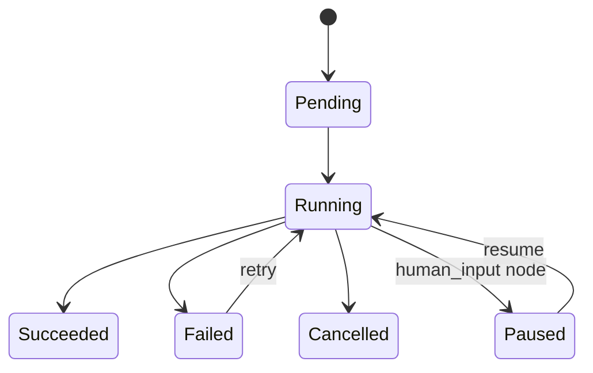

# Workflow Engine

🔴 Placeholder

## Yêu cầu

- Execute DAG node-by-node
- Hỗ trợ branch + loop bounded
- State per run (cho resume)
- Stream partial output (cho LLM node)
- Parallel execution các nhánh độc lập
- Cancellation
- Retry policy per node

## Approach options

| Option | Pros | Cons |
| --- | --- | --- |
| **Custom in-process** | Đơn giản, fast iteration | Crash = lost run |
| **Temporal / Cadence** | Durable, production-grade | Học cost cao, ops phức tạp |
| **Prefect** | Python-native, OSS | Hơi heavyweight |
| **Inngest** | Cloud-native, durable | SaaS lock-in |

→ MVP: Custom in-process + persist state per node vào Postgres khi quan trọng. Đặt sẵn interface để swap Temporal sau.

## State model

