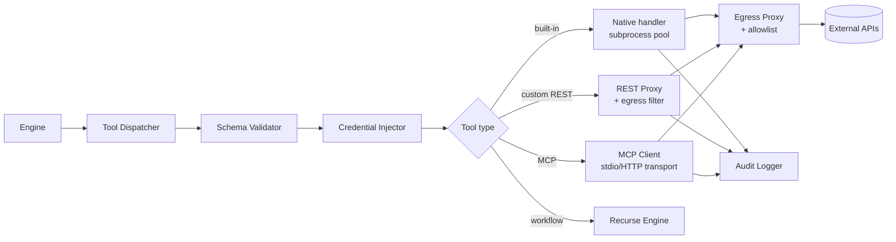
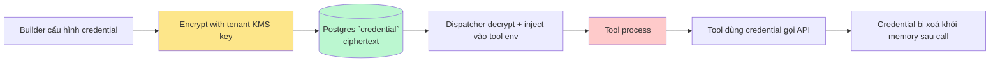

# Tool Runtime

🟡 Draft — v0.1

## Trang này nói về

**Tool Runtime** là **môi trường cách ly** nơi mọi Tool call thực thi — tách khỏi engine để **bug/crash trong tool không sập engine**, **code khách upload không truy cập được DB CAP**, và **tài nguyên (CPU/mem/network) bị giới hạn cứng**.

Tool Runtime là **bề mặt tấn công lớn nhất** của CAP: tool có thể là code Python do builder viết, REST call đến API ngoài, hoặc MCP server bên thứ ba. Đảm bảo isolation + observability ở đây quan trọng ngang với auth.

**Phép hình dung**:

- Tool Runtime ≈ **"phòng cách ly áp suất âm"** trong bệnh viện — bệnh nhân (tool call) vào, làm xong việc, ra; mầm bệnh không thoát.
- **Sandbox** ≈ **buồng kính chống đạn** — bên ngoài thấy được, bên trong không phá được.
- **Resource limit** ≈ **đồng hồ thời gian** + **van khoá oxy** — quá giờ hoặc quá khẩu phần → ngắt.
- **Credential injection** ≈ **găng tay vô trùng** — credential được đưa vào tool đúng lúc cần, không in ra log.

**Đọc trang này nếu bạn là**:

- **Dev backend** — sắp implement Tool Runtime, chọn cơ chế sandbox, viết handler.
- **DevOps / Security** — đánh giá rủi ro, allowlist network, audit egress.
- **Builder advanced** — viết custom REST/MCP tool, cần hiểu giới hạn sandbox.

**Trang liên quan**: [Tool](/02-domain/04-tool) (domain — 4 loại tool, schema) · [Service boundaries](/03-architecture/01-services) (Tool Runtime là service riêng) · [Workflow Engine](/03-architecture/03-workflow-engine) (engine gọi sang) · [Auth Flow](/03-architecture/07-auth-flow) (credential lifecycle).

---

## 1. Yêu cầu

| Yêu cầu | Vì sao | Cách đo lường |
| --- | --- | --- |
| **Isolation cứng** | Tool không truy cập DB CAP, file system app, biến môi trường nhạy cảm | Penetration test định kỳ |
| **Resource limit** | 1 tool runaway không ăn hết RAM/CPU của host | cgroup metrics, OOM kill log |
| **Timeout** | Tool slow không block engine vô hạn | p95/p99 tool latency |
| **Credential an toàn** | Secret không in log, không leak qua error message | grep audit log không thấy `sk-...` |
| **Network egress control** | Tool không exfiltrate data sang IP lạ | Egress proxy access log |
| **Audit per call** | Mỗi tool call có record: ai gọi, tool gì, args (redacted), result, cost | Audit log query |
| **Schema validation** | Input/output JSON khớp schema; sai → fail sớm, không truyền garbage | Tỉ lệ tool fail schema |
| **Multi-language** | MVP Python; v2 thêm JS/Node | Số language hỗ trợ |

---

## 2. Sandbox options — vì sao chọn subprocess MVP

| Option | Isolation | Startup | Cost | Khi nào chọn |
| --- | --- | --- | --- | --- |
| **Subprocess + rlimit + chroot/PID ns** | ⚠️ Medium (process-level) | < 50ms | Thấp | **MVP**: built-in tool đơn giản, không chạy code khách |
| **Firejail / Bubblewrap** | ⚠️ Medium-High | < 100ms | Thấp | MVP alt: Linux native, lightweight |
| **Docker container per call** | ✅ Strong | ~1-2s cold, ~100ms warm | Trung-cao | Production: tool chạy code khách, MCP bên thứ ba |
| **gVisor (runsc)** | ✅ Strong + syscall filter | ~200-500ms | Trung | High security, code untrusted |
| **WASM (Wasmtime/Wasmer)** | ✅ Strong + ngôn ngữ-agnostic | < 50ms | Thấp | Tương lai (v3+) — chưa mature đủ cho FS/network |
| **gVisor + Container pool** | ✅ Strong | < 100ms warm | Trung | Sweet spot production |

→ **MVP**: **subprocess pool** với rlimit + Linux namespaces (PID, mount, network) cho built-in tool. **Custom REST tool** thì proxy thuần (không chạy code), chỉ enforce egress + credential injection. **Code interpreter** (Python sandbox) dùng container ngay từ MVP vì rủi ro chạy code khách quá cao.

→ **v2**: chuyển toàn bộ sang **container pool warm-restart** (giữ N container idle, mỗi call clone fork — startup < 100ms).

---

## 3. Architecture



### 3.1 Tool Dispatcher

Single entry point từ engine. Trách nhiệm:

1. Resolve `tool_id` → `ToolVersion` cụ thể (theo agent pin)
2. Validate input schema
3. Resolve credential cho `(tenant_id, workspace_id, tool_id)`
4. Route đến handler theo `tool.type`
5. Apply timeout + retry policy
6. Collect result + cost + trace
7. Audit log

```python
async def dispatch(call: ToolCall) -> ToolResult:
    tool_version = await registry.resolve(call.tool_id, call.version_pin)
    inputs = schema_validator.validate_in(tool_version.input_schema, call.inputs)
    cred = await credential_store.inject(tool_version, call.tenant_id, call.workspace_id)

    async with trace_span("tool.execute", tool=tool_version.name):
        async with timeout(tool_version.timeout_s):
            handler = HANDLERS[tool_version.type]
            raw = await handler(tool_version, inputs, cred)

    outputs = schema_validator.validate_out(tool_version.output_schema, raw)
    await audit_logger.write(call, outputs, cost=...)
    return ToolResult(outputs=outputs, ...)
```

### 3.2 4 handler theo tool type

| Type | Handler | Sandbox |
| --- | --- | --- |
| `builtin` | Native Python function (registered) | Subprocess pool với rlimit |
| `rest` | HTTP client với pre-validated OpenAPI spec | Không chạy code — chỉ proxy + egress filter |
| `mcp` | MCP protocol client (stdio cho local server, HTTP cho remote) | Subprocess (stdio) hoặc network only (HTTP) |
| `workflow` | Recurse Engine — gọi sub-workflow | Engine in-process (không cần sandbox) |

---

## 4. Resource limits

### 4.1 Subprocess (MVP)

Linux `setrlimit` + namespace:

| Resource | Default | Configurable |
| --- | --- | --- |
| CPU time | 30s | Per-tool |
| Memory (RLIMIT_AS) | 512 MB | Per-tool (max 2 GB) |
| File descriptors | 64 | Tight |
| Process count (RLIMIT_NPROC) | 16 | |
| File size (RLIMIT_FSIZE) | 100 MB | |
| Stack | 8 MB | |

Network namespace: tool **không có** network interface trực tiếp — phải đi qua egress proxy (xem §5).

Mount namespace: chroot vào temp dir; **read-only** tới `/usr` và source code; **read-write** chỉ `/tmp/tool_<id>`.

### 4.2 Container (production)

| Resource | Default |
| --- | --- |
| CPU | 1 vCPU (`--cpus=1`) |
| Memory | 512 MB (`--memory=512m`) |
| Pids | 64 (`--pids-limit=64`) |
| Network | Bridge with egress proxy + no inbound |
| Capabilities | Drop all (`--cap-drop=ALL`) |
| Read-only root | `--read-only` + tmpfs `/tmp` |
| User | Non-root (`--user 1000:1000`) |

### 4.3 Kill protocol

Khi vượt timeout/resource:

1. Send `SIGTERM` → 2 giây cho graceful cleanup
2. Send `SIGKILL` nếu chưa exit
3. Container: `docker kill --signal=SIGTERM` → `docker kill`
4. Log: `tool.killed reason=timeout|oom|rlimit`
5. Return error code `TOOL_TIMEOUT` / `TOOL_OOM` cho engine

Engine handle theo retry policy (xem [Workflow Engine §6](/03-architecture/03-workflow-engine)).

---

## 5. Network egress control

Tool có thể cần gọi internet — nhưng phải qua **egress proxy** (Squid hoặc tự viết) để:

- **Allowlist domain**: chỉ cho phép gọi domain khai báo trong tool spec
- **Audit log**: ghi mọi request URL + status + bytes
- **TLS termination + re-encrypt** (optional): kiểm body để phát hiện exfiltration data nhạy cảm
- **Rate limit**: per-tool, per-tenant

### 5.1 Allowlist format

Trong tool spec:

```yaml
egress:
  allowlist:
    - "api.openai.com"
    - "*.googleapis.com"
    - "10.0.0.0/8"          # internal CIDR
  deny_default: true
  max_request_body_kb: 10240
  max_response_body_kb: 10240
```

→ Builder declare egress → review trước khi publish tool — security có cơ sở approve.

### 5.2 SSRF protection

Vì REST tool nhận URL từ LLM (có thể bị inject từ user input), proxy phải block:

- Loopback: `127.0.0.0/8`, `::1`
- Link-local: `169.254.0.0/16`
- Private: `10/8, 172.16/12, 192.168/16` (trừ khi explicit allowlist)
- Metadata endpoint: `169.254.169.254` (AWS), `metadata.google.internal`

---

## 6. Credential injection

### 6.1 Lifecycle



### 6.2 Injection mechanism

| Tool type | Cách inject |
| --- | --- |
| `builtin` | Pass qua function arg (in-process Python) |
| `rest` (subprocess) | Env var `TOOL_CRED_<NAME>=...` chỉ ở subprocess scope, không in `/proc/<pid>/environ` của parent |
| `rest` (container) | Mount `/run/secrets/cred` tmpfs, tool đọc file → xoá file |
| `mcp` | Pass qua MCP `initialize` message với env hoặc auth handshake |

**Quy tắc**:

- **Không bao giờ** log nguyên giá trị credential — chỉ log prefix 4 ký tự + length
- **Không bao giờ** truyền credential qua command-line argv (visible qua `ps`)
- **Rotate**: credential mới + cũ song song trong grace period 7 ngày
- **Revoke**: invalidate trong cache + đánh dấu `revoked_at` ngay; tool call mới fail `401`
- **Scope tightest**: credential per-workspace, không per-tenant trừ khi explicit (vd Tenant-wide LLM key)

---

## 7. Schema validation

Tool có `input_schema` + `output_schema` JSON Schema.

### 7.1 Trước khi gọi

```python
try:
    inputs = jsonschema.validate(call.inputs, tool.input_schema)
except ValidationError as e:
    raise ToolInputError(detail=e.message)   # không gọi tool, fail sớm
```

### 7.2 Sau khi gọi

```python
try:
    outputs = jsonschema.validate(raw_result, tool.output_schema)
except ValidationError as e:
    # Tool trả sai schema = bug tool, không phải fail business
    log.error("tool returned invalid output", tool=tool.name, error=e)
    raise ToolOutputError(detail=e.message)
```

### 7.3 OpenAPI auto-generate (Custom REST)

Builder upload OpenAPI 3.0 spec → CAP tự sinh:

- `input_schema` từ `parameters` + `requestBody`
- `output_schema` từ `responses.<code>.content`
- Auth config từ `securitySchemes`
- Validation runtime dùng schema này

---

## 8. Per tool-type detail

### 8.1 Built-in tool list (MVP)

| Tool | Mục đích | Sandbox |
| --- | --- | --- |
| `calculator` | Số học, đơn vị | In-process |
| `datetime` | Parse/format date, timezone | In-process |
| `web_search` | Tavily/Brave/SerpAPI | Egress proxy |
| `code_interpreter` | Python sandbox cho data analysis | **Container** (rủi ro cao) |
| `http_request` | GET/POST URL bất kỳ với allowlist | Egress proxy |
| `knowledge_search` | Search KB (gọi internal API) | In-process — đặc biệt, không qua egress |
| `email.send` | Gửi qua SMTP workspace | Egress proxy + rate limit |
| `file.read` | Đọc file từ Object Storage (theo tenant) | Internal — auth bằng signed URL |

### 8.2 Custom REST

Tham số trong tool spec:

```yaml
type: rest
openapi_url: https://internal-crm.cmc.local/openapi.json
auth:
  type: bearer
  credential_id: cred_crm_workspace_hr
egress:
  allowlist: ["internal-crm.cmc.local"]
timeout_s: 20
retry: { max_attempts: 3, backoff: exponential }
```

### 8.3 MCP

```yaml
type: mcp
transport: stdio   # hoặc http
command: "node /opt/mcp-servers/slack/index.js"   # cho stdio
url: "https://mcp.example.com/sse"                 # cho http
auth:
  type: oauth
  credential_id: cred_slack_workspace_hr
```

Tool list được CAP **discover** qua MCP `tools/list` lúc tool được install — không cần khai báo từng tool.

### 8.4 Workflow-as-Tool

Wrap 1 published workflow thành tool. Input/output schema = input/output của workflow. Khi gọi → engine chạy sub-workflow run (xem [Workflow Engine §9](/03-architecture/03-workflow-engine)).

---

## 9. Failure modes

| Loại lỗi | Handler | Retry? | Cho LLM thấy gì |
| --- | --- | --- | --- |
| Timeout | Engine | ✅ | `TOOL_TIMEOUT — tool đã chạy quá X giây` |
| OOM | Engine | ✅ (1 lần) | `TOOL_OOM — tool quá bộ nhớ` |
| Network 5xx | Engine retry với backoff | ✅ | (retry transparent; sau N fail → cho LLM thấy) |
| Network 4xx | Engine | ❌ (trừ 429) | `TOOL_HTTP_4XX — request không hợp lệ: <body>` |
| Auth 401/403 | Engine | ❌ + alert builder | `TOOL_AUTH_FAILED — credential có thể hết hạn` |
| Schema invalid input | Dispatcher | ❌ | `TOOL_INPUT_INVALID — <detail>` |
| Schema invalid output | Dispatcher | ❌ + alert | `TOOL_OUTPUT_INVALID — tool có thể đang lỗi` |
| Rate limit (CAP-side) | Dispatcher | Auto wait + retry | (transparent) |
| Egress denied | Egress Proxy | ❌ + alert security | `TOOL_EGRESS_DENIED — domain X không trong allowlist` |
| Tool crash / SIGKILL | Engine | ✅ | `TOOL_CRASHED` |

---

## 10. Audit log

Mỗi tool call ghi:

```json
{
  "ts": "2026-05-15T03:14:15Z",
  "tool_call_id": "tc_...",
  "tool_id": "tool_...",
  "tool_version": "v1.2.0",
  "tenant_id": "...",
  "workspace_id": "...",
  "principal": {
    "type": "agent",
    "agent_id": "...",
    "conversation_id": "...",
    "message_id": "..."
  },
  "args_redacted": { "...": "[REDACTED:PII]" },
  "result_summary": { "status": "ok", "size_bytes": 1234 },
  "latency_ms": 327,
  "cost_usd": 0.0012,
  "credential_prefix": "sk-xx",
  "egress_destinations": ["api.openai.com"],
  "outcome": "succeeded"
}
```

### 10.1 Redaction

Args/result chứa PII (CCCD, email, SĐT) bị redact theo regex + ML detector (v2). Redaction policy configure per-workspace.

### 10.2 Retention

- Hot: 30 ngày (truy vấn nhanh)
- Cold: 7 năm (S3 archive, compliance)

---

## 11. Performance

### 11.1 Hot path (cùng instance)

- Built-in tool in-process: < 5ms overhead Dispatcher
- Subprocess tool MVP: ~30-50ms startup (warm pool)
- Container tool warm: ~80-150ms
- Container tool cold: 1-2s (chỉ lần đầu)
- REST proxy: < 10ms overhead + network

### 11.2 Throughput

Per Tool Runtime process:

- Subprocess pool size: 20-50 (theo CPU)
- Container concurrent: 10-20 (theo memory)
- Built-in: 1000+ QPS (chỉ giới hạn bởi external API)

### 11.3 Bottleneck

Hầu như luôn là **external API** (LLM provider rate-limit, KB API slow). Tool Runtime hiếm khi là bottleneck.

---

## 12. Câu hỏi còn mở

| # | Câu hỏi | Cân nhắc | Phiên bản |
| --- | --- | --- | --- |
| Q1 | Chuyển sang gVisor / Kata Containers khi nào | Khi có tool chạy code khách rộng rãi (v3 marketplace) | v3 |
| Q2 | WASM cho built-in tool ngắn? | Startup gần 0, isolation tốt; nhưng FS/network API chưa đủ | v3+ |
| Q3 | Tool marketplace v3 — moderation pipeline | Static analysis + sandbox run + review thủ công | v3 |
| Q4 | Streaming tool output (vd web_search trả từng kết quả)? | Phức tạp nhưng cải UX | v2 |
| Q5 | Long-running tool (training job, OCR batch lớn)? | Cần tách "fire-and-forget tool" với callback | v2 |
| Q6 | Tool có thể trả "ask clarification" để hỏi LLM lại? | Mở pattern multi-turn tool — research | v3 |
| Q7 | mTLS giữa Engine ↔ Tool Runtime cần khi nào? | Khi tách process qua network | v2 |

---

## Liên kết

- [Tool](/02-domain/04-tool) — domain: 4 loại tool, schema, credential
- [Service boundaries](/03-architecture/01-services) — Tool Runtime là service riêng
- [Workflow Engine](/03-architecture/03-workflow-engine) — engine gọi sang Tool Runtime ở đâu
- [Auth Flow](/03-architecture/07-auth-flow) — API Key & credential lifecycle
- [Multi-tenant Isolation](/03-architecture/06-multi-tenant) — secret isolation per-tenant
- [Observability](/03-architecture/08-observability) — trace span cho tool call
