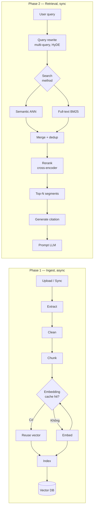
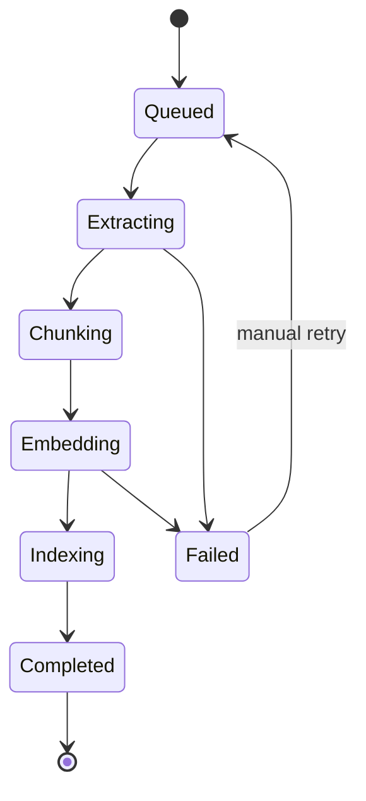

# RAG Pipeline

🟡 Draft — v0.1

## Trang này nói về

**RAG (Retrieval-Augmented Generation)** là mô hình **agent dùng tài liệu nội bộ để trả lời** — không phụ thuộc thuần kiến thức LLM. Trang này định nghĩa **cách CAP cài đặt** mô hình đó: từ lúc tài liệu được upload cho đến lúc câu trả lời có trích dẫn được render về end-user.

Pipeline có **2 phase tách rời** với độ ưu tiên ngược nhau:

- **Phase 1 — Ingest** (async): chuẩn bị tài liệu. Có thể chậm vài phút mỗi document, không sao.
- **Phase 2 — Retrieval** (sync): trả lời end-user. **Bắt buộc** < 200ms p95, không thì agent cảm giác lờ đờ.

**Phép hình dung**:

- Phase 1 ≈ **thủ thư biên mục sách** vào kho — tỉ mỉ, có thể mất giờ; sách sai biên mục → tra mãi không ra.
- Phase 2 ≈ **thủ thư trả lời khách** — phải nhanh, đúng, kèm địa chỉ ngăn sách để khách tự kiểm tra.

**Đọc trang này nếu bạn là**:

- **Dev backend** — sắp implement ingest worker, embedding service, hoặc retrieval handler.
- **Builder advanced** — tune chunking/embedding/rerank để cải chất lượng câu trả lời.
- **BA / content editor** — hiểu vì sao chất lượng câu trả lời phụ thuộc cách chuẩn bị tài liệu.

**Trang liên quan**: [Knowledge Base](/02-domain/05-knowledge) (domain) · [Data stores §3](/03-architecture/02-data-stores) (Vector DB) · [Workflow Engine](/03-architecture/03-workflow-engine) (engine gọi retrieval) · [Multi-tenant Isolation](/03-architecture/06-multi-tenant) (collection-per-KB).

---

## 1. Pipeline tổng quan



---

## 2. 5 nguyên tắc thiết kế

| # | Nguyên tắc | Hệ quả |
| --- | --- | --- |
| 1 | **Citation mặc định** | Mọi đoạn vào prompt LLM phải có `source_ref` để render link gốc; nếu không cite được → coi như "không biết" còn hơn bịa |
| 2 | **Ingest reproducible** | Cùng tài liệu + cùng config → cùng segment + vector; re-index một KB phải predictable |
| 3 | **Embedding cache theo hash** | Hash text segment → key; cùng text trong nhiều KB chỉ embed 1 lần, tiết kiệm tiền |
| 4 | **Isolation cứng cross-tenant** | Vector store tách collection-per-(tenant, workspace, kb); search filter ở payload kép check |
| 5 | **Async ingest, sync retrieval** | Builder upload xong trả `accepted` ngay; retrieval phải < 200ms p95 |

---

## 3. Phase 1 — Ingest

### 3.1 Trigger

| Cách | Khi nào fire | Worker |
| --- | --- | --- |
| **Manual upload** | Builder upload file qua Console | Push job `ingest:<doc_id>` vào MQ |
| **URL crawl** | Builder thêm URL hoặc cron re-crawl | Scheduler push `crawl:<url>` |
| **Source sync (v2)** | GDrive/SharePoint/Notion sync theo schedule | Scheduler push `sync:<source_id>` |
| **Webhook ingest** | External system POST tài liệu mới | API receive → push MQ |

### 3.2 Extract — bóc text từ format gốc

| Format | Library MVP | Note |
| --- | --- | --- |
| PDF | `unstructured.io` hoặc `pypdf` | Layout-aware cho table; OCR fallback nếu scan |
| DOCX/DOC | `python-docx`, `mammoth` | Giữ heading hierarchy |
| TXT / MD | Native read | UTF-8 detect encoding |
| HTML | `readability-lxml` | Strip nav/footer/ad; giữ `<h1-h6>`, `<table>`, `<pre>` |
| URL crawl | `playwright` (JS-render) + readability | Respect robots.txt; rate-limit 1 req/s per domain |
| CSV/XLSX (v2) | `pandas` | Mỗi row 1 segment hoặc whole table; tùy config |
| Image OCR (v2) | Tesseract / Azure OCR | Per-page text + bbox cho citation chính xác |
| Audio (v3) | Whisper | Transcribe + timestamp |

Output: **text thô** + metadata: `page_number`, `heading_path`, `source_url`, `extracted_at`.

### 3.3 Clean — chuẩn hoá

- Strip ký tự control, normalize Unicode (NFKC)
- Loại đoạn quá ngắn (< 10 ký tự) — header/footer
- Loại trùng lặp (page header lặp trên mọi trang)
- Giữ định dạng quan trọng: heading marker (`# ## ###`), table marker (`|---|`), list (`-`)

### 3.4 Chunk — cắt thành segment

3 chiến lược, builder chọn per-KB:

| Strategy | Cách cắt | Phù hợp |
| --- | --- | --- |
| **Recursive character** (default MVP) | Cắt theo separators thứ tự: `\n\n` → `\n` → `". "` → `" "` cho đến khi mỗi chunk ≤ size | Tài liệu chung (PDF, DOCX, MD) |
| **Parent-child** (v2) | Cắt 2 lần: parent ~1500 token, child ~300 token; retrieve child nhưng return parent | Tài liệu cần context rộng (hợp đồng, regulation) |
| **Semantic** (v3) | Dùng LLM tách theo ý nghĩa thay vì size cố định | Tài liệu chuyên ngành; chi phí cao |

Default config:

| Tham số | Default | Range |
| --- | --- | --- |
| `chunk_size` | 500 token | 200-2000 |
| `chunk_overlap` | 50 token (10%) | 0-200 |
| `separators` | `["\n\n", "\n", ". ", " "]` | configurable |
| `keep_metadata` | heading path + page number | bắt buộc |

**Quy tắc**: chunk nhỏ → recall cao nhưng context ít; chunk lớn → ngược lại. Hybrid với parent-child là sweet spot.

### 3.5 Embed — biến đổi text → vector

**Embedding cache** key = `sha256(model + normalized_text)`:

```python
async def embed(text: str, model: str) -> list[float]:
    key = f"emb:{model}:{sha256(normalize(text)).hex()}"
    cached = await redis.get(key) or await pg.fetch_emb_cache(key)
    if cached:
        return cached.vector
    vec = await provider.embed(text, model=model)
    await asyncio.gather(
        redis.setex(key, 3600, vec),         # 1h hot
        pg.upsert_emb_cache(key, vec),       # persistent
    )
    return vec
```

Lợi ích: re-index KB không tốn embedding lần 2; same text trong nhiều KB chia sẻ.

**Provider mặc định**:

| Provider | Model | Dim | Use case |
| --- | --- | --- | --- |
| OpenAI | `text-embedding-3-small` | 1536 | General, low cost (MVP default) |
| OpenAI | `text-embedding-3-large` | 3072 | Cao chất lượng |
| Cohere | `embed-multilingual-v3` | 1024 | **Tiếng Việt** + đa ngôn ngữ |
| BGE | `bge-large-en-v1.5` | 1024 | Self-hosted, tiếng Anh |
| Voyage | `voyage-3` | 1024 | Cao chất lượng |

**Quy tắc**: 1 KB **pin 1 embedding model**. Đổi → re-index toàn bộ KB.

### 3.6 Index — đẩy vào Vector DB

| Backend | Cách index | Note |
| --- | --- | --- |
| pgvector | `INSERT INTO segment_embedding (...) ON CONFLICT (segment_id) DO UPDATE` | Single SQL, transactional với metadata |
| Qdrant | `client.upsert(collection, points=[...], wait=true)` | Batch 100; collection per `(tenant, workspace, kb)` |

Idempotent: cùng `segment_id` chạy lại không tạo duplicate.

### 3.7 Incremental refresh

Re-ingest 1 document chỉ re-embed segment đã đổi (theo hash):

```python
new_chunks = chunk(extract(doc))
existing = await db.list_segments(doc_id)

for new_c in new_chunks:
    if new_c.hash in {e.hash for e in existing}:
        continue                        # giữ nguyên
    await embed_and_index(new_c)

for old in existing:
    if old.hash not in {n.hash for n in new_chunks}:
        await delete_segment(old.id)    # đoạn cũ bị xoá
```

Tiết kiệm 70-90% chi phí khi tài liệu chỉ sửa 1 chương.

### 3.8 Ingest job lifecycle



Per-step có retry độc lập với backoff. Builder thấy status trong Console.

---

## 4. Phase 2 — Retrieval

### 4.1 Query rewrite (v2)

LLM rewrite query user thành 1+ variant để recall tốt hơn:

| Technique | Mô tả | Khi nào dùng |
| --- | --- | --- |
| **Multi-query** | LLM sinh 3 paraphrase → search cả 3 → merge | Query mơ hồ |
| **HyDE** (Hypothetical Document Embeddings) | LLM "giả vờ" trả lời → embed câu trả lời → search | Domain đặc thù |
| **Context expansion** | Append last 2 message conversation vào query | Conversation multi-turn |
| **Decomposition** | Tách query đa-ý thành nhiều sub-query | Câu hỏi phức tạp |

MVP: chỉ context expansion. Multi-query + HyDE optional ở v2.

### 4.2 Search methods

#### Semantic (vector ANN)

```python
query_vec = embed(query, model=kb.embedding_model)
candidates = vector_store.search(
    collection=collection_for(tenant_id, workspace_id, kb_id),
    query_vector=query_vec,
    filter={"tenant_id": tenant_id, "workspace_id": workspace_id, "kb_id": kb_id},
    limit=20,
)
```

**Mạnh**: hiểu paraphrase, đồng nghĩa.

**Yếu**: tên riêng, mã số, từ hiếm.

#### Full-text (BM25)

```sql
SELECT id, content, ts_rank(tsv, query) AS rank
FROM segment, plainto_tsquery('vietnamese', $1) query
WHERE tsv @@ query
  AND tenant_id = $2 AND workspace_id = $3 AND kb_id = $4
ORDER BY rank DESC
LIMIT 20;
```

Với Postgres: `pg_trgm` cho fuzzy + `tsvector` cho FTS. Tiếng Việt: `unaccent` + custom dictionary.

**Mạnh**: tên riêng, số liệu, từ kỹ thuật.

**Yếu**: paraphrase.

#### Hybrid (recommended default)

Lấy top-K từ cả 2 → merge với **Reciprocal Rank Fusion**:

```python
def rrf(ranks: list[dict[str, int]], k=60) -> dict[str, float]:
    scores = defaultdict(float)
    for rank_dict in ranks:
        for doc_id, rank in rank_dict.items():
            scores[doc_id] += 1 / (k + rank)
    return scores
```

### 4.3 Rerank — cross-encoder

Top-20 từ hybrid → cross-encoder (cohere-rerank-v3 hoặc bge-reranker-v2-m3) → top-5 final cho LLM.

| Rerank model | Latency | Cost | Note |
| --- | --- | --- | --- |
| Cohere Rerank 3 | ~100ms cho 20 docs | $1/1K queries | Đa ngôn ngữ, tiếng Việt OK |
| BGE Reranker v2 m3 | ~200ms (self-hosted GPU) | Compute cost | Self-hosted |
| Jina Reranker v2 | ~80ms | Cost trung | |
| Voyage Rerank | ~100ms | Cost trung | |

→ MVP: Cohere (managed); v2: self-host BGE để giảm cost ở scale.

### 4.4 Citation generation

Mỗi top-N segment kèm:

```json
{
  "segment_id": "seg_abc",
  "content": "Lao động nữ được nghỉ thai sản 6 tháng...",
  "score": 0.92,
  "source": {
    "document_id": "doc_xyz",
    "document_name": "Sổ tay HR 2026.pdf",
    "page_number": 7,
    "heading_path": "Chương 3 > 3.2 Chế độ thai sản",
    "url": "https://cap.../documents/doc_xyz#page=7"
  }
}
```

LLM nhận segment + được instruct "trích nguồn dưới mỗi câu khẳng định". Output có `[1]`, `[2]` → renderer thay bằng link.

### 4.5 Prompt structure

```text
You are an assistant. Trả lời dựa CHỈ vào các đoạn tài liệu dưới đây.
Nếu thông tin không có → trả lời "Tôi không có thông tin này".
Mỗi câu khẳng định kèm citation [n].

# Tài liệu
[1] Source: Sổ tay HR 2026.pdf, trang 7
   "Lao động nữ được nghỉ thai sản 6 tháng..."

[2] Source: Quy định nghỉ phép.pdf, phụ lục 2
   "Trong trường hợp sinh đôi, mỗi con thêm 1 tháng..."

# Câu hỏi
Tôi có bao nhiêu ngày phép thai sản nếu sinh đôi?
```

---

## 5. Multi-tenant isolation

| Layer | Cơ chế |
| --- | --- |
| Collection name | `t_<tenant_id>__w_<workspace_id>__kb_<kb_id>` — physical separation |
| Payload filter | Mọi search bắt buộc filter `tenant_id` + `workspace_id` + `kb_id` |
| API auth | Request có JWT/API Key resolve tenant; repository pattern enforce |
| Embedding cache | Key có hash text nhưng vector chia sẻ được cross-tenant (text giống nhau → cùng vector — không phải data) |
| Document storage | S3 bucket layout có prefix `t_<tenant_id>/...` (xem [Data stores §5](/03-architecture/02-data-stores)) |

Chi tiết: [Multi-tenant Isolation §3](/03-architecture/06-multi-tenant).

---

## 6. Evaluation framework

Không có eval → không biết RAG tốt hay tệ. CAP cung cấp:

### 6.1 Metrics

| Metric | Đo gì | Cách tính |
| --- | --- | --- |
| **Recall@K** | Trong top-K, có segment đúng (theo golden set) không | Manual labelled set; eval trên CI |
| **MRR (Mean Reciprocal Rank)** | Vị trí segment đúng đầu tiên | Average 1/rank |
| **Citation precision** | Tỉ lệ citation đúng (LLM không trích lung tung) | LLM-as-judge hoặc manual |
| **Answer faithfulness** | Câu trả lời có sai lệch so với segment cite không | LLM-as-judge |
| **Latency p95** | Retrieval (không tính LLM) | OpenTelemetry |
| **Cost per query** | Embedding + rerank + LLM | Sum span attribute |

### 6.2 Golden set

Mỗi KB nên có 50-200 (query, expected_segment_ids) pairs:

- Builder upload via Console hoặc CLI
- Chạy eval mỗi khi đổi chunking/embedding/rerank config
- Result so sánh với baseline — gate cho deploy

### 6.3 Online eval

Lấy feedback user (👍/👎) → log lại → batch analyze hàng tuần → tìm cluster câu hỏi tệ → review.

---

## 7. Performance targets

| Phase | Step | p50 | p95 |
| --- | --- | --- | --- |
| Ingest | Extract PDF 100 trang | 5s | 15s |
| Ingest | Chunk + embed 100 trang | 10s | 30s |
| Ingest | Index 500 segment | 1s | 3s |
| Retrieve | Embed query | 80ms | 150ms |
| Retrieve | Vector search top-20 | 30ms | 80ms |
| Retrieve | BM25 search top-20 | 20ms | 50ms |
| Retrieve | Rerank top-20 → 5 | 80ms | 150ms |
| Retrieve | **End-to-end** (không LLM) | **150ms** | **300ms** |

Vượt p95 → alert.

---

## 8. Freshness & invalidation

| Sự kiện | Hành động |
| --- | --- |
| Document mới upload | Push ingest job; KB sẵn dùng (chưa có document mới) |
| Document update | Re-ingest incremental (chỉ embed segment đã đổi) |
| Document delete | Mark `deleted_at`; sau 7 ngày grace, hard delete vector |
| KB embedding model đổi | Full re-index (đắt — cảnh báo builder trước khi confirm) |
| Vector store backend đổi | Migration tool background |

---

## 9. Câu hỏi còn mở

| # | Câu hỏi | Cân nhắc | Phiên bản |
| --- | --- | --- | --- |
| Q1 | Multimodal (image + table extraction layout-aware) | Cần unstructured.io enterprise hoặc tự build | v3 |
| Q2 | Reranker self-host BGE — khi nào worth? | Cohere ~$1/1K query; BGE GPU ~$0.5/1K khi > 1M query/tháng | v3 |
| Q3 | Document versioning + history | Track diff giữa version để audit thay đổi câu trả lời | v3 |
| Q4 | Graph RAG (knowledge graph augmented) | Thêm bước extract entity + relation; query traverse graph | v4 |
| Q5 | Conversational retrieval — refine query qua follow-up | LLM tự rewrite query theo context conversation | v2 |
| Q6 | Multi-hop reasoning (cần 2-3 lần retrieve nối tiếp) | Agent tự loop retrieve → suy luận → retrieve tiếp | v2 |
| Q7 | Citation explainability — "vì sao đoạn này relevant?" | LLM giải thích link giữa query và segment | v2 |
| Q8 | Tiếng Việt cụ thể — stemmer + dict cho FTS | `unaccent` + Vinai/word-segment? | v2 |

---

## Liên kết

- [Knowledge Base](/02-domain/05-knowledge) — domain: KB, Document, Segment, embedding config
- [Data stores §3 — Vector DB](/03-architecture/02-data-stores) — pgvector + Qdrant chi tiết
- [Workflow Engine](/03-architecture/03-workflow-engine) — node `knowledge_retrieval` gọi sang
- [Multi-tenant Isolation](/03-architecture/06-multi-tenant) — collection isolation
- [Observability](/03-architecture/08-observability) — trace cho retrieval span
- [Section 8 — Dify reference](/08-references/01-dify) — pattern Dify áp dụng
