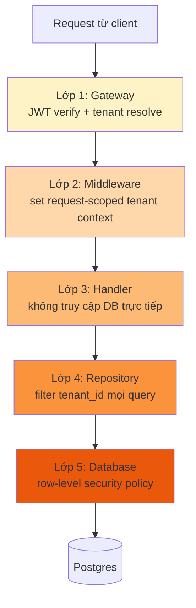
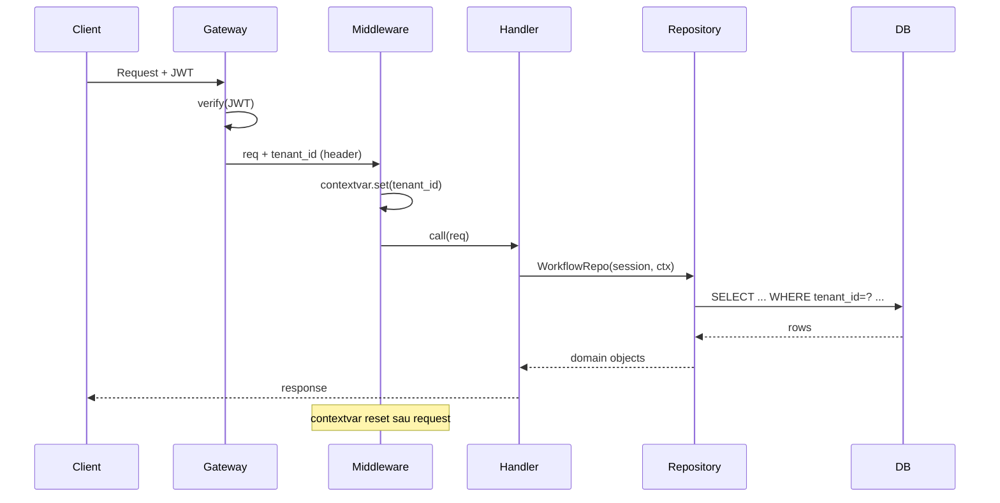

# Multi-tenant Isolation

🟡 Draft — v0.1

## Trang này nói về

**Multi-tenant isolation** là **cam kết cốt lõi** của CAP: dữ liệu của tenant A **không bao giờ** rò sang tenant B, ngay cả khi RBAC có bug, ngay cả khi dev gõ nhầm query, ngay cả khi tool sandbox bị khai thác. CAP áp dụng **defense in depth** — nhiều lớp bảo vệ độc lập, mỗi lớp đủ để giữ isolation kể cả khi các lớp khác hỏng.

Tách 2 khái niệm:

- **Isolation** = "tenant A không **thấy** được dữ liệu tenant B" — ở mọi store, mọi service, mọi log.
- **RBAC** = "trong cùng tenant, ai làm được gì" — phân quyền chi tiết.

Isolation là **kỹ thuật**, không phải policy: 1 dev gõ `SELECT * FROM workflow` thiếu filter → nếu có isolation tốt thì query trả empty hoặc lỗi rõ ràng, không silent leak.

**Phép hình dung**:

- Isolation ≈ **2 toà nhà tách biệt** — không có hành lang nối; muốn đi sang phải ra ngoài, vào lại bằng cửa khác.
- RBAC ≈ **chìa khoá phòng** trong cùng toà nhà — ai vào phòng nào.
- Defense in depth ≈ **3 lớp khoá** — cửa chính + cửa thang máy + cửa phòng; thủng 1 lớp vẫn còn 2 lớp.

**Đọc trang này nếu bạn là**:

- **Dev backend** — sắp viết handler / repository; **bắt buộc** đọc trước khi viết query đầu tiên.
- **Kiến trúc sư / Security** — đánh giá tổng thể isolation; quyết định khi nào nâng từ row-level lên schema-per-tenant.
- **Compliance / Audit** — cần chứng minh data isolation cho khách hàng / kiểm toán.

**Trang liên quan**: [Tenant & Workspace](/02-domain/01-tenant-workspace) (domain — 2 cấp tổ chức) · [IAM & RBAC](/02-domain/02-iam-rbac) (lớp phân quyền sau isolation) · [Data stores](/03-architecture/02-data-stores) (per-store isolation) · [Auth Flow](/03-architecture/07-auth-flow) (tenant context lấy từ JWT).

---

## 1. 3 chiến lược isolation — vì sao chọn row-level

| Tiêu chí | Row-level | Schema-per-tenant | DB-per-tenant |
| --- | --- | --- | --- |
| Cơ chế isolation | Cột `tenant_id` + filter ở repository | 1 schema PG mỗi tenant | 1 DB cluster mỗi tenant |
| Strength | Soft (app enforce) | Medium (PG enforce search_path) | Hard (network level) |
| Migration | 1 lần | N lần (mỗi tenant) | N lần |
| Cost | Thấp | Trung | Cao |
| Noisy neighbor | Có (cùng pool conn) | Giảm | Không |
| Backup per tenant | Khó | Dễ | Native |
| Phù hợp | < 1000 tenant | 1K - 10K tenant | Enterprise dedicated |
| MVP CAP chọn | ✅ | | |
| Lộ trình | | v4 cho > 1000 tenant | v5 cho dedicated infra |

→ **MVP**: row-level. Mọi bảng business có `(tenant_id, workspace_id)`; filter ở **repository layer** (không ở handler). Test riêng cho leak.

→ **v4**: chuyển một số tenant lớn sang schema-per-tenant qua tool migration. App code không đổi (qua schema_router middleware).

---

## 2. Defense in depth — 5 lớp



| Lớp | Cơ chế | Thủng lớp này → còn lớp nào bảo vệ |
| --- | --- | --- |
| 1. Gateway | JWT verify, lấy `tenant_id` claim → đính vào request header `X-Resolved-Tenant` | L2, L3, L4, L5 |
| 2. Middleware | Set thread-local / contextvar `current_tenant_id`; bỏ request nếu thiếu | L3, L4, L5 |
| 3. Handler | Inject `TenantContext` qua DI; tuyệt đối **không** dùng raw SQL hay session.query() | L4, L5 |
| 4. Repository | Constructor bind `tenant_id`; mọi query auto-append `WHERE tenant_id = ?` | L5 |
| 5. Database | (v2) PG Row-Level Security policy với `current_setting('app.tenant_id')` | (cuối cùng) |

→ Bug ở 1 lớp **không đủ** để leak — cần bug ở >= 2 lớp song song.

---

## 3. Repository pattern — chuẩn enforce

### 3.1 Constructor bắt buộc có tenant context

```python
class WorkflowRepository:
    def __init__(self, session: AsyncSession, ctx: TenantContext):
        self._session = session
        self._tenant_id = ctx.tenant_id          # ← bind cứng
        self._workspace_id = ctx.workspace_id

    async def list(self, status: str | None = None):
        stmt = select(Workflow).where(
            Workflow.tenant_id == self._tenant_id,        # ← luôn filter
            Workflow.workspace_id == self._workspace_id,
        )
        if status:
            stmt = stmt.where(Workflow.status == status)
        return await self._session.scalars(stmt).all()

    async def get(self, id: str) -> Workflow:
        wf = await self._session.get(Workflow, id)
        if wf is None:
            raise NotFound()
        # Defense: kể cả get-by-pk vẫn check tenant
        if wf.tenant_id != self._tenant_id or wf.workspace_id != self._workspace_id:
            raise NotFound()                              # ← 404, không 403, không leak existence
        return wf
```

### 3.2 Anti-pattern — bị reject ở code review

```python
# ❌ Không cho phép construct repository không có tenant
repo = WorkflowRepository(session)                       # TypeError ở runtime

# ❌ Không cho phép query qua session trực tiếp ở handler
@router.get("/workflows")
async def list_wf(session: AsyncSession):
    return await session.scalars(select(Workflow)).all() # No tenant filter!

# ❌ Không cho phép truyền tenant qua arg public
def list_for_tenant(repo, tenant_id):                    # tenant đến từ user input?
    ...

# ❌ Không cho phép raw SQL với f-string
await session.execute(f"SELECT * FROM workflow WHERE id={id}")  # SQL injection + no isolation
```

### 3.3 Linter rule

CI gate có:

- Custom Ruff rule: cấm `import session.query` / `session.scalars(select(...` trong file `routers/*` và `handlers/*`
- Cấm raw SQL ngoài migration
- Cấm `TenantContext(tenant_id="...")` literal ngoài test fixture

---

## 4. Tenant context propagation

### 4.1 Lifecycle



### 4.2 Context primitive

```python
# tenant_context.py
from contextvars import ContextVar

_current: ContextVar[TenantContext | None] = ContextVar("tenant_ctx", default=None)

@dataclass(frozen=True)
class TenantContext:
    tenant_id: str
    workspace_id: str | None    # null cho tenant-level endpoint
    principal_id: str
    principal_type: str         # account | service_account | api_key

def get_tenant_ctx() -> TenantContext:
    ctx = _current.get()
    if ctx is None:
        raise MissingTenantContext()
    return ctx

@contextmanager
def with_tenant_ctx(ctx: TenantContext):
    token = _current.set(ctx)
    try:
        yield
    finally:
        _current.reset(token)
```

Sử dụng:

```python
# Middleware
async def tenant_middleware(request, call_next):
    jwt = decode(request.headers["authorization"])
    ctx = TenantContext(
        tenant_id=jwt["tid"],
        workspace_id=jwt.get("wid"),
        principal_id=jwt["sub"],
        principal_type=jwt.get("type", "account"),
    )
    with with_tenant_ctx(ctx):
        return await call_next(request)
```

### 4.3 Worker / async task

Background job **không có HTTP request** → tenant context lấy từ **job payload**:

```python
async def ingest_document_job(payload: dict):
    ctx = TenantContext.from_payload(payload)         # tenant_id luôn có trong payload
    with with_tenant_ctx(ctx):
        repo = DocumentRepository(session, ctx)
        ...
```

Producer (engine) push job phải đính `tenant_id` + `workspace_id` vào payload — convention bắt buộc cho mọi MQ message.

---

## 5. Per-store isolation

### 5.1 Postgres

| Layer | Mechanism |
| --- | --- |
| Schema MVP | Cột `tenant_id` + `workspace_id` ở mọi bảng business |
| Repository | Auto-filter (xem §3) |
| Indexes | Composite `(tenant_id, workspace_id, ...)` cho efficient filter |
| RLS (v2) | PG Row-Level Security policy: `CREATE POLICY ... USING (tenant_id = current_setting('app.tenant_id'))` |
| Search path (v4) | Khi chuyển schema-per-tenant: `SET search_path TO t_<tenant_id>, public` |

### 5.2 Vector DB

| Backend | Mechanism |
| --- | --- |
| pgvector | Composite filter `WHERE tenant_id=? AND workspace_id=? AND kb_id=?` + index |
| Qdrant | **1 collection per `(tenant, workspace, kb)`** — physical separation. Payload filter là defence-in-depth thêm |

Lý do tách collection (không dùng filter-only):

- Qdrant performance scale theo collection size — tenant lớn không slow tenant nhỏ
- Migration / backup per tenant dễ hơn
- Bug filter chỉ leak trong cùng collection (rủi ro nhỏ hơn)

### 5.3 Redis

| Pattern | Mechanism |
| --- | --- |
| Cache key | Prefix `cache:t_<tenant_id>:<entity>:<id>` |
| Session | `sess:t_<tenant_id>:s_<session_id>` |
| Rate-limit | `rl:t_<tenant_id>:<resource>:<window>` |
| Lock | `lock:t_<tenant_id>:<resource>:<id>` |
| Cluster | (v3) Khi cần dedicated: Redis Cluster slot router theo `tenant_id` hash |

**Lưu ý**: `CACHE FLUSH ALL` cấm — chỉ flush theo prefix tenant.

### 5.4 Object Storage (S3)

| Layer | Mechanism |
| --- | --- |
| Bucket layout | Prefix `t_<tenant_id>/w_<workspace_id>/...` (xem [Data stores §5](/03-architecture/02-data-stores)) |
| Pre-signed URL | Generate URL có path scoped theo tenant; TTL ngắn (5 phút) |
| IAM policy (v3) | Mỗi tenant có IAM role read-only chỉ prefix `t_<tenant_id>/` |
| KMS (v3) | Key per-tenant cho SSE-KMS |

### 5.5 Message Queue

| Pattern | Mechanism |
| --- | --- |
| Stream | Shared stream `mq:ingest` nhưng mỗi message **bắt buộc** có `tenant_id` field |
| Consumer | Worker đọc message → tạo TenantContext từ payload → process trong context đó |
| Routing (v3) | Dedicated stream per-tier customer (vd `mq:ingest:enterprise`) |

### 5.6 Logs & traces

| Signal | Mechanism |
| --- | --- |
| Log | Every log line có structured field `tenant_id, workspace_id, request_id` |
| Trace | OpenTelemetry resource attribute `tenant.id` + `workspace.id` |
| Metric | Label cardinality cẩn thận — `tenant_id` ở counter/histogram chính, không ở label dim cardinality cao |
| Query | Loki/Tempo UI filter theo `tenant_id` bắt buộc; admin view có guard |

### 5.7 Secrets

| Store | Mechanism |
| --- | --- |
| KMS | Master key chung MVP; key per-tenant v3 cho Enterprise |
| Credential cipher | Encrypt với key derive từ master + tenant_id |
| Vault (v3) | Path `secret/cap/t_<tenant_id>/...` + policy per-tenant |

### 5.8 Runtime / Compute

| Pattern | Mechanism |
| --- | --- |
| Process pool | Shared MVP — không tách CPU per-tenant |
| Tool Runtime | Sandbox per-call (cách ly process), nhưng host shared |
| Quota | Tenant có quota tokens/RPS; vượt → throttle (không kill khác tenant) |
| Dedicated infra (v5) | Enterprise tenant có node pool riêng trong k8s — `nodeSelector: tenant=<id>` |

---

## 6. Cross-tenant scenarios — đặc biệt phải nghĩ trước

### 6.1 CAP Super Admin support access

CAP nội bộ cần "đăng nhập như" tenant để hỗ trợ. Quy tắc:

| Yêu cầu | Cài đặt |
| --- | --- |
| Bắt buộc MFA + just-in-time | Super admin phải MFA + workflow "yêu cầu access" có ai đó approve |
| Time-bounded | Max 4h, auto-expire |
| Audit kép | Vừa ghi audit của tenant ("super admin X đã access"), vừa ghi audit nội bộ CAP |
| Tenant notify | Tenant Owner nhận email khi có super admin login |
| Read-only mặc định | Mọi action ghi cần re-confirm; không có "free roam" |
| Recorded session (v3) | Record screen + action cho replay |

### 6.2 Marketplace (v3) — share resource cross-workspace cùng tenant

Workspace A publish agent lên marketplace nội bộ → workspace B clone về (**bản sao độc lập**). Quy tắc:

- Clone tạo entity mới với `workspace_id` của B
- KB referenced bị **fork** (nếu cần) hoặc bị bỏ (nếu B không có quyền)
- Original agent không bị ảnh hưởng nếu B sửa clone

### 6.3 Marketplace (v4) — share cross-tenant?

Cross-tenant share trong v4: workspace tenant A có thể export agent thành "template" → tenant B import. Quy tắc:

- Template = JSON definition + assets công khai, **không** bao gồm KB nội dung, **không** bao gồm credential
- Tenant B phải tự reconfigure tool + KB của mình
- Audit ghi rõ "imported from template tenant_X" để truy nguồn

### 6.4 End-user identity

End-user của tenant A chat với agent → CAP **không quản identity end-user**. Tenant tự quản — chuyển qua via `end_user_id` opaque trong request. CAP forward vào trace, không lookup, không validate. Chi tiết: [IAM §8.1](/02-domain/02-iam-rbac).

---

## 7. Testing for leakage

### 7.1 Unit test convention

Mỗi handler test có 2 case "tenant isolation":

```python
async def test_workflow_list_isolated():
    # Setup: 2 tenant, mỗi tenant 1 workflow
    await seed.workflow(tenant="A", workspace="A1", name="wf-a")
    await seed.workflow(tenant="B", workspace="B1", name="wf-b")

    # Act: list từ tenant A
    result = await client.get("/console/api/v1/workflows", auth=jwt_for("A"))

    # Assert: chỉ thấy wf-a
    assert {wf["name"] for wf in result.json()} == {"wf-a"}

async def test_workflow_get_cross_tenant_404():
    wf_b = await seed.workflow(tenant="B", workspace="B1")
    result = await client.get(f"/console/api/v1/workflows/{wf_b.id}", auth=jwt_for("A"))
    assert result.status_code == 404      # ← không phải 403, không leak existence
```

### 7.2 Integration test

CI có dedicated "tenant fuzz" test:

- Seed 5 tenant, mỗi tenant 10 entity
- Random pick endpoint + tenant + foreign entity_id
- Assert: **always** 404, không bao giờ 200

### 7.3 Manual penetration test

1 lần / năm: bên thứ ba test isolation:

- Bypass JWT (forge token với `tid` khác)
- SQL injection trên cột search
- IDOR (cross-tenant ID guess)
- Cache key collision
- Race condition (parallel requests đổi tenant)

---

## 8. Status code khi từ chối

| Tình huống | Code | Vì sao |
| --- | --- | --- |
| Resource thuộc tenant khác | **404 Not Found** | Không tiết lộ tồn tại — chống cross-tenant enum |
| Cùng tenant, không quyền | **403 Forbidden** | Minh bạch trong tổ chức |
| Chưa xác thực | **401 Unauthorized** | Cần login |
| Tenant suspended | **403 Forbidden** + body `{"reason": "tenant_suspended"}` | Người dùng cần biết để liên hệ admin |

Detail: [IAM §9.2](/02-domain/02-iam-rbac).

---

## 9. Migration row-level → schema-per-tenant (v4)

Khi nào trigger:

- Tổng số tenant > 1000
- Hoặc Enterprise tenant yêu cầu dedicated schema
- Hoặc 1 tenant chiếm > 30% load (noisy neighbor)

Quy trình:

1. Tạo schema `t_<tenant_id>` mới với cùng table definition
2. Migrate data: `INSERT INTO t_<id>.workflow SELECT * FROM public.workflow WHERE tenant_id = ?`
3. Verify count + checksum
4. Update `tenant_routing` table: tenant này dùng schema dedicated
5. Middleware `schema_router` set `search_path` theo `tenant_routing` lookup
6. Sau 1 tuần dual-read OK → drop rows cũ trong `public`

App code **không đổi** — chỉ đổi `search_path` ở connection.

---

## 10. Anti-pattern catalog

Tổng kết cho code reviewer:

| Anti-pattern | Vì sao tệ | Đúng |
| --- | --- | --- |
| Filter ở handler thay vì repository | Quên dễ; reviewer khó spot | Filter ở repository |
| `tenant_id` lấy từ request body | User có thể spoof | Lấy từ JWT/context |
| `SELECT * FROM tbl WHERE id=?` không tenant | Cross-tenant leak | `WHERE id=? AND tenant_id=?` |
| Cache key không có tenant prefix | Cache collision | `cache:t_<id>:...` |
| Log không có `tenant_id` | Khó audit/correlate | Structured logging |
| `Repository(session)` không có ctx | Bypass isolation | `Repository(session, ctx)` |
| Worker job không bind ctx từ payload | Background leak | `with_tenant_ctx(ctx)` wrap |
| Admin endpoint không có audit | Có thể abuse | Audit + MFA + just-in-time |

---

## 11. Câu hỏi còn mở

| # | Câu hỏi | Cân nhắc | Phiên bản |
| --- | --- | --- | --- |
| Q1 | Khi nào bật PG RLS policy? | Lớp DB-level cuối; có cost performance ~5% | v2 |
| Q2 | Schema-per-tenant trigger tự động hay manual? | Manual cho enterprise; auto khi load detect noisy neighbor | v4 |
| Q3 | Vector DB nâng lên dedicated Qdrant cluster per-tenant Enterprise? | Cần khi tenant có > 50M vector | v5 |
| Q4 | Multi-region tenant — data residency cross-region | Compliance EU/VN; complex sync | v5 |
| Q5 | KMS key rotation cadence per-tenant | Default 1 năm; Enterprise có thể yêu cầu 90 ngày | v3 |
| Q6 | Cross-tenant marketplace với data sharing chính thức? | Cần model "shared dataset" — phức tạp | v5 |
| Q7 | Audit trail cross-tenant access cần lưu bao lâu? | 7 năm cho compliance; cold archive | MVP đã chốt |

---

## Liên kết

- [Tenant & Workspace](/02-domain/01-tenant-workspace) — domain: 2 cấp tổ chức
- [IAM & RBAC](/02-domain/02-iam-rbac) — lớp phân quyền sau isolation
- [Data stores](/03-architecture/02-data-stores) — per-store mechanism chi tiết
- [Auth Flow](/03-architecture/07-auth-flow) — tenant context lấy từ đâu
- [Service boundaries](/03-architecture/01-services) — middleware ở service nào
- [Observability](/03-architecture/08-observability) — log structured + label
