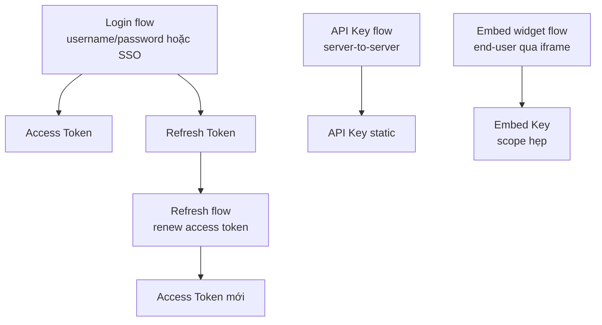
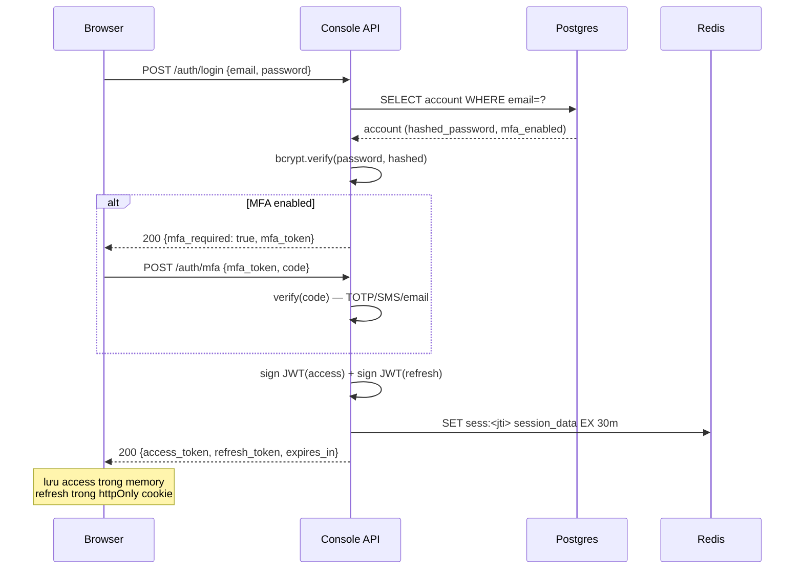
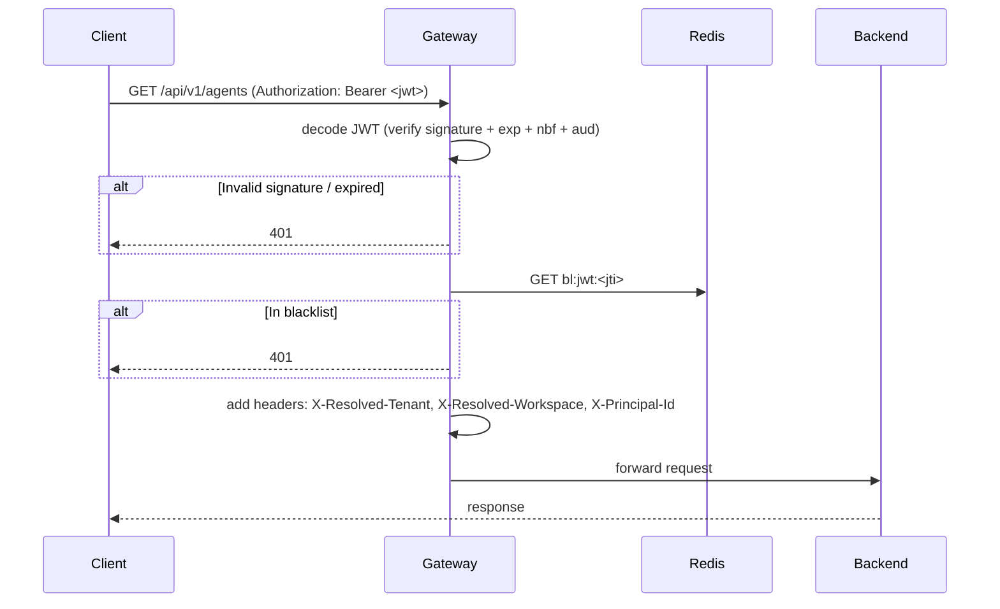
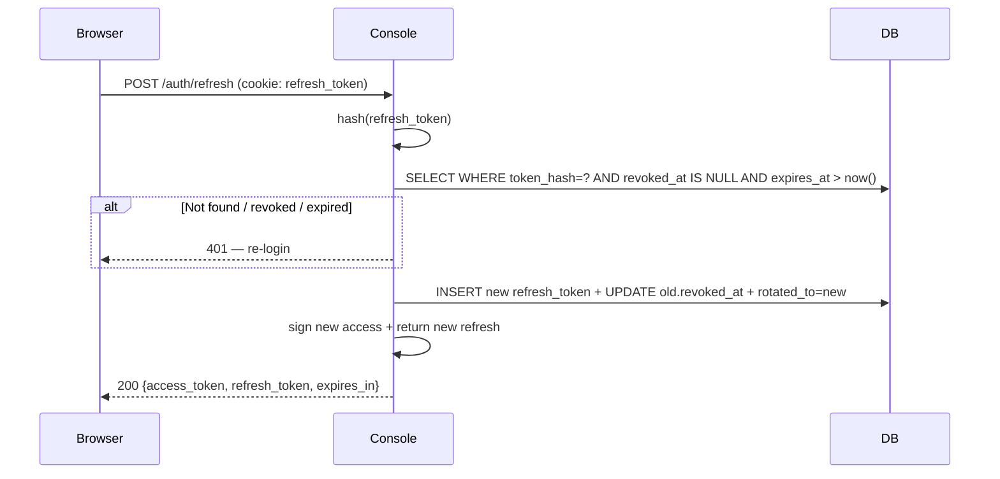
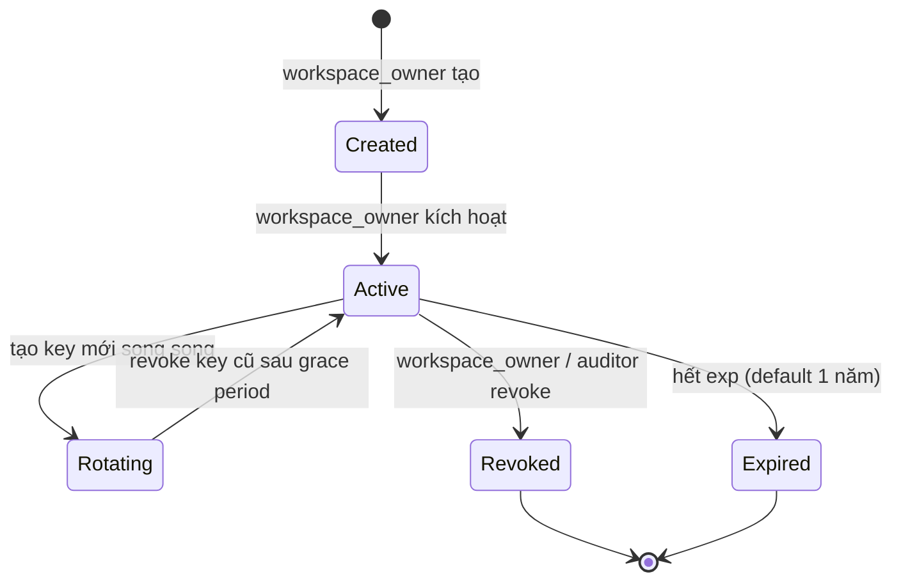
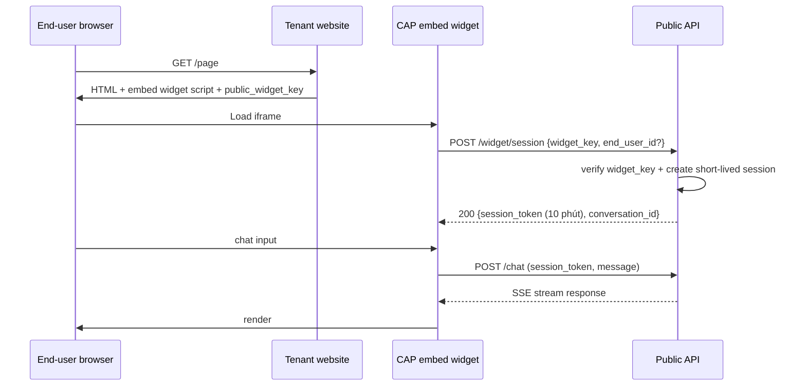

# Auth Flow

🟡 Draft — v0.1

## Trang này nói về

**Auth Flow** là **cơ chế xác thực** (authentication — "ai đây?") và **xác lập phiên** (session — "phiên đang hoạt động ra sao?") của CAP. Trang này nối tiếp [IAM & RBAC](/02-domain/02-iam-rbac) (lo phân quyền — "ai được làm gì?") với [Multi-tenant Isolation](/03-architecture/06-multi-tenant) (lo cách ly — "không nhìn được dữ liệu tenant khác").

3 nhóm credential, 3 mục đích khác nhau:

| Credential | Cấp cho | Lifetime | Mục đích chính |
| --- | --- | --- | --- |
| **Access Token (JWT)** | Người dùng đăng nhập | Ngắn (15-30 phút) | Mỗi request gọi API |
| **Refresh Token** | Cùng người dùng | Dài (7-30 ngày), rotate | Lấy access token mới mà không phải login lại |
| **API Key** | Service account, embed widget | Permanent (revocable) | Server-to-server, client-side embed |

**Phép hình dung**:

- Access Token ≈ **vé vào cửa sự kiện** — có thời hạn ngắn, chứng minh bạn là ai + được xem gì.
- Refresh Token ≈ **chứng minh thư member** — dùng để xin vé mới khi vé cũ hết hạn.
- API Key ≈ **chìa khoá phòng dịch vụ** — không có người đứng sau, dùng đến khi thu hồi.

**Đọc trang này nếu bạn là**:

- **Dev backend** — sắp implement login/logout/refresh handler, JWT verify middleware.
- **Dev frontend** — cần biết token lưu ở đâu (cookie? localStorage?), khi nào refresh.
- **Dev tích hợp** — gọi API CAP từ hệ thống ngoài, cần biết auth header format.
- **Security / Compliance** — đánh giá rủi ro session hijack, token leak, MFA policy.

**Trang liên quan**: [IAM & RBAC](/02-domain/02-iam-rbac) (phân quyền sau auth) · [Multi-tenant Isolation](/03-architecture/06-multi-tenant) (tenant context từ JWT) · [Service boundaries](/03-architecture/01-services) (Gateway verify JWT) · [Data stores §4](/03-architecture/02-data-stores) (Redis cho session + blacklist).

---

## 1. 4 luồng auth chính



| Flow | Khi nào | Output |
| --- | --- | --- |
| **Login** | User mở Web Console hoặc App lần đầu | Access + Refresh token |
| **Refresh** | Access token hết hạn (15-30 phút) | Access token mới + Refresh mới (rotate) |
| **API Key** | External system tích hợp; mỗi call kèm header `X-API-Key` | (key đã có sẵn) |
| **Embed widget** | End-user mở chat iframe trên web khách | Short-lived "guest session" token |

---

## 2. Login flow

### 2.1 Username/password (MVP)



### 2.2 SSO/OAuth (v3)

```mermaid
sequenceDiagram
    participant Browser
    participant Console
    participant IdP as Google/MS/SAML

    Browser->>Console: GET /auth/sso?provider=google
    Console-->>Browser: 302 redirect IdP authorize URL + state
    Browser->>IdP: User login + consent
    IdP-->>Browser: 302 redirect Console callback + code
    Browser->>Console: GET /auth/sso/callback?code=...&state=...
    Console->>IdP: POST exchange code → access_token + id_token
    IdP-->>Console: user profile (email, name)
    Console->>Console: match account by email; SCIM provisioning nếu lần đầu
    Console->>Console: sign JWT (giống §2.1)
    Console-->>Browser: 302 redirect /dashboard với cookie set
```

| Provider | Protocol | Phiên bản |
| --- | --- | --- |
| Google, Microsoft, GitHub | OAuth 2.0 + OIDC | v3 |
| Okta, Azure AD, Auth0 | OIDC | v3 |
| Enterprise IdP | SAML 2.0 | v3 |
| User/group sync | SCIM 2.0 | v3 |

### 2.3 Hash password

| Khía cạnh | Spec |
| --- | --- |
| Algorithm | **bcrypt** cost 12 (MVP) hoặc **argon2id** (v2) |
| Migration | Lưu `algo + params + hash` để rotate sau |
| Pepper | Optional: append app-secret + email vào password trước hash |
| Validation | Min 8 ký tự, có chữ + số; check Have-I-Been-Pwned (v2) |
| Reset | Email token TTL 30 phút, single-use, invalidate sau dùng |

---

## 3. JWT structure

### 3.1 Access token claims

```json
{
  "iss": "https://cap.cmc.local",
  "aud": "cap-console",
  "sub": "acc_01HXXX...",
  "tid": "ten_01HYYY...",
  "wid": "ws_01HZZZ...",
  "type": "account",
  "roles": ["workspace_editor"],
  "scopes": ["agent:read", "agent:write", "knowledge:read"],
  "session_id": "sess_01HAAA...",
  "jti": "jwt_01HBBB...",
  "iat": 1747320000,
  "exp": 1747321800,
  "nbf": 1747320000
}
```

| Claim | Mục đích |
| --- | --- |
| `iss` | Issuer — chống cross-environment token reuse |
| `aud` | Audience — `cap-console` hay `cap-public` — dùng đúng env |
| `sub` | Subject — `account_id` |
| `tid` | Tenant ID — **luôn có** (kể cả super admin) |
| `wid` | Workspace ID — null cho tenant-level endpoint |
| `type` | `account` / `service_account` / `api_key` (cho audit) |
| `roles` | Built-in role names cho fast check |
| `scopes` | Permission codes cụ thể (tránh load DB mỗi request) |
| `session_id` | Link tới Redis session — cho revoke |
| `jti` | JWT ID unique — cho blacklist |
| `iat`, `exp`, `nbf` | Timestamps |

### 3.2 Refresh token

Refresh token **không** phải JWT — là **opaque random string** (32 bytes):

```text
refresh_token: rt_<base64url(32 bytes)>
```

Lý do:

- Refresh được dùng 1 lần rồi rotate — không cần claims
- Lưu hash ở Postgres (`refresh_token` table), revoke = delete row
- Không log raw token (chỉ prefix 8 ký tự)

Schema:

```sql
CREATE TABLE refresh_token (
    token_hash  bytea PRIMARY KEY,    -- sha256(token)
    account_id  text NOT NULL,
    tenant_id   text NOT NULL,
    workspace_id text,
    issued_at   timestamptz,
    expires_at  timestamptz,
    rotated_from bytea,                -- token_hash trước (cho audit + replay detect)
    revoked_at  timestamptz,
    user_agent  text,
    ip          inet
);
```

### 3.3 Sign algorithm

| Khía cạnh | MVP | Production |
| --- | --- | --- |
| Algorithm | **HS256** (HMAC) | **RS256** (RSA) hoặc **EdDSA** (Ed25519) |
| Key rotation | Manual quarterly | Auto theo JWKS với multiple key |
| Key storage | App env var (HS256) | KMS / Vault (RS256) |
| Key per env | Mỗi env (dev/staging/prod) một key | Cùng cộng |

→ MVP: HS256 đơn giản; production chuyển RS256 để Gateway verify mà không có signing key.

---

## 4. Token verify ở Gateway



| Step | Note |
| --- | --- |
| Verify signature | Stateless, **không** gọi DB — verify với public key (RS256) hoặc shared secret (HS256) |
| Check blacklist | Chỉ check Redis (1 round-trip) — không phải DB |
| Add headers | Backend không tự decode JWT — đọc từ headers Gateway resolve |
| Cache miss → DB | Khi `session_id` không có trong Redis (rare) → check DB → cache lại |

---

## 5. Refresh flow



### 5.1 Rotation rule

| Sự kiện | Hành động |
| --- | --- |
| Refresh thành công | Tạo refresh mới, revoke refresh cũ ngay |
| Refresh bị dùng lần 2 (replay) | **Detect** qua `rotated_from` → revoke toàn bộ chain → force logout + alert |
| Refresh expired | Re-login |
| Account password đổi | Revoke tất cả refresh tokens của account |

### 5.2 Sliding window

Mỗi lần refresh, expiry kéo dài thêm 7 ngày (configurable). Inactive 7 ngày → phải re-login.

---

## 6. Logout & revoke

| Hành động | Cơ chế |
| --- | --- |
| **Logout** (user click) | Add JWT `jti` vào Redis `bl:jwt:<jti>` TTL = remaining `exp`. Revoke refresh token row |
| **Logout all sessions** | Revoke tất cả refresh + add JWT `jti` của session active vào blacklist |
| **Force logout user X** (admin) | Same as "logout all" cho account_id=X |
| **Force logout tenant** (super admin support) | Revoke tất cả của tenant_id |
| **Password change** | Auto-trigger "logout all" cho account đó |
| **Suspicious activity** (impossible travel) | Auto force-logout + email alert |

### 6.1 JWT blacklist semantics

| Tình huống | Trong blacklist? |
| --- | --- |
| Expired token (`exp < now`) | Không cần blacklist — verify reject sẵn |
| Active token revoke | Add vào Redis `bl:jwt:<jti>` TTL = `exp - now` |
| Logout long-time-ago | Không (token đã expired tự nhiên) |

→ Blacklist không phình to vô hạn: TTL auto-clean.

---

## 7. API Key

### 7.1 Lifecycle



### 7.2 Format

```text
cap_<env>_<scope>_<random>
   │     │     │       │
   │     │     │       └─ 32 bytes base64url
   │     │     └───── ws (workspace) hoặc sa (service account)
   │     └─────────── live / test
   └───────────────── prefix dễ identify
```

Ví dụ: `cap_live_ws_aB3kL...XyZ`

### 7.3 Schema

```sql
CREATE TABLE api_key (
    id          text PRIMARY KEY,
    tenant_id   text NOT NULL,
    workspace_id text,
    name        text,                        -- mô tả "ERP integration", "embed widget"
    prefix      text NOT NULL,               -- "cap_live_ws_aB3kL" (cho UI hiển thị)
    key_hash    bytea NOT NULL,              -- sha256 của full key
    created_at  timestamptz,
    created_by  text,
    expires_at  timestamptz,                 -- default +1 năm
    last_used_at timestamptz,
    revoked_at  timestamptz,
    revoked_by  text,
    revoke_reason text,
    scope_type  text NOT NULL,               -- 'tenant' | 'workspace' | 'resource'
    scope_id    text,
    permissions jsonb                        -- subset của full permission
);
```

### 7.4 Verify flow

```python
async def verify_api_key(raw: str) -> Principal:
    key_hash = sha256(raw)
    record = await db.fetch_one("SELECT ... WHERE key_hash=$1 AND revoked_at IS NULL", key_hash)
    if not record:
        raise InvalidAPIKey()
    if record.expires_at < now():
        raise ExpiredAPIKey()
    await db.execute("UPDATE api_key SET last_used_at=now() WHERE id=$1", record.id)
    return Principal(type="api_key", id=record.id, tenant_id=record.tenant_id,
                     workspace_id=record.workspace_id, permissions=record.permissions)
```

### 7.5 Quy tắc bảo mật

| Quy tắc | Cài đặt |
| --- | --- |
| Key chỉ hiện 1 lần lúc tạo | Sau khi tạo → UI display full key + "copy now"; reload → chỉ thấy prefix |
| **Không bao giờ** log full key | Log prefix 4-8 ký tự đầu + length |
| Hash trước khi lưu | Không recoverable; reset = revoke + tạo mới |
| Detect leak | (v2) Scan public GitHub cho regex prefix CAP → auto-revoke + notify |
| Rate-limit | Per-key + per-tenant để chống brute force |
| Scope tightest | Recommend ResourceInstance scope khi có thể |

---

## 8. Embed widget — end-user flow

End-user chat trên website của tenant qua iframe:



| Khía cạnh | Quy ước |
| --- | --- |
| `widget_key` | Public — embed trong HTML, scope **chỉ** `chat:invoke` với agent cụ thể |
| `session_token` | Short-lived (10 phút sliding), nâng rate-limit lên ngưỡng "1 user" |
| `end_user_id` | Opaque ID tenant gán (vd CRM customer_id) — CAP **không** validate, chỉ forward vào trace |
| Domain whitelist | `widget_key` cấu hình `allowed_origins`; CAP check `Origin` header CORS |
| Quota | Per `widget_key` per giờ — tránh embed bị abuse |

---

## 9. MFA (Multi-Factor Authentication)

### 9.1 Loại MFA hỗ trợ

| Loại | MVP | v2 | v3 |
| --- | --- | --- | --- |
| TOTP (Google Authenticator, Authy) | ✅ | | |
| SMS (qua provider Vonage/Twilio) | | ✅ | |
| Email code | ✅ | | |
| WebAuthn (Yubikey, Touch ID) | | | ✅ |
| Push notification (CAP mobile app) | | | ✅ |

### 9.2 Khi nào bắt buộc

| Đối tượng | Required |
| --- | --- |
| `tenant_owner` | ✅ (mặc định bắt buộc) |
| `tenant_admin` | ✅ |
| `workspace_*` | Tuỳ tenant policy |
| `auditor` | ✅ (luôn) |
| CAP super admin | ✅ (luôn) + bắt buộc TOTP/WebAuthn (không SMS) |

### 9.3 Sensitive action re-auth

Một số action cần re-auth (re-enter password + MFA) bất kể session đang active:

- Đổi password
- Tạo/revoke API key
- Đổi billing
- Thêm member với role `tenant_*`
- Delete tenant/workspace
- Export audit log

---

## 10. Service account

| Khác Account | Khác cụ thể |
| --- | --- |
| Không có password | Auth bằng API Key |
| Không có MFA | Bảo mật bằng key strength + rotation |
| Có owner | Đối với enterprise audit; người tạo chịu trách nhiệm |
| Lifecycle | Tách rời nhân sự — người tạo nghỉ vẫn còn |

Schema:

```sql
CREATE TABLE service_account (
    id text PRIMARY KEY,
    tenant_id text,
    workspace_id text,
    name text,
    description text,
    owner_account_id text,    -- người chịu trách nhiệm
    created_at timestamptz,
    archived_at timestamptz
);
```

API keys reference `service_account_id` thay vì `account_id`.

---

## 11. Session management

### 11.1 Session in Redis

```text
sess:<session_id> = JSON {
    account_id, tenant_id, workspace_id,
    issued_at, last_active_at,
    user_agent, ip,
    mfa_verified_at,
}
TTL = 30 phút sliding window
```

### 11.2 Concurrent session limit

| Plan | Max concurrent sessions per account |
| --- | --- |
| Free | 2 |
| Team | 5 |
| Business | 10 |
| Enterprise | Unlimited (config được) |

Vượt → revoke session cũ nhất (LRU).

### 11.3 Anomaly detection (v2)

| Tín hiệu | Hành động |
| --- | --- |
| **Impossible travel** (login từ 2 IP cách xa trong < 1h) | Force re-auth + email alert |
| Lần đầu login từ device mới | Email confirm |
| Login giờ bất thường (3am) | Optional MFA |
| Failed login burst | Lock 5 phút, captcha |

---

## 12. Audit cho auth

Mọi sự kiện auth ghi audit (xem [IAM §10](/02-domain/02-iam-rbac)):

| Event | Ghi gì |
| --- | --- |
| `login_success` | account_id, ip, user_agent, mfa_used, sso_provider |
| `login_failure` | email (KHÔNG ghi password), ip, reason |
| `logout` | account_id, session_id, reason ("user" / "admin_force") |
| `password_change` | account_id, ip |
| `mfa_enroll` / `mfa_remove` | account_id, method |
| `api_key_create` | actor, key prefix, scope, expires_at |
| `api_key_revoke` | actor, key prefix, reason |
| `refresh_token_replay_detected` | account_id, sessions revoked |
| `sso_link` / `sso_unlink` | account_id, provider |

Retention: 7 năm cho enterprise; 1 năm cho team.

---

## 13. Câu hỏi còn mở

| # | Câu hỏi | Cân nhắc | Phiên bản |
| --- | --- | --- | --- |
| Q1 | SSO/SAML/SCIM ở v3 — Okta vs Azure AD vs cả hai? | Doanh nghiệp VN chủ yếu Azure AD/Microsoft 365 | v3 |
| Q2 | Passkey / WebAuthn default ở v4? | UX tốt hơn TOTP; cần support browser/mobile | v4 |
| Q3 | Token rotation tự động qua middleware (silent refresh)? | Phổ biến nhưng tăng phức tạp frontend | v2 |
| Q4 | API Key + IP allowlist | Enterprise yêu cầu — không tốn ops khi đã có | v2 |
| Q5 | Just-in-time access cho super admin | Workflow approval + time-bounded | v3 |
| Q6 | OAuth scope-based cho 3rd party builder? | "App tích hợp" model như Slack Apps | v4 |
| Q7 | Device trust + posture check | Enterprise — check device managed, encrypted | v5 |

---

## Liên kết

- [IAM & RBAC](/02-domain/02-iam-rbac) — phân quyền sau khi auth thành công
- [Multi-tenant Isolation](/03-architecture/06-multi-tenant) — tenant context propagation từ JWT
- [Service boundaries](/03-architecture/01-services) — Gateway verify JWT
- [Data stores §4 — Redis](/03-architecture/02-data-stores) — session + blacklist storage
- [Observability](/03-architecture/08-observability) — audit log retention
