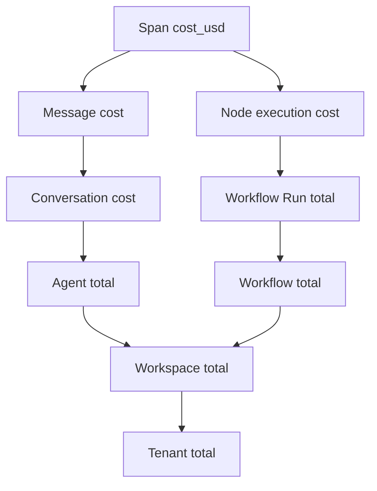

# Observability

🟡 Draft — v0.1

## Trang này nói về

**Observability** là khả năng **biết hệ thống đang làm gì + tại sao** mà không cần SSH vào máy. CAP cần observability "tốt hơn average SaaS" vì:

- Mỗi tương tác có **chi phí thực bằng tiền** (LLM tokens) — phải đếm chính xác để tính giá thành / charge khách.
- Mỗi workflow run có **nhiều bước phụ thuộc dịch vụ ngoài** — fail có thể do tool, LLM, KB, mạng — phải localize được.
- Mỗi tenant cần **audit log immutable** cho compliance.
- Builder cần **debug agent** — biết LLM đã thấy prompt gì, gọi tool nào, vì sao đáp sai.

CAP áp dụng **4 signals** (3 chuẩn OpenTelemetry + audit log riêng):

| Signal | Lưu ở | UI | Retention default |
| --- | --- | --- | --- |
| **Traces** | Tempo | Grafana Tempo | 7 ngày hot, 30 ngày cold |
| **Logs** | Loki | Grafana Logs | 14 ngày |
| **Metrics** | Prometheus → Mimir | Grafana Dashboard | 90 ngày |
| **Audit** | Postgres + S3 archive | CAP Audit UI | 1 năm hot, **7 năm cold** (legal) |

**Phép hình dung**:

- Trace ≈ **hộp đen máy bay** — replay được từng bước một flight.
- Log ≈ **nhật ký thuyền trưởng** — sự kiện ghi lại theo thời gian.
- Metric ≈ **đồng hồ tốc độ + nhiên liệu** — số liệu liên tục để monitor + alert.
- Audit ≈ **sổ kế toán có công chứng** — không sửa được, lưu lâu, phục vụ kiểm toán.

**Đọc trang này nếu bạn là**:

- **Dev backend** — sắp instrument code (span, log, metric).
- **DevOps / SRE** — set up Tempo/Loki/Prometheus, alert rules, dashboards.
- **Builder** — debug agent qua trace UI; đọc trace span để hiểu agent quyết định.
- **Compliance / Finance** — audit log retention, cost attribution.

**Trang liên quan**: [Service boundaries](/03-architecture/01-services) (healthcheck per service) · [Workflow Engine](/03-architecture/03-workflow-engine) (span structure cho run) · [Tool Runtime](/03-architecture/04-tool-runtime) (tool call span) · [Multi-tenant Isolation](/03-architecture/06-multi-tenant) (tenant_id ở mọi signal) · [IAM §10](/02-domain/02-iam-rbac) (audit event catalog).

---

## 1. 5 nguyên tắc

| # | Nguyên tắc | Hệ quả |
| --- | --- | --- |
| 1 | **Cost = first-class signal** | Mỗi span LLM/Tool có cost attribute; aggregate ra dashboard per tenant/workspace/agent/model |
| 2 | **tenant_id ở mọi nơi** | Mọi log line + mọi span + mọi metric có label `tenant_id, workspace_id` (controlled cardinality) |
| 3 | **Sampling thông minh** | Trace giữ 100% lỗi + 100% slow + 1-10% normal — chứ không drop random |
| 4 | **Audit ≠ Log** | Audit là legal record, immutable, retention dài; log là debug, được drop theo TTL |
| 5 | **Observability cho builder, không chỉ ops** | Trace UI có view "builder-friendly" — không cần Grafana skill để debug agent |

---

## 2. Traces

### 2.1 OpenTelemetry conventions

Span attributes chuẩn:

| Attribute | Có ở mọi span | Mô tả |
| --- | --- | --- |
| `tenant.id`, `workspace.id` | ✅ | Resource attribute |
| `service.name` | ✅ | `cap-app`, `cap-worker`, `cap-tool-runtime` |
| `request.id` / `trace.id` | ✅ | Correlation |
| `principal.type`, `principal.id` | ✅ | Ai gây ra |
| `cost.usd` | LLM, Tool, Embedding | Cộng vào sum theo span |
| `error.type` | Nếu lỗi | Standardized error code |

### 2.2 Workflow run span structure

```text
workflow.run                                              (root span)
├── tenant.id, workspace.id, run_id, workflow_id, version
├── duration_ms, status, total_cost_usd
│
├── node.execution: start                                (skipped if implicit)
├── node.execution: llm "classify_intent"
│   ├── llm.invoke
│   │   ├── llm.provider=openai, llm.model=gpt-4o
│   │   ├── llm.input_tokens=234, llm.output_tokens=42
│   │   ├── llm.cost_usd=0.0091
│   │   ├── llm.latency_ms=820
│   │   └── llm.cache_hit=false
│   └── (no tool call)
│
├── node.execution: knowledge_retrieval
│   ├── retrieval.kb_id, retrieval.query, retrieval.top_k=20→5
│   ├── embedding.encode
│   │   ├── embedding.model, embedding.cost_usd
│   │   └── embedding.cache_hit=true            ← saved cost
│   ├── vector.search
│   │   ├── vector.backend=qdrant
│   │   ├── vector.latency_ms=32
│   │   └── vector.results=20
│   ├── fulltext.search (latency_ms=18)
│   ├── rerank
│   │   ├── rerank.provider=cohere, rerank.cost_usd=0.001
│   │   └── rerank.input=20, rerank.output=5
│   └── retrieval.citations=[seg_1, seg_2, ...]
│
├── node.execution: branch (condition evaluated to "approved")
│
├── node.execution: tool "send_email"
│   └── tool.execute
│       ├── tool.name=send_email, tool.type=builtin
│       ├── tool.sandbox=subprocess
│       ├── tool.latency_ms=412
│       ├── tool.attempts=1
│       └── egress.destinations=["smtp.gmail.com"]
│
└── node.execution: end
```

### 2.3 Conversation span structure

```text
conversation.turn                                         (root)
├── tenant.id, workspace.id, conversation_id, message_id
├── agent_id, agent_version_id
├── duration_ms, total_cost_usd
│
├── llm.invoke (loop tiếp tục cho đến khi LLM không yêu cầu tool nữa)
│   ├── streaming.first_token_ms=320           ← TTFT
│   ├── streaming.total_tokens=234
│   └── llm.tool_call: "check_remaining_days"
│       └── tool.execute (latency, result, cost)
│
├── llm.invoke (turn 2 — sau tool result)
│   └── (final answer streaming)
```

### 2.4 Sampling

Pure tail-based sampling (Tempo + OTel Collector):

| Loại trace | Sampling rate |
| --- | --- |
| Error (status≠OK ở root) | 100% |
| Slow (duration > p95 baseline) | 100% |
| Sensitive endpoint (auth, billing, audit) | 100% |
| High-cost (cost_usd > $0.10) | 100% |
| Background job lớn | 100% |
| Normal | 1-10% (tunable) |

→ Giữ "interesting" traces, drop random — phù hợp budget storage.

### 2.5 Tail sampling decision

Collector hold span ~30s, đợi root đóng, decide có giữ hay không. Trade-off: latency search trace tăng 30s nhưng tiết kiệm 90% storage.

---

## 3. Cost tracking

Cost là **business signal cực kỳ quan trọng** — aggregate từ span attribute lên dashboard.

### 3.1 Where cost is captured

| Loại cost | Capture ở | Attribute |
| --- | --- | --- |
| LLM | `llm.invoke` span | `llm.cost_usd` |
| Embedding | `embedding.encode` span | `embedding.cost_usd` |
| Rerank | `rerank` span | `rerank.cost_usd` |
| Tool external | `tool.execute` span (nếu provider charge) | `tool.cost_usd` |
| Compute (v2) | `node.execution` span | `compute.seconds × rate` |

### 3.2 Rollup levels



### 3.3 Cost ledger table

Để query nhanh không phụ thuộc Tempo storage:

```sql
CREATE TABLE cost_ledger (
    id            uuid PRIMARY KEY,
    tenant_id     text NOT NULL,
    workspace_id  text NOT NULL,
    timestamp     timestamptz NOT NULL,
    source_type   text,         -- 'llm' | 'embedding' | 'rerank' | 'tool'
    source_ref    text,         -- conversation_id / run_id / batch_job_id
    agent_id      text,
    workflow_id   text,
    provider      text,         -- 'openai' | 'anthropic' | ...
    model         text,
    input_tokens  int,
    output_tokens int,
    cost_usd      numeric(10, 6),
    metadata      jsonb
);

CREATE INDEX idx_cost_tenant_time ON cost_ledger (tenant_id, timestamp DESC);
CREATE INDEX idx_cost_workspace_time ON cost_ledger (tenant_id, workspace_id, timestamp DESC);
CREATE INDEX idx_cost_agent_time ON cost_ledger (tenant_id, agent_id, timestamp DESC);
```

Trace exporter sample ghi cost vào ledger (idempotent qua span_id).

### 3.4 Dashboards

| Dashboard | Audience |
| --- | --- |
| **Tenant cost overview** | Tenant Owner — daily/monthly cost, top workspace, top agent |
| **Workspace cost detail** | Workspace Owner — top conversation, top model, hourly burn rate |
| **Agent performance** | Builder — cost/conversation, latency, error rate, satisfaction |
| **Per-model cost** | Finance — split theo provider/model để negotiate rate |
| **Quota usage** | Admin — % usage vs plan limit, projection EoM |

---

## 4. Logs

### 4.1 Structured logging

JSON only — không free-form text:

```json
{
  "ts": "2026-05-15T03:14:15.123Z",
  "level": "info",
  "msg": "workflow_run.started",
  "service": "cap-app",
  "tenant_id": "ten_01HXXX",
  "workspace_id": "ws_01HYYY",
  "request_id": "req_01HZZZ",
  "trace_id": "tr_01HAAA",
  "span_id": "sp_01HBBB",
  "principal": {"type": "account", "id": "acc_01HCCC"},
  "workflow_id": "wf_01HDDD",
  "run_id": "wr_01HEEE",
  "input_size_bytes": 1234
}
```

### 4.2 Log levels

| Level | Khi nào | Sample |
| --- | --- | --- |
| `debug` | Dev local; chỉ bật cho 1 tenant qua feature flag | "Cache miss for key X" |
| `info` | Sự kiện business chính | "Conversation started", "Workflow run started" |
| `warn` | Bất thường nhưng không break | "Tool slow > 5s", "Cache full" |
| `error` | Bug / unexpected fail | "DB connection lost", "Unhandled exception" |
| `fatal` | Process sắp die | (rare) |

Production default: `info`. Có config bật `debug` per-tenant qua flag (ngắn hạn để troubleshoot).

### 4.3 Correlation

Mọi log từ 1 request có cùng `request_id` (Gateway tạo, propagate qua header `X-Request-Id`). Mọi log trong scope 1 trace có cùng `trace_id` (OTel context).

### 4.4 PII handling

Log **không** chứa raw user message content, password, credential, PII. Khi cần log content debug → redact theo policy + log ở level debug (off mặc định).

---

## 5. Metrics

### 5.1 4 nhóm metric

| Nhóm | Mô tả | Ví dụ |
| --- | --- | --- |
| **RED** (Rate / Errors / Duration) | Per endpoint | `http_request_total`, `http_request_errors_total`, `http_request_duration_seconds` |
| **USE** (Utilization / Saturation / Errors) | Per resource | `db_connections_active`, `db_connections_max`, `queue_depth` |
| **Business KPI** | CAP-specific | `agent_invocations_total`, `cost_usd_total`, `kb_queries_total`, `active_tenants` |
| **SLO indicators** | Composite | `availability_5min`, `latency_p95_5min` |

### 5.2 Cardinality control

Label cẩn thận — tenant_id ở counter là OK; tenant_id ở histogram bucket label dày là exploding:

| Metric | OK label | Tránh |
| --- | --- | --- |
| `cost_usd_total` | `tenant_id, workspace_id, provider, model` | `conversation_id` (cardinality cao) |
| `http_request_duration` | `method, route, status_class` | `tenant_id` (mỗi tenant 1 histogram) |
| `agent_invocations_total` | `tenant_id, agent_id` | `message_id` |

Quy tắc: counter có thể có label tenant; histogram/summary có tenant chỉ khi < 1000 tenant.

### 5.3 Key SLO

| Metric | Target | Alert |
| --- | --- | --- |
| Public API availability (5xx rate) | 99.9% | < 99.5% trong 5 phút |
| Public API p95 latency | < 1s | > 2s trong 5 phút |
| Workflow run success rate | > 98% | < 95% trong 15 phút |
| RAG retrieval p95 | < 300ms | > 500ms trong 10 phút |
| Tool call success rate | > 95% | < 90% per-tool trong 30 phút |
| Database connection saturation | < 70% | > 85% |
| Queue depth (ingest) | < 1000 | > 5000 |

### 5.4 Alerting routing

Alertmanager → routes:

- **P1** (production down, data corruption risk) → PagerDuty oncall + Slack #alerts-p1
- **P2** (degraded, SLO breach > 15 phút) → Slack #alerts-p2
- **P3** (warning, non-customer-impacting) → Slack #alerts-info
- **Business** (cost surge, quota saturation) → email business owner

---

## 6. Audit log — đặc biệt

### 6.1 Vì sao tách khỏi log thường

| Khác biệt | Log | Audit |
| --- | --- | --- |
| Mục đích | Debug, troubleshoot | Compliance, legal |
| Retention | 14 ngày | **1 năm hot + 7 năm cold** |
| Mutability | Có thể drop / overwrite | **Append-only, không xoá** |
| Search | Loki LogQL | CAP Audit UI với scope check |
| Subset | All events | Subset events (xem catalog) |

### 6.2 Event catalog

Tham khảo [IAM §10](/02-domain/02-iam-rbac) cho catalog đầy đủ. Tóm tắt:

| Nhóm | Event ví dụ |
| --- | --- |
| **Identity** | `login_success`, `login_failure`, `mfa_enroll`, `password_change` |
| **RBAC** | `role_create`, `policy_grant`, `policy_revoke`, `permission_change` |
| **Tenant** | `tenant_create`, `tenant_suspend`, `billing_change` |
| **Workspace** | `workspace_create`, `workspace_archive`, `member_invite`, `member_remove` |
| **Resource** | `agent_publish`, `workflow_publish`, `knowledge_document_delete` |
| **API Key** | `api_key_create`, `api_key_rotate`, `api_key_revoke` |
| **Sensitive** | `audit_export`, `super_admin_access`, `data_export` |

### 6.3 Schema

```sql
CREATE TABLE audit_log (
    id            uuid PRIMARY KEY,
    timestamp     timestamptz NOT NULL,
    tenant_id     text NOT NULL,
    workspace_id  text,                            -- null cho tenant-level event
    event_type    text NOT NULL,
    actor_type    text,                            -- account | service_account | api_key | system | super_admin
    actor_id      text,
    target_type   text,                            -- agent | workflow | role | api_key | ...
    target_id     text,
    action        text,                            -- create | update | delete | grant | revoke | ...
    before_state  jsonb,                           -- diff trước (nếu update)
    after_state   jsonb,                           -- diff sau
    ip            inet,
    user_agent    text,
    request_id    text,
    metadata      jsonb,
    -- Append-only: không có updated_at, không có deleted_at
    prev_hash     bytea,                           -- hash của record trước (chain integrity)
    record_hash   bytea                            -- sha256 toàn bộ row trước khi insert
);

CREATE INDEX idx_audit_tenant_time ON audit_log (tenant_id, timestamp DESC);
CREATE INDEX idx_audit_tenant_target ON audit_log (tenant_id, target_type, target_id);
```

### 6.4 Immutability

| Cơ chế | Cài đặt |
| --- | --- |
| App-level | Repository **không** có method update/delete cho `audit_log` |
| DB-level (v2) | PG trigger reject UPDATE/DELETE; chỉ INSERT |
| Hash chain | Mỗi record có `record_hash = sha256(prev_hash + payload)` → tampering 1 row break chain |
| S3 archive | Cron đều đặn dump audit_log batch → S3 Object Lock + Glacier (legal hold) |
| Verification | Tool CLI verify chain mỗi tuần; alert nếu hash mismatch |

### 6.5 Retention & tiering

| Tier | Lưu ở | Retention | Query latency |
| --- | --- | --- | --- |
| Hot | Postgres `audit_log` | 1 năm | < 100ms |
| Cold | S3 Glacier | 7 năm | giờ-ngày (request restore) |
| Legal hold | S3 Object Lock indefinite | Theo case | (rare) |

Enterprise tenant có thể yêu cầu retention dài hơn — tách bucket riêng.

---

## 7. Builder-friendly trace UI

Builder không phải SRE — UI debug riêng:

| Tính năng | Mô tả |
| --- | --- |
| **Conversation timeline** | Mở conversation → thấy mỗi turn, click vào turn → expand các sub-step (LLM, Tool, KB) |
| **Workflow run flame graph** | Thấy node nào chậm, retry mấy lần, cost bao nhiêu |
| **Prompt inspector** | Click LLM call → thấy nguyên văn system prompt + user message + assistant response + tool calls |
| **Cost breakdown** | Mỗi turn / run có table phân tích cost theo (LLM input, LLM output, embedding, rerank, tool) |
| **Replay (v2)** | "Chạy lại" turn này với prompt sửa đổi để test fix |
| **Compare versions (v3)** | So 2 turn của 2 agent version trên cùng input |

→ Dùng cùng trace data nhưng UI thân thiện hơn raw Grafana Tempo.

---

## 8. Privacy & security

### 8.1 Sensitive data ở trace

| Field | Sample policy |
| --- | --- |
| User message content | Hash hoặc redact theo policy workspace (off mặc định cho audit) |
| LLM output | Cùng |
| Tool args | Redact theo regex PII (CCCD, số thẻ, email) |
| Tool result | Cùng |
| Credential | **Không bao giờ** (đã xử lý ở Tool Runtime, không truyền ra ngoài) |

### 8.2 Tenant access scope

| Tenant role | Thấy gì |
| --- | --- |
| `tenant_owner` | Toàn bộ trace của tenant mình |
| `workspace_owner` | Trace của workspace mình |
| `auditor` | Audit log + metadata trace; **không** content nếu redaction off |
| CAP super admin | Bypass — có audit của chính việc xem |

### 8.3 Cross-tenant

Trace + log + metric **không bao giờ** cho tenant này nhìn dữ liệu tenant khác. Grafana sử dụng datasource scoped theo tenant claim trong JWT (hoặc dedicated Grafana instance per-tenant Enterprise).

---

## 9. Deployment

### 9.1 Stack MVP

| Component | Tool | Cấu hình MVP |
| --- | --- | --- |
| Trace | Tempo + OTel Collector | Single binary, local FS storage |
| Log | Loki + Promtail | Single binary, local FS |
| Metric | Prometheus | Single binary, 15-day retention |
| Visualization | Grafana | Datasource cho cả 3 |
| Alert | Alertmanager | Slack + Email |

### 9.2 Stack production

| Component | Tool | Cấu hình |
| --- | --- | --- |
| Trace | Tempo (clustered) → S3 backend | 7 ngày hot, 30 ngày cold |
| Log | Loki (clustered) → S3 backend | 14 ngày |
| Metric | Grafana Mimir → S3 backend | 90 ngày |
| Audit | PG + S3 Object Lock | 1 năm + 7 năm |
| OTel Collector | Sidecar / DaemonSet | Receive + tail-sample + export |
| Synthetic monitoring | Grafana k6 / Cloud check | Probe public endpoint mỗi 1 phút |

### 9.3 Cost ước lượng (production scale)

| Signal | Storage / tháng | Cost ước (S3+compute) |
| --- | --- | --- |
| Traces (10% sample) | ~500 GB | $50-100 |
| Logs | ~200 GB | $20-50 |
| Metrics | ~50 GB | $30-60 |
| Audit (cold) | ~10 GB/năm + Glacier | $5-10 |

→ Total ~$150/tháng cho 1 customer enterprise. Scale-out tuyến tính.

---

## 10. Health & lifecycle

| Endpoint | Mục đích | Check gì |
| --- | --- | --- |
| `GET /healthz` (liveness) | Process sống | Process responsive |
| `GET /readyz` (readiness) | Sẵn sàng nhận request | DB connect + Redis connect + can fetch config |
| `GET /metrics` | Prometheus scrape | Mọi metric expose |

Kubernetes:

- Liveness probe → restart pod nếu fail
- Readiness probe → cut traffic nếu fail (DB down → ngắt nhận request)
- Startup probe → cho thời gian warm-up (load model, prefill cache)

---

## 11. SLO & SLA report

Monthly tự động sinh:

| Report | Audience |
| --- | --- |
| **Internal SLO** | Engineering — availability, latency p95, error budget burn |
| **Customer SLA** (Enterprise) | Tenant Owner — uptime cam kết theo plan |
| **Cost report** | Finance + Tenant Owner — chi tiết tokens, model, agent |
| **Compliance** | CISO + auditor — audit event count, anomalies, MFA coverage |

---

## 12. Câu hỏi còn mở

| # | Câu hỏi | Cân nhắc | Phiên bản |
| --- | --- | --- | --- |
| Q1 | Nâng từ Tempo lên dedicated trace SaaS (Datadog, Honeycomb)? | Cost vs feature; CAP control privacy là plus | v2-v3 |
| Q2 | Trace cho LLM prompt — lưu full prompt hay hash? | Full giúp debug; nhưng vi phạm privacy → tự bật per workspace | MVP đã chốt (opt-in) |
| Q3 | Real-time co-watching (admin xem live conversation đang stream)? | Builder cần khi handover bot ↔ human | v3 |
| Q4 | Anomaly detection auto (cost surge, error rate spike)? | ML pipeline trên metric stream | v3 |
| Q5 | Compliance report tự động ra PDF | Phục vụ audit khách hàng | v3 |
| Q6 | Per-tenant Grafana instance (Enterprise multi-tenancy)? | Cost vs isolation tốt hơn | v4 |
| Q7 | Distributed tracing cross-deployment (multi-region)? | Khi multi-region | v5 |
| Q8 | OpenTelemetry semantic convention cho LLM/Agent (đang draft) | Theo dõi spec evolve | Continuous |

---

## Liên kết

- [Service boundaries](/03-architecture/01-services) — healthcheck per service
- [Workflow Engine](/03-architecture/03-workflow-engine) — span structure workflow run
- [Tool Runtime](/03-architecture/04-tool-runtime) — tool call span + audit
- [RAG Pipeline](/03-architecture/05-rag-pipeline) — retrieval span + metrics
- [Multi-tenant Isolation](/03-architecture/06-multi-tenant) — tenant_id ở mọi signal
- [Auth Flow](/03-architecture/07-auth-flow) — audit auth event catalog
- [IAM §10](/02-domain/02-iam-rbac) — audit event catalog đầy đủ
