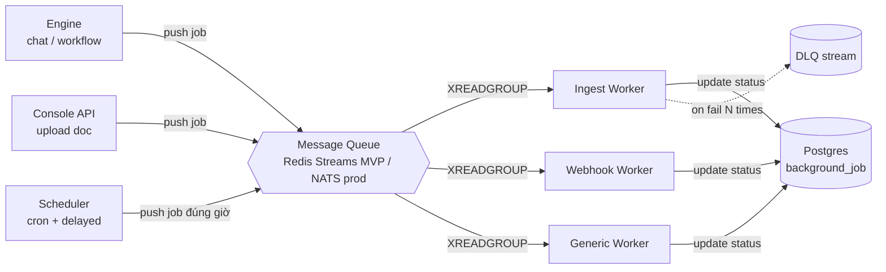

# Task Queue & Background Jobs

🟡 Draft — v0.1

## Trang này nói về

Mọi việc **không thể chạy đồng bộ trong request HTTP** — ingest tài liệu, embed batch, gửi webhook outbound, chạy cron workflow — đều đi qua Task Queue. Trang này tập trung **toàn bộ** thiết kế MQ + Worker + Scheduler vào 1 chỗ: cách push job, nhận job, retry, timeout, scheduled, concurrency, scheduler HA.

**Phép hình dung**: Task Queue như **băng chuyền nhà bếp** —

- **Engine, Console, Scheduler** = đầu bếp đặt order lên băng
- **MQ stream** = băng chuyền chạy
- **Worker** = phụ bếp pick order từ băng, chạy việc, đặt kết quả về kho (Postgres)
- **Scheduler** = đồng hồ báo giờ, đẩy order định kỳ lên băng

**Đọc trang này nếu bạn là**:

- **Dev backend** — viết job producer/consumer, define job type, retry policy
- **DevOps** — provision Redis Streams / NATS, scale worker pool, monitor queue depth
- **Kiến trúc sư** — đánh giá khi nào swap Redis → NATS → Kafka

**Trang liên quan**: [Service boundaries](/03-architecture/01-services) (Async Worker là 1 service) · [Data stores](/03-architecture/02-data-stores) (MQ là 1 store) · [Multi-tenant Isolation](/03-architecture/06-multi-tenant) (tenant context trong job payload) · [Workflow Engine](/03-architecture/03-workflow-engine) (durable execution alt).

---

## 1. Mô hình tổng quan



### 1.1 Producer

3 nguồn push job:

| Producer | Khi nào push | Stream tiêu biểu |
| --- | --- | --- |
| **Engine** | User trigger work nặng (vd "ingest tài liệu này") | `mq:ingest`, `mq:webhook_out` |
| **Console API** | Builder upload file qua UI | `mq:ingest` |
| **Scheduler** | Cron hit, hoặc delayed job đến giờ | `mq:scheduled`, các stream khác qua re-dispatch |

### 1.2 Consumer (Worker pool)

Worker là service riêng (xem [Services §1.4](/03-architecture/01-services)). Mỗi worker:

- Join 1 consumer group cho từng stream nó care (vd `grp:ingest`)
- Pull job qua `XREADGROUP`
- Ack qua `XACK` khi xong
- Update status job trong Postgres `background_job` table (xem §6)

---

## 2. Tech stack

| Component | MVP | v2 production | v3+ scale |
| --- | --- | --- | --- |
| **Broker** | Redis Streams (đã có Redis) | NATS JetStream | Kafka (cho replay + stream processing) |
| **Worker framework** | Custom async loop Python | Same (hoặc Arq/RQ nếu cần feature) | Same |
| **Scheduler** | APScheduler + Postgres backing (advisory lock leader) | Same | Same |
| **Idempotency store** | Redis `SETNX` TTL 24h | Redis cluster | Redis cluster |
| **Job state** | Postgres `background_job` table | Same | Same |
| **DLQ** | Stream riêng `mq:dlq:<purpose>` | Same | Kafka topic riêng |

### 2.1 Vì sao Redis Streams cho MVP

Đã có Redis sẵn cho cache + lock → 0 cài thêm component. Throughput < 1K msg/s là đủ cho < 100 tenant pilot. Khi vượt → swap NATS (giữ interface adapter).

Comparison đầy đủ ở [Services §4.1](/03-architecture/01-services).

### 2.2 Interface adapter để swap

Code dev phải dùng interface chung:

```python
class TaskQueue(Protocol):
    async def push(self, stream: str, message: dict) -> str: ...
    async def consume(
        self, stream: str, group: str, consumer: str
    ) -> AsyncIterator[Message]: ...
    async def ack(self, stream: str, group: str, message_id: str) -> None: ...
    async def claim_pending(
        self, stream: str, group: str, min_idle_ms: int
    ) -> list[Message]: ...

class RedisStreamsAdapter(TaskQueue): ...   # MVP
class NatsAdapter(TaskQueue): ...           # v2
```

Swap broker = đổi adapter init, không sửa domain code.

---

## 3. Message contract

Mọi message **bắt buộc** có shape sau:

```json
{
  "event_id": "evt_01H...",
  "tenant_id": "t_cmc_corp",
  "workspace_id": "w_hr_bot",
  "job_id": "job_01H...",
  "job_type": "ingest_document",
  "payload": {
    "document_id": "doc_..."
  },
  "attempts": 0,
  "scheduled_for": "2026-05-20T10:00:00Z",
  "trace_context": {
    "traceparent": "00-...",
    "tracestate": "..."
  }
}
```

| Field | Bắt buộc | Vai trò |
| --- | --- | --- |
| `event_id` | ✅ | ID duy nhất event, dùng cho idempotency dedup |
| `tenant_id` + `workspace_id` | ✅ | Khôi phục tenant context (không có HTTP request) — xem §5 |
| `job_id` | ✅ | Reference vào Postgres `background_job` row để track status |
| `job_type` | ✅ | Phân loại để worker route đúng handler (vd `ingest_document`, `send_webhook`) |
| `payload` | ✅ | Dữ liệu nghiệp vụ cụ thể cho job |
| `attempts` | ✅ | Counter retry, default 0 lúc push |
| `scheduled_for` | optional | Nếu set, Scheduler giữ đến đúng giờ mới push lên stream |
| `trace_context` | ✅ | OTEL `traceparent` từ producer để consumer continue trace |

---

## 4. Reliability — 5 cơ chế

### 4.1 Idempotency (dedup duplicate)

Worker trước khi process check `event_id` đã thấy chưa:

```python
async def process(msg):
    if not await redis.set(
        f"idem:{msg.event_id}", "1", nx=True, ex=86400
    ):
        await ack(msg)  # đã xử lý, ack lại để khỏi pending
        return
    await handler(msg)
    await ack(msg)
```

Lý do TTL 24h: đủ dài để cover mọi redelivery có thể xảy ra; ngắn để không tích đầy Redis.

### 4.2 Ack + pending recovery

- Worker pull job → status "pending in group"
- Process xong → `XACK` → message bị xoá khỏi pending list
- Worker crash trước khi ACK → message kẹt ở pending
- **Recovery**: 1 worker khác chạy `XAUTOCLAIM` định kỳ (mỗi 30s) — claim mọi message pending > 5 phút → process lại

```python
# Mỗi worker chạy task định kỳ
async def claim_orphaned():
    while True:
        await asyncio.sleep(30)
        orphans = await redis.xautoclaim(
            stream="mq:ingest",
            group="grp:ingest",
            consumer=my_id,
            min_idle_time=5 * 60 * 1000,  # 5 phút
            count=10,
        )
        for msg in orphans:
            await process(msg)
```

### 4.3 Retry strategy — exponential backoff + jitter

| Aspect | Spec |
| --- | --- |
| Strategy | Exponential backoff |
| Base delay | 1 giây |
| Cap | 60 giây |
| Multiplier | 2× |
| Jitter | ±25% random (chống thundering herd) |
| Max attempts | 5 (default, configurable per job type) |

Formula: `delay = min(cap, base × 2^attempt) × (1 ± rand(0, 0.25))`

Sequence: ~1s, ~2s, ~4s, ~8s, ~16s → DLQ.

**Implementation**: khi fail, worker re-push message với `attempts += 1` và `scheduled_for = now() + delay`. Scheduler service giữ đến giờ rồi đẩy lại.

```python
async def on_failure(msg, exc):
    msg.attempts += 1
    if msg.attempts >= job_config[msg.job_type].max_attempts:
        await push_dlq(msg, error=str(exc))
        await mark_job_failed(msg.job_id, str(exc))
        return
    delay = compute_backoff(msg.attempts)
    msg.scheduled_for = utcnow() + timedelta(seconds=delay)
    await push("mq:scheduled", msg)
```

### 4.4 Dead-letter queue (DLQ)

Sau max_attempts thất bại → push sang `mq:dlq:<original_stream>`:

```json
{
  "event_id": "...",
  "original_stream": "mq:ingest",
  "failed_at": "...",
  "final_error": "...",
  "attempts_history": [...]
}
```

**Recovery UX** (chưa implement, v2): trang `Settings → Failed Jobs` per workspace để builder review + click "Retry" → re-push lên original stream với `attempts = 0`.

### 4.5 Stream trim (giới hạn memory Redis)

```bash
XADD mq:ingest MAXLEN ~ 100000 * job=ingest_document ...
```

`MAXLEN ~` (approximate) → Redis giữ ~100K message gần nhất, drop oldest. Nếu worker chậm > 100K backlog → cảnh báo (xem §10 metrics).

---

## 5. Multi-tenant context propagation

Background job **không có HTTP request → không lấy tenant từ JWT được**. Solution:

1. Producer **bắt buộc** ghi `tenant_id` + `workspace_id` vào payload (validate ở interface level)
2. Worker khôi phục context khi nhận message:

```python
async def handle(msg):
    with tenant_context(msg.tenant_id, msg.workspace_id):
        # Mọi repository lookup từ đây đều scoped
        await ingest_document(msg.payload.document_id)
```

3. Repository tự validate context lại (defense in depth) — xem [Multi-tenant Isolation §5.5](/03-architecture/06-multi-tenant).

---

## 6. Job status tracking — `background_job` table

Mỗi job có 1 row trong Postgres `background_job`:

```sql
CREATE TABLE background_job (
  id              text PRIMARY KEY,        -- job_id
  tenant_id       text NOT NULL,
  workspace_id   text NOT NULL,
  job_type        text NOT NULL,           -- ingest_document, send_webhook, ...
  status          text NOT NULL,           -- queued | running | succeeded | failed | dlq
  progress        int DEFAULT 0,           -- 0-100
  payload_summary jsonb,                   -- snippet để hiển thị UI
  result          jsonb,                   -- output nếu thành công
  error           text,                    -- lỗi nếu fail
  attempts        int DEFAULT 0,
  started_at      timestamptz,
  completed_at    timestamptz,
  created_at      timestamptz DEFAULT now(),
  created_by      text,                    -- account_id của producer

  -- Resource link (optional, theo job type)
  resource_type   text,                    -- vd 'document'
  resource_id     text                     -- vd doc_id
);
```

**Lifecycle**:

```text
PUSH:    INSERT row status=queued
WORKER:  UPDATE status=running, started_at=now()
PROGRESS:UPDATE progress=N (mỗi N second hoặc N item)
END:     UPDATE status=succeeded|failed|dlq, completed_at=now(), result/error
```

**Client tracking**:

| Cách | Khi nào dùng |
| --- | --- |
| **Polling** | UI mặc định — `GET /jobs/{job_id}` mỗi 2-5s |
| **SSE stream** | Trang UI có progress bar realtime cho job > 30s |
| **Webhook out** | Khi tenant config webhook → backend push notification khi job đổi status |

---

## 7. Delayed / scheduled jobs

Vấn đề: Redis Streams **không native hỗ trợ delayed delivery**. Solution dùng Postgres-backed Scheduler:

### 7.1 Schema

```sql
CREATE TABLE scheduled_event (
  id           text PRIMARY KEY,
  scheduled_for timestamptz NOT NULL,
  stream       text NOT NULL,       -- target stream khi đến giờ
  payload      jsonb NOT NULL,      -- full message contract
  status       text NOT NULL,       -- pending | dispatched | cancelled
  created_at   timestamptz DEFAULT now()
);

CREATE INDEX idx_sched_pending
  ON scheduled_event (scheduled_for)
  WHERE status = 'pending';
```

### 7.2 Push delayed job

```python
async def push_delayed(stream: str, message: dict, run_at: datetime):
    await pg.execute(
        "INSERT INTO scheduled_event (id, scheduled_for, stream, payload, status) "
        "VALUES ($1, $2, $3, $4, 'pending')",
        message["event_id"], run_at, stream, message,
    )
```

### 7.3 Scheduler dispatch loop

Scheduler service (single-leader, xem §9) chạy loop mỗi 1 phút:

```python
async def dispatch_loop():
    while True:
        await asyncio.sleep(60)
        with pg.transaction():
            due = await pg.fetch(
                "SELECT * FROM scheduled_event "
                "WHERE status='pending' AND scheduled_for <= now() "
                "ORDER BY scheduled_for LIMIT 1000 FOR UPDATE SKIP LOCKED"
            )
            for row in due:
                await mq.push(row.stream, row.payload)
                await pg.execute(
                    "UPDATE scheduled_event SET status='dispatched' WHERE id=$1",
                    row.id,
                )
```

`FOR UPDATE SKIP LOCKED` cho phép nhiều scheduler instance pull song song mà không xung đột (mặc dù chỉ 1 active thật sự — chống race vẫn an toàn).

### 7.4 Use cases

| Use case | Cách dùng |
| --- | --- |
| Retry với backoff | `push_delayed(orig_stream, msg, now + delay)` |
| Cron workflow | Scheduler tự insert `scheduled_event` từ cron expression |
| Quota reset | Scheduler đầu mỗi cycle push job reset usage |
| Trial expiry warning | Push event 7 ngày trước `expires_at` của Subscription |

---

## 8. Job timeout + checkpoint

### 8.1 Timeout per job type

| Job type | Timeout (giây) | Lý do |
| --- | --- | --- |
| `send_webhook` | 30 | External endpoint phải nhanh |
| `ingest_document` | 600 (10 phút) | PDF lớn cần parse + chunk + embed |
| `embed_batch` | 300 | Batch 1000 segment |
| `workflow_run` (in-process MVP) | 3600 (1 giờ) | Workflow phức tạp |
| `cleanup_archived` | 1800 | Bulk DB operation |

Worker config-driven, đọc từ `job_config.json` hoặc env.

### 8.2 Khi sắp timeout

Worker khởi động timer khi nhận job. 80% timeout → trigger **graceful checkpoint**:

```python
async def handle_ingest(msg):
    deadline = monotonic() + timeout
    chunks = await load_remaining_chunks(msg.payload.document_id)
    for chunk in chunks:
        if monotonic() > deadline - 30:  # 30s buffer
            await save_progress(msg.job_id, processed=chunk.position)
            # Re-push để worker khác tiếp tục
            msg.payload["resume_from"] = chunk.position
            await mq.push("mq:ingest", msg)
            return
        await process_chunk(chunk)
```

→ Job dài chia thành nhiều "chunk", checkpoint sau từng chunk. Nếu worker crash giữa chừng → XAUTOCLAIM pickup → resume từ `resume_from`.

### 8.3 Hard timeout

Nếu worker hang (deadlock, infinite loop) → bên ngoài kill process. Khi đó:

- Pending message tự được claim bởi worker khác sau 5 phút (XAUTOCLAIM)
- Job status update bằng watchdog Scheduler: nếu `started_at` cách `now()` > 2 × timeout → mark `failed` với error "worker hang"

---

## 9. Concurrency control per resource

Vấn đề: 2 worker cùng pull 2 message ingest cho cùng 1 document (race) → fight nhau.

### 9.1 Resource lock

Trước khi process, acquire Redis lock theo resource:

```python
async def handle(msg):
    lock_key = f"lock:job:{msg.job_type}:{msg.resource_id}"
    async with redis_lock(lock_key, ttl=60, renew_every=20):
        # Renew TTL mỗi 20s trong khi work (watchdog)
        await actual_work(msg)
```

`redis_lock`:

- `SETNX lock_key worker_id EX 60` → nếu fail = ai đó đang work → return
- Background task renew TTL mỗi 20s (xem [Data stores §4.2](/03-architecture/02-data-stores))
- Release bằng Lua atomic (chỉ release nếu vẫn là token của mình)

### 9.2 Khi lock fail

Nếu không acquire được:

```python
async def handle(msg):
    lock_key = f"lock:job:{msg.job_type}:{msg.resource_id}"
    if not await try_acquire(lock_key):
        # Re-push với delay nhỏ, tránh hot-loop
        msg.scheduled_for = utcnow() + timedelta(seconds=5)
        await push_delayed("mq:scheduled", msg)
        await ack_original(msg)
        return
    # ... work
```

### 9.3 Idempotency vẫn cần

Lock là **first line**; idempotency dedup (§4.1) là **defense in depth** — phòng trường hợp:

- Lock release giữa chừng do crash
- Job retry sau khi đã thành công (consumer crash sau work nhưng trước ACK)

---

## 10. Scheduler HA — leader election qua Postgres

Scheduler **chỉ 1 active** (tránh duplicate cron trigger). Standby instance polling đợi.

### 10.1 PG advisory lock pattern

```python
LEADER_LOCK_KEY = 0x5C4E_D000  # arbitrary 64-bit int

async def run_as_leader():
    async with pg.acquire() as conn:
        while True:
            got = await conn.fetchval(
                "SELECT pg_try_advisory_lock($1)", LEADER_LOCK_KEY
            )
            if got:
                try:
                    await dispatch_loop()  # blocking, run forever
                finally:
                    await conn.fetchval(
                        "SELECT pg_advisory_unlock($1)", LEADER_LOCK_KEY
                    )
            else:
                await asyncio.sleep(5)  # standby poll
```

**Đặc tính**:

- PG advisory lock gắn với **connection** — nếu connection close (crash, restart) → lock tự release
- Standby pickup trong vòng 5-10s
- Đơn giản hơn Redis Redlock; dùng PG đã có

### 10.2 Số instance khuyến nghị

- MVP: 1 active + 1 standby (k8s replicas=2)
- Production: 1 active + 2 standby cho HA cao hơn

---

## 11. Outbox pattern — Postgres + MQ transactional consistency

Vấn đề: muốn "insert business row + push MQ" atomic, nhưng không có distributed transaction.

### 11.1 Schema

```sql
CREATE TABLE outbox (
  id           text PRIMARY KEY,
  stream       text NOT NULL,
  payload      jsonb NOT NULL,
  status       text NOT NULL DEFAULT 'pending',  -- pending | published
  created_at   timestamptz DEFAULT now(),
  published_at timestamptz
);

CREATE INDEX idx_outbox_pending
  ON outbox (created_at)
  WHERE status = 'pending';
```

### 11.2 Producer flow

```python
async def upload_document(doc):
    async with pg.transaction():
        await pg.insert("document", doc.to_row())
        await pg.insert("outbox", {
            "id": ulid(),
            "stream": "mq:ingest",
            "payload": build_ingest_message(doc),
        })
    # Transaction commit → outbox row + document row cùng có
```

### 11.3 Outbox dispatcher

Poller riêng (chạy trong Worker service hoặc tách process):

```python
async def outbox_dispatcher():
    while True:
        await asyncio.sleep(2)
        rows = await pg.fetch(
            "SELECT * FROM outbox WHERE status='pending' "
            "ORDER BY created_at LIMIT 100 FOR UPDATE SKIP LOCKED"
        )
        for row in rows:
            try:
                await mq.push(row.stream, row.payload)
                await pg.execute(
                    "UPDATE outbox SET status='published', published_at=now() "
                    "WHERE id=$1", row.id
                )
            except Exception:
                # Để pending, lần sau retry
                pass
```

### 11.4 Cleanup

Sau 24h, row `status=published` được archive sang cold storage (audit) + xoá khỏi `outbox`.

---

## 12. Observability — metrics + alerts

### 12.1 Core metrics

| Metric | Đo gì | Alert threshold |
| --- | --- | --- |
| `mq.depth{stream=X}` | Số message pending trong stream | > 10K → warn, > 50K → critical |
| `mq.lag_seconds{stream=X}` | Tuổi message cũ nhất trong stream | > 60s → warn, > 300s → critical |
| `mq.pending{group=X}` | Số message đang in-flight (chưa ACK) | > 1K → warn |
| `mq.dlq.size{stream=X}` | Số message trong DLQ | > 100 → warn (cần builder review) |
| `worker.process_duration_ms{job_type=X}` | Latency xử lý job p50/p95/p99 | p99 > timeout × 0.8 → warn |
| `worker.error_rate{job_type=X}` | % job fail / total | > 5% → warn |
| `worker.attempts_histogram{job_type=X}` | Distribution attempts trước khi succeed | Most jobs ≤ 1 attempt |

### 12.2 Trace propagation

Producer inject OTEL `traceparent` vào `message.trace_context`. Worker extract làm parent span:

```python
async def handle(msg):
    parent = trace.extract(msg.trace_context)
    with tracer.start_as_current_span(
        f"worker.{msg.job_type}",
        context=parent,
        attributes={
            "tenant_id": msg.tenant_id,
            "job_id": msg.job_id,
            "attempts": msg.attempts,
        }
    ):
        await actual_work(msg)
```

→ Trace từ producer (API request) liên tục qua MQ → consumer. Khi debug, mở Tempo thấy timeline từ HTTP request đến worker hoàn thành.

### 12.3 Logging convention

Mỗi log line từ worker phải có:

```json
{
  "level": "info",
  "msg": "job_succeeded",
  "tenant_id": "t_...",
  "workspace_id": "w_...",
  "job_id": "job_...",
  "job_type": "ingest_document",
  "duration_ms": 12345,
  "attempts": 1
}
```

Cho phép truy vấn Loki theo `tenant_id` để xem mọi job 1 tenant.

---

## 13. Scaling phasing

### 13.1 MVP — Redis Streams

| Component | Cấu hình | Capacity |
| --- | --- | --- |
| Redis | Standalone 4GB RAM | ~100K msg lưu, ~1K msg/s throughput |
| Worker | 2 instance, mỗi instance 5 connection PG | ~50 job concurrent |
| Scheduler | 1 active + 1 standby | (không scale horizontal) |

### 13.2 v2 — NATS JetStream

Triggers:
- Queue depth thường xuyên > 50K
- Throughput > 1K msg/s
- Multi-region deployment cần replication

Migration: adapter swap, dual-write 1 tuần, cutover. Stream contract không đổi.

### 13.3 v3 — Kafka

Triggers:
- Cần replay (audit, debug production issue lịch sử)
- Stream processing (CDC từ Postgres, analytics realtime)
- > 100K msg/s

Kafka có ecosystem rich (Kafka Streams, ksqlDB) — đáng đầu tư khi quy mô đủ.

---

## 14. Trade-off đã chấp nhận

| Quyết định | Lý do | Đánh đổi |
| --- | --- | --- |
| Redis Streams thay vì broker chuyên (NATS/RabbitMQ) cho MVP | Đã có Redis, giảm component vận hành | Throughput trần thấp (~1K msg/s); thay khi vượt |
| Custom async loop thay vì Celery/Arq | Đơn giản, dễ debug; control trace propagation tốt hơn | Phải tự maintain consumer logic, autoclaim, etc. |
| Postgres-backed Scheduler thay vì sorted set Redis | Persistence, transactional với business data | Dispatch granularity 1 phút (đủ cho mọi use case CAP) |
| PG advisory lock cho leader election | Đơn giản, dùng PG có sẵn, auto-release khi crash | Standby polling 5-10s mới promote (acceptable cho non-realtime cron) |
| Outbox pattern thay vì 2PC | Loại bỏ distributed transaction phức tạp | Eventual consistency (publish lag 1-2s), consumer phải idempotent |
| Idempotency dedup TTL 24h | Đủ cover redelivery thực tế | Job retry sau 24h sẽ chạy lại (extremely rare; acceptable) |
| Exponential backoff với jitter | Standard pattern, tránh thundering herd | Job retry mất thời gian; max ~30s tổng cho 5 lần |

---

## 15. Câu hỏi còn mở

| # | Câu hỏi | Cân nhắc | Phiên bản |
| --- | --- | --- | --- |
| Q1 | Per-tenant fairness — 1 tenant push 10K job có chiếm queue? | Multi-stream per tier (`mq:ingest:high` cho Enterprise, `:standard`) hoặc token bucket producer-side. MVP chưa cần vì pilot ít tenant | v2 |
| Q2 | Priority queue chính thức | Stream tách theo priority + weighted round-robin consumer. Hay 1 stream + priority field? | v2 |
| Q3 | DLQ recovery UX trong Console | Trang "Failed jobs" per workspace với filter, replay button, bulk retry | v2 |
| Q4 | Webhook outbound: 4xx vs 5xx retry semantics | 5xx + timeout → retry với backoff; 4xx → DLQ ngay (sai request, retry vô ích) | MVP cần chốt |
| Q5 | MQ broker production: NATS / RabbitMQ / Kafka | Đã list trade-off ở [Services Q1](/03-architecture/01-services); chọn dựa trên throughput + ops team familiar | v2 |
| Q6 | Long-running workflow > 1 giờ | Tách Engine thành durable execution (Temporal) hoặc giữ in-process + checkpoint pattern? | v2-v3 |
| Q7 | Stream sharding khi 1 stream > 100K msg/s | NATS native; Redis cluster cần custom partitioning | v3 |
| Q8 | Cross-region replication khi multi-region | NATS có super-cluster; Kafka có MirrorMaker | v4-v5 |

---

## Liên kết

- [Service boundaries](/03-architecture/01-services) — Async Worker, Scheduler là 2 service
- [Data stores §6 Message Queue](/03-architecture/02-data-stores) — MQ là 1 trong 5 store
- [Multi-tenant Isolation §5.5](/03-architecture/06-multi-tenant) — tenant context trong job payload
- [Workflow Engine](/03-architecture/03-workflow-engine) — durable execution alternative
- [Observability](/03-architecture/08-observability) — trace + log + metric cho background job
- [Knowledge Base](/02-domain/05-knowledge) — ingest pipeline là use case lớn nhất của Task Queue
- [Conversation §7 Workflow Run](/02-domain/07-conversation) — workflow run lifecycle `queued → running`
