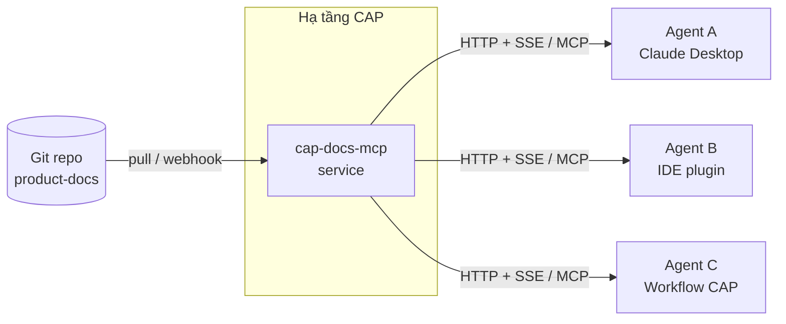

# Truy cập docs CAP qua MCP

🟡 Draft

Hướng dẫn cho **AI agent ngoài** (Claude Code session khác, agent SDK, IDE plugin, chatbot doanh nghiệp…) muốn đọc docs CAP một cách lập trình.

**[MCP — Model Context Protocol](https://modelcontextprotocol.io)** là chuẩn mở do Anthropic dẫn dắt, cho phép LLM client kết nối tới các "server" cung cấp tool/resource.

---

## Nguyên tắc thiết kế

Docs CAP là **nguồn dữ liệu chung của tổ chức** — không phải file cá nhân trên máy ai. Vì vậy MCP serve docs CAP **phải là service do đội CAP host trung tâm**. Client chỉ cấu hình **URL + API key** — không nên (và không cần) biết docs nằm ở đâu trong filesystem nào.



→ Spec chi tiết của service ở [02-custom-mcp-spec](/09-agent-access/02-custom-mcp-spec).

---

## 3 cách kết nối — theo độ khuyến nghị

| # | Cách | Khi nào dùng | Cần |
| --- | --- | --- | --- |
| 1 | **Remote MCP service** do CAP host | Mặc định cho mọi agent ngoài | URL + API key |
| 2 | **`fetch` MCP** trỏ vào Docusaurus site đã deploy | Tổ chức chưa triển khai (1) — đọc tạm | URL site |
| 3 | **`filesystem` MCP** local | Người **sửa** docs trên máy của mình (docs contributor) | Repo đã clone |

> ⚠️ **Đừng** hard-code đường dẫn filesystem của 1 máy cụ thể vào doc dùng chung, vào config share với team, hay vào prompt mẫu. Path local là chuyện riêng của từng máy.

---

## Cách 1 — Remote MCP service (recommended)

### Endpoint

| Môi trường | URL |
| --- | --- |
| Production | `https://docs-mcp.cap.cmc.local/sse` *(placeholder — chốt khi deploy)* |
| Staging | `https://docs-mcp.staging.cap.cmc.local/sse` |

### Cấu hình Claude Desktop / Claude Code

```json
{
  "mcpServers": {
    "cap-docs": {
      "url": "https://docs-mcp.cap.cmc.local/sse",
      "transport": "sse",
      "headers": {
        "Authorization": "Bearer <CAP_DOCS_MCP_KEY>"
      }
    }
  }
}
```

Trên Claude Code (CLI):

```bash
claude mcp add cap-docs --transport sse \
  --url https://docs-mcp.cap.cmc.local/sse \
  --header "Authorization: Bearer ${CAP_DOCS_MCP_KEY}"
```

### Lấy API key

API key cấp theo workspace/user trong CAP — quy trình cấp & rotate theo [docs/02-domain/02-iam-rbac](/02-domain/02-iam-rbac). Trong giai đoạn MVP, liên hệ admin để xin key.

### Tool agent có được

| Tool | Mục đích |
| --- | --- |
| `list_sections` | Cây ToC toàn bộ docs |
| `get_doc` | Lấy 1 trang theo slug, kèm frontmatter & trạng thái |
| `search_docs` | Semantic search có filter section / trạng thái |
| `find_term` | Tra glossary |

Chi tiết schema: [02-custom-mcp-spec](/09-agent-access/02-custom-mcp-spec).

### Ưu điểm

- **Zero local setup** — agent chạy ở đâu cũng kết nối được.
- **Luôn mới** — service tự pull docs từ git, không cần client sync.
- **Có search semantic**, có filter trạng thái 🟢/🟡/🔴.
- **Có ACL & audit log** — biết ai đọc gì khi nào.
- **Centralized rate limit & cost control**.

### Hạn chế

- Cần đội CAP **deploy service trước** — hiện đang ở giai đoạn thiết kế, chưa available.

---

## Cách 2 — `fetch` MCP trỏ vào site deployed

Dùng khi tổ chức **chưa deploy** remote MCP service ở Cách 1, nhưng docs đã deploy lên một domain.

### Server

[@modelcontextprotocol/server-fetch](https://github.com/modelcontextprotocol/servers/tree/main/src/fetch) — package chính thức.

### Cấu hình

```json
{
  "mcpServers": {
    "fetch": {
      "command": "uvx",
      "args": ["mcp-server-fetch"]
    }
  }
}
```

Agent được tool `fetch(url)` — trả về Markdown đã convert từ HTML. Sau đó agent fetch các URL của docs CAP đã deploy.

### Endpoint hữu ích trên site Docusaurus

| URL | Trả về |
| --- | --- |
| `https://<host>/` | Trang landing |
| `https://<host>/01-overview/02-architecture` | Trang architecture |
| `https://<host>/sitemap.xml` | Danh sách mọi trang (Docusaurus tự sinh) |

### Hạn chế của fetch

- Phải parse HTML → sidebar/nav lẫn vào kết quả → hơi nhiễu.
- Không có frontmatter (`sidebar_position`, status badge) — đã strip khi render HTML.
- Không có semantic search.
- Mermaid render thành SVG → agent text-only không hiểu sơ đồ.

→ Dùng tạm cho đến khi Cách 1 ready.

---

## Cách 3 — `filesystem` MCP local (chỉ cho người sửa docs)

> 🛑 Cách này **chỉ phù hợp** cho người **đang sửa** docs trên máy của họ — vd biên tập viên đang viết bài mới và muốn agent giúp soạn nội dung. **Không phù hợp** cho agent đọc docs về CAP như một "khách hàng".

### Server filesystem

[@modelcontextprotocol/server-filesystem](https://github.com/modelcontextprotocol/servers/tree/main/src/filesystem).

### Cấu hình mẫu

```json
{
  "mcpServers": {
    "cap-docs-local": {
      "command": "npx",
      "args": [
        "-y",
        "@modelcontextprotocol/server-filesystem",
        "<đường-dẫn-tới-thư-mục-docs-trên-máy-bạn>"
      ]
    }
  }
}
```

Đường dẫn ở `<…>` là path **trên máy của chính bạn** sau khi clone repo:

- Linux/macOS: vd `/home/you/cap/product-docs/docs`
- Windows: vd `C:\Users\you\cap\product-docs\docs`

### Quy tắc

- **Chỉ expose thư mục `docs/`**, không expose root repo — tránh leak `.env`, lock file, `node_modules`.
- **Đừng commit cấu hình này vào repo** với path cụ thể — đặt trong file MCP config của máy bạn.
- **Không share file cấu hình** đã điền sẵn path với team — mỗi người 1 path khác.

### Khi nào nên có thêm `git` MCP

Nếu agent cần biết history (ai sửa gì):

```json
{
  "cap-docs-git": {
    "command": "uvx",
    "args": ["mcp-server-git", "--repository", "<repo-root-trên-máy-bạn>"]
  }
}
```

---

## Best practice cho agent đọc docs CAP

1. **Bắt đầu từ trang landing** ([intro](/)) — có bản đồ section.
2. **Đọc [glossary](/01-overview/03-glossary)** trước khi trả lời câu hỏi domain — thuật ngữ CAP có định nghĩa riêng (vd `Workspace` ≠ `Workspace` của Dify).
3. **Tôn trọng badge trạng thái**:
   - 🟢 Đã thống nhất → trích dẫn tự tin.
   - 🟡 Draft → nói rõ "theo bản dự thảo hiện tại".
   - 🔴 Placeholder → đừng trích như sự thật.
4. **Cite source** khi trả lời: dẫn link `/02-domain/03-agent#…`.
5. **Không trả lời từ memory** — docs cập nhật thường xuyên, đọc lại mỗi session.

---

## Bảo mật

| Vấn đề | Mitigation |
| --- | --- |
| Docs có section internal-only sau này | Remote service ở Cách 1 có ACL theo scope (xem [spec](/09-agent-access/02-custom-mcp-spec#authentication--authorization)) |
| Lộ path / thông tin máy qua config share | Cách 3 chỉ dùng local; Cách 1/2 không có path |
| API key bị lộ | Rotate qua admin CAP; audit log ghi mọi tool call |
| Filesystem MCP expose root repo nhầm | Cách 3 hướng dẫn chỉ trỏ `docs/`, không phải root |

---

## Tham khảo

- [MCP specification](https://modelcontextprotocol.io/specification)
- [Reference MCP servers](https://github.com/modelcontextprotocol/servers)
- [Claude Desktop MCP setup](https://modelcontextprotocol.io/quickstart/user)
- [Custom MCP server spec cho CAP](/09-agent-access/02-custom-mcp-spec)
