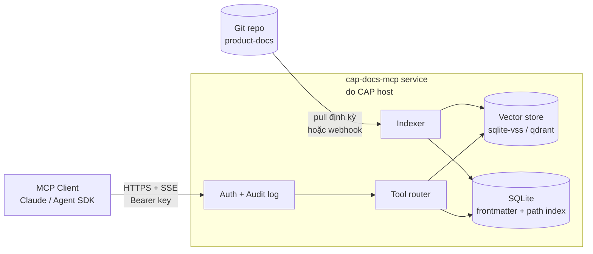

# Custom MCP server cho CAP docs — Spec

🔴 Placeholder — **đây là tài liệu thiết kế**, chưa implement

Spec cho một **MCP server chuyên dụng** phục vụ docs CAP, dùng khi `filesystem`/`fetch` MCP có sẵn không đủ (cần search semantic, lọc theo trạng thái 🟢/🟡/🔴, return structured frontmatter, multi-tenant access control…).

> Để dùng ngay với MCP có sẵn, xem [01-mcp-access](/09-agent-access/01-mcp-access).

---

## Vì sao cần custom server

| Vấn đề khi dùng MCP có sẵn | Custom server giải quyết |
| --- | --- |
| `filesystem` chỉ search theo glob/regex, không hiểu cấu trúc docs | Tool `search_docs` với semantic ranking + filter theo section |
| Không trả frontmatter cùng nội dung | Tool `get_doc` trả `{ frontmatter, content, status, last_modified }` |
| Không phân biệt 🟢/🟡/🔴 | Filter `status` ở mọi tool |
| Không có ACL — ai expose là ai đọc được hết | Hỗ trợ API key + scope (theo tenant nếu sau này docs có phần riêng) |
| Phải đọc từng file để biết structure | Tool `list_sections` trả ToC dưới dạng JSON cây |
| Mermaid không parse được | Tool `get_doc` có option `extract_diagrams: true` trả riêng các diagram |

---

## Phạm vi

- ✅ **In scope**: serve docs trong `docs/`, search, browse, get bằng path/slug.
- ❌ **Out of scope** (v1): edit docs, deploy site, quản lý user (sẽ delegate cho CAP backend khi tích hợp thật).

---

## Kiến trúc đề xuất



- **Mô hình triển khai**: **hosted service** do đội CAP vận hành. Client (agent ngoài) chỉ kết nối qua URL + API key — không cần biết docs nằm ở đâu.
- **Nguồn docs**: service **pull từ git repo `product-docs`** (định kỳ hoặc webhook), giải nén ra storage nội bộ, indexer build index. Client **không** trỏ vào filesystem nào.
- **Transport chính**: **HTTP + SSE** (multi-client, remote). Stdio chỉ dùng cho **dev mode** khi developer chạy service local để debug.
- **Embedding model**: configurable — default `text-embedding-3-small` (OpenAI) hoặc `bge-small` local cho môi trường air-gapped.

---

## Tool API

### 1. `list_sections`

Trả về cây ToC của toàn bộ docs.

**Input**: `{}`

**Output**:
```json
{
  "sections": [
    {
      "slug": "01-overview",
      "label": "01 — Overview",
      "position": 1,
      "description": "Vision, kiến trúc tổng quan, glossary",
      "pages": [
        { "slug": "01-vision", "title": "Vision", "status": "green", "position": 1 },
        { "slug": "02-architecture", "title": "Kiến trúc tổng quan", "status": "yellow", "position": 2 },
        { "slug": "03-glossary", "title": "Glossary", "status": "yellow", "position": 3 }
      ]
    }
  ]
}
```

`status` parse từ badge 🟢/🟡/🔴 trong nội dung trang.

---

### 2. `get_doc`

Lấy 1 trang theo path hoặc slug.

**Input**:
```json
{
  "path": "01-overview/02-architecture",
  "include_frontmatter": true,
  "extract_diagrams": false
}
```

**Output**:
```json
{
  "path": "01-overview/02-architecture",
  "title": "Kiến trúc tổng quan",
  "status": "yellow",
  "frontmatter": { "sidebar_position": 2 },
  "content": "...",
  "diagrams": [],
  "outgoing_links": [
    { "to": "02-domain/01-tenant-workspace", "anchor": null }
  ],
  "last_modified": "2026-05-12T10:23:00Z",
  "last_commit": "2b707bc"
}
```

---

### 3. `search_docs`

Semantic search.

**Input**:
```json
{
  "query": "phân quyền multi-tenant theo workspace",
  "top_k": 5,
  "filter": {
    "section": ["02-domain", "03-architecture"],
    "status": ["green", "yellow"]
  }
}
```

**Output**:
```json
{
  "results": [
    {
      "path": "02-domain/02-iam-rbac",
      "title": "IAM & RBAC",
      "score": 0.82,
      "snippet": "...workspace-level role override membership ở tenant level...",
      "matched_section": "## Workspace-level role"
    }
  ]
}
```

---

### 4. `find_term`

Tra thuật ngữ trong glossary.

**Input**: `{ "term": "Workspace" }`

**Output**:
```json
{
  "term": "Workspace",
  "definition": "Một không gian làm việc trong tenant. 1 tenant có N workspace",
  "dify_equivalent": "Mới — Dify không có khái niệm này; workspace của Dify = tenant",
  "source": "01-overview/03-glossary#tổ-chức--người-dùng",
  "related_pages": [
    "02-domain/01-tenant-workspace",
    "02-domain/02-iam-rbac"
  ]
}
```

---

### 5. `list_changes` (optional, cần git)

Liệt kê thay đổi gần đây trên docs.

**Input**: `{ "since": "2026-05-01", "section": null }`

**Output**:
```json
{
  "changes": [
    {
      "commit": "2b707bc",
      "author": "phongnd_cmcai",
      "date": "2026-05-14T...",
      "message": "Sync pnpm-lock.yaml...",
      "files": ["docs/intro.md"]
    }
  ]
}
```

---

## Resource API (MCP resources)

Bên cạnh tool, expose mỗi trang docs như 1 **MCP resource** để client browse như file:

| URI | Content |
| --- | --- |
| `cap-docs://intro` | Trang landing |
| `cap-docs://01-overview/02-architecture` | Trang architecture |
| `cap-docs://glossary` | Alias cho `01-overview/03-glossary` |
| `cap-docs://_index` | JSON ToC (= output của `list_sections`) |

`mime_type`: `text/markdown` cho trang, `application/json` cho `_index`.

---

## Authentication & Authorization

Vì service hosted ngay từ v0.1, **auth là bắt buộc từ đầu** (không có "stdio mode không cần auth").

| Layer | v0.1 | v0.2+ |
| --- | --- | --- |
| **API key** | Header `Authorization: Bearer <key>` — single shared key | Per-user / per-workspace key |
| **Scope** | Toàn bộ docs | Key có thuộc tính `sections_allowed: ["01-*", "02-*"]` — chặn truy cập section nội bộ |
| **Audit log** | Log file `{key_id, tool, args, timestamp}` | Export sang observability stack của CAP |
| **Rate limit** | Global cap đơn giản | Token bucket per key |

Khi CAP MVP có Auth backend, key issuance sẽ delegate sang đó. Trùng concept với phân quyền của chính CAP — xem [docs/02-domain/02-iam-rbac](/02-domain/02-iam-rbac).

---

## Cấu hình client

Client (agent ngoài) **chỉ cần URL + API key** — không cần biết về `DOCS_ROOT`, embedding, vector store… Đó là việc của operator.

```json
{
  "mcpServers": {
    "cap-docs": {
      "url": "https://docs-mcp.cap.cmc.local/sse",
      "transport": "sse",
      "headers": {
        "Authorization": "Bearer <CAP_DOCS_MCP_KEY>"
      }
    }
  }
}
```

Lấy key qua admin CAP. Xem hướng dẫn đầy đủ cho từng MCP client ở [01-mcp-access](/09-agent-access/01-mcp-access#cách-1--remote-mcp-service-recommended).

---

## Cấu hình operator (deploy service)

Cấu hình dưới đây là của **người vận hành service**, không phải của client.

### Biến môi trường

| Biến | Mục đích | Mặc định |
| --- | --- | --- |
| `DOCS_SOURCE_TYPE` | `git` (production) hoặc `local` (dev) | `git` |
| `DOCS_GIT_REPO` | URL repo, vd `https://git.cmc.local/cap/product-docs.git` | — |
| `DOCS_GIT_BRANCH` | Branch để pull | `master` |
| `DOCS_GIT_PULL_INTERVAL` | Chu kỳ pull (giây). `0` để chỉ webhook | `300` |
| `DOCS_LOCAL_PATH` | Chỉ dùng khi `DOCS_SOURCE_TYPE=local` (dev) | — |
| `EMBEDDING_PROVIDER` | `openai` / `local` | `openai` |
| `EMBEDDING_MODEL` | Model embedding | `text-embedding-3-small` |
| `OPENAI_API_KEY` | Bắt buộc nếu provider=openai | — |
| `INDEX_PATH` | Nơi lưu vector + meta DB | `/var/lib/cap-docs-mcp` |
| `AUTH_KEYS_PATH` | File JSON chứa danh sách API key | `/etc/cap-docs-mcp/keys.json` |
| `HTTP_PORT` | Port HTTP+SSE | `7821` |

### Chạy production (HTTP+SSE)

```bash
cap-docs-mcp serve \
  --transport sse \
  --port 7821 \
  --docs-source git \
  --docs-git-repo https://git.cmc.local/cap/product-docs.git \
  --docs-git-branch master \
  --auth-keys /etc/cap-docs-mcp/keys.json
```

### Chạy local dev (stdio, trỏ vào checkout cá nhân)

Chỉ cho developer **của service**, không phải cho client cuối:

```bash
cap-docs-mcp serve \
  --transport stdio \
  --docs-source local \
  --docs-local-path ./docs   # tương đối với CWD; tự đặt path của máy bạn
```

> Khi dùng mode này, đường dẫn là **chuyện riêng của máy developer** — không commit, không share.

---

## Tech stack đề xuất

| Thành phần | Lựa chọn |
| --- | --- |
| Runtime | Node.js 20+ (cùng stack với Docusaurus, dễ chia sẻ parser) |
| SDK | [`@modelcontextprotocol/sdk`](https://github.com/modelcontextprotocol/typescript-sdk) |
| Markdown parser | `remark` + `gray-matter` (Docusaurus đã dùng) |
| Mermaid extract | `remark-mermaid` hoặc regex code-fence |
| Vector store | `better-sqlite3` + `sqlite-vss` (local, zero-config) — hoặc Qdrant nếu deploy server |
| Embedding | OpenAI / local `bge-small-en-v1.5` qua `@xenova/transformers` |
| File watch | `chokidar` |
| Test | `vitest` |

---

## Roadmap

| Milestone | Phạm vi |
| --- | --- |
| **v0.1** | HTTP+SSE transport, single shared API key, git source + pull định kỳ, `list_sections` + `get_doc` + resource API. Chưa search. |
| **v0.2** | Thêm `search_docs` (semantic) + `find_term`. Indexer auto-rebuild khi git có commit mới. |
| **v0.3** | Per-user / per-workspace API key, scope theo section, audit log. Tích hợp với Auth của CAP nếu MVP đã có. |
| **v0.4** | `list_changes` (git integration), webhook khi docs đổi để client subscribe. |
| **v1.0** | Multi-version (theo `docsVersionDropdown` của Docusaurus), i18n nếu CAP thêm locale, stdio mode cho dev local. |

---

## Mở câu hỏi

- Có cần tích hợp **CAP backend Auth** thật khi v0.3 chứ không tự quản API key? — đợi Auth của CAP MVP chốt.
- Embedding local vs cloud: cloud rẻ hơn nhưng cần gửi nội dung docs ra ngoài → enterprise có thể không chấp nhận.
- Có expose **diagram render** (SVG) như resource riêng cho agent multimodal không?
- Cache layer giữa MCP server và client cho nhiều agent cùng đọc — có cần Redis không?

---

## Tham khảo

- [3 cách kết nối tới docs CAP](/09-agent-access/01-mcp-access) — hướng dẫn cho client (hosted service / `fetch` / `filesystem` dev)
- [MCP TypeScript SDK](https://github.com/modelcontextprotocol/typescript-sdk)
- [MCP specification](https://modelcontextprotocol.io/specification)
- [Docusaurus content plugin](https://docusaurus.io/docs/api/plugins/@docusaurus/plugin-content-docs) — cách Docusaurus parse docs, tham khảo khi viết indexer
