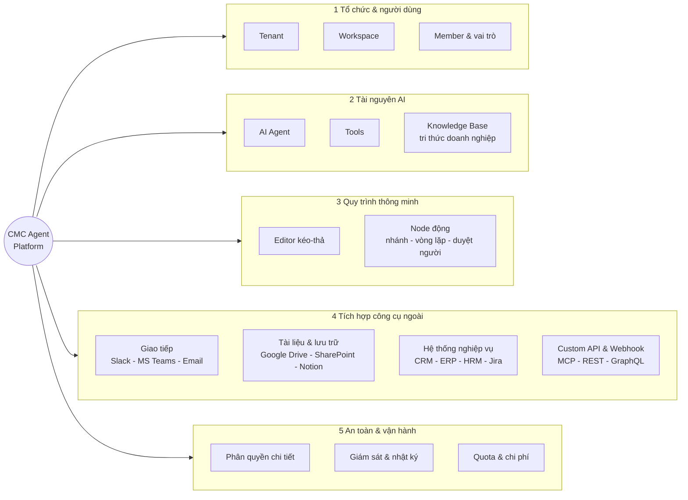
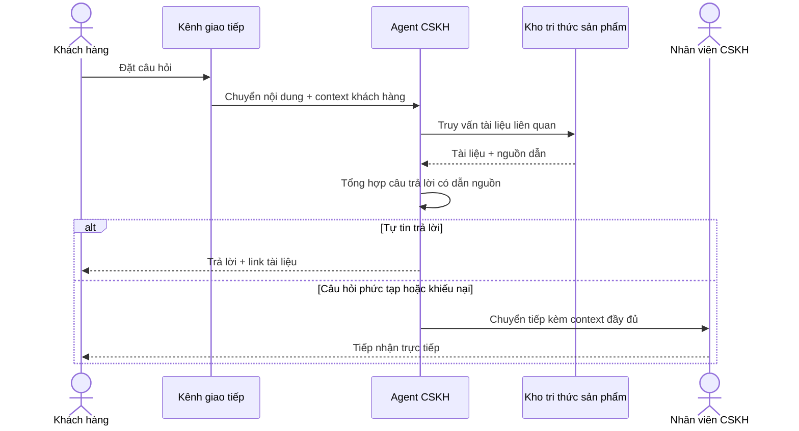
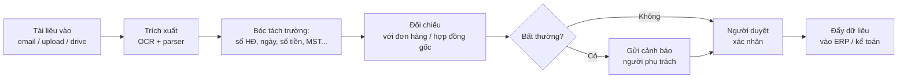
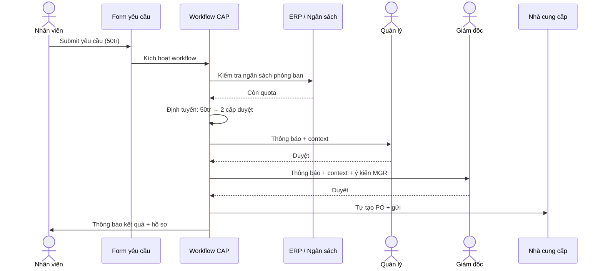

# CMC Agent Platform

**CMC Agent Platform (CAP)** là nền tảng **multi-tenant** dành cho doanh nghiệp, hỗ trợ **quản lý đa tác nhân (multi-agent)** và **xây dựng quy trình làm việc thông minh** dựa trên trí tuệ nhân tạo.

CAP giúp các tổ chức nhanh chóng thiết kế, triển khai và vận hành các trợ lý ảo (AI agent) cùng các luồng nghiệp vụ tự động hoá — từ chăm sóc khách hàng, hỗ trợ nội bộ, đến phân tích dữ liệu và xử lý tài liệu — mà **không yêu cầu lập trình chuyên sâu**.

---

## Bối cảnh & vấn đề

Hiện nay, mỗi doanh nghiệp đều có nhu cầu ứng dụng AI vào nhiều bài toán khác nhau, nhưng đang gặp 4 thách thức lớn:

| Thách thức | Mô tả |
| --- | --- |
| **Phân mảnh công cụ** | Mỗi phòng ban tự chọn một công cụ AI riêng → dữ liệu, chi phí, kiến thức bị chia nhỏ, không tái sử dụng được |
| **Khó kiểm soát rủi ro** | Không có cơ chế phân quyền và giám sát tập trung → nguy cơ lộ dữ liệu nội bộ, không tuân thủ quy định |
| **Phụ thuộc đội kỹ thuật** | Mọi thay đổi nhỏ về kịch bản trả lời, quy trình xử lý đều phải nhờ developer → triển khai chậm, tốn kém |
| **Khó mở rộng** | Khi tổ chức có nhiều khách hàng / dự án / phòng ban, công cụ đơn lẻ không đáp ứng được mô hình **đa tenant – đa workspace** |

---

## Giải pháp CAP mang lại

CAP là **nền tảng hợp nhất** giải quyết đồng thời 4 thách thức trên thông qua **5 nhóm năng lực cốt lõi**:

| # | Nhóm năng lực | Nội dung chính |
| --- | --- | --- |
| 1 | **Tổ chức & người dùng** | Quản lý nhiều tổ chức (tenant), nhiều không gian làm việc (workspace) trong từng tổ chức, mời thành viên và gán vai trò |
| 2 | **Tài nguyên AI** | Định nghĩa AI Agent, kết nối Tools, xây dựng Knowledge Base từ tri thức nội bộ doanh nghiệp |
| 3 | **Quy trình thông minh** | Thiết kế workflow bằng giao diện kéo-thả, hỗ trợ nhánh điều kiện, vòng lặp, chờ con người duyệt, gọi quy trình con |
| 4 | **Tích hợp công cụ ngoài** | Kết nối với hệ sinh thái sẵn có: kênh giao tiếp, kho tài liệu, hệ thống nghiệp vụ, API tuỳ biến |
| 5 | **An toàn & vận hành** | Phân quyền chi tiết theo tenant – workspace – tài nguyên, giám sát toàn hệ thống, kiểm soát chi phí AI |

---

## Mục tiêu sản phẩm

### 1. Trở thành **nền tảng hợp nhất** cho mọi giải pháp AI trong doanh nghiệp

Thay vì mỗi phòng ban tự xây hoặc thuê công cụ AI riêng, CAP cung cấp một nền tảng duy nhất để toàn tổ chức **chia sẻ hạ tầng, kiến thức và quy chuẩn**. Mỗi đơn vị có không gian làm việc (workspace) riêng nhưng vẫn được quản trị tập trung ở cấp tổ chức (tenant).

### 2. Trao quyền cho **người dùng nghiệp vụ** xây dựng AI mà không cần lập trình

CAP cung cấp giao diện **kéo-thả trực quan** để thiết kế quy trình làm việc với AI. Nhân sự nghiệp vụ (BA, PM, chuyên viên phòng ban) có thể tự định nghĩa kịch bản, kết nối nguồn dữ liệu, thiết kế logic xử lý — mà không cần viết code.

### 3. **Quản lý đa tác nhân** trong một hệ sinh thái thống nhất

Mỗi tác nhân (AI agent) trong CAP có vai trò và năng lực riêng — ví dụ: tác nhân tra cứu chính sách, tác nhân xử lý đơn hàng, tác nhân phân tích báo cáo. Các tác nhân có thể **phối hợp với nhau** trong cùng một quy trình để giải quyết những bài toán phức tạp.

### 4. **Tận dụng tri thức nội bộ** để nâng chất lượng câu trả lời

CAP cho phép tổ chức nạp tài liệu nội bộ (quy trình, hợp đồng, sản phẩm, FAQ...) vào kho tri thức (Knowledge Base). Tác nhân AI sẽ tham chiếu kho tri thức này khi trả lời, đảm bảo nội dung **chính xác, có nguồn gốc, không bịa đặt**.

### 5. Đảm bảo **an toàn dữ liệu và tuân thủ**

Mọi truy cập, mọi tương tác đều được **phân quyền chi tiết** theo tenant – workspace – tài nguyên, và được **ghi log đầy đủ** phục vụ audit. Dữ liệu của mỗi tổ chức được cách ly hoàn toàn, đáp ứng yêu cầu bảo mật cấp doanh nghiệp.

### 6. **Tối ưu chi phí và hiệu năng vận hành**

CAP theo dõi chi tiết chi phí gọi mô hình AI theo từng workspace / agent / người dùng, hỗ trợ thiết lập **hạn mức (quota)** và **báo cáo chi phí** minh bạch. Doanh nghiệp chủ động kiểm soát ngân sách AI mà không bị bất ngờ vì chi phí phát sinh.

---

## Đối tượng người dùng

CAP phục vụ **4 nhóm người dùng** chính, với mô hình phân quyền linh hoạt cho phép tổ chức **tự định nghĩa vai trò** phù hợp với cơ cấu nội bộ:

| Nhóm | Phạm vi | Vai trò trong hệ thống |
| --- | --- | --- |
| **Lãnh đạo tổ chức** | Toàn bộ tenant | Quản trị cấp cao nhất: tạo workspace, mời thành viên, theo dõi chi phí, audit và compliance toàn tổ chức |
| **Quản trị workspace** | Trong một workspace | Quản lý không gian làm việc: cấu hình tài nguyên (agent, tool, knowledge, workflow), mời thành viên, phân vai trò, giám sát hoạt động |
| **Thành viên (Member)** | Tài nguyên được cấp quyền | Tham gia xây dựng và vận hành. **Vai trò có thể tuỳ biến** theo nhu cầu tổ chức — ví dụ: nhà thiết kế quy trình, biên tập viên tri thức, người vận hành, người kiểm thử, người chỉ xem báo cáo… |
| **Người dùng cuối (End user)** | Tương tác với sản phẩm AI đã triển khai | **Trực tiếp** — chat với agent qua giao diện CAP cung cấp hoặc iframe nhúng; **Gián tiếp** — dùng một sản phẩm khác (website, app, CRM, chatbot, hệ thống nội bộ…) có tích hợp với CAP qua API; người dùng có thể không biết "đằng sau là CAP" |

> 💡 **Vai trò tuỳ biến** — không như các nền tảng có sẵn vài role cố định (Admin / Editor / Viewer), CAP cho phép Quản trị workspace **tạo vai trò mới** với bộ quyền tuỳ chọn để phù hợp với quy trình thực tế. Chi tiết ở [IAM & RBAC](/02-domain/02-iam-rbac).

---

## Các tình huống sử dụng tiêu biểu

Mỗi tình huống dưới đây mô tả: **bối cảnh nghiệp vụ**, **kênh kích hoạt** (cách quy trình bắt đầu), và **luồng người dùng** (các bước diễn ra từ đầu đến cuối).

---

### 🤝 1. Hỗ trợ khách hàng tự động (Customer Support)

**Bối cảnh**: Doanh nghiệp tiếp nhận hàng trăm câu hỏi mỗi ngày về sản phẩm, chính sách, bảo hành — đội chăm sóc khách hàng quá tải vào giờ cao điểm, khách hàng phải chờ lâu.

**Người hưởng lợi**: Khách hàng cuối (chờ ít hơn) · Đội CSKH (giảm 60-70% câu hỏi lặp)

**Kênh kích hoạt**:

- Widget chat trên website
- Fanpage Messenger / Zalo OA / Viber
- Mailbox `support@congty.vn` (CAP đọc email)
- Tổng đài thoại (chuyển voice → text)

**Luồng nghiệp vụ**:

**Giá trị**: phản hồi 24/7 · giảm chi phí nhân sự CSKH · câu trả lời nhất quán có dẫn nguồn.

---

### 📑 2. Trợ lý nội bộ cho nhân viên (Internal Helpdesk)

**Bối cảnh**: Nhân viên thường xuyên hỏi HR/IT/Admin về quy trình nghỉ phép, chấm công, chính sách phúc lợi, cấp thiết bị — bộ phận hỗ trợ mất 30-40% thời gian xử lý câu hỏi lặp.

**Người hưởng lợi**: Toàn bộ nhân viên · Bộ phận HR/IT/Admin/Pháp chế

**Kênh kích hoạt**:

- Bot trong Slack / Microsoft Teams (workspace của công ty)
- Cổng nội bộ (intranet portal)
- App di động nhân viên

**Luồng nghiệp vụ**:

1. Nhân viên gõ câu hỏi trong kênh Teams/Slack hoặc trang intranet
2. CAP xác thực qua SSO doanh nghiệp, **xác định phòng ban + vai trò** của người hỏi
3. Agent truy vấn các kho tri thức phù hợp (HR, IT, chính sách công ty…) — **chỉ tài liệu nhân viên có quyền xem**
4. Trả lời kèm link biểu mẫu, mục cụ thể trong sổ tay nhân viên
5. Nếu cần thực hiện hành động (đặt phép, đặt thiết bị…) → workflow tự điền form, gửi đến quản lý trực tiếp duyệt
6. Sau khi duyệt → cập nhật hệ thống HRM, gửi thông báo cho nhân viên

**Giá trị**: nhân viên tự phục vụ · giảm 50% ticket lặp · đảm bảo trả lời đúng theo phòng ban / cấp bậc.

---

### 🧾 3. Tự động xử lý tài liệu (Document Processing)

**Bối cảnh**: Phòng kế toán / mua sắm / pháp chế nhận hàng trăm hoá đơn, hợp đồng, báo giá mỗi ngày — nhập liệu thủ công tốn thời gian, dễ sai sót, khó kiểm soát.

**Người hưởng lợi**: Kế toán · Mua sắm · Pháp chế · Quản lý kho

**Kênh kích hoạt**:

- Upload file qua giao diện CAP
- Email đính kèm gửi vào mailbox chuyên dụng
- Tự động đồng bộ từ Google Drive / SharePoint / OneDrive khi có file mới
- Webhook từ hệ thống quản lý tài liệu / mua sắm

**Luồng nghiệp vụ**:

**Giá trị**: rút ngắn thời gian xử lý từ vài giờ xuống vài phút · giảm 90% lỗi nhập liệu · audit trail đầy đủ.

---

### 📊 4. Phân tích & báo cáo dữ liệu (Conversational BI)

**Bối cảnh**: Lãnh đạo và đội kinh doanh cần số liệu nhanh để ra quyết định nhưng phụ thuộc đội BI/Data viết SQL — báo cáo thường chậm vài ngày.

**Người hưởng lợi**: Lãnh đạo · Giám đốc kinh doanh / marketing · Trưởng phòng vận hành

**Kênh kích hoạt**:

- Chat trực tiếp trong CAP
- Hỏi qua Slack/Teams với @bot
- Tích hợp vào dashboard tuỳ chỉnh (gọi API)

**Luồng nghiệp vụ**:

1. Người dùng đặt câu hỏi tự nhiên: *"Doanh số tháng 3 miền Bắc so với tháng 2, chia theo dòng sản phẩm?"*
2. Agent **chuyển câu hỏi sang truy vấn** (SQL hoặc API) qua công cụ Text-to-SQL
3. Thực thi truy vấn trên kho dữ liệu (đã được cấu hình tích hợp + phân quyền)
4. Phân tích kết quả, sinh biểu đồ phù hợp (cột, đường, pie…)
5. Trả về **câu trả lời ngôn ngữ tự nhiên + biểu đồ + link drill-down**
6. Người dùng có thể hỏi tiếp ("Vì sao miền Bắc giảm?" / "Top 5 sản phẩm giảm?") → agent điều tra sâu hơn dựa trên context đã có

**Giá trị**: ra quyết định trong phút thay vì ngày · giảm tải đội Data · self-service BI cho non-technical user.

---

### 🔁 5. Tự động hoá quy trình liên phòng ban (Cross-functional Workflow)

**Bối cảnh**: Quy trình phê duyệt yêu cầu mua sắm / công lệnh / xin nghỉ kéo dài, qua nhiều cấp duyệt, nhiều biểu mẫu, dễ thất lạc — quản lý không kiểm soát được trạng thái.

**Người hưởng lợi**: Toàn tổ chức (rút ngắn thời gian xử lý 50-80%)

**Kênh kích hoạt**:

- Form trên cổng nội bộ
- Email gửi đến mailbox quy trình
- Sự kiện trong ERP/CRM (vd tồn kho dưới ngưỡng → tự tạo yêu cầu mua)
- Lịch định kỳ (vd cuối tháng tự chạy quy trình quyết toán)

**Luồng nghiệp vụ** (ví dụ: yêu cầu mua sắm):

**Định tuyến đa cấp duyệt theo ngưỡng** (cấu hình bằng node nhánh):

| Giá trị yêu cầu | Cấp duyệt |
| --- | --- |
| ≤ 10 triệu | Quản lý trực tiếp |
| 10 - 100 triệu | Quản lý + Giám đốc bộ phận |
| > 100 triệu | Quản lý + Giám đốc + Ban điều hành |

**Giá trị**: minh bạch trạng thái real-time · tự động hoàn toàn các thao tác lặp · audit trail cho compliance.

---

## Lộ trình triển khai

CAP được phát triển theo lộ trình **5 phiên bản** rõ ràng, ưu tiên giao giá trị nghiệp vụ sớm rồi mở rộng dần năng lực doanh nghiệp:

| Phiên bản | Tên gọi | Trọng tâm | Đối tượng phù hợp |
| --- | --- | --- | --- |
| **v1** | Foundation (MVP) | Đa tenant + workspace, mời thành viên với vai trò mặc định, agent cơ bản, kho tri thức (RAG), quy trình kéo-thả với các node thông dụng, API công khai cho tích hợp | Pilot nội bộ, dự án thử nghiệm 1 phòng ban |
| **v2** | Smart Workflow | Quy trình nâng cao (vòng lặp, đợi người duyệt, quy trình lồng quy trình), agent phối hợp đa tác nhân, retrieval nâng cao (hybrid search + rerank), trace chi tiết từng bước | Triển khai chính thức cho 1 tổ chức, nhiều phòng ban |
| **v3** | Ecosystem & Custom Role | **Vai trò tự định nghĩa** với bộ quyền tuỳ chọn, MCP (kết nối mọi công cụ chuẩn), SSO/SAML, lập lịch + sự kiện kích hoạt, marketplace nội bộ chia sẻ agent/workflow giữa các workspace | Tổ chức trung-lớn, nhiều tenant pilot |
| **v4** | Enterprise Operations | Audit log UI hoàn chỉnh, dashboard chi phí + quota theo nhiều cấp, SLA monitoring, đa ngôn ngữ giao diện, agent đa phương thức (text + image + voice), mobile-friendly | Sản xuất diện rộng, khách hàng enterprise |
| **v5** | Scale & White-label | Triển khai đa khu vực địa lý, hạ tầng dành riêng cho từng tenant lớn, white-label / OEM cho đối tác, hệ sinh thái partner (plugin, template, chuyên gia tích hợp) | Cloud SaaS thương mại, đối tác phân phối |

📎 Chi tiết phạm vi từng phiên bản: [Section 7 — Roadmap](/07-roadmap/01-mvp)

---

## Cấu trúc tài liệu

| # | Phần | Đối tượng đọc | Nội dung |
| --- | --- | --- | --- |
| 01 | [Tổng quan](/01-overview/01-vision) | Tất cả | Định hướng, kiến trúc tổng thể, thuật ngữ |
| 02 | [Mô hình nghiệp vụ](/02-domain/01-tenant-workspace) | BA, PO, kiến trúc sư | Các khái niệm cốt lõi và quan hệ |
| 03 | [Kiến trúc kỹ thuật](/03-architecture/01-services) | Kiến trúc sư, lập trình viên | Thiết kế chi tiết các thành phần |
| 04 | [API](/04-api/01-conventions) | Lập trình viên tích hợp | Đặc tả endpoint, xác thực |
| 05 | [Giao diện người dùng](/05-frontend/01-app-shell) | Lập trình viên frontend, designer | Bố cục, thành phần UI |
| 06 | [Triển khai](/06-deployment/01-dev-env) | DevOps, IT vận hành | Hướng dẫn cài đặt và vận hành |
| 07 | [Lộ trình](/07-roadmap/01-mvp) | Quản lý sản phẩm | Phạm vi MVP và các giai đoạn |
| 08 | [Tài liệu tham khảo](/08-references/01-dify) | Kiến trúc sư | Phân tích các nền tảng tham chiếu |
| 09 | [Truy cập cho agent](/09-agent-access/01-mcp-access) | Đội tích hợp AI | Cách AI agent ngoài đọc docs CAP qua MCP |

---

## Quy ước tài liệu

- **Ngôn ngữ**: Tiếng Việt cho nội dung; thuật ngữ kỹ thuật giữ nguyên tiếng Anh (Agent, Workflow, Tenant…)
- **Sơ đồ**: Dùng Mermaid, hiển thị trực tiếp trong trang
- **Trạng thái nội dung**:
  - 🟢 **Đã thống nhất** — sẵn sàng triển khai
  - 🟡 **Dự thảo** — đang hoàn thiện, có thể điều chỉnh
  - 🔴 **Khung sườn** — mới có tiêu đề và câu hỏi cần làm rõ

---

Bắt đầu khám phá tại **[Kiến trúc tổng quan](/01-overview/02-architecture)**.
